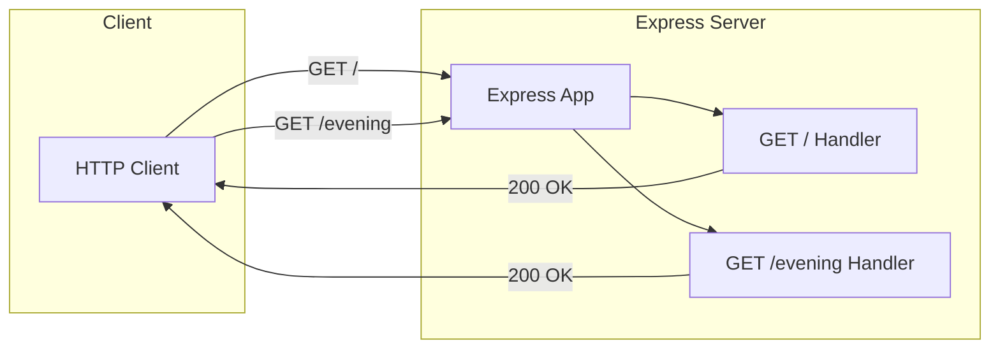

# Repo-Test-Sud

Testing Existing and New Projects

## Node.js Express Server

This project includes a Node.js server built with Express.js framework.

### Features

- **Express.js Server**: Lightweight and fast web server using Express.js ^4.21.2
- **Greeting Endpoints**: Two GET endpoints returning different greeting messages
- **Configurable Port**: Server port configurable via environment variables
- **Jest Testing**: Comprehensive test suite using Jest and Supertest
- **Production Ready**: Conditional server startup for testing compatibility

## Architecture

The application follows a simple Express.js architecture with direct route handlers:



The server uses a modular design where:
- **Express App**: Core application instance created from `express()`
- **Route Handlers**: Individual functions handling specific endpoint requests
- **Conditional Startup**: Server only starts when run directly (`node server.js`), allowing the app to be imported for testing

## Prerequisites

Before you begin, ensure you have the following installed:

| Requirement | Version | Purpose |
|-------------|---------|---------|
| Node.js | >= 18.0.0 | JavaScript runtime |
| npm | (included with Node.js) | Package manager |

Verify your installation:

```bash
node --version    # Should output v18.x.x or higher
npm --version     # Should output npm version
```

## Installation

### 1. Clone the Repository

```bash
git clone <repository-url>
cd Repo-Test-Sud
```

### 2. Install Dependencies

For deterministic installations (recommended):

```bash
npm ci
```

Or for standard installation:

```bash
npm install
```

### 3. Verify Installation

Check that dependencies are installed correctly:

```bash
npm ls
```

You should see Express.js and development dependencies listed without errors.

## Configuration

### Environment Setup

1. Copy the example environment file:

```bash
cp .env.example .env
```

2. Edit `.env` with your preferred settings (optional):

```bash
# Example .env file content
PORT=3000
DB=
```

### Environment Variables

| Variable | Description | Default | Required |
|----------|-------------|---------|----------|
| `PORT` | Server listening port | `3000` | No |
| `DB` | Database connection string | - | No |

**Note**: The `DB` variable is available for future database integration but is not currently used by the server.

## Usage

### Starting the Development Server

```bash
npm start
```

**Expected Output**:

```
Server running on port 3000
```

### Accessing the Server

Once the server is running, you can access it at:

- **Default**: http://localhost:3000/
- **Custom Port**: http://localhost:{PORT}/ (if PORT is configured)

## API Reference

### Endpoints Overview

| Route | Method | Response | Content-Type |
|-------|--------|----------|--------------|
| `/` | GET | "Hello world" | text/html |
| `/evening` | GET | "Good evening" | text/html |

---

### GET /

Root endpoint returning a greeting message.

**Description**: Returns "Hello world" as a plain text response.

**Request**:
- Method: `GET`
- URL: `/`
- Body: None required

**Response**:
- Status: `200 OK`
- Content-Type: `text/html; charset=utf-8`
- Body: `Hello world`

**Example**:

```bash
curl http://localhost:3000/
```

**Response**:

```
Hello world
```

---

### GET /evening

Evening greeting endpoint.

**Description**: Returns "Good evening" as a plain text response.

**Request**:
- Method: `GET`
- URL: `/evening`
- Body: None required

**Response**:
- Status: `200 OK`
- Content-Type: `text/html; charset=utf-8`
- Body: `Good evening`

**Example**:

```bash
curl http://localhost:3000/evening
```

**Response**:

```
Good evening
```

## Testing

### Running Tests

Execute the test suite using Jest:

```bash
npm test
```

**Expected Output**:

```
PASS  tests/server.test.js
  Express Server Endpoints
    ✓ GET / should return "Hello world" (xx ms)
    ✓ GET /evening should return "Good evening" (xx ms)

Test Suites: 1 passed, 1 total
Tests:       2 passed, 2 total
```

### Test Coverage

The test suite verifies:
- **Root Endpoint**: `GET /` returns status 200 with "Hello world"
- **Evening Endpoint**: `GET /evening` returns status 200 with "Good evening"

Tests are located in `tests/server.test.js` and use Supertest for HTTP assertions.

## Deployment

### Development

For local development, simply run:

```bash
npm start
```

The server will automatically reload if you restart it after making changes.

### Production with PM2

PM2 is a process manager for Node.js applications with load balancing and monitoring.

**1. Install PM2 globally**:

```bash
npm install -g pm2
```

**2. Start the server**:

```bash
pm2 start server.js --name "express-server"
```

**3. Additional PM2 commands**:

```bash
pm2 status              # Check status
pm2 logs express-server # View logs
pm2 restart express-server # Restart
pm2 stop express-server    # Stop
```

**4. Optional: Create ecosystem.config.js**:

```javascript
module.exports = {
  apps: [{
    name: 'express-server',
    script: 'server.js',
    instances: 'max',
    exec_mode: 'cluster',
    env: {
      NODE_ENV: 'development',
      PORT: 3000
    },
    env_production: {
      NODE_ENV: 'production',
      PORT: 80
    }
  }]
};
```

### Docker Deployment

**1. Create a Dockerfile**:

```dockerfile
FROM node:18-alpine

WORKDIR /app

COPY package*.json ./
RUN npm ci --only=production

COPY . .

EXPOSE 3000

CMD ["node", "server.js"]
```

**2. Build the Docker image**:

```bash
docker build -t express-server .
```

**3. Run the container**:

```bash
docker run -p 3000:3000 express-server
```

**4. With environment variables**:

```bash
docker run -p 8080:8080 -e PORT=8080 express-server
```

### Cloud Deployment Options

This application can be deployed to various cloud platforms:

- **Heroku**: Use the Procfile with `web: node server.js`
- **AWS**: Deploy using Elastic Beanstalk, ECS, or EC2
- **DigitalOcean**: Use App Platform or Droplets
- **Vercel**: Configure for Node.js serverless deployment

Refer to each platform's documentation for specific deployment instructions.

## Troubleshooting

### Port Already in Use

**Error**: `Error: listen EADDRINUSE: address already in use :::3000`

**Solution**:

1. Find the process using the port:
   ```bash
   lsof -i :3000
   ```

2. Kill the process:
   ```bash
   kill -9 <PID>
   ```

3. Or use a different port:
   ```bash
   PORT=3001 npm start
   ```

### Node Version Issues

**Error**: `The engine "node" is incompatible with this module`

**Solution**: Ensure you have Node.js >= 18.0.0 installed:

```bash
node --version
```

If needed, use a version manager like `nvm`:

```bash
nvm install 18
nvm use 18
```

### Module Not Found

**Error**: `Error: Cannot find module 'express'`

**Solution**: Install dependencies:

```bash
npm install
```

Or for a clean install:

```bash
rm -rf node_modules package-lock.json
npm install
```

### Permission Errors

**Error**: `EACCES: permission denied`

**Solution**:

1. Avoid using `sudo` with npm
2. Fix npm permissions: https://docs.npmjs.com/resolving-eacces-permissions-errors-when-installing-packages-globally

## Contributing

Contributions are welcome! Please follow these guidelines:

### How to Contribute

1. Fork the repository
2. Create a feature branch: `git checkout -b feature/your-feature`
3. Make your changes
4. Run tests: `npm test`
5. Commit your changes: `git commit -m 'Add your feature'`
6. Push to the branch: `git push origin feature/your-feature`
7. Open a Pull Request

### Code Style Guidelines

- Use `'use strict'` at the top of JavaScript files
- Follow existing code formatting patterns
- Add JSDoc comments for new functions
- Write tests for new functionality

### Pull Request Process

1. Ensure all tests pass
2. Update documentation if needed
3. Request review from maintainers
4. Address feedback promptly

## License

This project is available for educational and testing purposes. Please refer to the repository owner for specific licensing information.

## Acknowledgments

- [Express.js](https://expressjs.com/) - Fast, unopinionated, minimalist web framework
- [Jest](https://jestjs.io/) - Delightful JavaScript Testing
- [Supertest](https://github.com/visionmedia/supertest) - HTTP assertions library
