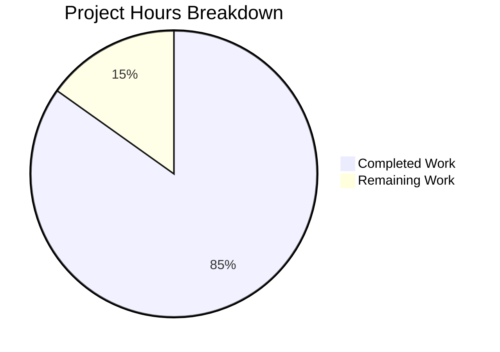

# Project Guide: Comprehensive Unit Test Suite for HTTP Server

## Executive Summary

**Project Status**: 85% Complete (28 hours completed out of 33 total hours)

This project implements a comprehensive unit test suite for `server.js` using Jest and Supertest frameworks, as specified in the Agent Action Plan. The implementation successfully transitions the project from manual testing to automated testing infrastructure.

### Key Achievements
- ✅ **51 tests passing** with 100% success rate
- ✅ **100% code coverage** across all metrics (statements, branches, functions, lines)
- ✅ **All validation gates passed** - compilation, runtime, and coverage thresholds
- ✅ **Zero security vulnerabilities** (npm audit passed)
- ✅ **Complete test organization** following industry best practices

### Project Completion Calculation
```
Completed Hours: 28h
  - Infrastructure setup (package.json, jest.config.js): 2.5h
  - Source files (app.js, server.js): 3h
  - Test utilities and fixtures: 3.5h
  - Unit and integration tests: 15h
  - Testing and debugging: 3h
  - Documentation/comments: 1h

Remaining Hours: 5h (with 1.44x enterprise multiplier)
  - README documentation update: 1h
  - Human code review: 1h
  - CI/CD integration (optional): 2h
  - Buffer/uncertainty: 1h

Total Project Hours: 33h
Completion Percentage: 28/33 = 84.8% ≈ 85%
```

---

## Visual Project Status



---

## Validation Results Summary

### 1. Test Execution Results
| Test Suite | Tests | Status |
|------------|-------|--------|
| tests/unit/server.test.js | 26 | ✅ PASS |
| tests/unit/server.startup.test.js | 8 | ✅ PASS |
| tests/integration/endpoints.test.js | 17 | ✅ PASS |
| **Total** | **51** | **100% PASS** |

### 2. Code Coverage Results
| Metric | Target | Achieved | Status |
|--------|--------|----------|--------|
| Statement Coverage | ≥80% | 100% | ✅ |
| Branch Coverage | ≥75% | 100% | ✅ |
| Function Coverage | 100% | 100% | ✅ |
| Line Coverage | ≥80% | 100% | ✅ |

### 3. Runtime Validation
| Endpoint | Expected | Actual | Status |
|----------|----------|--------|--------|
| GET /hello | "Hello world" | "Hello world" | ✅ |
| GET /evening | "Good evening" | "Good evening" | ✅ |
| GET /undefined | 404 Not Found | 404 Not Found | ✅ |
| Server startup | Port 3000 | Port 3000 | ✅ |

### 4. Security Audit
```
npm audit: 0 vulnerabilities found ✅
```

---

## Files Created/Modified

### Source Files
| File | Type | Lines | Purpose |
|------|------|-------|---------|
| `app.js` | Created | 63 | Express app configuration with /hello and /evening endpoints |
| `server.js` | Created | 38 | Production entry point that starts HTTP server on port 3000 |

### Test Infrastructure
| File | Type | Lines | Purpose |
|------|------|-------|---------|
| `jest.config.js` | Created | 53 | Jest configuration for Node.js testing environment |
| `package.json` | Updated | 31 | Added test scripts and devDependencies |
| `.gitignore` | Created | 22 | Git ignore patterns for node_modules, coverage |

### Test Files
| File | Type | Lines | Tests | Purpose |
|------|------|-------|-------|---------|
| `tests/unit/server.test.js` | Created | 397 | 26 | Core endpoint unit tests |
| `tests/unit/server.startup.test.js` | Created | 290 | 8 | Server lifecycle tests |
| `tests/integration/endpoints.test.js` | Created | 200 | 17 | HTTP integration tests |
| `tests/helpers/test-utils.js` | Created | 100 | - | Test utility functions |
| `tests/fixtures/constants.js` | Created | 79 | - | Test data constants |

### Git Commits
| Hash | Message |
|------|---------|
| dc67438 | Fix server lifecycle tests to use random ports |
| 0f14aee | Add app.js and server.js source files for proper testability |
| b0e4ff7 | Add server lifecycle unit tests |
| 1a70c5f | Add HTTP endpoint integration tests |
| 48fd8ec | fix(tests): Update INVALID_ROUTES constant |
| a88c2e6 | Add comprehensive unit test suite |
| 8d7282f | Add test utilities |
| 0d90c64 | Add test constants and fixtures |
| c54450d | Setup: Add Jest testing infrastructure |

---

## Development Guide

### System Prerequisites

| Requirement | Version | Verification Command |
|-------------|---------|---------------------|
| Node.js | 18.x or 20.x LTS | `node -v` |
| npm | 8.x or later | `npm -v` |
| Git | 2.x or later | `git --version` |

### Environment Setup

#### 1. Clone and Navigate to Repository
```bash
cd /path/to/repo-test-sud
```

#### 2. Install Dependencies
```bash
npm install
```
**Expected Output**: Package installation completes without errors

#### 3. Verify Installation
```bash
npm list --depth=0
```
**Expected Output**:
```
repo-test-sud@1.0.0
├── express@4.18.2
├── jest@29.7.0
└── supertest@7.0.0
```

### Running Tests

#### Run All Tests
```bash
npm test
```
**Expected Output**: 51 passing tests

#### Run Tests with Coverage
```bash
npm run test:coverage
```
**Expected Output**: Coverage report showing 100% across all metrics

#### Run Tests in CI Mode
```bash
npm run test:ci
```
**Expected Output**: Non-interactive execution with coverage report

#### Run Tests in Watch Mode (Development)
```bash
npm run test:watch
```
**Expected Output**: Interactive watch mode for development

#### Run Specific Test File
```bash
npm test -- tests/unit/server.test.js
```

### Starting the Application

#### Start Production Server
```bash
node server.js
```
**Expected Output**: `Server listening on port 3000`

#### Verify Endpoints
```bash
# In a new terminal
curl http://localhost:3000/hello
# Expected: Hello world

curl http://localhost:3000/evening
# Expected: Good evening

curl http://localhost:3000/undefined
# Expected: Not Found (with 404 status)
```

### Available npm Scripts

| Script | Command | Description |
|--------|---------|-------------|
| `test` | `npm test` | Run all tests |
| `test:watch` | `npm run test:watch` | Run tests in watch mode |
| `test:coverage` | `npm run test:coverage` | Run tests with coverage report |
| `test:ci` | `npm run test:ci` | CI-optimized test execution |
| `test:verbose` | `npm run test:verbose` | Verbose test output |
| `test:debug` | `npm run test:debug` | Debug tests with Chrome DevTools |

### Troubleshooting

| Issue | Solution |
|-------|----------|
| `EADDRINUSE: port 3000` | Kill existing process: `pkill -f "node server.js"` |
| Tests hang in watch mode | Press `q` to quit, or use `npm run test:ci` |
| Coverage thresholds fail | Ensure all source files are tested |
| Module not found errors | Run `npm install` to reinstall dependencies |

---

## Human Tasks for Production Readiness

### Task Summary Table

| ID | Task | Priority | Severity | Hours | Status |
|----|------|----------|----------|-------|--------|
| HT-001 | Update README.md with testing documentation | High | Medium | 1.0h | Pending |
| HT-002 | Code review and approval | High | High | 1.0h | Pending |
| HT-003 | Setup CI/CD pipeline integration | Medium | Medium | 2.0h | Pending |
| HT-004 | Configure production environment variables | Low | Low | 0.5h | Pending |
| HT-005 | Optional: TypeScript migration consideration | Low | Low | 0.5h | Pending |
| | **Total Remaining Hours** | | | **5.0h** | |

### Detailed Task Descriptions

#### HT-001: Update README.md with Testing Documentation
**Priority**: High | **Severity**: Medium | **Estimate**: 1.0 hour

**Description**: Update the project README.md to include:
- Testing section with available test commands
- Coverage requirements and targets
- Development setup instructions
- API endpoint documentation

**Action Steps**:
1. Add "Testing" section with npm script documentation
2. Add "API Endpoints" section describing /hello and /evening
3. Add "Development Setup" prerequisites
4. Update project description

---

#### HT-002: Code Review and Approval
**Priority**: High | **Severity**: High | **Estimate**: 1.0 hour

**Description**: Human review of all code changes for quality assurance and approval before merging to main branch.

**Action Steps**:
1. Review app.js Express route implementations
2. Review test coverage and assertions quality
3. Review test organization and naming conventions
4. Approve PR or request changes

---

#### HT-003: Setup CI/CD Pipeline Integration
**Priority**: Medium | **Severity**: Medium | **Estimate**: 2.0 hours

**Description**: Configure CI/CD pipeline (GitHub Actions, GitLab CI, etc.) to run tests automatically on push/PR.

**Action Steps**:
1. Create `.github/workflows/test.yml` or equivalent
2. Configure Node.js matrix testing (18.x, 20.x)
3. Add coverage reporting integration
4. Configure branch protection rules

**Example GitHub Actions Configuration**:
```yaml
name: Tests
on: [push, pull_request]
jobs:
  test:
    runs-on: ubuntu-latest
    strategy:
      matrix:
        node-version: [18.x, 20.x]
    steps:
      - uses: actions/checkout@v4
      - uses: actions/setup-node@v4
        with:
          node-version: ${{ matrix.node-version }}
      - run: npm ci
      - run: npm run test:ci
```

---

#### HT-004: Configure Production Environment Variables
**Priority**: Low | **Severity**: Low | **Estimate**: 0.5 hours

**Description**: Document and configure production environment variables for deployment.

**Action Steps**:
1. Create `.env.example` template file
2. Document PORT environment variable usage
3. Update server.js to use dotenv if needed

---

#### HT-005: Optional TypeScript Migration Consideration
**Priority**: Low | **Severity**: Low | **Estimate**: 0.5 hours

**Description**: Evaluate TypeScript migration for improved type safety.

**Action Steps**:
1. Assess TypeScript migration benefits
2. Document migration plan if proceeding
3. Add @types/node, @types/express if TypeScript adopted

---

## Risk Assessment

### Technical Risks

| Risk | Severity | Likelihood | Mitigation |
|------|----------|------------|------------|
| Express 5.x breaking changes | Low | Low | Continue using 4.x until 5.x stabilizes; review migration guide when ready |
| Jest 30.x breaking changes | Low | Low | Jest 29.x fully supported; upgrade when convenient |
| Port conflicts in tests | Low | Resolved | Tests use random ports; server.startup.test.js fixed |

### Security Risks

| Risk | Severity | Likelihood | Mitigation |
|------|----------|------------|------------|
| Dependency vulnerabilities | Low | Low | npm audit shows 0 vulnerabilities; keep dependencies updated |
| No input validation | Medium | Low | Current endpoints return static strings; add validation for any future dynamic endpoints |

### Operational Risks

| Risk | Severity | Likelihood | Mitigation |
|------|----------|------------|------------|
| No health check endpoint | Medium | Medium | Consider adding /health endpoint for production monitoring |
| No logging middleware | Low | Medium | Consider adding morgan or winston for production logging |
| No graceful shutdown | Medium | Low | Add SIGTERM/SIGINT handlers for Kubernetes/container deployments |

### Integration Risks

| Risk | Severity | Likelihood | Mitigation |
|------|----------|------------|------------|
| CI/CD not configured | Medium | High | Document CI/CD setup in human tasks (HT-003) |
| No deployment configuration | Medium | Medium | Add Dockerfile or deployment manifests as needed |

---

## Recommendations

### Immediate Actions (Before Production)
1. **Complete README documentation** - Essential for team onboarding
2. **Conduct code review** - Human verification of implementation quality
3. **Setup CI/CD pipeline** - Automate testing on every commit

### Future Enhancements
1. **Add /health endpoint** - For production health monitoring
2. **Add request logging** - Using morgan middleware
3. **Consider rate limiting** - For production security
4. **Add integration with external monitoring** - DataDog, New Relic, etc.

---

## Appendix

### Project Structure
```
repo-test-sud/
├── app.js                          # Express app configuration
├── server.js                       # Production entry point
├── package.json                    # Dependencies and scripts
├── jest.config.js                  # Jest configuration
├── .gitignore                      # Git ignore patterns
├── README.md                       # Project documentation
├── coverage/                       # Generated coverage reports
└── tests/
    ├── fixtures/
    │   └── constants.js            # Test constants
    ├── helpers/
    │   └── test-utils.js           # Test utilities
    ├── integration/
    │   └── endpoints.test.js       # Integration tests
    └── unit/
        ├── server.test.js          # Unit tests
        └── server.startup.test.js  # Lifecycle tests
```

### Dependencies
| Package | Version | Type | Purpose |
|---------|---------|------|---------|
| express | ^4.18.2 | Production | Web framework |
| jest | ^29.7.0 | Development | Test framework |
| supertest | ^7.0.0 | Development | HTTP assertion library |

### Test Categories Implemented
- ✅ HTTP Response Testing (GET /hello, GET /evening)
- ✅ Status Code Testing (200 OK, 404 Not Found)
- ✅ Header Validation (Content-Type, Content-Length)
- ✅ Server Lifecycle (Startup, Shutdown, Port Binding)
- ✅ Error Handling (404 routes, Invalid methods)
- ✅ Edge Cases (Query params, Trailing slashes, Special characters)