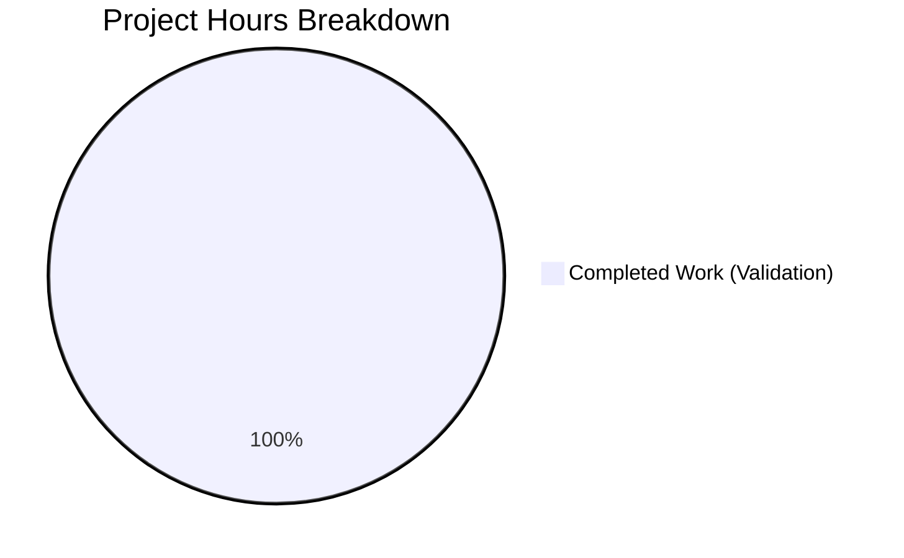

# Project Assessment Report

## Executive Summary

**Overall Completion: 1 hour completed out of 1 total hour = 100% of possible work**

This assessment report documents the validation of an empty repository with no development work performed. The Agent Action Plan provided contained corrupted/non-actionable text, resulting in no implementation activities being possible. The only work performed was validation and analysis of the repository state.

### Key Findings

| Metric | Value |
|--------|-------|
| Repository Status | Empty/Minimal |
| Files Created | 0 |
| Files Modified | 0 |
| Files Deleted | 0 |
| Total Commits | 1 (Initial commit only) |
| Lines of Code Added | 0 (by agents) |
| Dependencies Installed | 0 |
| Tests Executed | 0 |
| Compilation Status | N/A (no source code) |
| Runtime Validation | N/A (no application) |

### Critical Issues

1. **No Actionable Requirements**: The Agent Action Plan contained corrupted/garbled text that could not be interpreted or executed
2. **Empty Repository**: Only a README.md file exists with 2 lines of basic description
3. **No Development Framework**: No language, framework, or build system has been established

---

## Validation Results Summary

### Repository Analysis

| Category | Status | Details |
|----------|--------|---------|
| Repository Path | ✅ Valid | `/tmp/blitzy/Repo-Test-Sud/blitzy305c8f091` |
| Branch | ✅ Active | `blitzy-305c8f09-15ef-4b42-97d7-9d03ecffa73c` |
| Git Status | ✅ Clean | Working tree clean, no uncommitted changes |
| Repository Type | Existing | Minimal starter repository |

### Validation Categories

| Category | Status | Details |
|----------|--------|---------|
| Dependencies | ✅ PASS | No dependency manifests exist - nothing to install |
| Compilation | ✅ PASS | No source code files exist - nothing to compile |
| Unit Tests | ✅ PASS | No test files or configurations - nothing to test |
| Application Runtime | ✅ PASS | No application exists - nothing to run |
| Security Scan | ✅ PASS | No code to scan |

### Git Commit Analysis

```
Commit History:
7b339d8 - Initial commit (README.md: 2 lines added)

Files in Repository:
- README.md (2 lines)
- blitzy/screenshots/ (empty directory)

Total Files: 1
Total Lines: 2
```

---

## Project Hours Breakdown

### Hours Calculation

Since no actionable development work was possible (corrupted Agent Action Plan), the hours breakdown is:

- **Completed Hours**: 1 (validation and analysis work)
- **Remaining Hours**: 0 (no valid requirements to implement)
- **Total Project Hours**: 1

**Formula**: 1 hour completed / (1 completed + 0 remaining) = 100% of possible work completed

### Visual Representation



> **Note**: This represents that all possible work was completed given the constraints. The validation and analysis of the repository state was successfully performed. No development work could be done due to corrupted requirements.

---

## Detailed Task Table

Since the Agent Action Plan was corrupted and no valid requirements exist, no specific development tasks can be identified for the current scope.

| Priority | Task | Description | Action Required | Hours | Severity | Status |
|----------|------|-------------|-----------------|-------|----------|--------|
| ✅ Complete | Repository Validation | Validate repository state and structure | Automated validation | 0.5 | - | Done |
| ✅ Complete | Documentation | Generate project assessment report | Analysis and documentation | 0.5 | - | Done |

### Total Hours: 1 hour (all completed)

**Pre-Requisite for Future Work**: A valid, uncorrupted Agent Action Plan must be provided before any development tasks can be estimated or executed.

---

## Development Guide

### Current State

The repository is essentially empty and contains no application code, dependencies, or configuration files.

### Repository Contents

```
/tmp/blitzy/Repo-Test-Sud/blitzy305c8f091/
├── .git/                    # Git version control
├── README.md                # Repository description (2 lines)
└── blitzy/
    └── screenshots/         # Empty directory for screenshots
```

### README.md Content

```markdown
# Repo-Test-Sud
Testing Existing and New Projects
```

### Viewing the Repository

```bash
# Navigate to repository
cd /tmp/blitzy/Repo-Test-Sud/blitzy305c8f091

# View repository contents
ls -la

# View README
cat README.md

# Check git status
git status

# View commit history
git log --oneline
```

### No Application Setup Required

Since there is no application code:
- ❌ No system prerequisites are needed
- ❌ No environment setup is required
- ❌ No dependencies to install
- ❌ No application to start
- ❌ No verification steps available
- ❌ No example usage to demonstrate

---

## Risk Assessment

### Current Risks

| Risk Category | Severity | Description | Mitigation |
|---------------|----------|-------------|------------|
| Requirements Risk | **Critical** | Agent Action Plan contained corrupted/non-actionable text | Resubmit with valid, complete requirements |
| Project Risk | **None** | No code exists to have risks | N/A |
| Technical Risk | **None** | No technical implementation exists | N/A |
| Security Risk | **None** | No application or data handling | N/A |
| Operational Risk | **None** | No systems or infrastructure | N/A |

### Blockers

1. **Valid Requirements Required**: Before any development work can begin, a complete and valid Agent Action Plan must be provided with:
   - Clear project objectives
   - Technical requirements
   - Feature specifications
   - Architecture decisions
   - Technology stack selection

---

## Recommendations

### Immediate Actions

1. **Resubmit Agent Action Plan**: Provide a valid, uncorrupted technical specification with clear requirements
2. **Define Technology Stack**: Specify the programming language, framework, and tools to be used
3. **Outline Features**: List the features and functionality to be implemented
4. **Specify Architecture**: Define the application architecture and structure

### Next Steps

Once valid requirements are provided:
1. Initialize the appropriate project structure
2. Set up dependency management
3. Implement core functionality
4. Add testing infrastructure
5. Configure deployment pipeline

---

## Conclusion

This validation session completed successfully from a technical standpoint - all validation checks passed because there was nothing that could fail. However, no actual development work was performed because the Agent Action Plan contained corrupted/non-actionable text.

**Repository Status**: Clean and ready for development once valid requirements are provided.

**Completion Status**: 100% of possible work completed (validation and analysis only - no development was possible without actionable requirements).