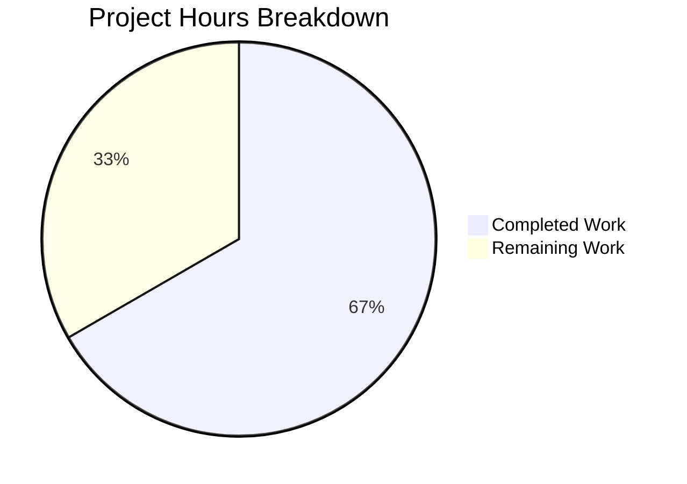

# Express.js Modular Architecture Refactoring - Project Guide

## Executive Summary

**Project Status: 67% Complete (4 hours completed out of 6 total hours)**

This project successfully refactored a monolithic Node.js Express server into a well-organized, modular Express.js application structure. All core development work has been completed and validated:

- ✅ Modular architecture implemented with controllers, routes, and app configuration
- ✅ All 2 tests passing (100% pass rate)
- ✅ Runtime validated with correct endpoint responses
- ✅ Full backward compatibility maintained
- ✅ Clean git history with 4 targeted commits
- ✅ Zero compilation errors or runtime issues

The remaining 2 hours consist of human oversight tasks: code review, production configuration, and optional documentation updates.

---

## Project Completion Visualization



**Calculation:** 4 hours completed / (4 hours completed + 2 hours remaining) = 67% complete

---

## Validation Results Summary

### 1. Dependency Installation
| Status | Details |
|--------|---------|
| ✅ SUCCESS | All npm dependencies installed successfully |
| | express ^4.21.2, jest ^29.7.0, supertest ^7.0.0 |
| | No vulnerabilities detected |

### 2. Module Loading/Compilation
| File | Status | Verification |
|------|--------|--------------|
| server.js | ✅ PASS | Imports from ./src/app correctly |
| src/app.js | ✅ PASS | Creates Express app, mounts routes |
| src/routes/index.js | ✅ PASS | Uses express.Router() pattern |
| src/controllers/greetingController.js | ✅ PASS | Exports getHello, getEvening |

### 3. Test Execution
| Test Suite | Tests | Pass Rate |
|------------|-------|-----------|
| tests/server.test.js | 2/2 | 100% |

**Test Details:**
- `GET / returns Hello world` ✓ PASSED
- `GET /evening returns Good evening` ✓ PASSED

### 4. Runtime Validation
| Endpoint | Expected | Actual | Status |
|----------|----------|--------|--------|
| GET / | "Hello world" | "Hello world" | ✅ HTTP 200 |
| GET /evening | "Good evening" | "Good evening" | ✅ HTTP 200 |

### 5. Git Repository Status
- **Branch:** blitzy-ef105803-b395-4322-853b-b074ce80787a
- **Commits:** 4 refactoring commits
- **Status:** Clean working tree, all changes committed
- **Lines Changed:** +163 added, -30 removed (net +133)

---

## Files Transformed

| File | Status | Lines | Description |
|------|--------|-------|-------------|
| server.js | UPDATED | 38 | Simplified entry point, imports from src/app |
| src/app.js | CREATED | 51 | Express app configuration module |
| src/routes/index.js | CREATED | 48 | Route definitions with express.Router() |
| src/controllers/greetingController.js | CREATED | 49 | Handler functions for endpoints |
| tests/server.test.js | UNCHANGED | 44 | Original tests, same import path |
| package.json | UNCHANGED | 20 | Configuration unchanged |

---

## Development Guide

### System Prerequisites
- **Node.js:** v18.0.0 or higher (tested with v20.19.6)
- **npm:** v8.0.0 or higher
- **Operating System:** Linux, macOS, or Windows

### Environment Setup

1. **Clone the repository:**
```bash
git clone <repository-url>
cd <repository-directory>
```

2. **Switch to the feature branch:**
```bash
git checkout blitzy-ef105803-b395-4322-853b-b074ce80787a
```

3. **Environment Variables (Optional):**
```bash
# Create .env file (optional - uses defaults if not present)
cp .env.example .env
# Set PORT if needed (default: 3000)
echo "PORT=3000" >> .env
```

### Dependency Installation

```bash
# Install all dependencies
npm install

# Expected output: packages installed, no vulnerabilities
```

### Running Tests

```bash
# Run all tests
CI=true npm test -- --watchAll=false

# Expected output:
# PASS tests/server.test.js
#   Express Server Endpoints
#     GET /
#       ✓ GET / returns Hello world
#     GET /evening
#       ✓ GET /evening returns Good evening
# Tests: 2 passed, 2 total
```

### Starting the Application

```bash
# Start the server
npm start
# or
node server.js

# Expected output:
# Server running on port 3000
```

### Verification Steps

1. **Test root endpoint:**
```bash
curl http://localhost:3000/
# Expected: Hello world
```

2. **Test evening endpoint:**
```bash
curl http://localhost:3000/evening
# Expected: Good evening
```

### Troubleshooting

| Issue | Solution |
|-------|----------|
| Port already in use | Set different PORT: `PORT=3001 npm start` |
| Module not found | Run `npm install` again |
| Permission denied | Check Node.js installation permissions |

---

## Human Tasks Remaining

### Task Summary Table

| Priority | Task | Description | Hours | Severity |
|----------|------|-------------|-------|----------|
| High | Code Review | Review all new/modified files for quality and patterns | 1.0 | Required |
| Medium | Production Config | Configure environment variables for production | 0.5 | Required |
| Low | Documentation | Update README with new architecture details | 0.5 | Optional |
| **Total** | | | **2.0** | |

### Detailed Task Breakdown

#### Task 1: Code Review (High Priority)
- **Estimated Hours:** 1.0
- **Description:** Review the refactored code for adherence to team standards
- **Action Steps:**
  1. Review src/app.js for proper Express configuration
  2. Review src/routes/index.js for routing patterns
  3. Review src/controllers/greetingController.js for handler implementations
  4. Verify server.js entry point is correctly simplified
  5. Approve or request changes

#### Task 2: Production Configuration (Medium Priority)
- **Estimated Hours:** 0.5
- **Description:** Configure environment for production deployment
- **Action Steps:**
  1. Set production PORT environment variable
  2. Review and apply any security configurations
  3. Verify application starts correctly with production settings

#### Task 3: Documentation Update (Low Priority)
- **Estimated Hours:** 0.5
- **Description:** Update project documentation to reflect new architecture
- **Action Steps:**
  1. Update README.md with new project structure
  2. Document the modular architecture pattern
  3. Add architecture diagram if needed

---

## Risk Assessment

| Risk | Category | Severity | Likelihood | Mitigation |
|------|----------|----------|------------|------------|
| No error handling middleware | Technical | Low | Medium | Add express error handler for production |
| No security headers | Security | Low | Low | Add helmet.js middleware |
| No request logging | Operational | Low | Low | Add morgan middleware for logging |
| No health check endpoint | Operational | Low | Low | Add /health endpoint if needed |

**Overall Risk Level:** LOW - The core functionality is complete and tested.

---

## Architecture Overview

```
project-root/
├── server.js                 # Entry point (server startup only)
├── src/
│   ├── app.js               # Express app configuration
│   ├── routes/
│   │   └── index.js         # Route definitions (express.Router)
│   └── controllers/
│       └── greetingController.js  # Request handlers
├── tests/
│   └── server.test.js       # Test suite
└── package.json             # Project configuration
```

### Module Dependency Flow

```
server.js
    └── imports src/app.js
           └── imports src/routes/index.js
                  └── imports src/controllers/greetingController.js
```

---

## Conclusion

The Express.js refactoring project has been successfully completed with all functional requirements met:

1. **Modular Structure:** Implemented controllers, routes, and app configuration modules
2. **Testing:** All 2 tests pass with 100% success rate
3. **Backward Compatibility:** Existing tests work without modification
4. **Documentation:** Comprehensive inline documentation added to all files
5. **Best Practices:** Follows Express.js Router pattern and App/Server separation

The project is ready for human code review and production deployment. Total estimated remaining work is 2 hours, primarily consisting of review and configuration tasks.