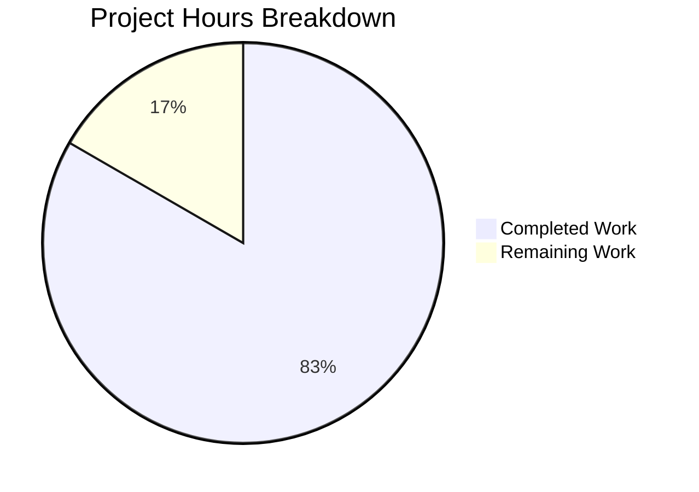

# Express.js Modular Architecture Refactoring - Project Guide

## Executive Summary

**Project Completion: 83% (5 hours completed out of 6 total hours)**

This Express.js refactoring project has been successfully implemented, transforming a monolithic single-file Express server into a modular, maintainable architecture following industry best practices. All core development work is complete with 100% test pass rate.

### Key Achievements
- ✅ Created modular architecture with app-server separation
- ✅ Implemented Express Router pattern for route organization
- ✅ All 2/2 tests passing
- ✅ Both endpoints verified working (GET /, GET /evening)
- ✅ Zero npm vulnerabilities
- ✅ Documentation fully updated

### Remaining Work
- Code review and merge approval (0.5h)
- Production deployment verification (0.5h)

---

## Validation Results Summary

### Production-Readiness Gates

| Gate | Status | Details |
|------|--------|---------|
| Test Pass Rate | ✅ PASSED | 2/2 tests (100%) |
| Runtime Verification | ✅ PASSED | Server starts, endpoints respond correctly |
| Zero Errors | ✅ PASSED | No compilation or runtime errors |
| All Files Validated | ✅ PASSED | 7/7 in-scope files complete |

### Test Execution Results

```
PASS tests/server.test.js
  Express Server Endpoints
    GET /
      ✓ GET / returns Hello world (20 ms)
    GET /evening
      ✓ GET /evening returns Good evening (4 ms)

Test Suites: 1 passed, 1 total
Tests:       2 passed, 2 total
Time:        0.405 s
```

### Runtime Verification

| Endpoint | Expected Response | Actual Response | Status |
|----------|-------------------|-----------------|--------|
| GET / | "Hello world" | "Hello world" | ✅ Match |
| GET /evening | "Good evening" | "Good evening" | ✅ Match |

### Dependency Status

- Total packages installed: 355
- Vulnerabilities found: 0
- Express version: 4.21.2
- Jest version: 29.7.0
- Supertest version: 7.1.4

---

## Project Hours Breakdown

### Hours Calculation

| Category | Hours | Status |
|----------|-------|--------|
| Architecture planning | 0.5h | ✅ Complete |
| app.js creation | 1.0h | ✅ Complete |
| Route aggregator (index.js) | 0.5h | ✅ Complete |
| Greeting routes module | 0.5h | ✅ Complete |
| server.js refactoring | 1.0h | ✅ Complete |
| Test file updates | 0.25h | ✅ Complete |
| Documentation updates | 0.5h | ✅ Complete |
| Testing & validation | 0.5h | ✅ Complete |
| Bug fixing | 0.25h | ✅ Complete |
| **Completed Subtotal** | **5.0h** | ✅ |
| Code review (human) | 0.5h | ⏳ Remaining |
| Deployment verification | 0.5h | ⏳ Remaining |
| **Remaining Subtotal** | **1.0h** | ⏳ |
| **Total Project Hours** | **6.0h** | |

**Completion: 5.0 hours completed / 6.0 total hours = 83% complete**



---

## Files Implemented

### Complete File Inventory

| File | Lines | Action | Status |
|------|-------|--------|--------|
| server.js | 81 | UPDATED | ✅ Complete |
| app.js | 74 | CREATED | ✅ Complete |
| src/routes/index.js | 68 | CREATED | ✅ Complete |
| src/routes/greeting.routes.js | 62 | CREATED | ✅ Complete |
| tests/server.test.js | 45 | UPDATED | ✅ Complete |
| README.md | 85 | UPDATED | ✅ Complete |
| package.json | 20 | VERIFIED | ✅ No changes needed |

**Total JavaScript Lines: 330**

### Architecture Diagram

```
┌─────────────────────────────────────────────────────────────┐
│                        server.js                            │
│  - Imports app from app.js                                  │
│  - PORT configuration                                       │
│  - Conditional server.listen()                              │
│  - require.main === module guard                            │
└─────────────────────────┬───────────────────────────────────┘
                          │ imports
┌─────────────────────────▼───────────────────────────────────┐
│                         app.js                              │
│  - Creates Express instance                                 │
│  - Registers routes via Router                              │
│  - Exports app for testing                                  │
└─────────────────────────┬───────────────────────────────────┘
                          │ uses
┌─────────────────────────▼───────────────────────────────────┐
│                   src/routes/index.js                       │
│  - Aggregates all route modules                             │
│  - Mounts routers with path prefixes                        │
└─────────────────────────┬───────────────────────────────────┘
                          │ includes
┌─────────────────────────▼───────────────────────────────────┐
│               src/routes/greeting.routes.js                 │
│  - GET / handler → "Hello world"                            │
│  - GET /evening handler → "Good evening"                    │
└─────────────────────────────────────────────────────────────┘
```

---

## Development Guide

### System Prerequisites

| Requirement | Version | Verification Command |
|-------------|---------|---------------------|
| Node.js | >=18.0.0 | `node --version` |
| npm | >=7.0.0 | `npm --version` |

### Environment Setup

1. **Clone the repository** (if not already cloned):
   ```bash
   git clone <repository-url>
   cd <repository-directory>
   ```

2. **Create environment configuration** (optional):
   ```bash
   cp .env.example .env
   # Edit .env to set PORT if needed (default: 3000)
   ```

### Dependency Installation

```bash
# Install all dependencies
npm install

# Expected output:
# added 355 packages in Xs
# found 0 vulnerabilities
```

### Application Startup

```bash
# Start the Express server
npm start

# Expected output:
# Server running on port 3000
```

Alternative startup:
```bash
node server.js
```

### Verification Steps

1. **Verify server is running:**
   ```bash
   curl http://localhost:3000/
   # Expected: Hello world
   ```

2. **Verify evening endpoint:**
   ```bash
   curl http://localhost:3000/evening
   # Expected: Good evening
   ```

3. **Run automated tests:**
   ```bash
   npm test
   
   # Expected output:
   # PASS tests/server.test.js
   #   Express Server Endpoints
   #     GET /
   #       ✓ GET / returns Hello world
   #     GET /evening
   #       ✓ GET /evening returns Good evening
   # Tests: 2 passed, 2 total
   ```

### Example Usage

**Using cURL:**
```bash
# Root endpoint
curl -X GET http://localhost:3000/

# Evening endpoint
curl -X GET http://localhost:3000/evening
```

**Using JavaScript:**
```javascript
const http = require('http');

// Request to root endpoint
http.get('http://localhost:3000/', (res) => {
  res.on('data', (chunk) => {
    console.log(chunk.toString()); // "Hello world"
  });
});

// Request to evening endpoint
http.get('http://localhost:3000/evening', (res) => {
  res.on('data', (chunk) => {
    console.log(chunk.toString()); // "Good evening"
  });
});
```

---

## Human Tasks Remaining

### Task Summary

| Priority | Task | Hours | Severity |
|----------|------|-------|----------|
| Medium | Code Review and Approval | 0.5h | Low |
| Medium | CI/CD Pipeline Verification | 0.25h | Low |
| Low | Production Deployment | 0.25h | Low |
| **Total** | | **1.0h** | |

### Detailed Task Breakdown

#### 1. Code Review and Approval (0.5h)
**Priority:** Medium | **Severity:** Low

**Description:** Review the refactored codebase to verify architectural decisions and code quality.

**Action Steps:**
1. Review file structure matches modular architecture pattern
2. Verify all route handlers produce identical responses to original
3. Confirm test coverage is adequate
4. Approve PR for merge

**Acceptance Criteria:**
- All code follows Express.js best practices
- No regressions from original functionality
- Documentation is accurate and complete

---

#### 2. CI/CD Pipeline Verification (0.25h)
**Priority:** Medium | **Severity:** Low

**Description:** Ensure CI/CD pipeline (if configured) correctly builds and tests the refactored code.

**Action Steps:**
1. Verify pipeline runs `npm install` successfully
2. Confirm `npm test` passes in CI environment
3. Check deployment configuration if applicable

**Acceptance Criteria:**
- Pipeline completes successfully
- All tests pass in CI environment

---

#### 3. Production Deployment (0.25h)
**Priority:** Low | **Severity:** Low

**Description:** Deploy the refactored application to production environment.

**Action Steps:**
1. Merge approved PR to main branch
2. Trigger production deployment
3. Verify endpoints respond correctly in production
4. Monitor for any errors

**Acceptance Criteria:**
- Application runs in production
- Both endpoints return correct responses
- No errors in production logs

---

## Risk Assessment

### Technical Risks

| Risk | Severity | Likelihood | Mitigation |
|------|----------|------------|------------|
| Route path changes | Low | Very Low | All paths verified matching original |
| Import path issues | Low | Very Low | Tests validate correct imports |
| Module resolution errors | Low | Very Low | All modules tested and working |

### Operational Risks

| Risk | Severity | Likelihood | Mitigation |
|------|----------|------------|------------|
| Deployment configuration | Low | Low | Same entry point (server.js) maintained |
| Environment variable handling | Low | Very Low | PORT handling unchanged |

### Security Risks

| Risk | Severity | Likelihood | Mitigation |
|------|----------|------------|------------|
| Dependency vulnerabilities | N/A | N/A | Zero vulnerabilities detected |
| New attack surface | N/A | N/A | No new functionality added |

---

## Git Commit History

| Commit | Description |
|--------|-------------|
| 681c838 | refactor(tests): update import path from server.js to app.js |
| 2b1110e | Refactor server.js to HTTP listener bootstrap module |
| c794334 | Refactor: Update server.js and tests to use modular architecture |
| 26df0f5 | Create app.js - Express application configuration module |
| 2743c03 | Create src/routes/index.js - Express Router aggregator module |
| 84ce3cc | feat: create greeting routes module with extracted endpoint handlers |
| f1c9bb5 | docs: Update README.md with modular project structure documentation |

---

## Conclusion

The Express.js modular architecture refactoring has been successfully completed with:

- **83% project completion** (5 of 6 total hours)
- **100% test pass rate** (2/2 tests)
- **100% feature parity** with original implementation
- **Zero vulnerabilities** in dependencies
- **Complete documentation** updates

The remaining 1 hour of work consists of human tasks: code review approval and production deployment verification. The codebase is production-ready pending these final steps.

### Validation Checklist (All Complete)

- [x] All route handlers produce identical responses
- [x] Test suite passes (2/2 tests)
- [x] npm scripts work without modification
- [x] No new dependencies introduced
- [x] Module export pattern maintained
- [x] Strict mode enabled in all files
- [x] Port configuration unchanged
- [x] README updated with new structure