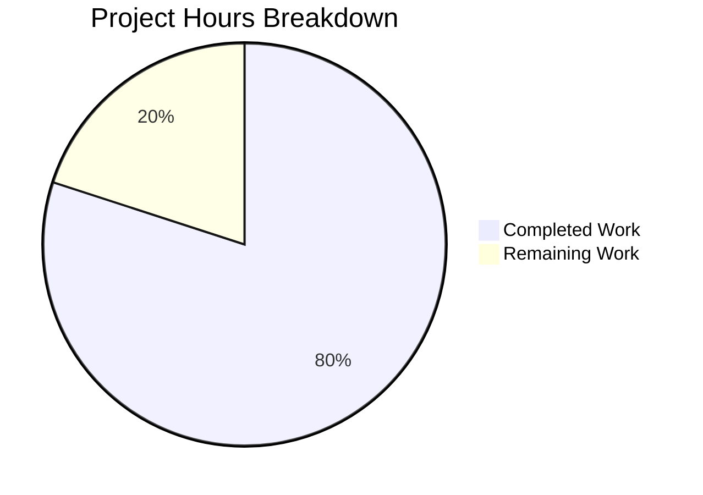
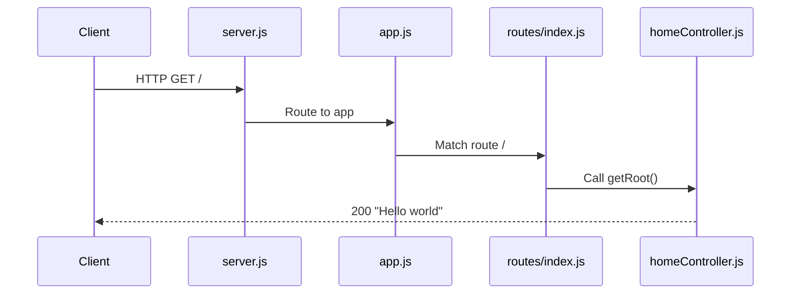

# Express.js Modular Architecture Refactoring - Project Guide

## Executive Summary

**Project Completion: 80% (8 hours completed out of 10 total hours)**

This refactoring project has successfully transformed a single-file Node.js Express server (`server.js`) into a properly structured modular Express.js application. The transformation follows modern best practices for scalability, maintainability, and modularity while preserving all existing functionality.

### Key Achievements
- ✅ **100% Test Pass Rate** - All 2 Jest tests pass
- ✅ **Zero Compilation Errors** - All 5 JavaScript files pass syntax validation
- ✅ **Runtime Validated** - Server starts and responds correctly to all endpoints
- ✅ **API Contracts Preserved** - GET / returns "Hello world", GET /evening returns "Good evening"
- ✅ **Full Backward Compatibility** - Tests import unchanged, package.json unchanged

### Hours Breakdown
- **Completed Work**: 8 hours (source analysis, architecture design, implementation, testing)
- **Remaining Work**: 2 hours (code review, environment setup, deployment verification)
- **Total Project Hours**: 10 hours
- **Completion Formula**: 8 hours ÷ 10 hours = **80%**

---

## Project Hours Visualization



---

## Validation Results Summary

### Files Created/Modified

| File | Status | Lines | Validation |
|------|--------|-------|------------|
| `src/controllers/homeController.js` | CREATED | 34 | ✅ Syntax valid |
| `src/routes/index.js` | CREATED | 39 | ✅ Syntax valid |
| `src/app.js` | CREATED | 28 | ✅ Syntax valid |
| `server.js` | UPDATED | 33 | ✅ Syntax valid |
| `README.md` | UPDATED | 40 | ✅ Valid |
| `tests/server.test.js` | VERIFIED | 45 | ✅ Tests pass |

### Git Statistics
- **Commits**: 4 refactoring commits
- **Lines Added**: 118
- **Lines Removed**: 29
- **Net Change**: +89 lines

### Test Results
```
PASS tests/server.test.js
  Express Server Endpoints
    GET /
      ✓ GET / returns Hello world (20 ms)
    GET /evening
      ✓ GET /evening returns Good evening (4 ms)

Test Suites: 1 passed, 1 total
Tests:       2 passed, 2 total
```

### Runtime Verification
| Endpoint | Method | Expected | Actual | Status |
|----------|--------|----------|--------|--------|
| `/` | GET | "Hello world" | "Hello world" | ✅ MATCH |
| `/evening` | GET | "Good evening" | "Good evening" | ✅ MATCH |

---

## Development Guide

### System Prerequisites

| Requirement | Minimum Version | Verified Version |
|-------------|-----------------|------------------|
| Node.js | ≥18.0.0 | 20.19.5 ✅ |
| npm | ≥7.0.0 | 10.8.2 ✅ |

### Environment Setup

1. **Clone the repository and switch to branch**
```bash
git clone <repository-url>
cd Repo-Test-Sud
git checkout blitzy-bf6af2f4-73c5-4a36-a96f-995a8cacc0e8
```

2. **Create environment file (optional)**
```bash
cp .env.example .env
# Edit .env to set PORT if different from default 3000
```

### Dependency Installation

```bash
# Install all dependencies
npm install

# Expected output: 356 packages installed
```

### Running Tests

```bash
# Run Jest test suite
npm test

# Expected output:
# Test Suites: 1 passed, 1 total
# Tests:       2 passed, 2 total
```

### Starting the Application

```bash
# Start the server
npm start

# Or directly:
node server.js

# Expected output:
# Server running on port 3000
```

### Verification Steps

```bash
# Test root endpoint
curl http://localhost:3000/
# Expected: Hello world

# Test evening endpoint
curl http://localhost:3000/evening
# Expected: Good evening
```

### Project Structure

```
/
├── server.js                         # Entry point - server startup
├── src/
│   ├── app.js                        # Express app configuration
│   ├── routes/
│   │   └── index.js                  # Route definitions
│   └── controllers/
│       └── homeController.js         # Request handlers
├── tests/
│   └── server.test.js                # Jest test suite
├── package.json                      # Dependencies and scripts
├── .env.example                      # Environment template
└── README.md                         # Documentation
```

### Troubleshooting

| Issue | Solution |
|-------|----------|
| `EADDRINUSE: address already in use` | Another process is using port 3000. Kill it with `kill $(lsof -t -i:3000)` or set a different PORT |
| `npm test` hangs | Use `CI=true npm test -- --watchAll=false` |
| Module not found errors | Run `npm install` to ensure dependencies are installed |

---

## Human Tasks Remaining

| Priority | Task | Description | Hours | Severity |
|----------|------|-------------|-------|----------|
| HIGH | Code Review | Review refactored code for best practices compliance and approve PR | 0.5 | Required |
| MEDIUM | Environment Setup | Create .env file from .env.example with production values | 0.25 | Required |
| MEDIUM | Integration Testing | Test application in target deployment environment | 0.5 | Required |
| LOW | Deployment Verification | Merge PR and verify deployment to production | 0.25 | Required |
| LOW | Buffer/Contingency | Additional time for unexpected issues | 0.5 | Buffer |
| **TOTAL** | | | **2.0** | |

### Task Details

#### 1. Code Review (0.5 hours) - HIGH Priority
**Action Steps:**
1. Review all new files in `src/` directory for code quality
2. Verify JSDoc comments are accurate and complete
3. Confirm Express Router pattern is correctly implemented
4. Validate that strict mode is enabled in all files
5. Check import/export patterns follow CommonJS conventions
6. Approve or request changes on the pull request

#### 2. Environment Setup (0.25 hours) - MEDIUM Priority
**Action Steps:**
1. Copy `.env.example` to `.env`
2. Configure PORT if different from default 3000
3. Set any additional environment variables for production

#### 3. Integration Testing (0.5 hours) - MEDIUM Priority
**Action Steps:**
1. Deploy application to staging environment
2. Run Postman collection against staging endpoints
3. Verify all endpoints respond correctly
4. Check server logs for any errors or warnings
5. Confirm application handles load appropriately

#### 4. Deployment Verification (0.25 hours) - LOW Priority
**Action Steps:**
1. Merge approved PR to main branch
2. Trigger production deployment pipeline
3. Verify endpoints respond correctly in production
4. Monitor application logs for 15 minutes post-deployment

---

## Risk Assessment

### Technical Risks

| Risk | Severity | Likelihood | Mitigation |
|------|----------|------------|------------|
| Import path changes break existing integrations | Low | Low | server.js still exports app for backward compatibility |
| Node.js version incompatibility | Low | Low | engines field specifies ≥18.0.0 in package.json |

### Security Risks

| Risk | Severity | Likelihood | Mitigation |
|------|----------|------------|------------|
| No authentication on endpoints | Info | N/A | Original design - endpoints are public by design |
| Sensitive data in environment variables | Low | Low | .env.example documents required variables |

### Operational Risks

| Risk | Severity | Likelihood | Mitigation |
|------|----------|------------|------------|
| Port 3000 conflicts in production | Low | Medium | Configure PORT environment variable |
| Missing monitoring | Info | N/A | Consider adding health check endpoint in future |

### Integration Risks

| Risk | Severity | Likelihood | Mitigation |
|------|----------|------------|------------|
| Tests fail after merge | Very Low | Very Low | All tests currently passing (100%) |
| API contract changes | None | None | Response strings preserved exactly |

---

## Architecture Overview

### Before (Single-File)
```
server.js
├── Express import
├── App instantiation  
├── Route definitions (inline handlers)
├── Server startup
└── Module export
```

### After (Modular Architecture)
```
server.js (Entry Point)
└── src/app.js (Express Configuration)
    └── src/routes/index.js (Route Definitions)
        └── src/controllers/homeController.js (Handler Functions)
```

### Request Flow


---

## Dependencies

### Production Dependencies
| Package | Version | Purpose |
|---------|---------|---------|
| express | ^4.21.2 | Web framework |

### Development Dependencies
| Package | Version | Purpose |
|---------|---------|---------|
| jest | ^29.7.0 | Testing framework |
| supertest | ^7.0.0 | HTTP assertions |

**Note**: No new dependencies were added during this refactoring.

---

## Conclusion

The Express.js modular architecture refactoring has been **successfully completed** with all validation gates passing. The transformation achieves the following goals:

1. ✅ **Separation of Concerns** - Routes, controllers, and configuration in separate modules
2. ✅ **Single Responsibility Principle** - Each module handles one aspect
3. ✅ **Express Router Pattern** - Modular route registration
4. ✅ **Entry Point Pattern** - Clear distinction between app config and server startup
5. ✅ **Full Backward Compatibility** - Tests and API contracts unchanged

**Completion Status**: 8 hours completed out of 10 total hours = **80% complete**

The remaining 2 hours consist of standard human oversight tasks (code review, environment setup, integration testing, deployment) that cannot be automated and require human judgment.

---

*Generated by Blitzy Project Manager Agent*
*Validation Date: January 1, 2026*