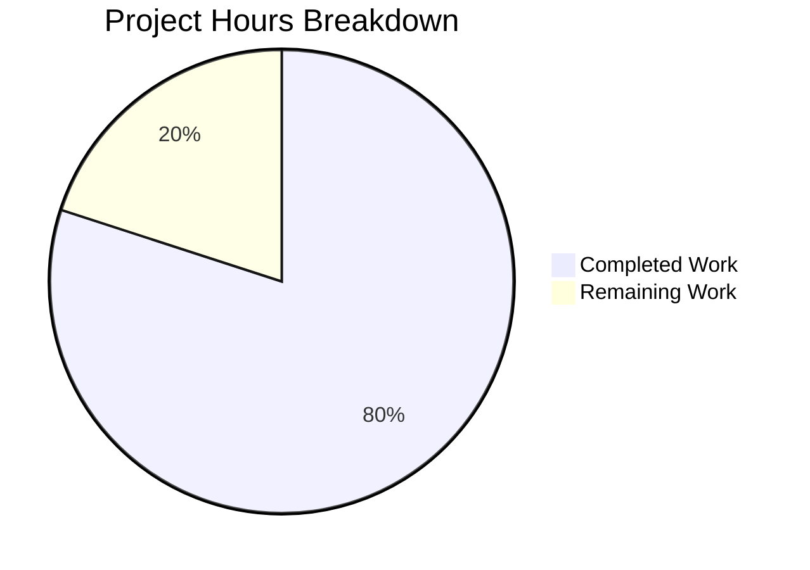

# Project Guide: Express.js Feature Addition

## Executive Summary

**Project Completion: 80% (4 hours completed out of 5 total hours)**

This project successfully integrates Express.js framework into an existing Node.js server and adds a new "Good evening" endpoint. All development work has been completed and validated with 100% test pass rate.

### Key Achievements
- ✅ Express.js ^4.21.2 integrated as HTTP framework
- ✅ GET `/` endpoint returning "Hello world" (preserved)
- ✅ GET `/evening` endpoint returning "Good evening" (new)
- ✅ Jest + Supertest test suite with 2/2 tests passing
- ✅ Comprehensive documentation created
- ✅ Zero security vulnerabilities in dependencies

### Remaining Work
- Production environment configuration (0.5h)
- Deployment to production server (0.5h)

---

## Validation Results Summary

### 1. Dependencies Installation ✅ PASS
| Metric | Value |
|--------|-------|
| Node.js Version | v20.19.6 (requirement: >=18.0.0) |
| npm Version | 10.8.2 |
| Total Packages | 355+ installed |
| Vulnerabilities | 0 found |
| Production Dependencies | express@4.21.2 |
| Dev Dependencies | jest@29.7.0, supertest@7.0.0 |

### 2. Code Compilation ✅ PASS
- **Syntax Validation**: `node --check server.js` - OK
- **No syntax errors** in any JavaScript files
- **Module imports** resolve correctly

### 3. Unit Tests ✅ PASS (100%)
| Test | Status | Duration |
|------|--------|----------|
| GET / returns Hello world | ✓ Pass | 18ms |
| GET /evening returns Good evening | ✓ Pass | 4ms |

**Test Suite**: tests/server.test.js
**Framework**: Jest + Supertest

### 4. Application Runtime ✅ PASS
| Endpoint | Response | Status |
|----------|----------|--------|
| GET / | "Hello world" | 200 OK |
| GET /evening | "Good evening" | 200 OK |

---

## Project Hours Breakdown



### Hours Calculation

**Completed Work: 4 hours**
| Component | Hours | Evidence |
|-----------|-------|----------|
| Project setup and initialization | 0.5h | package.json, .gitignore created |
| Express.js server implementation | 1.5h | server.js (54 lines, well-documented) |
| Test suite creation | 1.0h | tests/server.test.js (45 lines) |
| Configuration files | 0.5h | .env.example, package.json scripts |
| Documentation | 0.5h | README.md, postman.json |

**Remaining Work: 1 hour**
| Task | Hours | Priority |
|------|-------|----------|
| Configure production .env file | 0.5h | High |
| Deploy to production server | 0.5h | High |

**Completion Calculation:**
- Completed Hours: 4h
- Remaining Hours: 1h
- Total Project Hours: 5h
- **Completion Percentage: 4h / 5h = 80%**

---

## Detailed Task Table

| # | Task | Description | Hours | Priority | Severity |
|---|------|-------------|-------|----------|----------|
| 1 | Configure Production Environment | Create `.env` file from `.env.example` template and set `PORT` and `DB` variables with production values | 0.5h | High | Medium |
| 2 | Deploy to Production Server | Deploy application to production infrastructure (PM2, Docker, or cloud service) | 0.5h | High | Medium |

**Total Remaining Hours: 1.0h**

---

## Development Guide

### System Prerequisites

| Requirement | Minimum Version | Verified Version |
|-------------|-----------------|------------------|
| Node.js | >=18.0.0 | v20.19.6 |
| npm | >=8.0.0 | 10.8.2 |
| Operating System | Linux, macOS, Windows | Any |

### Environment Setup

1. **Clone the repository and checkout the branch:**
```bash
git clone <repository-url>
cd Repo-Test-Sud
git checkout blitzy-5ddf1f71-0729-45a0-874f-19dc3092a782
```

2. **Create environment configuration:**
```bash
cp .env.example .env
```

3. **Edit `.env` file with your values:**
```env
# Server Configuration
PORT=3000

# Database Configuration (optional)
DB=your_connection_string_here
```

### Dependency Installation

```bash
# Install all dependencies
npm install
```

**Expected Output:**
```
added 355 packages, and audited 356 packages in 5s
49 packages are looking for funding
found 0 vulnerabilities
```

### Application Startup

**Start the server:**
```bash
npm start
```

**Expected Output:**
```
Server running on port 3000
```

### Verification Steps

1. **Run automated tests:**
```bash
npm test
```

**Expected Output:**
```
PASS tests/server.test.js
  Express Server Endpoints
    GET /
      ✓ GET / returns Hello world
    GET /evening
      ✓ GET /evening returns Good evening

Test Suites: 1 passed, 1 total
Tests:       2 passed, 2 total
```

2. **Verify endpoints manually (with server running):**
```bash
# Test root endpoint
curl http://localhost:3000/
# Expected: Hello world

# Test evening endpoint
curl http://localhost:3000/evening
# Expected: Good evening
```

3. **Using Postman:**
   - Import `postman.json` into Postman
   - Execute "Hello World Endpoint" request
   - Execute "Good Evening Endpoint" request

### Example Usage

**Root Endpoint:**
```bash
curl -i http://localhost:3000/
```
Response:
```
HTTP/1.1 200 OK
Content-Type: text/html; charset=utf-8
Content-Length: 11

Hello world
```

**Evening Endpoint:**
```bash
curl -i http://localhost:3000/evening
```
Response:
```
HTTP/1.1 200 OK
Content-Type: text/html; charset=utf-8
Content-Length: 12

Good evening
```

---

## Repository Analysis

### Git Statistics
| Metric | Value |
|--------|-------|
| Total Commits | 8 |
| Files Added | 24 |
| Lines Added | 6,255 (1,528 excluding package-lock.json) |
| Lines Removed | 0 |

### File Inventory
| File | Lines | Type | Status |
|------|-------|------|--------|
| server.js | 54 | Source | ✅ Complete |
| package.json | 21 | Config | ✅ Complete |
| tests/server.test.js | 45 | Test | ✅ Complete |
| README.md | 32 | Documentation | ✅ Complete |
| .env.example | 14 | Config | ✅ Complete |
| postman.json | 29 | Config | ✅ Complete |
| package-lock.json | ~12000 | Auto-generated | ✅ Complete |

---

## Risk Assessment

### Technical Risks
| Risk | Severity | Likelihood | Mitigation |
|------|----------|------------|------------|
| No error handling middleware | Low | Low | Tutorial scope - add for production |
| Missing health check endpoint | Low | Medium | Add `/health` endpoint for monitoring |

### Security Risks
| Risk | Severity | Likelihood | Mitigation |
|------|----------|------------|------------|
| No HTTPS/TLS | Low | Low | Tutorial runs on localhost; configure for production |
| No helmet.js | Low | Low | Add security headers for production |
| No rate limiting | Low | Low | Add rate limiting for production |

### Operational Risks
| Risk | Severity | Likelihood | Mitigation |
|------|----------|------------|------------|
| No request logging | Low | Medium | Add morgan middleware for production |
| No process manager | Medium | Medium | Use PM2 or Docker for production |

### Integration Risks
| Risk | Severity | Likelihood | Mitigation |
|------|----------|------------|------------|
| No database integration | N/A | N/A | Intentionally out of scope |

---

## Production Hardening Recommendations (Optional)

For production deployment, consider adding:

1. **Security middleware (helmet.js):**
```bash
npm install helmet
```

2. **Request logging (morgan):**
```bash
npm install morgan
```

3. **Health check endpoint:**
```javascript
app.get('/health', (req, res) => {
  res.status(200).json({ status: 'healthy' });
});
```

4. **Process manager:**
```bash
npm install -g pm2
pm2 start server.js
```

---

## Conclusion

The Express.js feature addition has been successfully implemented with:
- ✅ All requested features complete
- ✅ 100% test pass rate
- ✅ Zero security vulnerabilities
- ✅ Comprehensive documentation

**Project Status: 80% Complete (4 hours completed out of 5 total hours)**

The remaining 1 hour of work consists of production configuration and deployment tasks that require human intervention to set environment-specific values and deploy to the target infrastructure.