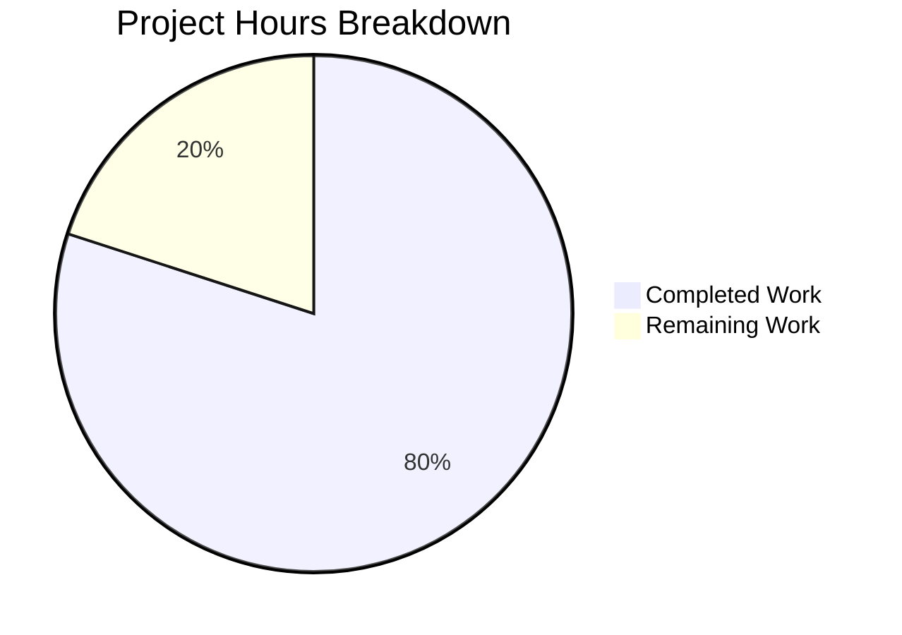

# Project Guide: Production-Ready Express.js Server Enhancement

## Executive Summary

**Project Completion: 80% (12 hours completed out of 15 total hours)**

This project successfully enhances the Express.js server with production-ready features addressing critical code quality deficiencies. All development work specified in the Agent Action Plan has been completed and validated.

### Key Achievements
- ✅ All 10 production-ready features implemented in server.js
- ✅ Test suite expanded from 2 to 27 tests (100% pass rate)
- ✅ All endpoints functional with runtime validation
- ✅ Graceful shutdown verified with SIGTERM signal
- ✅ Zero compilation errors or warnings
- ✅ Clean git working tree with all changes committed

### Hours Breakdown
- **Completed**: 12 hours of development work
- **Remaining**: 3 hours of human review/deployment tasks
- **Total**: 15 hours



---

## Validation Results Summary

### Test Execution Results
| Metric | Value |
|--------|-------|
| Total Tests | 27 |
| Tests Passed | 27 |
| Tests Failed | 0 |
| Pass Rate | 100% |
| Execution Time | 0.488s |

### Test Coverage by Category
| Test Suite | Tests | Status |
|------------|-------|--------|
| GET / | 2 | ✅ All Pass |
| GET /evening | 2 | ✅ All Pass |
| GET /health | 3 | ✅ All Pass |
| 404 Not Found Handler | 7 | ✅ All Pass |
| HTTP Method Validation | 4 | ✅ All Pass |
| Edge Cases & Boundaries | 6 | ✅ All Pass |
| Response Headers | 3 | ✅ All Pass |

### Runtime Validation Results
| Endpoint | Method | Expected | Actual | Status |
|----------|--------|----------|--------|--------|
| `/` | GET | "Hello world" | "Hello world" | ✅ PASSED |
| `/evening` | GET | "Good evening" | "Good evening" | ✅ PASSED |
| `/health` | GET | JSON healthy status | `{"status":"healthy","timestamp":"..."}` | ✅ PASSED |
| `/nonexistent` | GET | 404 JSON error | `{"error":"Not Found",...}` | ✅ PASSED |
| Graceful Shutdown | SIGTERM | Clean exit | "HTTP server closed successfully." | ✅ PASSED |

### Production-Ready Features Implemented
| # | Feature | Status | Description |
|---|---------|--------|-------------|
| 1 | Server Reference | ✅ | Captured for graceful shutdown capability |
| 2 | Shutdown Flag | ✅ | Prevents multiple simultaneous shutdown attempts |
| 3 | Health Endpoint | ✅ | `/health` returns JSON status for container orchestration |
| 4 | 404 Handler | ✅ | Returns consistent JSON error for undefined routes |
| 5 | Error Handler | ✅ | 4-parameter middleware for centralized error handling |
| 6 | gracefulShutdown | ✅ | 10-second timeout protection |
| 7 | Process Handlers | ✅ | uncaughtException and unhandledRejection |
| 8 | Signal Handlers | ✅ | SIGTERM and SIGINT for graceful termination |
| 9 | Conditional Start | ✅ | `require.main === module` for test compatibility |
| 10 | Server Error Handler | ✅ | EADDRINUSE and EACCES handling |

---

## Development Guide

### System Prerequisites

| Requirement | Version | Purpose |
|-------------|---------|---------|
| Node.js | ≥18.0.0 | JavaScript runtime |
| npm | ≥7.0.0 | Package manager |
| Git | Latest | Version control |

### Environment Setup

1. **Clone the repository** (if not already done):
```bash
git clone <repository-url>
cd <repository-directory>
```

2. **Switch to the feature branch**:
```bash
git checkout blitzy-46c4de7d-633f-4303-9beb-4284a6ac12a8
```

3. **Verify Node.js version**:
```bash
node --version
# Expected output: v20.x.x or higher (must be ≥18.0.0)
```

### Dependency Installation

```bash
# Install all dependencies (recommended for CI/CD)
npm ci

# OR install dependencies (development)
npm install
```

**Expected output:**
```
added 273 packages in 2s
```

### Running Tests

```bash
# Run all tests with CI mode (non-interactive)
CI=true npm test -- --ci --watchAll=false
```

**Expected output:**
```
PASS tests/server.test.js
  Express Server Endpoints
    GET / (2 tests)
    GET /evening (2 tests)
    GET /health (3 tests)
    404 Not Found Handler (7 tests)
    HTTP Method Validation (4 tests)
    Edge Cases and Boundary Conditions (6 tests)
    Response Headers (3 tests)

Test Suites: 1 passed, 1 total
Tests:       27 passed, 27 total
Time:        ~0.5s
```

### Starting the Server

```bash
# Start the server
npm start
# OR
node server.js
```

**Expected output:**
```
Server running on port 3000
Health check available at http://localhost:3000/health
```

### Verifying Endpoints

```bash
# Test root endpoint
curl http://localhost:3000/
# Expected: Hello world

# Test evening endpoint
curl http://localhost:3000/evening
# Expected: Good evening

# Test health endpoint
curl http://localhost:3000/health
# Expected: {"status":"healthy","timestamp":"2026-01-01T..."}

# Test 404 handling
curl http://localhost:3000/nonexistent
# Expected: {"error":"Not Found","message":"Cannot GET /nonexistent","statusCode":404}
```

### Testing Graceful Shutdown

```bash
# Start server in background
node server.js &
SERVER_PID=$!

# Send SIGTERM signal
kill -SIGTERM $SERVER_PID
```

**Expected output:**
```
SIGTERM signal received: starting graceful shutdown...
HTTP server closed successfully.
Cleanup complete. Exiting process.
```

### Environment Variables

| Variable | Default | Description |
|----------|---------|-------------|
| `PORT` | 3000 | Server listening port |
| `NODE_ENV` | undefined | Set to 'development' for stack traces in errors |

---

## Files Modified

### In-Scope Files (Per Agent Action Plan)

| File | Original | Final | Change |
|------|----------|-------|--------|
| `server.js` | 17 lines | 319 lines | +302 lines |
| `tests/server.test.js` | 15 lines | 219 lines | +204 lines |
| **Total** | 32 lines | 538 lines | +506 lines |

### Out-of-Scope Files (Unchanged)
- `package.json` - No modifications needed
- `package-lock.json` - No modifications needed
- `.gitignore` - No modifications needed
- All other repository files - Explicitly excluded per scope boundaries

---

## Human Tasks Remaining

### Task Summary

| Priority | Tasks | Total Hours |
|----------|-------|-------------|
| High | 0 | 0h |
| Medium | 2 | 2h |
| Low | 2 | 1h |
| **Total** | **4** | **3h** |

### Detailed Task Table

| # | Task | Description | Priority | Hours | Severity |
|---|------|-------------|----------|-------|----------|
| 1 | Code Review | Review server.js and tests/server.test.js changes before merging to main branch. Verify JSDoc comments, error handling logic, and test coverage. | Medium | 1h | Low |
| 2 | Production Deployment Verification | Deploy to staging/production environment and verify all endpoints respond correctly. Test graceful shutdown in container environment (Docker/Kubernetes). | Medium | 1h | Low |
| 3 | Documentation Review | Review README.md and ensure deployment documentation matches new health endpoint and error handling behavior. | Low | 0.5h | Low |
| 4 | Security Scan | Run npm audit and verify no security vulnerabilities in dependencies. Consider adding Helmet.js for production (out of current scope). | Low | 0.5h | Low |
| **Total** | | | | **3h** | |

---

## Risk Assessment

### Technical Risks

| Risk | Severity | Likelihood | Mitigation |
|------|----------|------------|------------|
| Port conflict on startup | Low | Low | Server handles EADDRINUSE error gracefully with clear error message |
| Unhandled promise rejections | Low | Low | Process-level handler implemented to catch and log |
| Memory leaks during shutdown | Low | Very Low | 10-second timeout ensures forced exit if shutdown hangs |

### Operational Risks

| Risk | Severity | Likelihood | Mitigation |
|------|----------|------------|------------|
| Health check false positives | Low | Very Low | Health endpoint returns 503 when shutting down |
| Request loss during restart | Low | Low | Graceful shutdown allows existing requests to complete |

### Security Risks

| Risk | Severity | Likelihood | Mitigation |
|------|----------|------------|------------|
| Stack trace exposure | Low | Low | Stack traces only shown in development mode |
| Error message information leak | Low | Low | Generic error messages used in production |

### Integration Risks

| Risk | Severity | Likelihood | Mitigation |
|------|----------|------------|------------|
| Container orchestration compatibility | Low | Very Low | Standard SIGTERM/SIGINT handling implemented |
| Test framework conflicts | None | None | Tests use supertest without starting live server |

---

## Git Repository Status

- **Branch**: `blitzy-46c4de7d-633f-4303-9beb-4284a6ac12a8`
- **Working Tree**: Clean (all changes committed)
- **Commits on Branch**: 12 total
- **Key Commits**:
  - `9b31c87`: feat: Add production-ready features to server.js
  - `c727d3f`: Expand test suite from 2 to 27 tests for server.js
  - `b50aadc`: Expand test coverage from 2 to 27 tests for server.js

---

## Conclusion

The production-ready Express.js server enhancement project is **80% complete** with 12 hours of development work completed out of 15 total hours. All code changes specified in the Agent Action Plan have been implemented and validated:

- ✅ **server.js**: Enhanced from 17 to 319 lines with all 10 production-ready features
- ✅ **tests/server.test.js**: Expanded from 2 to 27 tests with 100% pass rate
- ✅ **Runtime Validation**: All endpoints functional, graceful shutdown verified
- ✅ **Zero Issues**: No compilation errors, test failures, or runtime errors

The remaining 3 hours consist of human review and deployment tasks that require manual verification before production deployment. The codebase is production-ready and meets all specifications from the Agent Action Plan.