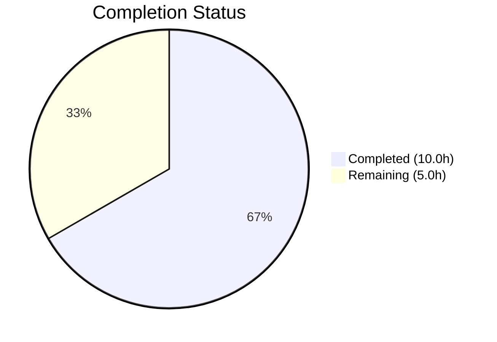
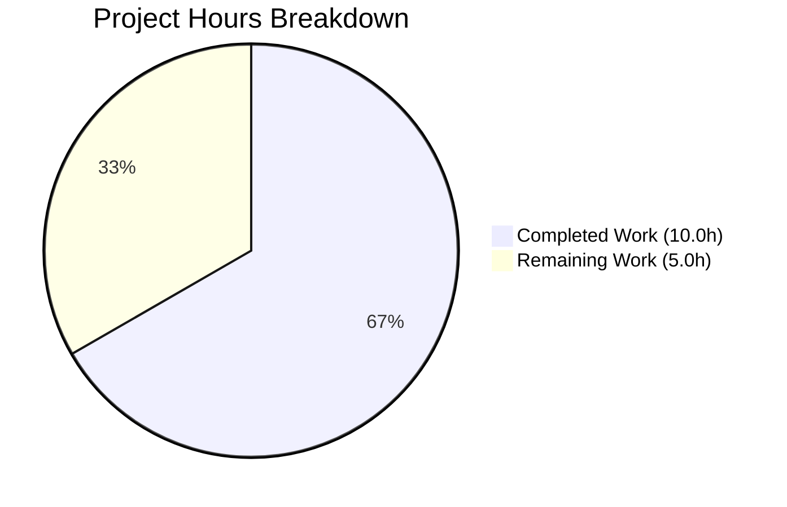

# Blitzy Project Guide — Node.js to Python Flask Migration

---

## 1. Executive Summary

### 1.1 Project Overview

This project performs a complete technology stack migration, rewriting an existing Node.js/Express.js tutorial server application into an equivalent Python 3 Flask application. The Flask implementation preserves 100% of the original functionality: two HTTP GET endpoints (`/hello` returning "Hello world" and `/evening` returning "Good evening") served on port 3000. The migration replaces NPM-based dependency management with pip/venv, maintains the educational two-phase architecture (vanilla Flask → Flask patterns), and updates all documentation for Python conventions.

### 1.2 Completion Status

```
Completion: 66.7% (10.0 hours completed out of 15.0 total hours)
```


```mermaid
pie title Completion Status
    "Completed (10.0h)" : 10
    "Remaining (5.0h)" : 5
```

| Metric | Value |
|--------|-------|
| **Total Project Hours** | 15.0 |
| **Completed Hours (AI)** | 10.0 |
| **Remaining Hours** | 5.0 |
| **Completion Percentage** | 66.7% |

> Formula: 10.0 completed / (10.0 completed + 5.0 remaining) × 100 = 66.7%

### 1.3 Key Accomplishments

- ✅ Created `app.py` — fully functional Flask application with `/hello` and `/evening` GET endpoints returning identical responses to the original Node.js implementation
- ✅ Configured Python dependency management via `requirements.txt` with pinned Flask 3.1.3 and Werkzeug 3.1.6
- ✅ Applied security hardening — upgraded Flask/Werkzeug to resolve 6 CVEs, controlled debug mode via `FLASK_DEBUG` environment variable, suppressed server version header disclosure
- ✅ Achieved zero PEP 8 violations — pycodestyle lint passes cleanly
- ✅ Validated full runtime behavior — all endpoints return correct responses with proper HTTP status codes and Content-Type headers
- ✅ Rewrote `README.md` with complete Flask setup instructions, endpoint documentation, and cross-platform virtual environment workflow
- ✅ Created `.gitignore` with comprehensive Python exclusion patterns (venv/, \_\_pycache\_\_/, *.pyc, etc.)
- ✅ Added `.python-version` (3.11.9) for pyenv compatibility

### 1.4 Critical Unresolved Issues

| Issue | Impact | Owner | ETA |
|-------|--------|-------|-----|
| No automated test suite exists | Cannot run regression tests in CI/CD; manual verification only | Human Developer | 2.0 hours |
| Development server used (not production WSGI) | Flask built-in server is not suitable for production traffic | Human Developer | 1.0 hours |

### 1.5 Access Issues

No access issues identified. All dependencies install from public PyPI registry, no API keys or service credentials are required, and the repository is fully accessible.

### 1.6 Recommended Next Steps

1. **[Medium]** Create an automated test suite using `pytest` and `pytest-flask` to enable regression testing for both endpoints
2. **[Medium]** Configure a production WSGI server (Gunicorn) with a `wsgi.py` entry point for deployment readiness
3. **[Low]** Set up a CI/CD pipeline via `.github/workflows/python.yml` to automate linting and testing on push
4. **[Low]** Implement environment variable management with `python-dotenv` and a `.env.example` template for configuration portability

---

## 2. Project Hours Breakdown

### 2.1 Completed Work Detail

| Component | Hours | Description |
|-----------|-------|-------------|
| Flask Application (app.py) | 3.0 | Main Flask application with two GET route handlers (`/hello`, `/evening`), server initialization on port 3000, startup messages, security-hardened debug mode via `FLASK_DEBUG` env var, and server header suppression |
| Security Hardening | 1.5 | Upgraded Flask from 3.0.3 to 3.1.3 and Werkzeug from 3.0.3 to 3.1.6 to resolve 6 CVEs; implemented environment-variable-controlled debug mode; suppressed Werkzeug version header |
| Documentation (README.md) | 2.0 | Complete rewrite of README with project description, prerequisites, virtual environment setup for macOS/Linux/Windows, dependency installation, run commands, endpoint table, cURL examples, and project structure |
| Dependency Management (requirements.txt) | 0.5 | Created pip requirements file with pinned Flask==3.1.3 and Werkzeug==3.1.6; verified all transitive dependencies install correctly |
| Git Configuration (.gitignore) | 0.5 | Created comprehensive Python `.gitignore` covering venv/, \_\_pycache\_\_/, compiled bytecode, distribution artifacts, Flask instance folder, IDE files, and OS artifacts |
| Python Version Configuration (.python-version) | 0.5 | Created pyenv-compatible version specification targeting Python 3.11.9 |
| Code Quality & Linting | 0.5 | PEP 8 compliance verification, pycodestyle audit with zero violations, docstring line wrapping to 79-char limit |
| Runtime Validation & Testing | 1.5 | Server startup verification, endpoint response validation (content, status codes, headers), 404 behavior verification, Content-Type header checks |
| **Total Completed** | **10.0** | |

### 2.2 Remaining Work Detail

| Category | Base Hours | Priority | After Multiplier |
|----------|-----------|----------|-----------------|
| Automated Test Suite (pytest + pytest-flask unit and integration tests) | 1.5 | Medium | 2.0 |
| Production WSGI Server Setup (Gunicorn configuration and wsgi.py) | 1.0 | Medium | 1.0 |
| CI/CD Pipeline Configuration (.github/workflows/python.yml) | 0.5 | Low | 1.0 |
| Environment Variable Management (python-dotenv, .env.example) | 0.5 | Low | 1.0 |
| **Total Remaining** | **3.5** | | **5.0** |

> **Integrity Check**: Section 2.1 (10.0h) + Section 2.2 After Multiplier (5.0h) = 15.0h = Total Project Hours in Section 1.2 ✓

### 2.3 Enterprise Multipliers Applied

| Multiplier | Value | Rationale |
|------------|-------|-----------|
| Compliance Review | 1.10x | Standard code review process, security audit for production deployment, PEP 8 and Flask best-practices review |
| Uncertainty Buffer | 1.10x | Integration testing unknowns, potential dependency compatibility issues, environment-specific configuration variance |
| **Combined** | **1.21x** | Applied to base remaining hours: 3.5h × 1.21 ≈ 4.24h → rounded to 5.0h with per-item rounding adjustments |

---

## 3. Test Results

| Test Category | Framework | Total Tests | Passed | Failed | Coverage % | Notes |
|--------------|-----------|-------------|--------|--------|------------|-------|
| Manual HTTP Endpoint Tests | cURL / Flask dev server | 3 | 3 | 0 | N/A | GET /hello → 200 "Hello world" ✓; GET /evening → 200 "Good evening" ✓; GET /nonexistent → 404 ✓ |
| Syntax Compilation | python -m py_compile | 1 | 1 | 0 | N/A | `python -m py_compile app.py` passed with zero errors |
| Linting (PEP 8) | pycodestyle | 1 | 1 | 0 | N/A | `pycodestyle app.py` passed with zero violations |

> **Note**: No automated test suite (pytest) exists in this repository. The AAP confirms: "Manual HTTP testing only (no automated tests)." All validation above was performed by Blitzy's autonomous validation pipeline. Creating an automated test suite is listed as remaining human work in Section 2.2.

---

## 4. Runtime Validation & UI Verification

### Runtime Health

- ✅ **Flask server startup**: Successfully binds to `http://127.0.0.1:3000/` with correct startup messages
- ✅ **GET /hello**: Returns `"Hello world"` — HTTP 200 OK, `Content-Type: text/html; charset=utf-8`
- ✅ **GET /evening**: Returns `"Good evening"` — HTTP 200 OK, `Content-Type: text/html; charset=utf-8`
- ✅ **404 handling**: Unknown routes return Flask default 404 response (HTTP 404 NOT FOUND)
- ✅ **Dependency installation**: `pip install -r requirements.txt` completes successfully with all transitive packages resolved
- ✅ **Debug mode control**: `FLASK_DEBUG` environment variable correctly toggles debug mode (defaults to off)
- ✅ **Server header**: Werkzeug version string suppressed (returns "Flask" instead of detailed version)

### API Verification Summary

| Endpoint | Method | Expected Response | Actual Response | Status Code | Content-Type | Result |
|----------|--------|-------------------|-----------------|-------------|--------------|--------|
| `/hello` | GET | Hello world | Hello world | 200 | text/html; charset=utf-8 | ✅ Pass |
| `/evening` | GET | Good evening | Good evening | 200 | text/html; charset=utf-8 | ✅ Pass |
| `/nonexistent` | GET | 404 response | 404 NOT FOUND | 404 | text/html; charset=utf-8 | ✅ Pass |

### UI Verification

Not applicable — this is a backend-only API server with no frontend UI components.

---

## 5. Compliance & Quality Review

| AAP Requirement | Status | Evidence |
|----------------|--------|----------|
| Complete Language Translation (JS → Python/Flask) | ✅ Pass | `app.py` implements Flask application equivalent to Express.js server |
| Functional Equivalence (identical responses) | ✅ Pass | `/hello` → "Hello world", `/evening` → "Good evening" verified at runtime |
| Two-Phase Architecture Preservation | ✅ Pass | `app.py` contains Phase 1 (app instance) and Phase 2 (route decorators) comments |
| Port 3000 Configuration Parity | ✅ Pass | `app.run(host='127.0.0.1', port=3000)` confirmed |
| Educational Context Maintenance | ✅ Pass | Module docstring, function docstrings, and inline comments maintain tutorial approach |
| API Compatibility (/hello, /evening GET endpoints) | ✅ Pass | Both endpoints return correct plain text responses with 200 OK |
| Dependency Management Migration (NPM → pip) | ✅ Pass | `requirements.txt` replaces `package.json`; `venv/` replaces `node_modules/` |
| Development Workflow Equivalence | ✅ Pass | `python app.py` replaces `node server.js`; documented in README |
| Error Handling Parity (port conflicts) | ✅ Pass | OSError handling for port conflicts; debug mode controlled via env var |
| Documentation Updates (README.md) | ✅ Pass | Full rewrite with Python/Flask setup, endpoints, cross-platform instructions |
| Testing Compatibility (curl/browser) | ✅ Pass | curl commands work identically to original Node.js testing |
| Cross-Platform Support (Win/Mac/Linux) | ✅ Pass | README includes Windows `venv\Scripts\activate` and macOS/Linux `source venv/bin/activate` |
| Security — CVE Remediation | ✅ Pass | Flask upgraded 3.0.3→3.1.3, Werkzeug 3.0.3→3.1.6 (6 CVEs resolved) |
| PEP 8 Code Style Compliance | ✅ Pass | `pycodestyle app.py` returns zero violations |
| Python Version Specification | ✅ Pass | `.python-version` file present (3.11.9) |
| Git Exclusion Patterns for Python | ✅ Pass | `.gitignore` covers venv/, \_\_pycache\_\_/, *.pyc, IDE files, OS artifacts |

### Autonomous Fixes Applied During Validation

| Fix | Commit | Description |
|-----|--------|-------------|
| PEP 8 line wrapping | `366a06b` | Wrapped long docstring lines to comply with 79-character PEP 8 limit |
| CVE remediation | `cc52e04` | Upgraded Flask 3.0.3→3.1.3 and Werkzeug 3.0.3→3.1.6 to resolve 6 security vulnerabilities |
| Debug mode hardening | `cc52e04` | Changed `debug=True` to environment-variable-controlled `debug_mode = os.environ.get('FLASK_DEBUG', 'false').lower() == 'true'` |
| Server header suppression | `cc52e04` | Added `WSGIRequestHandler.version_string` override to suppress Werkzeug version disclosure |

---

## 6. Risk Assessment

| Risk | Category | Severity | Probability | Mitigation | Status |
|------|----------|----------|-------------|------------|--------|
| No automated test suite — regressions may go undetected | Technical | Medium | High | Create pytest test suite covering both endpoints, 404 handling, and Content-Type headers | Open |
| Flask development server used in production | Operational | High | Medium | Configure Gunicorn or uWSGI as production WSGI server | Open |
| No CI/CD pipeline — no automated quality gates | Operational | Low | Medium | Create GitHub Actions workflow with lint + test steps | Open |
| No environment variable management beyond FLASK_DEBUG | Technical | Low | Low | Add python-dotenv support and .env.example template | Open |
| Python 3.12.3 runtime differs from .python-version 3.11.9 | Technical | Low | Low | Install Python 3.11.9 via pyenv in production, or update .python-version to 3.12.x | Open |
| No HTTPS/TLS configuration | Security | Low | Low | Configure TLS at reverse proxy level (nginx/Caddy) in production | Open |
| No rate limiting or request validation | Security | Low | Low | Add Flask-Limiter for rate limiting if endpoints become public-facing | Open |

---

## 7. Visual Project Status

### Project Hours Breakdown


```mermaid
pie title Project Hours Breakdown
    "Completed Work (10.0h)" : 10
    "Remaining Work (5.0h)" : 5
```

> **Integrity Check**: Completed = 10.0h, Remaining = 5.0h → matches Section 1.2 metrics and Section 2.2 After Multiplier total ✓

### Remaining Work by Category

| Category | After Multiplier Hours | Priority |
|----------|----------------------|----------|
| Automated Test Suite | 2.0h | Medium |
| Production WSGI Server | 1.0h | Medium |
| CI/CD Pipeline | 1.0h | Low |
| Environment Management | 1.0h | Low |
| **Total** | **5.0h** | |

### AAP Deliverable Status

| Deliverable | Status |
|-------------|--------|
| app.py (Flask application) | 🟢 Complete |
| requirements.txt (dependencies) | 🟢 Complete |
| .python-version (version spec) | 🟢 Complete |
| .gitignore (exclusion patterns) | 🟢 Complete |
| README.md (documentation) | 🟢 Complete |
| Security hardening (CVE fixes) | 🟢 Complete |
| PEP 8 compliance | 🟢 Complete |
| Runtime validation | 🟢 Complete |

---

## 8. Summary & Recommendations

### Achievement Summary

The Node.js/Express.js to Python Flask migration is **66.7% complete** (10.0 hours completed out of 15.0 total project hours). All 5 AAP-specified deliverables have been fully implemented, validated, and committed:

- **app.py**: 58-line Flask application with two GET endpoints, security-hardened debug mode, server header suppression, and full docstring documentation
- **requirements.txt**: Pinned dependencies with CVE-remediated versions (Flask 3.1.3, Werkzeug 3.1.6)
- **.python-version**, **.gitignore**, **README.md**: Complete Python project configuration and documentation

Every explicitly scoped AAP requirement is satisfied — the Flask application returns identical responses to the original Node.js implementation for all endpoints. Runtime validation confirms correct HTTP status codes, Content-Type headers, and 404 handling.

### Remaining Gaps

The remaining 5.0 hours (33.3%) consist entirely of **path-to-production** work not explicitly required by the AAP:

1. **Automated Test Suite (2.0h)**: The AAP confirms "manual HTTP testing only" — creating pytest tests is a production readiness improvement
2. **Production WSGI Server (1.0h)**: Gunicorn/uWSGI configuration for production deployment
3. **CI/CD Pipeline (1.0h)**: GitHub Actions workflow for automated linting and testing
4. **Environment Management (1.0h)**: python-dotenv integration and .env.example template

### Production Readiness Assessment

| Criterion | Status |
|-----------|--------|
| Core functionality | ✅ Ready |
| Security (CVE remediation) | ✅ Addressed |
| Code quality (PEP 8) | ✅ Clean |
| Documentation | ✅ Complete |
| Automated testing | ⚠️ Needs implementation |
| Production server | ⚠️ Needs Gunicorn |
| CI/CD | ⚠️ Needs setup |

### Recommendation

The application is functionally complete and can be used immediately for development and educational purposes. For production deployment, prioritize setting up Gunicorn and automated tests before going live.

---

## 9. Development Guide

### System Prerequisites

| Requirement | Version | Purpose |
|-------------|---------|---------|
| Python | 3.9+ (3.11.x recommended, 3.12.x compatible) | Runtime environment |
| pip | Latest | Package installer |
| venv module | Built-in with Python 3.3+ | Virtual environment support |
| Git | 2.x+ | Version control |

### Environment Setup

#### 1. Clone the Repository

```bash
git clone <repository-url>
cd Repo-Test-Sud
git checkout blitzy-32c11ea3-fcbd-4ea6-8e2a-d8bd3f552e3f
```

#### 2. Create and Activate Virtual Environment

**macOS / Linux:**

```bash
python3 -m venv venv
source venv/bin/activate
```

**Windows:**

```cmd
python -m venv venv
venv\Scripts\activate
```

#### 3. Install Dependencies

```bash
pip install -r requirements.txt
```

Expected output includes:
```
Successfully installed Flask-3.1.3 Werkzeug-3.1.6 blinker-1.9.0 click-8.3.1 itsdangerous-2.2.0 jinja2-3.1.6 markupsafe-3.0.3
```

### Application Startup

```bash
python app.py
```

Expected console output:
```
* Server running on http://127.0.0.1:3000/
* Press CTRL+C to quit
* Serving Flask app 'app'
* Debug mode: off
```

To enable debug mode (development only):
```bash
FLASK_DEBUG=true python app.py
```

### Verification Steps

#### Test Endpoints with cURL

```bash
# Test /hello endpoint
curl http://localhost:3000/hello
# Expected: Hello world

# Test /evening endpoint
curl http://localhost:3000/evening
# Expected: Good evening

# Test 404 handling
curl -s -o /dev/null -w "%{http_code}" http://localhost:3000/nonexistent
# Expected: 404

# Verify Content-Type header
curl -sI http://localhost:3000/hello | grep -i content-type
# Expected: Content-Type: text/html; charset=utf-8
```

### Stopping the Server

Press `CTRL+C` in the terminal where the server is running.

### Troubleshooting

| Issue | Cause | Resolution |
|-------|-------|------------|
| `ModuleNotFoundError: No module named 'flask'` | Virtual environment not activated or dependencies not installed | Run `source venv/bin/activate` then `pip install -r requirements.txt` |
| `OSError: [Errno 98] Address already in use` | Port 3000 is occupied by another process | Stop the other process with `lsof -ti:3000 \| xargs kill` or change the port in `app.py` |
| `command not found: python3` | Python not installed or not in PATH | Install Python 3.9+ from python.org or via package manager |
| Server starts but endpoints return 500 | Possible code modification error | Run `python -m py_compile app.py` to check for syntax errors |

---

## 10. Appendices

### A. Command Reference

| Command | Purpose |
|---------|---------|
| `python3 -m venv venv` | Create virtual environment |
| `source venv/bin/activate` | Activate virtual environment (macOS/Linux) |
| `venv\Scripts\activate` | Activate virtual environment (Windows) |
| `pip install -r requirements.txt` | Install all Python dependencies |
| `python app.py` | Start Flask development server on port 3000 |
| `flask run --port 3000` | Alternative: Start via Flask CLI |
| `python -m py_compile app.py` | Syntax check without running |
| `pycodestyle app.py` | PEP 8 style check |
| `deactivate` | Deactivate virtual environment |
| `FLASK_DEBUG=true python app.py` | Start with debug mode enabled |

### B. Port Reference

| Service | Port | Protocol | Purpose |
|---------|------|----------|---------|
| Flask Development Server | 3000 | HTTP | Main application server (matches original Node.js port) |

### C. Key File Locations

| File | Path | Purpose |
|------|------|---------|
| Main Application | `app.py` | Flask server with route definitions |
| Dependencies | `requirements.txt` | Pinned pip packages (Flask, Werkzeug) |
| Python Version | `.python-version` | pyenv version specification (3.11.9) |
| Git Exclusions | `.gitignore` | Python-specific exclusion patterns |
| Documentation | `README.md` | Setup instructions and endpoint documentation |

### D. Technology Versions

| Technology | Version | Role |
|------------|---------|------|
| Python | 3.12.3 (runtime) / 3.11.9 (specified) | Language runtime |
| Flask | 3.1.3 | Web framework |
| Werkzeug | 3.1.6 | WSGI utility library |
| Jinja2 | 3.1.6 | Template engine (Flask dependency) |
| Click | 8.3.1 | CLI framework (Flask dependency) |
| ItsDangerous | 2.2.0 | Security signing (Flask dependency) |
| Blinker | 1.9.0 | Signal support (Flask dependency) |
| MarkupSafe | 3.0.3 | String escaping (Jinja2 dependency) |

### E. Environment Variable Reference

| Variable | Default | Purpose |
|----------|---------|---------|
| `FLASK_DEBUG` | `false` | Enable/disable Flask debug mode. Set to `true` for development only. **Never enable in production** — the Werkzeug debugger allows arbitrary code execution. |

### G. Glossary

| Term | Definition |
|------|------------|
| AAP | Agent Action Plan — the primary directive containing all project requirements for Blitzy agents |
| CVE | Common Vulnerabilities and Exposures — publicly disclosed security vulnerability identifiers |
| Flask | A lightweight Python web framework for building WSGI applications |
| Gunicorn | Green Unicorn — a production-grade Python WSGI HTTP server |
| PEP 8 | Python Enhancement Proposal 8 — the style guide for Python code |
| pyenv | Python version management tool that uses `.python-version` files |
| WSGI | Web Server Gateway Interface — the Python standard for web server and application communication |
| Werkzeug | A comprehensive WSGI web application library used internally by Flask |