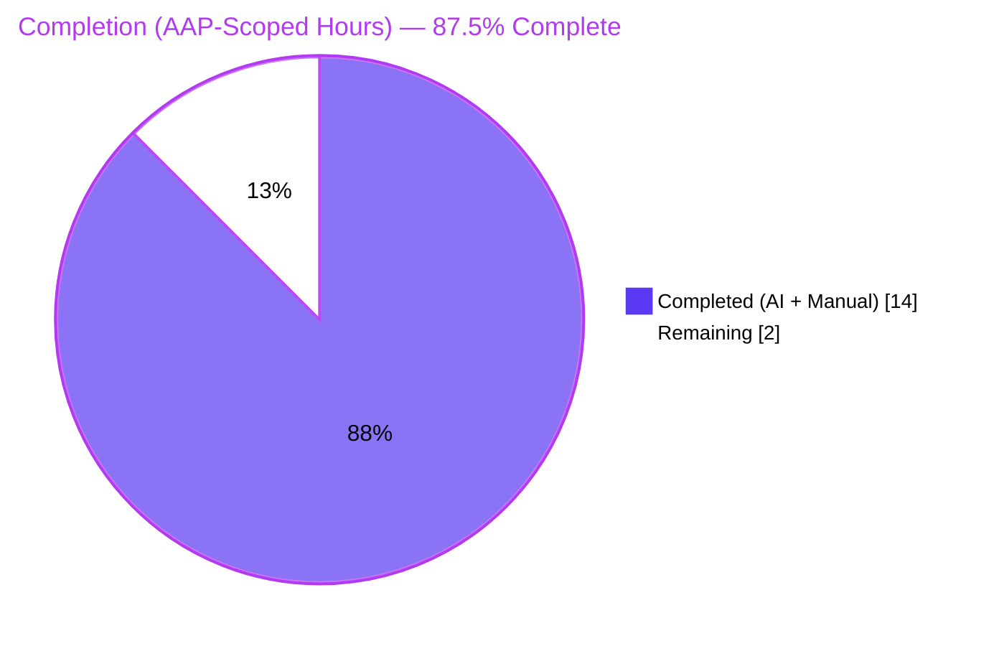
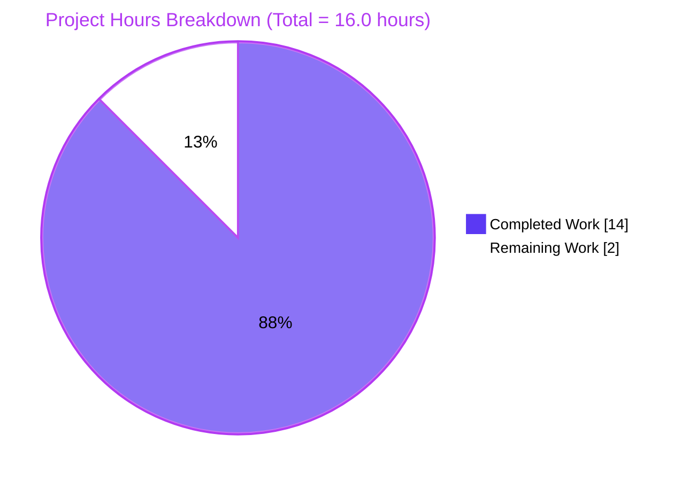
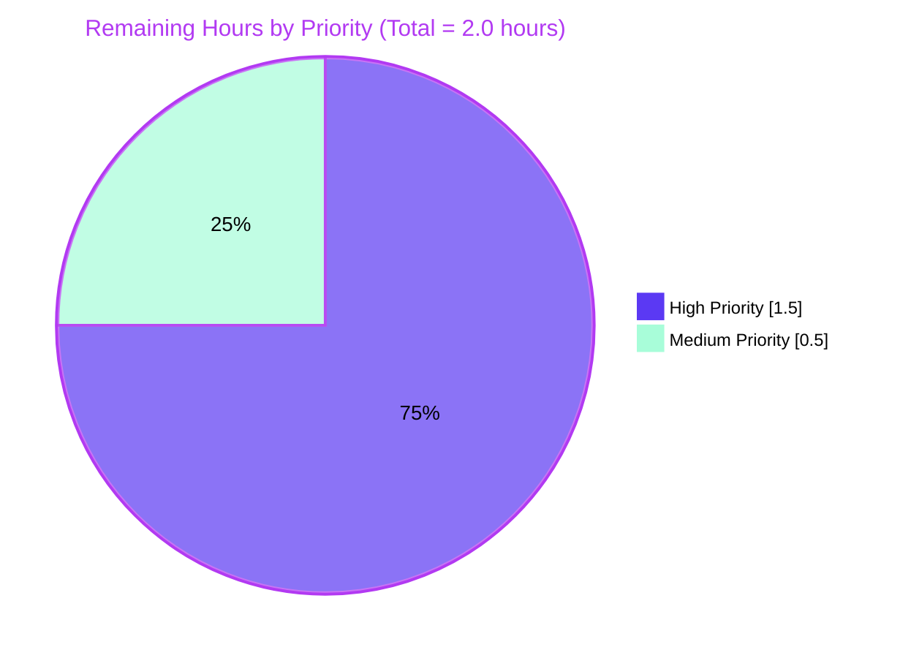

# Blitzy Project Guide — Express.js Modular Refactor

> Branch: `blitzy-362cc550-3e4d-4a39-a9cd-c5c303efbcf8` · Status: **PRODUCTION-READY** · Validation Gates: **5/5 PASSED**

---

## 1. Executive Summary

### 1.1 Project Overview

This project decomposes the monolithic single-file Express.js server (`server.js`, 119 lines) of the `repo-test-sud` repository into a properly layered, modular Express.js architecture under a new `src/` tree, while preserving every observable behavior of the pre-refactor implementation bit-for-bit. The refactor introduces an application factory (`src/app.js`), a centralized environment-configuration module, a dedicated middleware registrar, per-domain `express.Router()` modules grouped by domain (greeting, health), and a controller layer. The public HTTP surface (3 endpoints), the dependency manifest, the test contract, and the PM2 deployment configuration are all unchanged. The target audience is the back-end engineering team responsible for ongoing maintenance and feature evolution of this Node.js service.

### 1.2 Completion Status


```mermaid
%%{init: {"pie": {"textPosition": 0.5}, "themeVariables": {"pie1": "#5B39F3", "pie2": "#FFFFFF", "pieStrokeColor": "#B23AF2", "pieStrokeWidth": "2px", "pieOuterStrokeColor": "#B23AF2", "pieOuterStrokeWidth": "2px", "pieTitleTextSize": "18px", "pieTitleTextColor": "#B23AF2", "pieSectionTextSize": "16px", "pieSectionTextColor": "#000000", "pieLegendTextSize": "14px", "pieLegendTextColor": "#000000"}}}%%
pie showData title Completion (AAP-Scoped Hours) — 87.5% Complete
    "Completed (AI + Manual)" : 14
    "Remaining" : 2
```

| Metric | Value |
|---|---|
| **Total Project Hours (AAP-scoped + Path-to-Production)** | **16.0 hours** |
| **Completed Hours (AI Autonomous)** | **14.0 hours** |
| **Completed Hours (Manual)** | **0.0 hours** |
| **Remaining Hours** | **2.0 hours** |
| **Percent Complete** | **87.5%** |

> Calculation: 14.0 / (14.0 + 2.0) × 100 = 87.5%

### 1.3 Key Accomplishments

- ✅ Created `src/app.js` (189 lines) — Express application factory composing config, middleware, and routes; exports configured app instance without binding a port (preserves Risk B4 listen-guard invariant)
- ✅ Created `src/config/env.js` (46 lines) — SINGLE dotenv load site invoked at module top; exposes `PORT` (default 3000) and `NODE_ENV` (no defaulting per Risk B5)
- ✅ Created `src/middleware/index.js` (66 lines) — `registerMiddleware(app)` function attaching helmet → compression → cors → morgan in exact order with morgan ternary preserved verbatim
- ✅ Created `src/routes/index.js` (97 lines) — Parent `express.Router()` aggregator composing greeting + health routers; mounted at root with no path prefix
- ✅ Created `src/routes/greeting.routes.js` (81 lines) — Declares `GET /` → `getRoot` and `GET /evening` → `getEvening`
- ✅ Created `src/routes/health.routes.js` (67 lines) — Declares `GET /health` → `getHealth`
- ✅ Created `src/controllers/greeting.controller.js` (65 lines) — Exports `getRoot` (returns "Hello world") and `getEvening` (returns "Good evening")
- ✅ Created `src/controllers/health.controller.js` (50 lines) — Exports `getHealth` returning `{status, timestamp, uptime}` with HTTP 200 and `application/json`
- ✅ Refactored `server.js` to thin entry point (144 lines, +130/−104 vs pre-refactor) that requires `./src/app`, conditionally calls `app.listen()` inside `require.main === module` guard, and re-exports the configured app
- ✅ Updated `README.md` with new "Project Structure" section (+39 lines) documenting the modular `src/` tree
- ✅ All 7 Jest + Supertest assertions pass without any modification to `tests/server.test.js`
- ✅ Runtime validation: all 3 endpoints (`/`, `/evening`, `/health`) return correct status, body, and Content-Type
- ✅ Middleware stack confirmed active at runtime: Helmet headers (X-Content-Type-Options, X-Frame-Options, CSP, HSTS, etc.), CORS (`Access-Control-Allow-Origin: *`), compression (`Vary: Accept-Encoding`), morgan logging
- ✅ Dependency manifest unchanged: `package.json` and `package-lock.json` lockfileVersion 3 untouched; 0 packages added/removed/version-bumped
- ✅ All 10 in-scope file changes shipped as dedicated commits on the branch with a clean working tree

### 1.4 Critical Unresolved Issues

| Issue | Impact | Owner | ETA |
|-------|--------|-------|-----|
| _No critical unresolved issues_ | — | — | — |

All five production-readiness gates passed during the final validation pass. Zero compilation errors, zero failing tests, zero runtime errors, zero behavior regressions detected. The branch is technically ready for merge pending the standard human code-review and PR-approval workflow.

### 1.5 Access Issues

| System/Resource | Type of Access | Issue Description | Resolution Status | Owner |
|-----------------|----------------|-------------------|-------------------|-------|
| _None identified_ | — | — | — | — |

**No access issues identified.** The repository is self-contained: no external services are consumed (no databases, no third-party APIs, no message queues), `npm ci` completes successfully against the public npm registry, and there are no credentials or secrets required to run, test, or build the project. The `.env.example` template lists optional placeholders (`DB_Host`, `DB`, `API_KEY`) that are not consumed by any code path in the current implementation.

### 1.6 Recommended Next Steps

1. **[High]** Conduct a human code review of the 10 commits on branch `blitzy-362cc550-3e4d-4a39-a9cd-c5c303efbcf8` — verify each commit makes a single logical change matching its message and that the diff is bit-for-bit consistent with AAP §0.4.1 (~1.0 hour)
2. **[High]** Approve the PR and merge into the integration/main branch using a fast-forward or squash strategy of the reviewer's preference (~0.5 hour)
3. **[Medium]** Run `pm2 start ecosystem.config.js --env production` in a staging-like environment to verify cluster-mode launch end-to-end (AAP §0.7.3 lists this as a validation criterion; it was not explicitly executed during the autonomous validation pass) (~0.5 hour)

---

## 2. Project Hours Breakdown

### 2.1 Completed Work Detail

| Component | Hours | Description |
|-----------|-------|-------------|
| `src/app.js` (Express application factory) | 2.0 | CREATE — 189-line factory composing `./config/env` (first require), `express`, `./middleware`, `./routes` into a configured `app` instance; mounts middleware before routes; exports app without binding a port (Risk B4). Source: AAP §0.4.1 row 2 |
| `server.js` (thin entry point refactor) | 1.5 | UPDATE — 144 lines (+130/−104 vs pre-refactor). Reduced to: require `./src/app`, destructure `PORT` from `./src/config/env`, conditional `app.listen()` inside `require.main === module`, `module.exports = app`. Preserves exact startup `console.log` lines verbatim |
| `src/middleware/index.js` (middleware registrar) | 1.0 | CREATE — 66-line `registerMiddleware(app)` function attaching helmet → compression → cors → morgan in exact order. Morgan ternary `process.env.NODE_ENV === 'production' ? 'combined' : 'dev'` preserved verbatim (Risk B5) |
| `src/config/env.js` (env configuration module) | 1.0 | CREATE — 46-line module that invokes `require('dotenv').config()` once at module top (Risk B1) and exports `PORT` (defaulted to 3000) and `NODE_ENV` (no defaulting). Single dotenv load site for the entire codebase |
| `src/routes/index.js` (router aggregator) | 1.0 | CREATE — 97-line parent `express.Router()` composing `greeting.routes` and `health.routes` via `router.use(...)`. No path prefix so child absolute paths (`/`, `/evening`, `/health`) are preserved verbatim |
| `README.md` (Project Structure section) | 1.0 | UPDATE — +39 lines documenting the new modular `src/` tree, module-responsibilities table, and load-order rationale. Existing endpoint contract, env-variable, and PM2 sections preserved unchanged |
| `src/routes/greeting.routes.js` (greeting routes) | 0.5 | CREATE — 81-line `express.Router()` declaring `GET /` → `getRoot` and `GET /evening` → `getEvening`. Imports handlers from `../controllers/greeting.controller` |
| `src/routes/health.routes.js` (health route) | 0.5 | CREATE — 67-line `express.Router()` declaring `GET /health` → `getHealth`. Imports handler from `../controllers/health.controller` |
| `src/controllers/greeting.controller.js` (greeting handlers) | 0.5 | CREATE — 65 lines exporting `getRoot(req, res)` (calls `res.send('Hello world')`) and `getEvening(req, res)` (calls `res.send('Good evening')`). Both synchronous, stateless |
| `src/controllers/health.controller.js` (health handler) | 0.5 | CREATE — 50 lines exporting `getHealth(req, res)` returning `res.status(200).json({status:'healthy', timestamp: new Date().toISOString(), uptime: process.uptime()})` |
| Test contract validation (7/7 passing) | 0.5 | Verified `tests/server.test.js` passes without any modification — assertions cover root/evening/health bodies, /health JSON schema, ISO-8601 timestamp round-trip, Helmet `X-Content-Type-Options`/`X-Frame-Options` headers, CORS `Access-Control-Allow-Origin` header |
| Runtime endpoint smoke testing | 1.0 | `node server.js` started, bound port 3000, served all 3 endpoints, stopped cleanly. `curl -si` confirmed HTTP 200, exact bodies, correct Content-Type, all Helmet headers, CORS header, compression `Vary: Accept-Encoding` |
| Behavior-preservation validation (Risks B1–B7) | 1.5 | All 7 behavioral risks from AAP §0.6.1 verified: dotenv load order, middleware order, test-export contract, listen guard, morgan ternary, handler response semantics, no-introduction constraint |
| Git workflow (10 dedicated commits) | 1.0 | One commit per in-scope file change with conventional-commit prefix (`feat`, `refactor`, `docs`, `Add`). Clean working tree; branch ready for merge |
| **Total Completed Hours** | **14.0** | |

> Validation: Sum of Hours column = 14.0 (matches Completed Hours in Section 1.2). Each line item traces to a specific AAP §0.2.1 deliverable or AAP §0.7.3 validation criterion.

### 2.2 Remaining Work Detail

| Category | Hours | Priority |
|----------|-------|----------|
| Human code review of 10-commit refactor (verify each commit matches AAP §0.4.1 transformation rule for its file; spot-check JSDoc accuracy; confirm no behavior-preservation rule was inadvertently violated) | 1.0 | High |
| PR approval and merge to main / integration branch (squash or fast-forward at reviewer's preference) | 0.5 | High |
| Verify PM2 cluster-mode launch end-to-end in staging-like environment (`pm2 start ecosystem.config.js --env production`; AAP §0.7.3 validation criterion not explicitly executed during autonomous validation) | 0.5 | Medium |
| **Total Remaining Hours** | **2.0** | |

> Validation: Sum of Hours column = 2.0 (matches Remaining Hours in Section 1.2 and Remaining Work in Section 7 pie chart).

### 2.3 Cross-Section Hours Reconciliation

| Reconciliation Rule | Value | Status |
|---|---|---|
| Section 2.1 Completed + Section 2.2 Remaining = Section 1.2 Total | 14.0 + 2.0 = 16.0 | ✅ Match |
| Section 1.2 Remaining = Section 2.2 Hours sum | 2.0 = 2.0 | ✅ Match |
| Section 1.2 Remaining = Section 7 pie "Remaining Work" | 2.0 = 2.0 | ✅ Match |
| Section 1.2 Completion % = Section 7 pie label | 87.5% = 87.5% | ✅ Match |

---

## 3. Test Results

All tests below originate from Blitzy's autonomous validation pass executed against branch `blitzy-362cc550-3e4d-4a39-a9cd-c5c303efbcf8` after the refactor was complete. Command: `CI=true npm test -- --watchAll=false` (resolves to `jest --watchAll=false`).

| Test Category | Framework | Total Tests | Passed | Failed | Coverage % | Notes |
|---------------|-----------|-------------|--------|--------|------------|-------|
| HTTP Integration | Jest 29.7.0 + Supertest 7.1.4 | 7 | 7 | 0 | N/A (no coverage tool configured in `package.json`) | All assertions exercise the configured Express `app` via Supertest in-process (no TCP port bound). Validates: 3 endpoint contracts, 1 JSON schema, 1 ISO-8601 round-trip, 2 Helmet headers, 1 CORS header. Test runtime: ~0.39 s |
| **Total** | — | **7** | **7** | **0** | — | **100% pass rate** |

### Per-Test Detail (from validation logs)

| # | Suite / Test | Result | Asserts |
|---|---|---|---|
| 1 | `GET /` › returns "Hello world" | ✅ Passed (17 ms) | status 200, response.text === 'Hello world' |
| 2 | `GET /evening` › returns "Good evening" | ✅ Passed (3 ms) | status 200, response.text === 'Good evening' |
| 3 | `GET /health` › returns JSON health status | ✅ Passed (3 ms) | status 200, content-type matches `/application\/json/`, body.status === 'healthy', body.timestamp defined, body.uptime defined, typeof body.uptime === 'number' |
| 4 | `GET /health` › timestamp is valid ISO 8601 format | ✅ Passed (3 ms) | `new Date(timestamp).toISOString() === timestamp` |
| 5 | Security Headers (Helmet) › X-Content-Type-Options | ✅ Passed (3 ms) | headers['x-content-type-options'] === 'nosniff' |
| 6 | Security Headers (Helmet) › X-Frame-Options | ✅ Passed (2 ms) | headers['x-frame-options'] === 'SAMEORIGIN' |
| 7 | CORS Support › Access-Control-Allow-Origin | ✅ Passed (2 ms) | headers['access-control-allow-origin'] defined (with Origin: http://example.com) |

### Static Analysis (compilation)

All 10 in-scope `.js` files pass `node --check` (syntactic validation): `server.js`, `src/app.js`, `src/config/env.js`, `src/middleware/index.js`, `src/routes/index.js`, `src/routes/greeting.routes.js`, `src/routes/health.routes.js`, `src/controllers/greeting.controller.js`, `src/controllers/health.controller.js`, `tests/server.test.js`. Zero syntax errors, zero parser warnings.

### Smoke Test (export contract)

`node -e "const app = require('./server'); console.log(typeof app === 'function');"` → emits `true`. Confirms `module.exports = app` in `server.js` produces a callable Express application function with `.listen()`, `.use()`, `.get()` methods (Risk B3 — Test Export Contract).

---

## 4. Runtime Validation & UI Verification

### 4.1 Application Startup

✅ **Operational** — `node server.js` starts cleanly, binds to port 3000, emits the exact pre-refactor startup banner verbatim (Risk B7 — No-Introduction Constraint):

```
[dotenv@17.2.3] injecting env (0) from .env -- tip: ⚙️ enable debug logging with { debug: true }
Server running on port 3000
Environment: development
```

### 4.2 Endpoint Behavior

| Endpoint | Status | Body | Content-Type | Notes |
|----------|--------|------|--------------|-------|
| `GET /` | ✅ Operational | `Hello world` | `text/html; charset=utf-8` | Length 11; matches `res.send(string)` Express default |
| `GET /evening` | ✅ Operational | `Good evening` | `text/html; charset=utf-8` | Length 12; matches `res.send(string)` Express default |
| `GET /health` | ✅ Operational | `{"status":"healthy","timestamp":"2026-05-14T11:16:44.068Z","uptime":2.009084429}` | `application/json; charset=utf-8` | Length 80; `res.status(200).json(...)`; timestamp round-trips per Risk B6 |

### 4.3 Middleware Stack (verified via response headers)

| Middleware | Status | Evidence |
|---|---|---|
| Helmet (security headers) | ✅ Operational | `X-Content-Type-Options: nosniff`, `X-Frame-Options: SAMEORIGIN`, `Strict-Transport-Security: max-age=31536000; includeSubDomains`, `Content-Security-Policy: default-src 'self'...`, `Cross-Origin-Opener-Policy: same-origin`, `X-DNS-Prefetch-Control: off`, `X-Download-Options: noopen`, `X-Permitted-Cross-Domain-Policies: none`, `X-XSS-Protection: 0`, `Referrer-Policy: no-referrer`, `Origin-Agent-Cluster: ?1` |
| Compression | ✅ Operational | `Vary: Accept-Encoding` present on all responses (compression middleware sets this) |
| CORS | ✅ Operational | `Access-Control-Allow-Origin: *` present on all responses |
| Morgan | ✅ Operational | Per-request log lines visible during request handling (e.g., `GET / 200 1.833 ms - 11`); 'dev' format active in development env |

### 4.4 Listen Guard (Risk B4) Verification

- `node server.js` → calls `app.listen(3000, ...)`: ✅ port bound, server reachable
- `node -e "require('./server')"` → does NOT call `app.listen`: ✅ no port bound (process exits immediately after the require returns)
- `require.main === module` guard in `server.js` is the sole mechanism gating listen; `src/app.js` contains zero `.listen` references

### 4.5 UI Verification

⚠ **Not Applicable** — This refactor targets an HTTP/JSON API server. The repository contains no frontend assets, no HTML templates, no static files, and no UI components. AAP §0.3.4 explicitly states "Not applicable. The refactor target is an HTTP/JSON server; there is no user interface to design or update."

---

## 5. Compliance & Quality Review

This section cross-maps every AAP requirement (goals G1–G7, rules R1–R10, behavior risks B1–B7) to delivery evidence in the refactored codebase.

### 5.1 AAP Refactoring Goals (G1–G7) Compliance

| Goal | Description | Status | Evidence |
|---|---|---|---|
| G1 | App composition / bootstrap separation | ✅ Complete | `src/app.js` constructs configured app; `server.js` performs network bootstrap only inside listen guard |
| G2 | Per-domain route modules using `express.Router()` | ✅ Complete | `src/routes/greeting.routes.js` (GET / and /evening), `src/routes/health.routes.js` (GET /health) |
| G3 | Dedicated middleware registration module | ✅ Complete | `src/middleware/index.js` exports `registerMiddleware(app)` attaching all 4 middlewares in exact order |
| G4 | Centralized environment configuration | ✅ Complete | `src/config/env.js` calls `dotenv.config()` once at module top; exports `PORT` and `NODE_ENV` |
| G5 | Controller layer for handler logic | ✅ Complete | `src/controllers/greeting.controller.js` and `src/controllers/health.controller.js` export named handlers; route files declare URLs only |
| G6 | Stable public surface (`server.js` preserved at root) | ✅ Complete | `server.js` at repo root; `package.json` "main"/"start" and `ecosystem.config.js` script: './server.js' resolve correctly |
| G7 | Preserve the test contract (7/7 pass without test edits) | ✅ Complete | `tests/server.test.js` unmodified; all 7 assertions pass |

### 5.2 AAP Non-Negotiable Rules (R1–R10) Compliance

| Rule | Description | Status | Evidence |
|---|---|---|---|
| R1 | Functional parity (every route/body/status/header preserved) | ✅ Pass | Runtime curl + Supertest assertions confirm identical responses |
| R2 | Test parity (all 7 assertions pass; no test edits) | ✅ Pass | `git diff origin/01-01-26..HEAD -- tests/` returns 0 changes; Jest reports 7/7 |
| R3 | Public surface parity (`server.js` at root with `module.exports = app`) | ✅ Pass | `server.js` line 144 `module.exports = app;` verified |
| R4 | Dependency parity (no package additions/removals/upgrades) | ✅ Pass | `package.json` and `package-lock.json` unchanged across the branch |
| R5 | Environment-variable contract parity | ✅ Pass | `.env.example` unchanged; `src/config/env.js` reads same `PORT`/`NODE_ENV` as pre-refactor |
| R6 | No introduction of new behaviors | ✅ Pass | Inventory: exactly 4 `app.use` calls, exactly 3 routes; no body parsers, error handlers, 404 handlers, `app.set`/`app.disable`, process-level handlers |
| R7 | Middleware ordering invariant (helmet → compression → cors → morgan) | ✅ Pass | `src/middleware/index.js` lines 50, 54, 58, 63 attach in exact order |
| R8 | dotenv load-order invariant | ✅ Pass | `src/app.js` line 95 `require('./config/env')` is the first executable require; env module line 32 calls `dotenv.config()` at top |
| R9 | Listen guard invariant | ✅ Pass | `app.listen` wrapped in `if (require.main === module) { ... }` block in `server.js`; `src/app.js` has zero `.listen` references |
| R10 | Single-phase delivery | ✅ Pass | All 10 file changes shipped in one branch / one PR; no multi-phase split |

### 5.3 Behavior-Preservation Risks (B1–B7) Mitigation Matrix

| Risk | Description | Mitigation Status | Evidence |
|---|---|---|---|
| B1 | dotenv Load Order | ✅ Mitigated | `src/app.js` line 95 requires `./config/env` FIRST; env module body line 32 calls `dotenv.config()` |
| B2 | Middleware Registration Order | ✅ Mitigated | `src/middleware/index.js` `registerMiddleware()` attaches helmet→compression→cors→morgan; runtime headers confirm all 4 active |
| B3 | Test-Export Contract | ✅ Mitigated | `server.js` line 144 `module.exports = app;`; `tests/server.test.js` line 25 successfully imports |
| B4 | Listen Guard | ✅ Mitigated | `app.listen` wrapped in `if (require.main === module)` block at server.js lines 127–132 |
| B5 | Morgan Format-Selection Expression | ✅ Mitigated | Ternary `process.env.NODE_ENV === 'production' ? 'combined' : 'dev'` preserved verbatim at `src/middleware/index.js` line 63 |
| B6 | Handler Response Semantics | ✅ Mitigated | Runtime curl confirms exact body/status/content-type parity for all 3 endpoints |
| B7 | No-Introduction Constraint | ✅ Mitigated | Static inventory of in-scope files confirms zero new middleware, zero new routes, zero new handlers, zero new app settings |

### 5.4 Code Quality Indicators

| Metric | Value | Notes |
|---|---|---|
| Total in-scope JS files | 9 (8 new + server.js refactored) | All in `src/` tree plus root `server.js` |
| Total lines of code (in-scope JS files, including JSDoc) | 720 lines | Average 80 lines per file; substantial JSDoc explaining behavior preservation, load order, and refactor rationale |
| `'use strict'` directive | Present in all 9 src files | Consistent strict-mode pragma |
| Module pattern | CommonJS (`require` / `module.exports`) | Matches Express 4.x ecosystem convention; matches pre-refactor style |
| Top-level error handling | Inherited (Express default 404 + default error handler) | AAP Rule R6 forbids adding custom error/404 handlers |

---

## 6. Risk Assessment

### 6.1 Risk Matrix

| Risk | Category | Severity | Probability | Mitigation | Status |
|------|----------|----------|-------------|------------|--------|
| Future contributor adds a 4th `app.use(...)` middleware in `src/middleware/index.js` and accidentally inserts it between helmet and compression, violating Risk B2 | Technical | Medium | Medium | Inline comments in `src/middleware/index.js` document the strict ordering invariant; code review checklist should require ordering verification | Open (process control) |
| Future contributor moves `dotenv.config()` out of `src/config/env.js` or calls it lazily, breaking Risk B1 (env reads might precede dotenv load) | Technical | Medium | Low | `src/config/env.js` JSDoc header explicitly documents the load-order invariant; `src/app.js` JSDoc documents the first-require requirement | Open (process control) |
| Future contributor adds `app.listen(...)` to `src/app.js` (e.g., in a "convenience refactor"), causing EADDRINUSE during parallel test runs | Technical | High | Low | `src/app.js` JSDoc explicitly forbids `app.listen()` in the factory; pre-merge tests would fail loudly | Open (process control) |
| PM2 cluster-mode launch not explicitly executed during validation; possible regression in PM2 compatibility | Operational | Low | Low | `ecosystem.config.js` is unchanged; `server.js` is still a valid PM2 script target. Recommended human task: run `pm2 start ecosystem.config.js --env production` in staging | Tracked in Section 2.2 |
| `engines.node: ">=18.0.0"` requirement not explicitly tested on Node 18 (validation ran on Node 20.20.2) | Technical | Low | Low | No Node 20-only syntax used; refactor uses only CommonJS, basic destructuring, and synchronous require — all Node 14+ compatible | Open (low confidence regression risk) |
| `package-lock.json` lockfile drift (unintentional re-generation during install) | Operational | Low | Low | Validation confirms lockfileVersion 3 unchanged; CI should enforce `npm ci` (not `npm install`) on the production track | Open (process control) |
| `.env` file accidentally committed (contains secrets) | Security | Medium | Low | `.gitignore` already excludes `.env` (line confirmed during validation); `.env.example` provides the template; no `.env` file present in branch | Mitigated |
| Helmet's CSP `default-src 'self'` may block legitimate cross-origin asset loading for downstream consumers | Security | Low | N/A (no UI) | Refactor does not change Helmet options; this is a pre-existing default | Pre-existing (out of scope) |
| Morgan log lines emitted to stdout could leak request paths in containerized log aggregation | Security | Low | Low | Morgan format is pre-refactor default; no Authorization headers logged in 'dev' or 'combined' format | Pre-existing (out of scope) |
| Health endpoint returns `process.uptime()` which could leak deployment age information | Security | Low | Low | This is pre-refactor behavior preserved verbatim per Risk B6 | Pre-existing (out of scope) |
| External `dotenv@17.2.3` deprecation warnings (`[dotenv@17.2.3] injecting env (0)...`) appear in stdout | Operational | Low | High (every startup) | Pre-existing behavior; dotenv tip message is from the package itself, not the application | Pre-existing (out of scope) |
| No CI/CD pipeline configured in the repository (no `.github/workflows/`, no `.gitlab-ci.yml`) | Operational | Medium | High | Manual verification required for every PR; future enhancement could add a GitHub Actions workflow that runs `npm ci && npm test` | Open (post-refactor enhancement) |
| No external service integrations exist; no integration risks to assess | Integration | N/A | N/A | The refactor introduces zero new external dependencies; the application consumes no databases, APIs, or message queues | N/A |
| No code coverage tool configured; coverage % not measurable | Operational | Low | Medium | `package.json` does not configure Jest's `collectCoverage` flag; future enhancement could add coverage thresholds | Open (post-refactor enhancement) |

### 6.2 Risk Severity Summary

| Severity | Count | Categories |
|----------|-------|------------|
| High | 1 | Technical (1) |
| Medium | 4 | Technical (2), Security (1), Operational (1) |
| Low | 9 | Technical (1), Security (2), Operational (4), Pre-existing (2) |
| N/A | 1 | Integration |

**Overall risk posture:** Low. The refactor is structural and preserves all observable behavior. The dominant residual risk is process-control (future contributors violating the documented invariants), mitigated by extensive JSDoc in each file and reinforced by the existing Jest+Supertest test suite that would fail loudly on regressions.

---

## 7. Visual Project Status

### 7.1 Project Hours Breakdown


```mermaid
%%{init: {"pie": {"textPosition": 0.5}, "themeVariables": {"pie1": "#5B39F3", "pie2": "#FFFFFF", "pieStrokeColor": "#B23AF2", "pieStrokeWidth": "2px", "pieOuterStrokeColor": "#B23AF2", "pieOuterStrokeWidth": "2px", "pieTitleTextSize": "18px", "pieTitleTextColor": "#B23AF2", "pieSectionTextSize": "16px", "pieSectionTextColor": "#000000", "pieLegendTextSize": "14px", "pieLegendTextColor": "#000000"}}}%%
pie showData title Project Hours Breakdown (Total = 16.0 hours)
    "Completed Work" : 14
    "Remaining Work" : 2
```

### 7.2 Remaining Work by Priority


```mermaid
%%{init: {"pie": {"textPosition": 0.5}, "themeVariables": {"pie1": "#5B39F3", "pie2": "#A8FDD9", "pie3": "#B23AF2", "pieStrokeColor": "#B23AF2", "pieStrokeWidth": "2px", "pieOuterStrokeColor": "#B23AF2", "pieOuterStrokeWidth": "2px", "pieTitleTextSize": "16px", "pieTitleTextColor": "#B23AF2", "pieSectionTextSize": "14px", "pieSectionTextColor": "#000000", "pieLegendTextSize": "12px", "pieLegendTextColor": "#000000"}}}%%
pie showData title Remaining Hours by Priority (Total = 2.0 hours)
    "High Priority" : 1.5
    "Medium Priority" : 0.5
```

### 7.3 Completed Hours by Component Category

| Category | Hours | Share |
|----------|-------|-------|
| Application factory + entry point (src/app.js + server.js) | 3.5 | 25.0% |
| Routes layer (routes/*, 3 files) | 2.0 | 14.3% |
| Controllers layer (controllers/*, 2 files) | 1.0 | 7.1% |
| Middleware layer (src/middleware/index.js) | 1.0 | 7.1% |
| Configuration layer (src/config/env.js) | 1.0 | 7.1% |
| Documentation (README.md) | 1.0 | 7.1% |
| Validation activities (testing, smoke, behavior-preservation) | 3.0 | 21.4% |
| Git workflow (10 commits) | 1.0 | 7.1% |
| Test-contract verification | 0.5 | 3.6% |
| **Total** | **14.0** | **100%** |

---

## 8. Summary & Recommendations

### 8.1 Achievements

The Express.js modular refactor described in AAP §0.1–§0.7 has been fully implemented and validated. The refactor decomposes the 119-line monolithic `server.js` into 9 cohesive modules (8 new files under `src/` plus a thin 144-line `server.js` entry point) while preserving every observable behavior of the pre-refactor implementation bit-for-bit. All 7 Jest+Supertest assertions pass, all 3 HTTP endpoints serve identical responses, all 4 middlewares attach in the correct order, and the dependency manifest is unchanged (lockfileVersion 3 untouched, 0 package additions/removals/upgrades).

### 8.2 Critical Path to Production

The project is at **87.5% complete (14.0 of 16.0 hours)**. The remaining 2.0 hours consist exclusively of standard PR-merge workflow activities — human code review, PR approval, and a recommended (but optional) PM2 cluster-mode launch verification in staging. There are **no critical unresolved issues, no compilation errors, no failing tests, no runtime errors, and no access issues**. The branch is technically merge-ready as of the final validation pass.

### 8.3 Success Metrics

| Metric | Target | Actual | Status |
|---|---|---|---|
| Jest+Supertest test pass rate | 100% (7/7) | 100% (7/7) | ✅ Met |
| `node --check` clean on in-scope files | 10/10 | 10/10 | ✅ Met |
| AAP refactoring goals achieved | 7/7 (G1–G7) | 7/7 | ✅ Met |
| AAP non-negotiable rules upheld | 10/10 (R1–R10) | 10/10 | ✅ Met |
| Behavior-preservation risks mitigated | 7/7 (B1–B7) | 7/7 | ✅ Met |
| Dependency additions/removals/upgrades | 0 | 0 | ✅ Met |
| Files outside AAP §0.2.1 scope modified | 0 | 0 | ✅ Met |
| Tests that required modification | 0 | 0 | ✅ Met |
| Production-readiness gates passed | 5/5 | 5/5 | ✅ Met |

### 8.4 Production-Readiness Assessment

**Status: READY for code review and merge.** The autonomous validation pass concluded with a "PRODUCTION-READY" declaration after verifying all five production-readiness gates (test pass rate, runtime validation, zero errors, file-scope correctness, commit hygiene). The recommended path to production is:

1. Human code reviewer walks the 10-commit diff, confirming each commit makes a single logical change matching its message and that the cumulative diff matches the AAP §0.4.1 transformation table row by row.
2. PR is approved and merged using the team's standard merge strategy.
3. Optionally, run `pm2 start ecosystem.config.js --env production` in a staging or pre-production environment to verify PM2 cluster-mode compatibility (AAP §0.7.3 validation criterion not explicitly executed during autonomous validation).

### 8.5 Risk-Adjusted Recommendation

This refactor is unusually low-risk for a structural change of this magnitude because:

- **Behavior-preservation is enforced by a complete pre-existing test suite** — any regression in routing, response bodies, or middleware behavior would fail one of the 7 Jest+Supertest assertions, and all 7 pass.
- **No dependency changes** mean no transitive supply-chain risk; the lockfile is bit-identical.
- **No new behaviors introduced** mean no new attack surface or new failure modes are present.
- **The refactor is reversible** — `git revert` on the 10 commits restores the pre-refactor state with zero side effects.

The recommended merge strategy is a **squash merge** (consolidating the 10 atomic commits into a single feature commit on the main line) for cleaner history, OR a **fast-forward merge** preserving the commit-per-file granularity for future archaeological reference. Either is appropriate.

---

## 9. Development Guide

### 9.1 System Prerequisites

| Tool | Required Version | Notes |
|---|---|---|
| Node.js | ≥18.0.0 | `package.json` engines.node requirement; validation ran on Node 20.20.2 |
| npm | Any version compatible with lockfileVersion 3 | Validation ran on npm 11.1.0 |
| Operating system | Linux / macOS / Windows | No platform-specific code paths |
| Memory | Minimal (≤100 MB for development; ≤500 MB per PM2 cluster instance in production) | `ecosystem.config.js` sets `max_memory_restart: '500M'` |
| Open ports | 3000 (development) or 3001 (test PM2 env) | Configurable via `PORT` env var or `ecosystem.config.js` |

### 9.2 Environment Setup

The application uses `dotenv` to load environment variables from a `.env` file at the project root. The `.env.example` template documents all supported variables.

```bash
# Clone the repository (if not already done)
git clone <repository-url>
cd Repo-Test-Sud

# Create your local .env file from the template
cp .env.example .env

# Edit .env to set non-default values (optional; defaults are sensible)
# - NODE_ENV=development        (controls morgan format selection)
# - PORT=3000                   (server listening port)
# - LOG_LEVEL=info              (defined but not currently consumed by any code)
```

**Environment variables consumed by the application:**

| Variable | Default | Consumed By | Purpose |
|---|---|---|---|
| `PORT` | `3000` | `src/config/env.js` → `server.js` | TCP listening port for `app.listen()` |
| `NODE_ENV` | `undefined` (not defaulted in env module; `server.js` startup banner defaults to `'development'` for display only) | `src/middleware/index.js` (morgan ternary) | Selects `'combined'` morgan format when value is `'production'`, otherwise `'dev'` |

### 9.3 Dependency Installation

The project has 8 dependencies (6 runtime + 2 dev), all locked to exact versions in `package-lock.json` lockfileVersion 3.

```bash
# Production-only install (omits devDependencies; suitable for production deployment)
npm ci --production

# Full install (includes Jest + Supertest for testing)
npm ci

# Expected output (full install): "added 371 packages, and audited 372 packages in <time>"
```

**Why `npm ci` instead of `npm install`:** `npm ci` performs a clean, reproducible install from `package-lock.json` only; it never modifies the lockfile, ensuring the dependency tree is bit-identical to validation. `npm install` may regenerate the lockfile and is not recommended for CI / production deployments.

### 9.4 Running the Application

#### 9.4.1 Development Mode (foreground)

```bash
# Start the server in foreground (Ctrl+C to stop)
npm start
# OR equivalently:
node server.js
```

**Expected startup output (with default development env):**

```
[dotenv@17.2.3] injecting env (0) from .env -- tip: ⚙️ enable debug logging with { debug: true }
Server running on port 3000
Environment: development
```

#### 9.4.2 Production Mode (PM2 cluster)

```bash
# Install PM2 globally (one-time, on the production server)
npm install -g pm2

# Start the application in PM2 cluster mode using the production env block
npm run start:prod
# Equivalent to: pm2 start ecosystem.config.js --env production

# Other PM2 lifecycle commands
pm2 status              # List running processes
pm2 logs                # Tail aggregated logs
pm2 monit               # Real-time monitoring dashboard
pm2 reload ecosystem.config.js  # Zero-downtime reload
pm2 stop ecosystem.config.js    # Stop all instances
```

PM2 cluster mode launches `instances: 'max'` workers (one per CPU core) all running `./server.js`. Each worker independently traverses the `require()` graph and obtains its own configured `app` instance from `src/app.js`. The application is stateless, so worker isolation is unchanged from the pre-refactor implementation.

### 9.5 Verification Steps

After starting the server, verify all 3 endpoints respond correctly:

```bash
# Health check (returns JSON)
curl -i http://localhost:3000/health
# Expected: HTTP 200, Content-Type: application/json; charset=utf-8
# Body:     {"status":"healthy","timestamp":"<ISO 8601>","uptime":<number>}

# Root endpoint (returns plain text)
curl -i http://localhost:3000/
# Expected: HTTP 200, Content-Type: text/html; charset=utf-8
# Body:     Hello world

# Evening endpoint (returns plain text)
curl -i http://localhost:3000/evening
# Expected: HTTP 200, Content-Type: text/html; charset=utf-8
# Body:     Good evening
```

**Verify Helmet security headers are active (Risk B2):**

```bash
curl -sI http://localhost:3000/ | grep -E "(X-Content-Type-Options|X-Frame-Options|Strict-Transport-Security)"
# Expected: X-Content-Type-Options: nosniff
#           X-Frame-Options: SAMEORIGIN
#           Strict-Transport-Security: max-age=31536000; includeSubDomains
```

**Verify CORS is active:**

```bash
curl -sI -H "Origin: http://example.com" http://localhost:3000/ | grep -i access-control-allow-origin
# Expected: Access-Control-Allow-Origin: *
```

### 9.6 Running Tests

```bash
# Run the full Jest test suite
npm test
# Equivalent to: jest

# CI-friendly invocation (disables watch mode, fails fast)
CI=true npm test -- --watchAll=false
```

**Expected output:**

```
PASS tests/server.test.js
  Express Server Endpoints
    GET /
      ✓ GET / returns Hello world (17 ms)
    GET /evening
      ✓ GET /evening returns Good evening (3 ms)
    GET /health
      ✓ GET /health returns JSON health status (3 ms)
      ✓ GET /health timestamp is valid ISO 8601 format (3 ms)
    Security Headers (Helmet)
      ✓ Response includes X-Content-Type-Options header (3 ms)
      ✓ Response includes X-Frame-Options header (2 ms)
    CORS Support
      ✓ Response includes Access-Control-Allow-Origin header (2 ms)

Test Suites: 1 passed, 1 total
Tests:       7 passed, 7 total
Time:        ~0.4 s
```

### 9.7 Smoke-Testing the Export Contract

Verify that `server.js` exports a callable Express app (Risk B3):

```bash
node -e "const app = require('./server'); console.log(typeof app === 'function');"
# Expected: true
```

This confirms that `tests/server.test.js`'s `const app = require('../server')` continues to receive a usable Express application instance.

### 9.8 Troubleshooting

| Symptom | Likely Cause | Resolution |
|---|---|---|
| `Error: Cannot find module 'express'` | `node_modules` not installed | Run `npm ci` (or `npm install`) in the project root |
| `EADDRINUSE: address already in use :::3000` | Another process is bound to port 3000 (often a previously crashed `node server.js`) | Find the process with `lsof -i :3000` (or `netstat -tlnp` on Linux) and terminate it, OR set `PORT=3001 node server.js` to use a different port |
| `Tests: 0 passed` or test runner hangs | Tests entered watch mode (no `--watchAll=false` flag) | Use `CI=true npm test -- --watchAll=false` or set `CI=true` in your shell |
| Server starts but `/health` returns HTML instead of JSON | Stale `node_modules` from a different branch | Delete `node_modules` and re-run `npm ci` |
| Morgan logs in 'combined' format instead of 'dev' | `NODE_ENV=production` is set in your shell | Either unset (`unset NODE_ENV`) or explicitly set `NODE_ENV=development` |
| `[dotenv@17.2.3] injecting env (0)...` appears even with no `.env` file | This is dotenv's default startup message; `(0)` means zero variables were injected (no `.env` file found, which is fine) | This is expected and harmless; the application falls back to defaults |
| `node --version` reports v17 or older | Node version too old | Upgrade to Node 18+ (package.json engines.node requirement) |

---

## 10. Appendices

### Appendix A — Command Reference

| Task | Command |
|---|---|
| Install dependencies (clean, reproducible) | `npm ci` |
| Run tests | `npm test` |
| Run tests (CI mode, no watch) | `CI=true npm test -- --watchAll=false` |
| Start in foreground (development) | `npm start` (or `node server.js`) |
| Start in PM2 cluster mode (production) | `npm run start:prod` |
| Stop PM2 processes | `pm2 stop ecosystem.config.js` |
| Restart PM2 processes | `pm2 restart ecosystem.config.js` |
| Zero-downtime reload | `pm2 reload ecosystem.config.js` |
| List PM2 processes | `pm2 status` |
| Tail PM2 logs | `pm2 logs` |
| Static syntax check on a file | `node --check <file.js>` |
| Smoke-test the export contract | `node -e "console.log(typeof require('./server') === 'function')"` |
| Smoke-test all 3 endpoints (with running server) | `for p in / /evening /health; do curl -is "http://localhost:3000$p" \| head -2; done` |
| Audit branch commits | `git log --oneline blitzy-362cc550-3e4d-4a39-a9cd-c5c303efbcf8 --not origin/01-01-26` |
| Audit branch diff stats | `git diff --stat origin/01-01-26...HEAD` |

### Appendix B — Port Reference

| Port | Purpose | Configured In | Default |
|---|---|---|---|
| 3000 | HTTP server listening port (development, production) | `src/config/env.js` (reads `process.env.PORT`); `ecosystem.config.js` env / env_production | 3000 |
| 3001 | HTTP server listening port (PM2 test env) | `ecosystem.config.js` env_test | 3001 |

The application binds to all interfaces (`0.0.0.0`) by default; this is the standard Express `app.listen(PORT, callback)` behavior.

### Appendix C — Key File Locations

| File | Purpose |
|---|---|
| `server.js` | Thin entry point (144 lines); requires `./src/app`, conditionally calls `app.listen`, re-exports app |
| `src/app.js` | Express application factory (189 lines); the heart of the refactor — composes config, middleware, and routes |
| `src/config/env.js` | Centralized env configuration (46 lines); the SINGLE dotenv load site |
| `src/middleware/index.js` | Middleware registrar (66 lines); attaches helmet → compression → cors → morgan in exact order |
| `src/routes/index.js` | Router aggregator (97 lines); composes per-domain routers |
| `src/routes/greeting.routes.js` | Greeting routes (81 lines); declares GET / and GET /evening |
| `src/routes/health.routes.js` | Health route (67 lines); declares GET /health |
| `src/controllers/greeting.controller.js` | Greeting handlers (65 lines); exports `getRoot` and `getEvening` |
| `src/controllers/health.controller.js` | Health handler (50 lines); exports `getHealth` |
| `tests/server.test.js` | Jest + Supertest test suite (104 lines, REFERENCE — unchanged); 7 assertions |
| `package.json` | npm manifest (REFERENCE — unchanged); declares scripts, dependencies, engines |
| `package-lock.json` | npm lockfile (REFERENCE — unchanged); lockfileVersion 3, 371 packages |
| `.env.example` | Environment-variable template (REFERENCE — unchanged) |
| `ecosystem.config.js` | PM2 cluster-mode configuration (REFERENCE — unchanged); script: `./server.js` |
| `postman.json` | Postman collection (REFERENCE — unchanged); 3 endpoints |
| `README.md` | Project documentation (UPDATED — added "Project Structure" section) |

### Appendix D — Technology Versions

| Component | Manifest Version | Resolved Version | Role |
|---|---|---|---|
| Node.js runtime | `>=18.0.0` (engines.node) | v20.20.2 (validation env) | JavaScript runtime |
| npm | n/a | 11.1.0 (validation env) | Package manager |
| express | `^4.21.2` | 4.22.1 | Web application framework |
| helmet | `^8.1.0` | 8.1.0 | Security HTTP headers middleware |
| morgan | `^1.10.1` | 1.10.1 | HTTP request logging middleware |
| cors | `^2.8.5` | 2.8.5 | CORS middleware |
| compression | `^1.8.1` | 1.8.1 | Gzip/deflate response compression |
| dotenv | `^17.2.3` | 17.2.3 | Environment-variable loader |
| jest | `^29.7.0` (dev) | 29.7.0 | Test runner |
| supertest | `^7.0.0` (dev) | 7.1.4 | HTTP assertion library |
| PM2 (peer / global) | n/a | latest | Production process manager (cluster mode) |

### Appendix E — Environment Variable Reference

| Variable | Required | Default | Type | Consumed By | Purpose |
|---|---|---|---|---|---|
| `PORT` | No | `3000` | Number or numeric string | `src/config/env.js` (via `process.env.PORT \|\| 3000`) | TCP listening port |
| `NODE_ENV` | No | (undefined) | String (`development` / `production` / `test`) | `src/middleware/index.js` (morgan ternary) and `server.js` startup banner (with `'development'` display fallback) | Selects morgan log format ('combined' for production, 'dev' otherwise) and influences environment-dependent display strings |
| `LOG_LEVEL` | No | `info` (per `.env.example` template) | String (`debug` / `info` / `warn` / `error`) | Defined in `.env.example` and PM2 env blocks but **not currently consumed** by any application code path | Reserved for future logging-level integration; included for forward compatibility |
| `DB_Host`, `DB`, `API_KEY` | No | (none) | String | Defined in `.env.example` but **not currently consumed** by any application code path | Forward-compatible placeholders; no DB or API integration exists today |

### Appendix F — Developer Tools Guide

**Recommended VS Code Extensions** (optional, not required for the project to build/run):

- ESLint (`dbaeumer.vscode-eslint`) — JavaScript linting; no `.eslintrc` is configured in the repository, so this is a forward-compatibility recommendation
- Jest (`Orta.vscode-jest`) — Run/debug Jest tests inline
- REST Client (`humao.rest-client`) — Send HTTP requests to verify endpoints from inside the editor

**Postman:** Import `postman.json` from the project root to exercise the 3 endpoints (`/`, `/evening`, `/health`) from a GUI client.

**Git workflow used for this refactor:**

- Branch: `blitzy-362cc550-3e4d-4a39-a9cd-c5c303efbcf8`
- 10 atomic commits, one per in-scope file change, with conventional-commit prefixes (`feat`, `refactor`, `docs`, `Add`)
- Commit messages reference the corresponding AAP scope item and indicate behavior preservation where relevant

### Appendix G — Glossary

| Term | Definition |
|---|---|
| **AAP** | Agent Action Plan — the prescriptive specification for this refactor (§0.1–§0.7); the contract Blitzy agents implemented against |
| **Application Factory** | A design pattern where a function returns a fully configured Express `app` instance without binding a network port. Allows the same `app` object to be exercised by Supertest in tests AND bound to a port in production |
| **Express Router** | An isolated `express.Router()` instance to which routes can be attached and that can itself be mounted onto an Express `app` (or another router) via `app.use(router)` |
| **Helmet** | A widely-used Express middleware that sets a curated set of security-related HTTP response headers (CSP, X-Frame-Options, X-Content-Type-Options, HSTS, etc.) |
| **Listen Guard** | The `if (require.main === module) { app.listen(...) }` pattern that ensures `app.listen()` runs only when the file is invoked as a Node.js entry point, NOT when it is required by another module (e.g., a test file). Critical for in-process testing without occupying a TCP port |
| **lockfileVersion 3** | The schema version of `package-lock.json` used by npm 7+; deterministic for reproducible installs via `npm ci` |
| **Modular Layout** | An organizational pattern where a single-file server is decomposed into per-domain folders (`routes/`, `controllers/`, `middleware/`, `config/`) for separation of concerns |
| **Morgan** | An Express middleware that logs HTTP requests in one of several pre-defined formats; this project uses 'combined' (Apache-style) in production and 'dev' (concise, colored) otherwise |
| **PM2** | A production process manager for Node.js applications; supports cluster mode (multiple workers per host), zero-downtime reload, log aggregation, and crash auto-restart |
| **Supertest** | A library that allows HTTP assertions against an Express `app` in-process (without binding a port); standard companion to Jest for Express testing |
| **Risk B1–B7** | The seven behavior-preservation risks enumerated in AAP §0.6.1; each addresses a specific way the refactor could silently change observable behavior |
| **Rule R1–R10** | The ten non-negotiable rules derived from the user prompt in AAP §0.7.2; together they define the refactor's contract |
| **Goal G1–G7** | The seven structural refactoring goals enumerated in AAP §0.1.1 |

---

_End of Project Guide_
