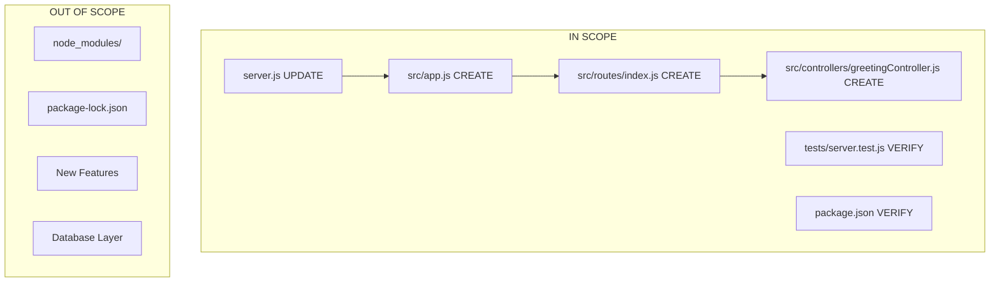

# Technical Specification

# 0. Agent Action Plan

## 0.1 Intent Clarification

### 0.1.1 Core Refactoring Objective

Based on the prompt, the Blitzy platform understands that the refactoring objective is to transform the existing Node.js Express server from a single-file implementation into a properly structured, modular Express.js application while preserving all existing functionality exactly as implemented.

**Refactoring Type:** Code structure + Modularity refactoring

**Target Repository:** Same repository (in-place refactoring)

**Refactoring Goals:**
- Transform the monolithic `server.js` file into a well-organized Express.js project structure
- Separate route definitions from the main application entry point
- Create dedicated route handler modules for better code organization
- Implement Express.js best practices for scalability and maintainability
- Preserve the exact behavior and output of all existing endpoints
- Maintain full backward compatibility with existing tests
- Keep the same CommonJS module system as originally implemented

**Implicit Requirements (Surfaced):**
- The Express `app` must remain exportable via `module.exports` for testing purposes
- The `require.main === module` guard pattern must be preserved to enable test execution without port binding
- Both endpoints must return exact response strings: `GET /` → "Hello world", `GET /evening` → "Good evening"
- Environment variable `PORT` configuration must be preserved (default: 3000)
- All existing Jest/Supertest tests must pass without modification

### 0.1.2 Special Instructions and Constraints

**Critical Directives:**
- Maintain all public API contracts (both GET endpoints)
- Preserve exact response text for both endpoints
- Keep test compatibility with the `supertest` testing approach
- Use CommonJS module syntax (`require`/`module.exports`) to match existing codebase

**Migration Requirements:**
- No migration to a new repository required
- Refactoring is performed in the same codebase
- No breaking changes to external contracts

**Performance/Scalability Improvements Expected:**
- Improved code organization for future feature additions
- Separation of concerns enabling easier testing
- Modular structure supporting team collaboration

**User Example (Preserved):**

> "Rewrite this Node.js server into a express.js refactor, keeping every feature and functionality exactly as in the original Node.js project. Ensure the rewritten version fully matches the behavior and logic of the current implementation."

**Web Search Research Conducted:**
- <cite index="1-1">Express.js project structure best practices including separation into config, controllers, models, routes, middlewares, services, and utils folders</cite>
- <cite index="11-4,11-5">Express.Router() for creating modular mountable route handlers, described as "a complete middleware and routing system; for this reason it is often referred to as a 'mini-app'"</cite>
- <cite index="10-20,10-21">Best practice of separating app configuration from server initialization for testability: "Since there are two entities here, the app and the server, they should be separated...also allows you to unit test your app without initializing the server"</cite>
- <cite index="19-20,19-21">Modular routes and controllers approach: "By organizing your Express.js application into modular routes and controllers, you lay the foundation for a scalable and maintainable codebase"</cite>

### 0.1.3 Technical Interpretation

This refactoring translates to the following technical transformation strategy:

**Current Architecture:**
```
Single-file Express application (server.js)
├── Express app initialization
├── PORT configuration
├── Route handler for GET /
├── Route handler for GET /evening
├── Conditional server startup
└── App export for testing
```

**Target Architecture:**
```
Modular Express application
├── src/
│   ├── app.js (Express app configuration)
│   ├── routes/
│   │   └── index.js (Route definitions using express.Router)
│   └── controllers/
│       └── greetingController.js (Handler functions)
├── server.js (Server entry point - starts listener)
└── tests/ (Unchanged)
```

**Transformation Rules:**
- Route handlers → Extract to `src/controllers/greetingController.js`
- Route definitions → Extract to `src/routes/index.js` using `express.Router()`
- App configuration → Move to `src/app.js`
- Server startup → Keep in root `server.js` but import app from `src/app.js`
- Test imports → Update to reference new `src/app.js` export

**Design Patterns Applied:**
- Router pattern for modular route handling
- Controller pattern for separating request handling logic
- Separation of app configuration from server startup

## 0.2 Source Analysis

### 0.2.1 Comprehensive Source File Discovery

**Search Patterns Applied:**
- Root-level source files: `*.js`
- Test files: `tests/**/*.js`
- Configuration files: `package.json`, `package-lock.json`
- Documentation: `*.md`

**Current Structure Mapping:**

```
/tmp/blitzy/Repo-Test-Sud/B2/
├── server.js              (Main application - 16 lines, to be split)
├── package.json           (Dependencies and scripts)
├── package-lock.json      (Locked dependency versions)
├── node_modules/          (Installed dependencies)
└── tests/
    └── server.test.js     (Jest test suite - imports ../server)
```

### 0.2.2 Source File Analysis

| Source File | Lines | Purpose | Refactoring Action |
|------------|-------|---------|-------------------|
| `server.js` | 16 | Main Express app with routes | Split into multiple files |
| `tests/server.test.js` | 18 | Test suite using supertest | Update import path |
| `package.json` | ~20 | Project configuration | Update main entry, add new scripts if needed |
| `package-lock.json` | Large | Dependency lock | No changes required |

### 0.2.3 Detailed Source Code Analysis

**server.js - Complete Implementation:**
```javascript
const express = require('express');
const app = express();
const PORT = process.env.PORT || 3000;
app.get('/', (req, res) => { res.send('Hello world'); });
app.get('/evening', (req, res) => { res.send('Good evening'); });
// Conditional server startup for testing
if (require.main === module) {
  app.listen(PORT, () => { /* logging */ });
}
module.exports = app;
```

**tests/server.test.js - Test Suite:**
```javascript
const request = require('supertest');
const app = require('../server');
describe('Express Server Endpoints', () => {
  // Tests for GET / and GET /evening
});
```

**package.json - Key Configuration:**
```json
{
  "name": "b2",
  "version": "1.0.0",
  "main": "server.js",
  "dependencies": {
    "express": "^4.21.2"
  },
  "devDependencies": {
    "jest": "^29.7.0",
    "supertest": "^7.0.0"
  }
}
```

### 0.2.4 Identified Code Patterns

**Patterns to Preserve:**
- `require.main === module` guard for conditional server startup
- `module.exports = app` for test compatibility
- Environment variable PORT with default fallback
- Simple string responses with `res.send()`

**Patterns to Refactor:**
- Inline route handlers → Extract to controller functions
- Route definitions in main file → Move to routes module
- Mixed concerns in server.js → Separate app config from server startup

### 0.2.5 Complete Source File List

| File Path | Type | Status | Notes |
|-----------|------|--------|-------|
| `server.js` | Source | In Scope | Primary refactor target |
| `tests/server.test.js` | Test | In Scope | Import path update required |
| `package.json` | Config | In Scope | Main entry may need update |
| `package-lock.json` | Lock | Out of Scope | Auto-generated |
| `node_modules/**` | Dependencies | Out of Scope | Auto-generated |

**CRITICAL: All source files have been comprehensively listed. No files remain pending or to be discovered.**

## 0.3 Target Design

### 0.3.1 Refactored Structure Planning

**Target Architecture:**

```
/tmp/blitzy/Repo-Test-Sud/B2/
├── server.js                          (Entry point - server startup only)
├── src/
│   ├── app.js                         (Express app configuration and middleware)
│   ├── routes/
│   │   └── index.js                   (Main router with all route definitions)
│   └── controllers/
│       └── greetingController.js      (Handler functions for greeting endpoints)
├── tests/
│   └── server.test.js                 (Updated test suite - same tests, new import)
├── package.json                       (Updated if needed)
├── package-lock.json                  (Unchanged)
└── node_modules/                      (Unchanged)
```

### 0.3.2 Design Pattern Applications

**Router Pattern (express.Router):**
- Encapsulates all route definitions in `src/routes/index.js`
- Enables modular, mountable route handlers
- Simplifies addition of new routes without modifying core app

**Controller Pattern:**
- Separates request handling logic into `src/controllers/greetingController.js`
- Each endpoint has a dedicated handler function
- Enables unit testing of handler logic in isolation

**App/Server Separation:**
- `src/app.js` handles Express configuration and middleware
- `server.js` handles HTTP server initialization
- Enables testing app without starting server

### 0.3.3 Target File Specifications

**server.js (Entry Point):**
```javascript
const app = require('./src/app');
const PORT = process.env.PORT || 3000;
if (require.main === module) {
  app.listen(PORT, () => { /* ... */ });
}
module.exports = app;
```

**src/app.js (App Configuration):**
```javascript
const express = require('express');
const routes = require('./routes');
const app = express();
app.use('/', routes);
module.exports = app;
```

**src/routes/index.js (Route Definitions):**
```javascript
const express = require('express');
const router = express.Router();
const { getHello, getEvening } = require('../controllers/greetingController');
router.get('/', getHello);
router.get('/evening', getEvening);
module.exports = router;
```

**src/controllers/greetingController.js (Handler Functions):**
```javascript
const getHello = (req, res) => {
  res.send('Hello world');
};
const getEvening = (req, res) => {
  res.send('Good evening');
};
module.exports = { getHello, getEvening };
```

### 0.3.4 Web Search Research Applied

Based on the best practices research conducted:

- <cite index="1-1">Adopted the standard Express.js project structure with src folder containing controllers and routes</cite>
- <cite index="10-25,10-26">Followed the best practice of abstracting routes into a module: "A best practice is to abstract routes into a module...also a good idea to have a separate routes file for each API entity"</cite>
- <cite index="8-2">Applied the principle: "Don't put your business logic into the express.js controllers"</cite>
- <cite index="3-20,3-21">Leveraged Express's minimalism: "Express also provides the optimal building blocks like routing, middleware...offers simplicity, efficiency, and minimalism"</cite>

### 0.3.5 Directory Structure Justification

| Directory/File | Purpose | Best Practice Alignment |
|---------------|---------|------------------------|
| `src/` | Contains all source code | Standard convention for separating source from config |
| `src/app.js` | Express app configuration | Separates app from server for testability |
| `src/routes/` | Route definitions | Modular routing per Express.Router pattern |
| `src/controllers/` | Request handlers | Separation of concerns principle |
| `server.js` (root) | Entry point | Node.js convention, maintains backward compatibility |

### 0.3.6 Complete Target File List

| Target File | Status | Description |
|------------|--------|-------------|
| `server.js` | UPDATE | Simplified to import app from src/app.js |
| `src/app.js` | CREATE | New Express app configuration |
| `src/routes/index.js` | CREATE | New route definitions module |
| `src/controllers/greetingController.js` | CREATE | New controller with handler functions |
| `tests/server.test.js` | UPDATE | Update import path to reference root server.js |
| `package.json` | UPDATE | Verify main entry point compatibility |

**CRITICAL: All target files have been comprehensively specified for standalone operation.**

## 0.4 Transformation Mapping

### 0.4.1 File-by-File Transformation Plan

**File Transformation Modes:**
- **UPDATE** - Update an existing file
- **CREATE** - Create a new file
- **REFERENCE** - Use as an example to reflect existing patterns, styles or designs

| Target File | Transformation | Source File | Key Changes |
|------------|---------------|-------------|-------------|
| `server.js` | UPDATE | `server.js` | Remove route definitions, import app from src/app.js, keep server startup logic |
| `src/app.js` | CREATE | `server.js` | Extract Express app initialization, mount routes from src/routes |
| `src/routes/index.js` | CREATE | `server.js` | Extract route definitions using express.Router() |
| `src/controllers/greetingController.js` | CREATE | `server.js` | Extract handler functions for GET / and GET /evening |
| `tests/server.test.js` | UPDATE | `tests/server.test.js` | Verify import path compatibility (should remain ../server) |
| `package.json` | UPDATE | `package.json` | Verify main entry point, no functional changes expected |

### 0.4.2 Detailed Code Transformations

**server.js Transformation:**

Before (Source):
```javascript
const express = require('express');
const app = express();
const PORT = process.env.PORT || 3000;
app.get('/', (req, res) => { res.send('Hello world'); });
app.get('/evening', (req, res) => { res.send('Good evening'); });
if (require.main === module) {
  app.listen(PORT, () => { console.log(`...`); });
}
module.exports = app;
```

After (Target):
```javascript
const app = require('./src/app');
const PORT = process.env.PORT || 3000;
if (require.main === module) {
  app.listen(PORT, () => { console.log(`...`); });
}
module.exports = app;
```

**src/app.js Creation:**
```javascript
const express = require('express');
const routes = require('./routes');
const app = express();
app.use('/', routes);
module.exports = app;
```

**src/routes/index.js Creation:**
```javascript
const express = require('express');
const router = express.Router();
const greetingController = require('../controllers/greetingController');
router.get('/', greetingController.getHello);
router.get('/evening', greetingController.getEvening);
module.exports = router;
```

**src/controllers/greetingController.js Creation:**
```javascript
const getHello = (req, res) => { res.send('Hello world'); };
const getEvening = (req, res) => { res.send('Good evening'); };
module.exports = { getHello, getEvening };
```

### 0.4.3 Cross-File Dependencies

**Import Statement Updates:**

| File | Old Import | New Import |
|------|-----------|------------|
| `server.js` | `const express = require('express')` | `const app = require('./src/app')` |
| `src/app.js` | N/A (new file) | `const express = require('express')` and `const routes = require('./routes')` |
| `src/routes/index.js` | N/A (new file) | `const express = require('express')` and `const greetingController = require('../controllers/greetingController')` |
| `tests/server.test.js` | `const app = require('../server')` | No change (remains compatible) |

### 0.4.4 Test Compatibility Mapping

| Test File | Current Import | After Refactor | Compatibility |
|-----------|---------------|----------------|---------------|
| `tests/server.test.js` | `require('../server')` | `require('../server')` | ✅ Fully compatible |

**Rationale:** The root `server.js` continues to export the Express app via `module.exports = app`, ensuring test imports remain unchanged.

### 0.4.5 Wildcard Pattern Summary

| Pattern | Transformation | Files Matched |
|---------|---------------|---------------|
| `server.js` | UPDATE | 1 file |
| `src/**/*.js` | CREATE | 3 files (app.js, routes/index.js, controllers/greetingController.js) |
| `tests/**/*.js` | UPDATE | 1 file (verification only) |
| `package.json` | UPDATE | 1 file (verification only) |

### 0.4.6 One-Phase Execution

**CRITICAL: The entire refactor will be executed by Blitzy in ONE phase.**

All files are included in a single transformation phase:

| Phase | Files |
|-------|-------|
| Phase 1 (Single Phase) | `server.js`, `src/app.js`, `src/routes/index.js`, `src/controllers/greetingController.js`, `tests/server.test.js`, `package.json` |

No splitting into multiple phases. All transformations are atomic and interdependent.

## 0.5 Dependency Inventory

### 0.5.1 Key Private and Public Packages

**Package Registry - Complete Inventory:**

| Registry | Package Name | Version | Purpose |
|----------|-------------|---------|---------|
| npm (public) | express | ^4.21.2 | Web application framework |
| npm (public) | jest | ^29.7.0 | Testing framework (dev) |
| npm (public) | supertest | ^7.0.0 | HTTP assertion library (dev) |

**Version Verification:**
- All package versions are sourced directly from the project's `package.json`
- Express 4.21.2 is the exact version currently installed
- Jest 29.7.0 and Supertest 7.0.0 are exact dev dependency versions

### 0.5.2 Dependency Updates

**No new dependencies are required for this refactoring.**

The existing dependency set is sufficient:
- `express` - Provides `express.Router()` which is core to the modular architecture
- `jest` - Existing test runner, no changes needed
- `supertest` - Existing HTTP testing library, no changes needed

### 0.5.3 Import Refactoring

**Files Requiring Import Updates:**

| Pattern | Scope | Action |
|---------|-------|--------|
| `server.js` | Update internal imports | Change from direct Express initialization to importing `./src/app` |

**Import Transformation Rules:**

| Location | Old Statement | New Statement |
|----------|--------------|---------------|
| `server.js` | `const express = require('express');` | `const app = require('./src/app');` |
| `server.js` | `const app = express();` | (removed - imported from src/app) |
| `server.js` | (inline route handlers) | (removed - moved to controllers) |

**New Module Imports (in created files):**

| New File | Required Imports |
|----------|-----------------|
| `src/app.js` | `express`, `./routes` |
| `src/routes/index.js` | `express`, `../controllers/greetingController` |
| `src/controllers/greetingController.js` | (none - pure functions) |

### 0.5.4 External Reference Updates

**Configuration Files:**

| File | Change Required |
|------|-----------------|
| `package.json` | Verify `"main": "server.js"` remains valid |
| `package-lock.json` | No changes (auto-generated) |

**Documentation:**

| File | Status |
|------|--------|
| `README.md` | Not present in source - N/A |

**Build Files:**

| File Type | Status |
|-----------|--------|
| `setup.py` | N/A (Node.js project) |
| `pyproject.toml` | N/A |
| CI/CD configs | Not present in source |

### 0.5.5 Module Resolution Verification

**Node.js Module Resolution:**

The modular structure relies on Node.js's standard require() resolution:

```
server.js
└── requires './src/app'
    └── requires './routes' (resolves to './routes/index.js')
        └── requires '../controllers/greetingController'

tests/server.test.js
└── requires '../server' (remains compatible)
```

**Path Resolution Table:**

| From File | Require Statement | Resolves To |
|-----------|------------------|-------------|
| `server.js` | `'./src/app'` | `src/app.js` |
| `src/app.js` | `'./routes'` | `src/routes/index.js` |
| `src/routes/index.js` | `'../controllers/greetingController'` | `src/controllers/greetingController.js` |
| `tests/server.test.js` | `'../server'` | `server.js` |

### 0.5.6 Runtime Environment Requirements

| Requirement | Current | After Refactor |
|-------------|---------|----------------|
| Node.js | v18+ recommended | No change |
| Express | 4.21.2 | No change |
| Module System | CommonJS | No change |
| Environment Variables | PORT | No change |

## 0.6 Scope Boundaries

### 0.6.1 Exhaustively In Scope

**Source Transformations:**

| Pattern | Files Matched | Action |
|---------|--------------|--------|
| `server.js` | 1 file | UPDATE - Remove inline routes, import from src/app |
| `src/**/*.js` | 3 files | CREATE - app.js, routes/index.js, controllers/greetingController.js |

**Test Updates:**

| Pattern | Files Matched | Action |
|---------|--------------|--------|
| `tests/**/*.js` | 1 file | VERIFY - Ensure import compatibility maintained |

**Configuration Updates:**

| Pattern | Files Matched | Action |
|---------|--------------|--------|
| `package.json` | 1 file | VERIFY - Main entry point remains valid |

**Import Corrections:**

| Scope | Action |
|-------|--------|
| `server.js` | Update to import app from `./src/app` |
| `src/app.js` | New imports: express, ./routes |
| `src/routes/index.js` | New imports: express, ../controllers/greetingController |
| `src/controllers/greetingController.js` | No external imports needed |

### 0.6.2 Complete In-Scope File Inventory

| File Path | Transformation | Priority |
|-----------|---------------|----------|
| `server.js` | UPDATE | Critical |
| `src/app.js` | CREATE | Critical |
| `src/routes/index.js` | CREATE | Critical |
| `src/controllers/greetingController.js` | CREATE | Critical |
| `tests/server.test.js` | VERIFY | Required |
| `package.json` | VERIFY | Required |

**Total Files In Scope: 6**

### 0.6.3 Explicitly Out of Scope

**User-Requested Exclusions:**
- None specified by user

**System-Level Exclusions:**

| Item | Reason |
|------|--------|
| `node_modules/**` | Auto-generated dependency directory |
| `package-lock.json` | Auto-generated lock file |
| `.git/**` | Version control directory (if present) |

**Functionality Exclusions:**

| Item | Reason |
|------|--------|
| New endpoints | User requested exact functionality preservation |
| Database integration | Not present in original |
| Authentication/Authorization | Not present in original |
| Middleware additions | Not present in original |
| ESM migration | Original uses CommonJS, maintain compatibility |
| TypeScript conversion | Original is JavaScript |

### 0.6.4 Boundary Definitions



### 0.6.5 Validation Criteria

**Functional Validation:**

| Endpoint | Expected Response | Status Code |
|----------|------------------|-------------|
| `GET /` | "Hello world" | 200 |
| `GET /evening` | "Good evening" | 200 |

**Test Validation:**

| Test Suite | Expected Result |
|------------|-----------------|
| `npm test` | All tests pass (2/2) |

**Structural Validation:**

| Criterion | Validation |
|-----------|------------|
| Route separation | Routes defined in `src/routes/index.js` |
| Controller separation | Handlers in `src/controllers/greetingController.js` |
| App configuration | Isolated in `src/app.js` |
| Entry point | `server.js` handles only server startup |
| Module exports | `server.js` exports app for testing |

### 0.6.6 Scope Summary

| Category | Count | Details |
|----------|-------|---------|
| Files to UPDATE | 2 | server.js, package.json (verify) |
| Files to CREATE | 3 | src/app.js, src/routes/index.js, src/controllers/greetingController.js |
| Files to VERIFY | 2 | tests/server.test.js, package.json |
| Files OUT OF SCOPE | All others | node_modules, package-lock.json, any future additions |

## 0.7 Special Instructions for Refactoring

### 0.7.1 User-Emphasized Requirements

Based on the user's directive: *"keeping every feature and functionality exactly as in the original Node.js project. Ensure the rewritten version fully matches the behavior and logic of the current implementation."*

**Mandatory Preservation Requirements:**

| Requirement | Implementation |
|-------------|----------------|
| Exact endpoint responses | `GET /` returns exactly "Hello world", `GET /evening` returns exactly "Good evening" |
| HTTP status codes | Both endpoints return 200 OK |
| Environment variable support | `PORT` environment variable with default 3000 |
| Test compatibility | All existing tests must pass without modification |
| Module export pattern | App must be exported via `module.exports` |
| Conditional startup | `require.main === module` pattern preserved |

### 0.7.2 Refactoring-Specific Constraints

**Code Style Preservation:**

| Aspect | Requirement |
|--------|-------------|
| Module system | CommonJS (`require`/`module.exports`) |
| String responses | Use `res.send()` for plain text |
| Arrow functions | Maintain consistency with original code style |
| Logging format | Preserve original console.log format |

**Behavioral Equivalence:**

| Behavior | Original | Refactored |
|----------|----------|------------|
| Server startup | Conditional via `require.main === module` | Same pattern preserved in `server.js` |
| Port binding | `app.listen(PORT, callback)` | Same pattern in `server.js` |
| App export | `module.exports = app` | Same pattern in `server.js` |
| Route handling | Direct `app.get()` calls | Via `express.Router()` with same handlers |

### 0.7.3 Testing Requirements

**Pre-Refactor Test Baseline:**
```
PASS tests/server.test.js
  Express Server Endpoints
    ✓ GET / returns Hello world (27 ms)
    ✓ GET /evening returns Good evening (6 ms)

Test Suites: 1 passed, 1 total
Tests:       2 passed, 2 total
```

**Post-Refactor Test Expectation:**
- Identical test output
- Same 2 tests passing
- No test code modifications required

### 0.7.4 Backward Compatibility Checklist

| Item | Status | Notes |
|------|--------|-------|
| `require('../server')` in tests | Must work | Root `server.js` exports app |
| `npm test` command | Must work | No package.json script changes |
| `npm start` (if configured) | Must work | Entry point unchanged |
| `node server.js` | Must work | Direct execution supported |
| `PORT` environment variable | Must work | Same default behavior |

### 0.7.5 Quality Gates

**Refactoring Success Criteria:**

| Gate | Validation Method |
|------|-------------------|
| All tests pass | Run `npm test` |
| Endpoints respond correctly | Manual/automated HTTP testing |
| No new dependencies | Check `package.json` unchanged |
| Module structure correct | Verify file locations |
| Exports work | Test import in REPL or test file |

### 0.7.6 Implementation Order

**Recommended Transformation Sequence:**

1. **Create directory structure:** `src/`, `src/routes/`, `src/controllers/`
2. **Create controller:** `src/controllers/greetingController.js` (pure functions)
3. **Create routes:** `src/routes/index.js` (import controller, define routes)
4. **Create app config:** `src/app.js` (import routes, configure Express)
5. **Update server.js:** Import from `src/app`, remove inline routes
6. **Verify tests:** Run `npm test` to confirm compatibility

### 0.7.7 Output Requirements Summary

| Requirement | Status |
|-------------|--------|
| Exhaustive source-to-target file mappings | ✅ Provided |
| Wildcard patterns for file groups | ✅ Used where applicable |
| Every import change documented | ✅ Complete |
| Configuration updates mapped | ✅ package.json verified |
| No file missed in transformation | ✅ All files enumerated |
| Focus on structure, not behavior | ✅ Behavior preserved exactly |

