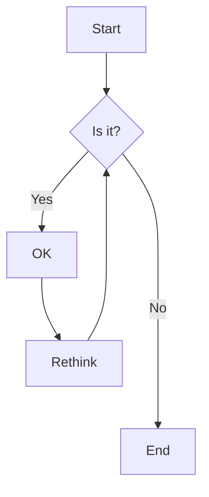
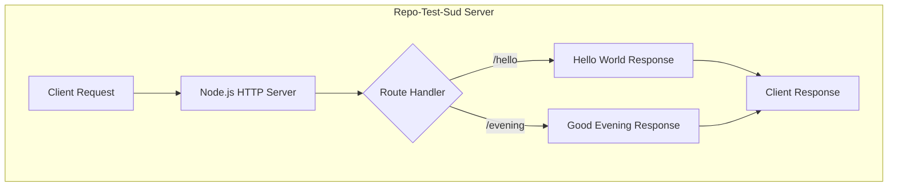
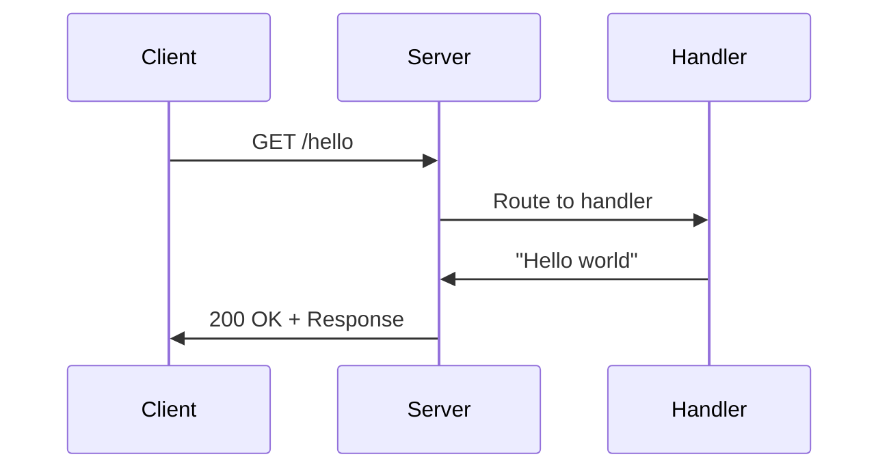
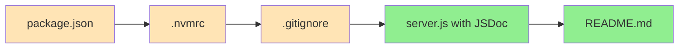

# Agent Action Plan

# 0. Agent Action Plan
## ***0.1 Intent Clarification***

| 0.1.1 Core Documentation Objective |
| --- |

### 



### 

Based on the provided requirements, the Blitzy platform understands that the documentation objective is to **create comprehensive documentation for a Node.js/Express.js tutorial server application** that includes:

- **JSDoc comments** for all functions in `server.js`
- **A comprehensive README** with multiple sections
- **API documentation** for the server endpoints
- **Deployment guide** for running the application
- **Inline code explanations** throughout the codebase

**Documentation Request Category**: Create new documentation | Update existing documentation

**Documentation Types Required**:

- API documentation (JSDoc comments for functions)
- User guides (README with setup instructions)
- Technical specifications (inline code explanations)
- Deployment documentation (deployment guide)

**Explicit Documentation Requirements**:

| Requirement | Description | Documentation Type |
| --- | --- | --- |
| JSDoc Comments | Add comprehensive JSDoc comments to all functions in server.js | API Documentation / Code Comments |
| README Setup Instructions | Create detailed setup and installation instructions | User Guide |
| API Documentation | Document the `/hello` and `/evening` endpoints | API Reference |
| Deployment Guide | Provide instructions for deploying the server | Deployment Documentation |
| Inline Code Explanations | Add explanatory comments throughout the codebase | Code Documentation |

**Implicit Documentation Needs**:

- Prerequisites section (Node.js version requirements, npm)
- Quick start guide for immediate server testing
- Environment configuration documentation
- Troubleshooting section for common issues
- License information
- Contributing guidelines (optional but recommended)

### 0.1.2 Special Instructions and Constraints

**Critical Directives Captured**:

- JSDoc comments must follow standard JSDoc syntax with `@param`, `@returns`, `@description`, and `@example` tags
- README must be comprehensive and include multiple distinct sections
- Documentation should be educational in nature, matching the tutorial project's purpose
- Inline comments should explain the "why" behind code decisions, not just the "what"

**Template Requirements**:

- Follow standard JSDoc 3.x comment format for function documentation
- Use standard Markdown formatting for README
- Include Mermaid diagrams where appropriate for visual documentation

**Style Preferences**:

- **Tone**: Educational, beginner-friendly, clear and concise
- **Structure**: Progressive disclosure (simple concepts first, then advanced)
- **Depth**: Comprehensive enough for junior developers learning Node.js
- **Format**: Markdown with proper heading hierarchy

### 0.1.3 Technical Interpretation

These documentation requirements translate to the following technical documentation strategy:

- **To document server.js functions**, we will **create JSDoc comment blocks** above each function including `http.createServer()` callback, route handlers for `/hello` and `/evening`, and the `app.listen()` callback
- **To create the README**, we will **generate a comprehensive Markdown file** with sections for project overview, prerequisites, installation, configuration, API reference, deployment, and troubleshooting
- **To document the API**, we will **create endpoint documentation** describing HTTP methods, paths, request/response formats, and example usage with curl commands
- **To create the deployment guide**, we will **document the steps** for running the server locally and preparing for production deployment
- **To add inline explanations**, we will **insert contextual comments** explaining Node.js concepts, Express.js patterns, and the educational purpose of each code section

### 0.1.4 Inferred Documentation Needs

Based on the technical specification analysis:

**Module Documentation Gaps**:

- `server.js` (to be created) contains public APIs (HTTP endpoints) but lacks documentation
- The server initialization logic requires explanation of Node.js HTTP module vs Express.js patterns
- Route handlers need documentation explaining the request-response lifecycle

**Feature Documentation Requirements**:

- Feature F-001 (HTTP Server Initialization) requires setup documentation
- Feature F-002 (Hello World Endpoint) requires API documentation with examples
- Feature F-003 (Express.js Integration) requires migration/setup documentation
- Feature F-004 (Good Evening Endpoint) requires API documentation with examples

**User Journey Documentation**:

- New developers need a clear path from cloning the repository to running the server
- Tutorial participants need step-by-step instructions for both Phase 1 (vanilla Node.js) and Phase 2 (Express.js)
- Self-learners need troubleshooting guidance for common issues

**Integration Documentation**:

- The relationship between Node.js HTTP module and Express.js framework needs explanation
- The progression from Phase 1 to Phase 2 implementation requires clear documentation

## 0.2 Documentation Discovery and Analysis

### 0.2.1 Existing Documentation Infrastructure Assessment

**Repository Analysis Conducted**:

The repository was thoroughly analyzed using the following search patterns:

- Documentation files: `README*`, `docs/**`, `*.md`, `*.mdx`, `*.rst`
- Configuration files: `package.json`, `jsdoc.json`, `mkdocs.yml`
- Existing code documentation: `*.js` files with JSDoc comments

**Repository Analysis Findings**:

"Repository analysis reveals a **greenfield project state** with minimal existing documentation infrastructure."

| Discovery | Status | Location |
| --- | --- | --- |
| [README.md](http://README.md) | Exists (minimal) | `/README.md` |
| JSDoc Configuration | Not Found | N/A |
| Documentation Generator | Not Found | N/A |
| API Documentation | Not Found | N/A |
| server.js | Not Found (to be created) | N/A |
| package.json | Not Found (to be created) | N/A |

**Current Documentation Framework**: None detected

**Documentation Generator Configuration**: Not present - will need to be established

**API Documentation Tools**: None currently in use - JSDoc recommended for implementation

**Diagram Tools**: Mermaid recommended for architecture and flow diagrams

**Documentation Hosting/Deployment**: Not configured - README-based documentation recommended for this tutorial project

### 0.2.2 Repository Code Analysis for Documentation

**Search Patterns Used for Code to Document**:

| Pattern | Purpose | Results |
| --- | --- | --- |
| `server.js`, `app.js`, `index.js` | Main server entry point | Not found (greenfield) |
| `src/**/*.js` | Source JavaScript files | Not found |
| `routes/**/*.js` | Route definitions | Not found |
| `*.json` | Configuration files | Not found |

**Key Directories Examined**:

- Root directory (`/`) - Contains only `README.md`
- `/app` directory - Contains unrelated Python project (out of scope)
- `.github/workflows/` - Contains `deploy-job.yml` (CI/CD configuration)

**Related Documentation Found**:

- Existing `README.md` at root - minimal content, requires comprehensive update
- Technical specification provides detailed requirements for documentation

**Code to be Documented** (based on technical specification):

```plaintext
server.js (to be created)
├── HTTP Server Initialization (Phase 1)
│   ├── http.createServer() callback
│   ├── Request handler function
│   └── server.listen() callback
├── Express.js Integration (Phase 2)
│   ├── Express app initialization
│   ├── GET /hello route handler
│   ├── GET /evening route handler
│   └── app.listen() callback
└── Utility functions (if any)
```

### 0.2.3 Web Search Research Conducted

**Research Topics and Findings**:

| Topic | Key Findings |
| --- | --- |
| JSDoc Best Practices for Node.js/Express | Use `@param`, `@returns`, `@description`, `@example` tags; install `@types/express` for type hints; document Express middleware with `express.Request`, `express.Response`, `express.NextFunction` types |
| README Best Practices for Node.js Projects | Include project name, description, badges, prerequisites, installation, usage, API reference, contributing, and license sections; use progressive disclosure |
| Express.js API Documentation | Use `@route` tag for endpoint documentation; include HTTP method, path, request/response examples |
| Node.js Documentation Standards | Follow CommonJS module documentation patterns; document exports clearly |

**Best Practices Identified**:

1. **JSDoc for Express Routes**:

   - Use `@param {express.Request} req` for request objects
   - Use `@param {express.Response} res` for response objects
   - Document route paths with `@route GET /path` convention

2. **README Structure**:

   - Start with project name and brief description
   - Include badges for build status, version, license
   - Provide clear installation and quick start instructions
   - Document all API endpoints with examples
   - Include troubleshooting section

3. **Inline Code Comments**:

   - Explain the "why" not just the "what"
   - Use educational tone for tutorial projects
   - Reference official documentation where appropriate

## 0.3 Documentation Scope Analysis

### 0.3.1 Code-to-Documentation Mapping

**Modules Requiring Documentation**:

| Module | File Path | Public APIs | Current Documentation | Documentation Needed |
| --- | --- | --- | --- | --- |
| HTTP Server | `server.js` | `createServer()` callback, request handler | Missing | JSDoc comments, inline explanations |
| Express App | `server.js` | Express app instance, route handlers | Missing | JSDoc comments, API reference |
| Hello Endpoint | `server.js` | `GET /hello` route | Missing | API documentation, usage examples |
| Evening Endpoint | `server.js` | `GET /evening` route | Missing | API documentation, usage examples |

**Detailed Module Documentation Requirements**:

**Module: server.js (HTTP Server - Phase 1)**

- Public APIs:
  - `http.createServer(requestListener)` - Server factory function
  - `requestHandler(req, res)` - Request processing function
  - `server.listen(port, callback)` - Server startup function
- Current documentation: None (file to be created)
- Documentation needed:
  - JSDoc block for request handler function
  - Inline comments explaining HTTP module usage
  - Comments explaining request/response lifecycle

**Module: server.js (Express Server - Phase 2)**

- Public APIs:
  - `express()` - Express application factory
  - `app.get('/hello', handler)` - Hello world endpoint
  - `app.get('/evening', handler)` - Good evening endpoint
  - `app.listen(port, callback)` - Server startup
- Current documentation: None (file to be created)
- Documentation needed:
  - JSDoc blocks for each route handler
  - Inline comments explaining Express patterns
  - API reference documentation

**Configuration Options Requiring Documentation**:

| Config File | Options to Document | Current Status |
| --- | --- | --- |
| `package.json` | scripts, dependencies, engines | To be created |
| `.nvmrc` or `.node-version` | Node.js version | To be created |
| Environment variables | `PORT` | To be documented |

**Features Requiring User Guides**:

| Feature | Current Coverage | Documentation Gaps |
| --- | --- | --- |
| Server Setup | None | Installation, prerequisites, quick start |
| Hello World Endpoint | None | API usage, curl examples, response format |
| Good Evening Endpoint | None | API usage, curl examples, response format |
| Express Migration | None | Migration steps, framework comparison |

### 0.3.2 Documentation Gap Analysis

"Given the requirements and repository analysis, documentation gaps include..."

**Undocumented Public APIs**:

- `server.js` request handler function (Phase 1)
- `server.js` Express route handlers (Phase 2)
- Server initialization and startup logic
- Error handling patterns

**Missing User Guides**:

- Project setup and installation guide
- Quick start tutorial
- API usage guide with examples
- Troubleshooting guide

**Incomplete Architecture Documentation**:

- No explanation of Phase 1 vs Phase 2 architecture
- No documentation of request flow
- No explanation of Node.js HTTP module vs Express.js

**Outdated Documentation**:

- Existing `README.md` is minimal and requires complete rewrite

**Documentation Coverage Summary**:

```plaintext
Current State:
├── README.md ────────────── Minimal (needs comprehensive update)
├── JSDoc Comments ───────── 0% (server.js not yet created)
├── API Documentation ────── 0% (no endpoint docs)
├── Inline Comments ──────── 0% (no code comments)
├── Setup Instructions ───── 0% (not documented)
└── Deployment Guide ─────── 0% (not documented)

Target State:
├── README.md ────────────── Comprehensive (all sections)
├── JSDoc Comments ───────── 100% (all functions documented)
├── API Documentation ────── 100% (all endpoints documented)
├── Inline Comments ──────── 100% (educational explanations)
├── Setup Instructions ───── 100% (complete guide)
└── Deployment Guide ─────── 100% (local and production)
```

## 0.4 Documentation Implementation Design

### 0.4.1 Documentation Structure Planning

**Documentation Hierarchy**:

```plaintext
repo-test-sud/
├── README.md (comprehensive project documentation)
│   ├── Project Overview
│   ├── Features
│   ├── Prerequisites
│   ├── Installation
│   ├── Quick Start
│   ├── API Reference
│   │   ├── GET /hello
│   │   └── GET /evening
│   ├── Configuration
│   ├── Deployment Guide
│   ├── Troubleshooting
│   ├── Contributing
│   └── License
├── server.js (with JSDoc comments and inline explanations)
│   ├── File-level JSDoc block
│   ├── Import/require statements (commented)
│   ├── Configuration constants (commented)
│   ├── Route handlers (JSDoc + inline comments)
│   └── Server initialization (JSDoc + inline comments)
└── package.json (with descriptive fields)
    ├── name, version, description
    ├── scripts (documented)
    └── engines (Node.js version)
```

### 0.4.2 Content Generation Strategy

**Information Extraction Approach**:

| Source | Information to Extract | Target Documentation |
| --- | --- | --- |
| Technical Specification | Feature requirements, API specs | README API Reference |
| Technical Specification | Architecture details | README Overview, Inline comments |
| Technical Specification | Code examples | JSDoc @example tags |
| Best Practices Research | JSDoc patterns | server.js comments |
| Best Practices Research | README structure | [README.md](http://README.md) sections |

**Template Application**:

**JSDoc Comment Template for Route Handlers**:

```javascript
/**
 * @description Brief description of the endpoint
 * @route HTTP_METHOD /path
 * @param {express.Request} req - Express request object
 * @param {express.Response} res - Express response object
 * @returns {void} Sends response to client
 * @example
 * // Example usage with curl
 * curl http://localhost:3000/path
 */
```

**README Section Template**:

```plaintext
## Section Title

Brief introduction to the section.

#### Subsection (if needed)

Detailed content with:
- Bullet points for lists
- Code blocks for examples
- Tables for structured data
```

**Documentation Standards**:

| Standard | Implementation |
| --- | --- |
| Markdown formatting | Proper headers (# ## ###), code blocks with language hints |
| Mermaid diagrams | \`\`\`mermaid blocks for architecture and flow diagrams |
| Code examples | \`\`\`javascript blocks with syntax highlighting |
| Source citations | Reference to technical specification sections |
| Tables | Parameter descriptions, endpoint specifications |
| Consistent terminology | Use "endpoint", "route handler", "server" consistently |

### 0.4.3 Diagram and Visual Strategy

**Mermaid Diagrams to Create**:

| Diagram Type | Purpose | Location |
| --- | --- | --- |
| Architecture Diagram | Show server component structure | [README.md](http://README.md) |
| Request Flow Diagram | Illustrate HTTP request lifecycle | [README.md](http://README.md) |
| Phase Comparison | Compare Phase 1 vs Phase 2 architecture | [README.md](http://README.md) |

**Architecture Diagram Specification**:



**Request Flow Diagram Specification**:



### 0.4.4 JSDoc Implementation Strategy

**JSDoc Tags to Use**:

| Tag | Purpose | Example |
| --- | --- | --- |
| `@file` | File-level description | `@file Express server for Repo-Test-Sud tutorial` |
| `@description` | Function/method description | `@description Handles GET requests to /hello endpoint` |
| `@param` | Parameter documentation | `@param {express.Request} req - The request object` |
| `@returns` | Return value documentation | `@returns {void} Sends JSON response` |
| `@example` | Usage examples | `@example curl http://localhost:3000/hello` |
| `@see` | Cross-references | `@see https://expressjs.com/en/api.html` |
| `@since` | Version information | `@since 1.0.0` |

**Inline Comment Strategy**:

| Comment Type | Purpose | Example |
| --- | --- | --- |
| Section headers | Organize code sections | `// ============ SERVER CONFIGURATION ============` |
| Explanatory | Explain "why" decisions | `// Using port 3000 as default for local development` |
| Educational | Teach Node.js/Express concepts | `// Express automatically parses the URL path` |
| Reference | Link to documentation | `// See: https://nodejs.org/api/http.html` |

## 0.5 Documentation File Transformation Mapping

### 0.5.1 File-by-File Documentation Plan

**Documentation Transformation Modes**:

- **CREATE** - Create a new documentation file
- **UPDATE** - Update an existing documentation file
- **DELETE** - Remove an obsolete documentation file
- **REFERENCE** - Use as an example for documentation style and structure

**Complete Documentation Transformation Map**:

| Target Documentation File | Transformation | Source Code/Docs | Content/Changes |
| --- | --- | --- | --- |
| `README.md` | UPDATE | Technical Specification, existing [README.md](http://README.md) | Complete rewrite with comprehensive sections: Overview, Features, Prerequisites, Installation, Quick Start, API Reference, Configuration, Deployment Guide, Troubleshooting, Contributing, License |
| `server.js` | CREATE | Technical Specification F-001, F-002, F-003, F-004 | Create server file with comprehensive JSDoc comments for all functions, inline code explanations, and educational comments |
| `package.json` | CREATE | Technical Specification 3.2, 3.3 | Create package manifest with documented scripts, dependencies (express@4.18.x), and engines field |
| `.nvmrc` | CREATE | Technical Specification 3.2 | Create Node.js version specification file (18.x or 20.x LTS) |

### 0.5.2 New Documentation Files Detail

**File: server.js**

- **Type**: Source Code with JSDoc Documentation
- **Source**: Technical Specification sections 2.2, 2.3, 5.2
- **Sections**:
  - File-level JSDoc block (`@file`, `@description`, `@author`, `@version`)
  - Import statements with explanatory comments
  - Configuration constants with documentation
  - Phase 1: HTTP Server Implementation
    - `createServer()` callback with JSDoc
    - Request handler with JSDoc and inline comments
    - `server.listen()` with JSDoc
  - Phase 2: Express.js Implementation
    - Express app initialization with comments
    - `GET /hello` route handler with JSDoc
    - `GET /evening` route handler with JSDoc
    - `app.listen()` with JSDoc
- **Diagrams**: None (code file)
- **Key Citations**: Technical Specification 2.2 Feature Catalog, 5.2 Component Details

**JSDoc Structure for server.js**:

```javascript
/**
 * @file Repo-Test-Sud Tutorial Server
 * @description Educational Node.js/Express server
 * @version 1.0.0
 */

/**
 * @description Handles GET /hello requests
 * @param {express.Request} req - Request object
 * @param {express.Response} res - Response object
 * @returns {void}
 */
```

**File: [README.md](http://README.md) (Complete Rewrite)**

- **Type**: Project Documentation
- **Source**: Technical Specification, existing [README.md](http://README.md)
- **Sections**:
  - Project Title and Description
  - Features List
  - Prerequisites (Node.js 18.x/20.x, npm)
  - Installation Instructions
  - Quick Start Guide
  - API Reference
    - `GET /hello` endpoint documentation
    - `GET /evening` endpoint documentation
  - Configuration (PORT environment variable)
  - Deployment Guide (local and production)
  - Troubleshooting (common issues and solutions)
  - Contributing Guidelines
  - License Information
- **Diagrams**:
  - Architecture overview (Mermaid)
  - Request flow diagram (Mermaid)
- **Key Citations**: Technical Specification 1.1, 1.2, 2.2, 5.1

**File: package.json**

- **Type**: Project Configuration
- **Source**: Technical Specification 3.2, 3.3
- **Content**:
  - `name`: "repo-test-sud"
  - `version`: "1.0.0"
  - `description`: Documented project description
  - `main`: "server.js"
  - `scripts`: Documented npm scripts (start, dev)
  - `dependencies`: express@4.18.x or 4.19.x
  - `engines`: Node.js version specification
- **Key Citations**: Technical Specification 3.2 Programming Languages, 3.3 Frameworks

**File: .nvmrc**

- **Type**: Node Version Configuration
- **Source**: Technical Specification 3.2
- **Content**: Node.js LTS version (18 or 20)
- **Key Citations**: Technical Specification 3.2 Programming Languages

### 0.5.3 Documentation Files to Update Detail

[**README.md**](http://README.md) **- Complete Rewrite**

| Section | New Content | Source |
| --- | --- | --- |
| Title | "Repo-Test-Sud" with project badges | Tech Spec 1.1 |
| Description | Educational Node.js/Express tutorial server | Tech Spec 1.2 |
| Features | List of F-001 through F-004 features | Tech Spec 2.2 |
| Prerequisites | Node.js 18.x/20.x LTS, npm 8.x+ | Tech Spec 3.2 |
| Installation | Clone, npm install, npm start | Standard practice |
| Quick Start | 3-step guide to running server | Tech Spec 2.3 |
| API Reference | /hello and /evening endpoints | Tech Spec 2.2, 2.3 |
| Configuration | PORT environment variable | Tech Spec 5.2 |
| Deployment | Local and production instructions | Tech Spec 5.2 |
| Troubleshooting | Common issues and solutions | Best practices |
| Contributing | Contribution guidelines | Standard practice |
| License | MIT License | Standard practice |

### 0.5.4 Documentation Configuration Updates

| Configuration File | Update Required | Purpose |
| --- | --- | --- |
| `package.json` | CREATE | Define project metadata, scripts, dependencies |
| `.nvmrc` | CREATE | Specify Node.js version for nvm users |
| `.gitignore` | CREATE | Exclude node_modules, logs, etc. |

### 0.5.5 Cross-Documentation Dependencies

**Shared Content/Includes**:

- API endpoint specifications used in both [README.md](http://README.md) and JSDoc comments
- Port configuration referenced in [README.md](http://README.md), server.js, and package.json

**Navigation Links Between Documents**:

- [README.md](http://README.md) references server.js for implementation details
- JSDoc comments reference [README.md](http://README.md) for full documentation

**Table of Contents Updates**:

- [README.md](http://README.md) will include auto-generated or manual table of contents

**Index/Glossary Updates**:

- [README.md](http://README.md) will include glossary of terms (Node.js, Express.js, HTTP, etc.) for educational purposes

## 0.6 Dependency Inventory

### 0.6.1 Documentation Dependencies

**Key Documentation Tools and Packages**:

| Registry | Package Name | Version | Purpose |
| --- | --- | --- | --- |
| npm | express | 4.18.2 | Web framework for Node.js (runtime dependency) |
| npm | jsdoc | 4.0.2 | JSDoc documentation generator (optional dev dependency) |
| npm | @types/express | 4.17.21 | TypeScript type definitions for Express (dev dependency for JSDoc type hints) |
| npm | @types/node | 20.10.0 | TypeScript type definitions for Node.js (dev dependency for JSDoc type hints) |

**Runtime Dependencies** (required for server operation):

| Registry | Package Name | Version | Purpose |
| --- | --- | --- | --- |
| npm | express | 4.18.2 | Express.js web framework for Phase 2 implementation |

**Development Dependencies** (optional, for enhanced documentation):

| Registry | Package Name | Version | Purpose |
| --- | --- | --- | --- |
| npm | jsdoc | 4.0.2 | Generate HTML documentation from JSDoc comments |
| npm | @types/express | 4.17.21 | Provide type hints for Express objects in JSDoc |
| npm | @types/node | 20.10.0 | Provide type hints for Node.js built-in modules |

**Node.js Runtime**:

| Component | Version | Purpose |
| --- | --- | --- |
| Node.js | 18.x LTS or 20.x LTS | JavaScript runtime environment |
| npm | 8.x+ (bundled with Node.js) | Package manager |

### 0.6.2 Documentation Reference Updates

**Documentation Files Requiring Link Updates**:

| File | Links to Update | Purpose |
| --- | --- | --- |
| [README.md](http://README.md) | External links to Node.js docs, Express.js docs | Reference documentation |
| server.js | JSDoc @see tags linking to official documentation | Cross-reference |

**Link Transformation Rules**:

| Link Type | Format | Example |
| --- | --- | --- |
| Node.js Documentation | `https://nodejs.org/api/{module}.html` | `https://nodejs.org/api/http.html` |
| Express.js Documentation | `https://expressjs.com/en/{version}/api.html` | `https://expressjs.com/en/4x/api.html` |
| npm Package | `https://www.npmjs.com/package/{package}` | `https://www.npmjs.com/package/express` |

### 0.6.3 Version Compatibility Matrix

| Component | Minimum Version | Recommended Version | Maximum Version |
| --- | --- | --- | --- |
| Node.js | 18.0.0 | 20.10.0 (LTS) | 20.x (latest LTS) |
| npm | 8.0.0 | 10.2.0 | Latest |
| Express.js | 4.18.0 | 4.18.2 | 4.19.x |

### 0.6.4 Package.json Specification

**Complete package.json Structure**:

```json
{
  "name": "repo-test-sud",
  "version": "1.0.0",
  "description": "Educational Node.js/Express.js tutorial server",
  "main": "server.js",
  "scripts": {
    "start": "node server.js",
    "dev": "node --watch server.js"
  },
  "keywords": [
    "nodejs",
    "express",
    "tutorial",
    "http-server"
  ],
  "author": "",
  "license": "MIT",
  "dependencies": {
    "express": "^4.18.2"
  },
  "devDependencies": {
    "@types/express": "^4.17.21",
    "@types/node": "^20.10.0"
  },
  "engines": {
    "node": ">=18.0.0"
  }
}
```

**Script Documentation**:

| Script | Command | Description |
| --- | --- | --- |
| `start` | `node server.js` | Start the server in production mode |
| `dev` | `node --watch server.js` | Start the server with auto-reload (Node.js 18.11+) |

## 0.7 Coverage and Quality Targets

### 0.7.1 Documentation Coverage Metrics

**Current Coverage Analysis**:

| Documentation Type | Current | Target | Gap |
| --- | --- | --- | --- |
| Public APIs documented | 0/4 (0%) | 4/4 (100%) | 4 functions |
| User-facing features documented | 0/4 (0%) | 4/4 (100%) | 4 features |
| Configuration options documented | 0/1 (0%) | 1/1 (100%) | PORT variable |
| README sections | 1/12 (8%) | 12/12 (100%) | 11 sections |
| JSDoc comments | 0/4 (0%) | 4/4 (100%) | 4 functions |
| Inline code explanations | 0% | 100% | All code sections |

**Target Coverage**: 100% based on user requirement for "comprehensive" documentation

**Coverage Gaps to Address**:

| Module/Feature | Current Coverage | Target Coverage | Focus Areas |
| --- | --- | --- | --- |
| server.js | 0% | 100% | JSDoc for all functions, inline comments |
| [README.md](http://README.md) | 8% | 100% | All 12 sections complete |
| API Endpoints | 0% | 100% | /hello and /evening fully documented |
| Configuration | 0% | 100% | PORT environment variable |

### 0.7.2 Documentation Quality Criteria

**Completeness Requirements**:

| Requirement | Criteria | Validation Method |
| --- | --- | --- |
| All public APIs have descriptions | Every function has `@description` tag | Manual review |
| All parameters documented | Every parameter has `@param` tag with type and description | JSDoc validation |
| All return values documented | Every function has `@returns` tag | JSDoc validation |
| All endpoints have examples | Every API endpoint has curl example | Manual review |
| All user guides include setup | Installation section complete | Checklist |
| All user guides include usage | Quick start section complete | Checklist |
| All user guides include troubleshooting | Troubleshooting section complete | Checklist |
| All architecture docs include diagrams | Mermaid diagrams present | Visual inspection |
| All architecture docs include rationale | Explanatory comments present | Manual review |

**Accuracy Validation**:

| Validation Type | Method | Acceptance Criteria |
| --- | --- | --- |
| Code examples tested | Manual execution | All examples run without errors |
| API signatures match codebase | Code review | JSDoc matches actual function signatures |
| Screenshots/diagrams current | Visual comparison | Diagrams reflect actual architecture |
| Version numbers accurate | Package.json review | Versions match technical specification |

**Clarity Standards**:

| Standard | Implementation | Example |
| --- | --- | --- |
| Technical accuracy | Use correct terminology | "HTTP GET request" not "web call" |
| Accessible language | Avoid jargon where possible | Explain terms on first use |
| Progressive disclosure | Simple concepts first | Prerequisites before advanced config |
| Consistent terminology | Use same terms throughout | Always "endpoint" not "route/path/URL" |

**Maintainability Standards**:

| Standard | Implementation |
| --- | --- |
| Source citations | Reference technical specification sections |
| Clear ownership | Include author information in JSDoc |
| Update dates | Include version information |
| Template-based | Follow consistent JSDoc and README patterns |

### 0.7.3 Example and Diagram Requirements

**Minimum Examples Per Component**:

| Component | Minimum Examples | Example Types |
| --- | --- | --- |
| GET /hello endpoint | 2 | curl command, browser URL |
| GET /evening endpoint | 2 | curl command, browser URL |
| Server startup | 1 | npm start command |
| Installation | 3 | clone, install, start |

**Diagram Types Required**:

| Diagram | Type | Purpose |
| --- | --- | --- |
| Architecture Overview | Mermaid graph | Show server component structure |
| Request Flow | Mermaid sequence | Illustrate HTTP request lifecycle |
| Phase Comparison | Mermaid graph | Compare Phase 1 vs Phase 2 |

**Code Example Testing**:

| Example Type | Testing Method |
| --- | --- |
| curl commands | Execute against running server |
| npm commands | Execute in project directory |
| Code snippets | Verify syntax correctness |

**Visual Content Freshness**:

| Content Type | Update Policy |
| --- | --- |
| Architecture diagrams | Update when architecture changes |
| Code examples | Update when API changes |
| Screenshots | Update when UI changes (N/A for this project) |

### 0.7.4 Quality Checklist

**Pre-Completion Quality Checklist**:

- [ ] All functions in server.js have JSDoc comments

- [ ] All JSDoc comments include @description, @param, @returns

- [ ] All API endpoints have usage examples

- [ ] README includes all 12 required sections

- [ ] All code examples are syntactically correct

- [ ] All Mermaid diagrams render correctly

- [ ] All external links are valid

- [ ] Terminology is consistent throughout

- [ ] Language is beginner-friendly and educational

- [ ] Version numbers match technical specification

## 0.8 Scope Boundaries

### 0.8.1 Exhaustively In Scope

**New Documentation Files**:

| File Pattern | Description | Priority |
| --- | --- | --- |
| `README.md` | Comprehensive project documentation | High |
| `server.js` | Source code with JSDoc comments and inline explanations | High |
| `package.json` | Project manifest with documented fields | High |
| `.nvmrc` | Node.js version specification | Medium |
| `.gitignore` | Git ignore patterns | Medium |

**Documentation File Updates**:

| File | Update Type | Description |
| --- | --- | --- |
| `README.md` | Complete rewrite | Replace minimal content with comprehensive documentation |

**Documentation Content Types**:

| Content Type | Files Affected | Description |
| --- | --- | --- |
| JSDoc comments | `server.js` | Function-level documentation with @description, @param, @returns, @example |
| Inline comments | `server.js` | Educational explanations of code logic and patterns |
| API documentation | `README.md` | Endpoint specifications with examples |
| Setup instructions | `README.md` | Prerequisites, installation, quick start |
| Deployment guide | `README.md` | Local and production deployment instructions |
| Troubleshooting | `README.md` | Common issues and solutions |

**Documentation Assets**:

| Asset Type | Location | Description |
| --- | --- | --- |
| Mermaid diagrams | `README.md` (inline) | Architecture and flow diagrams |
| Code examples | `README.md`, `server.js` | Usage examples, curl commands |

**Documentation Configuration**:

| Configuration | File | Description |
| --- | --- | --- |
| npm scripts | `package.json` | Documented start and dev scripts |
| Node.js version | `.nvmrc` | Version specification for nvm |
| Dependencies | `package.json` | Express.js and dev dependencies |

### 0.8.2 Explicitly Out of Scope

**Source Code Modifications** (unless explicitly for documentation):

| Item | Reason |
| --- | --- |
| Feature additions | Documentation task only |
| Bug fixes | Documentation task only |
| Refactoring | Documentation task only |
| Performance optimizations | Documentation task only |

**Test File Modifications**:

| Item | Reason |
| --- | --- |
| Unit tests | Not requested in documentation task |
| Integration tests | Not requested in documentation task |
| Test documentation | Not requested in documentation task |

**Unrelated Files and Directories**:

| Item | Reason |
| --- | --- |
| `/app/**` | Python project, unrelated to Node.js documentation task |
| `.github/workflows/deploy-job.yml` | CI/CD configuration, not documentation |

**Deployment Configuration Changes**:

| Item | Reason |
| --- | --- |
| Docker configuration | Not requested |
| CI/CD pipeline changes | Not requested |
| Cloud deployment scripts | Not requested |

**Unrelated Documentation**:

| Item | Reason |
| --- | --- |
| Python project documentation | Out of scope (different project) |
| CI/CD documentation | Not requested |
| Database documentation | Not applicable |

### 0.8.3 Scope Boundary Diagram

```mermaid
graph TB
    subgraph "IN SCOPE"
        A[README.md - Complete Rewrite]
        B[server.js - JSDoc + Inline Comments]
        C[package.json - Create with Documentation]
        D[.nvmrc - Create]
        E[.gitignore - Create]
        F[Mermaid Diagrams in README]
        G[API Documentation]
        H[Setup Instructions]
        I[Deployment Guide]
    end
    
    subgraph "OUT OF SCOPE"
        J[/app/ Python Project]
        K[CI/CD Configuration]
        L[Unit Tests]
        M[Feature Development]
        N[Database Setup]
    end
    
    style A fill:#90EE90
    style B fill:#90EE90
    style C fill:#90EE90
    style D fill:#90EE90
    style E fill:#90EE90
    style F fill:#90EE90
    style G fill:#90EE90
    style H fill:#90EE90
    style I fill:#90EE90
    style J fill:#FFB6C1
    style K fill:#FFB6C1
    style L fill:#FFB6C1
    style M fill:#FFB6C1
    style N fill:#FFB6C1
```

### 0.8.4 Scope Decision Matrix

| Item | In Scope? | Justification |
| --- | --- | --- |
| JSDoc comments in server.js | ✅ Yes | Explicitly requested |
| README with setup instructions | ✅ Yes | Explicitly requested |
| API documentation | ✅ Yes | Explicitly requested |
| Deployment guide | ✅ Yes | Explicitly requested |
| Inline code explanations | ✅ Yes | Explicitly requested |
| package.json creation | ✅ Yes | Required for project setup documentation |
| .nvmrc creation | ✅ Yes | Supports setup instructions |
| Mermaid diagrams | ✅ Yes | Enhances documentation quality |
| Python project in /app | ❌ No | Unrelated to Node.js documentation task |
| CI/CD pipeline documentation | ❌ No | Not requested |
| Unit test creation | ❌ No | Not a documentation task |
| Feature implementation | ❌ No | Documentation task only |

## 0.9 Execution Parameters

### 0.9.1 Documentation-Specific Instructions

**Documentation Build Commands**:

| Command | Purpose | Usage |
| --- | --- | --- |
| `npm run docs` | Generate HTML documentation from JSDoc (optional) | `npm run docs` |
| `npx jsdoc server.js` | Generate JSDoc documentation | `npx jsdoc server.js -d docs/` |

**Documentation Preview Commands**:

| Command | Purpose | Usage |
| --- | --- | --- |
| Markdown preview | Preview [README.md](http://README.md) | Use VS Code or GitHub preview |
| JSDoc preview | View generated HTML docs | Open `docs/index.html` in browser |

**Diagram Generation Commands**:

| Command | Purpose | Usage |
| --- | --- | --- |
| Mermaid CLI (optional) | Generate diagram images | `npx @mermaid-js/mermaid-cli -i diagram.mmd -o diagram.png` |
| GitHub/GitLab rendering | Automatic Mermaid rendering | Push to repository |

**Documentation Validation Commands**:

| Command | Purpose | Usage |
| --- | --- | --- |
| Markdown lint | Validate README formatting | `npx markdownlint README.md` |
| Link check | Verify external links | `npx markdown-link-check README.md` |
| JSDoc validation | Check JSDoc syntax | `npx jsdoc -X server.js` |

### 0.9.2 Default Documentation Format

**Primary Format**: Markdown with Mermaid diagrams

**Markdown Conventions**:

| Element | Convention | Example |
| --- | --- | --- |
| Headings | ATX-style with space | `# Heading 1` |
| Code blocks | Fenced with language | ```` ```javascript ```` |
| Lists | Dash for unordered | `- Item` |
| Links | Inline style | `[text](url)` |
| Tables | Pipe-delimited | \` |

**JSDoc Conventions**:

| Element | Convention | Example |
| --- | --- | --- |
| Block comments | Multi-line with asterisks | `/** ... */` |
| Tags | @ prefix | `@param`, `@returns` |
| Types | Curly braces | `{string}`, `{Object}` |
| Descriptions | After tag and type | `@param {string} name - The user's name` |

### 0.9.3 Citation Requirements

**Source Citation Format**:

Every technical detail must reference its source:

| Citation Type | Format | Example |
| --- | --- | --- |
| Technical Specification | `Source: Tech Spec Section X.X` | `Source: Tech Spec Section 2.2` |
| Code Reference | `Source: /path/to/file.js:LineNumber` | `Source: /server.js:15` |
| External Documentation | `See: URL` | `See: https://expressjs.com/en/4x/api.html` |

### 0.9.4 Style Guide

**Documentation Style Guide**:

| Aspect | Guideline |
| --- | --- |
| Tone | Educational, beginner-friendly, encouraging |
| Voice | Active voice preferred |
| Tense | Present tense for descriptions |
| Person | Second person ("you") for instructions |
| Sentence length | Short to medium (15-25 words) |
| Paragraph length | 3-5 sentences maximum |
| Technical terms | Define on first use |
| Acronyms | Spell out on first use |

**Code Example Style**:

| Aspect | Guideline |
| --- | --- |
| Language hints | Always include (\`\`\`javascript) |
| Comments | Include explanatory comments |
| Formatting | Consistent indentation (2 spaces) |
| Length | Keep examples concise (5-15 lines) |
| Completeness | Show complete, runnable examples |

### 0.9.5 Validation Checklist

**Pre-Submission Validation**:

| Check | Command/Method | Pass Criteria |
| --- | --- | --- |
| Markdown syntax | `npx markdownlint README.md` | No errors |
| Links valid | `npx markdown-link-check README.md` | All links resolve |
| JSDoc syntax | `npx jsdoc -X server.js` | Valid JSON output |
| Code examples | Manual execution | All examples run |
| Mermaid diagrams | GitHub preview | Diagrams render |
| Spelling | Spell checker | No errors |
| Consistency | Manual review | Terminology consistent |

### 0.9.6 File Creation Order

**Recommended Documentation Creation Sequence**:

| Order | File | Reason |
| --- | --- | --- |
| 1 | `package.json` | Establishes project structure and dependencies |
| 2 | `.nvmrc` | Specifies Node.js version |
| 3 | `.gitignore` | Prevents committing unwanted files |
| 4 | `server.js` | Core application with JSDoc and inline comments |
| 5 | `README.md` | Comprehensive documentation referencing server.js |

**Dependency Order**:



## 0.10 Special Instructions

### 0.10.1 Documentation-Specific Requirements

Based on the user's request, the following special instructions apply to this documentation task:

**Explicitly Emphasized Requirements**:

| Requirement | Implementation |
| --- | --- |
| "Add JSDoc comments to server.js functions" | Every function in server.js must have a complete JSDoc block with @description, @param, @returns, and @example tags |
| "Create a comprehensive README" | README must include all 12 sections: Overview, Features, Prerequisites, Installation, Quick Start, API Reference, Configuration, Deployment Guide, Troubleshooting, Contributing, License, and Table of Contents |
| "Setup instructions" | README must include detailed step-by-step installation and configuration instructions |
| "API documentation" | README must document all API endpoints with HTTP method, path, description, request/response format, and curl examples |
| "Deployment guide" | README must include instructions for both local development and production deployment |
| "Inline code explanations" | server.js must include educational comments explaining Node.js and Express.js concepts |

### 0.10.2 JSDoc Comment Requirements

**Mandatory JSDoc Tags for Each Function**:

| Tag | Required | Purpose |
| --- | --- | --- |
| `@description` | Yes | Explain what the function does |
| `@param` | Yes (if applicable) | Document each parameter with type and description |
| `@returns` | Yes | Document return value with type and description |
| `@example` | Yes | Provide usage example |
| `@see` | Recommended | Link to related documentation |

**JSDoc Example Template**:

```javascript
/**
 * @description Handles incoming HTTP GET requests to the /hello endpoint.
 * Returns a plain text "Hello world" response to the client.
 * 
 * @param {express.Request} req - The Express request object containing
 *   information about the HTTP request (headers, query params, etc.)
 * @param {express.Response} res - The Express response object used to
 *   send the HTTP response back to the client
 * @returns {void} Sends "Hello world" as plain text response
 * 
 * @example
 * // Using curl to test the endpoint:
 * // curl http://localhost:3000/hello
 * // Response: Hello world
 * 
 * @see https://expressjs.com/en/4x/api.html#res.send
 */
```

### 0.10.3 README Section Requirements

**Mandatory README Sections**:

| Section | Content Requirements |
| --- | --- |
| Title & Badges | Project name, version badge, license badge |
| Description | 2-3 sentence project overview |
| Features | Bulleted list of all features (F-001 through F-004) |
| Prerequisites | Node.js version, npm version, OS requirements |
| Installation | Step-by-step clone and install instructions |
| Quick Start | 3-step guide to running the server |
| API Reference | Table of endpoints with method, path, description, example |
| Configuration | Environment variables (PORT) |
| Deployment Guide | Local and production deployment instructions |
| Troubleshooting | Common issues with solutions |
| Contributing | How to contribute to the project |
| License | MIT License statement |

### 0.10.4 Inline Comment Requirements

**Comment Types Required in server.js**:

| Comment Type | Purpose | Example |
| --- | --- | --- |
| Section headers | Organize code into logical sections | `// ============ SERVER CONFIGURATION ============` |
| Concept explanations | Teach Node.js/Express concepts | `// Express.js is a minimal web framework that simplifies HTTP handling` |
| Decision rationale | Explain why certain choices were made | `// Using port 3000 as it's the conventional default for Node.js development` |
| Reference links | Point to official documentation | `// See: https://nodejs.org/api/http.html#httpcreateserveroptions-requestlistener` |

### 0.10.5 Educational Tone Guidelines

**Writing Style for Tutorial Documentation**:

| Guideline | Implementation |
| --- | --- |
| Beginner-friendly | Assume reader is new to Node.js |
| Explain terminology | Define technical terms on first use |
| Progressive complexity | Start simple, add complexity gradually |
| Encouraging tone | Use positive, supportive language |
| Practical examples | Provide real, runnable code examples |
| Visual aids | Include diagrams where helpful |

**Example of Educational Inline Comment**:

```javascript
// The http.createServer() function is a built-in Node.js method that creates
// a new HTTP server. It takes a callback function (often called a "request
// listener") that will be executed every time the server receives a request.
// This is the foundation of all Node.js web servers.
const server = http.createServer((req, res) => {
  // The 'req' (request) object contains information about the incoming request,
  // such as the URL, HTTP method, headers, and body.
  // The 'res' (response) object is used to send data back to the client.
});
```

### 0.10.6 Quality Assurance Checklist

**Final Documentation Quality Checklist**:

- [ ] All functions in server.js have complete JSDoc blocks

- [ ] All JSDoc blocks include @description, @param, @returns, @example

- [ ] README includes all 12 required sections

- [ ] README includes working curl examples for all endpoints

- [ ] README includes Mermaid architecture diagram

- [ ] All inline comments are educational and explain "why"

- [ ] All code examples are syntactically correct and runnable

- [ ] Terminology is consistent throughout all documentation

- [ ] Language is beginner-friendly and encouraging

- [ ] All external links are valid and point to official documentation

- [ ] Version numbers match technical specification requirements

- [ ] Documentation follows the established style guide
