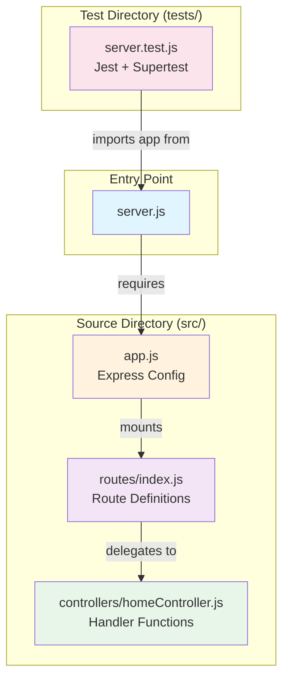
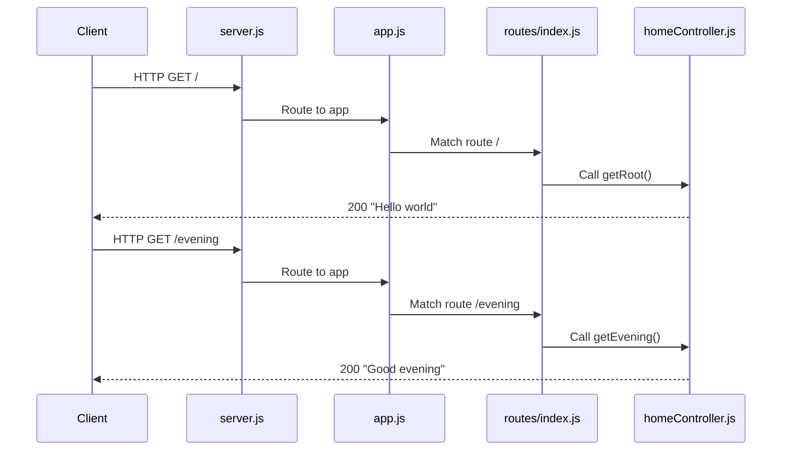

# Technical Specification

# 0. Agent Action Plan

## 0.1 Intent Clarification

Based on the prompt, the Blitzy platform understands that the refactoring objective is to transform an existing single-file Node.js Express server into a properly structured Express.js application following modern best practices for scalability, maintainability, and modularity.

### 0.1.1 Core Refactoring Objective

The current application (`server.js`) is a minimal Express.js server implemented as a single CommonJS module with all functionality consolidated in one file. The refactoring will restructure this into an organized Express.js project architecture while preserving all existing behavior.

- **Refactoring Type**: Code structure reorganization (Modularity and Project Architecture)
- **Target Repository**: Same repository refactor (in-place transformation)
- **Framework**: Express.js ^4.21.2 (maintaining current version)

**Explicit Refactoring Goals:**
- Separate routing logic from application configuration
- Extract route handlers into dedicated controller modules
- Establish clear entry points distinguishing between application configuration and server startup
- Organize tests to mirror the new source structure
- Maintain full backward compatibility with existing API contracts

**Implicit Requirements Surfaced:**
- All public API interfaces must remain unchanged (`GET /` returns "Hello world", `GET /evening` returns "Good evening")
- Test suite must continue passing without modification to assertions
- Environment variable handling (`PORT`) must be preserved
- The application export pattern (`module.exports = app`) must be maintained for test compatibility
- The conditional server startup (`require.main === module`) pattern must be preserved

### 0.1.2 Technical Interpretation

This refactoring translates to the following technical transformation strategy:

```
TRANSFORMATION STRATEGY
═══════════════════════════════════════
Single-File Architecture → Multi-File Modular Architecture

Current State:
  server.js (ALL code in one file)
    ├── Express import
    ├── App instantiation
    ├── Route definitions (inline handlers)
    ├── Server startup
    └── Module export

Target State:
  src/
    ├── app.js (Express app configuration)
    ├── routes/index.js (Route definitions)
    ├── controllers/homeController.js (Handler logic)
    └── config/index.js (Configuration management)
  server.js (Entry point - imports and starts app)
```

**Architectural Patterns Applied:**
- **Separation of Concerns**: Routes, controllers, and configuration in separate modules
- **Single Responsibility Principle**: Each module handles one aspect of the application
- **Express Router Pattern**: Modular route registration using `express.Router()`
- **Entry Point Pattern**: Clear distinction between app configuration and server startup

### 0.1.3 Special Instructions and Constraints

**Critical Directives Captured:**
- "keeping every feature and functionality exactly as in the original Node.js project"
- "fully matches the behavior and logic of the current implementation"

**Preserved Behaviors (Non-Negotiable):**
| Endpoint | Method | Response Body | Status Code |
|----------|--------|---------------|-------------|
| `/` | GET | "Hello world" | 200 |
| `/evening` | GET | "Good evening" | 200 |

**Test Compatibility Requirements:**
- Tests must be able to import the Express app without starting a server
- Tests use supertest for in-process HTTP testing
- Existing test file (`tests/server.test.js`) assertions remain valid

**Environment Variables:**
- `PORT` - Server listening port (default: 3000)
- `DB_Host` - Database host (provided by user, available in environment)
- `API_KEY` - API key secret (provided by user, available in environment)

## 0.2 Source Analysis

### 0.2.1 Comprehensive Source File Discovery

The source repository has been systematically analyzed to identify all files requiring refactoring. The project is located at the repository root with a minimal Express.js server structure.

**Repository Path**: `/tmp/blitzy/Repo-Test-Sud/010126/`

**Current Source Structure:**
```
Current:
/
├── server.js                    (1357 bytes - main application, to be refactored)
├── package.json                 (367 bytes - dependency manifest)
├── package-lock.json            (169760 bytes - lockfile)
├── .env.example                 (377 bytes - environment template)
├── README.md                    (520 bytes - documentation)
├── postman.json                 (593 bytes - API collection)
├── tests/
│   └── server.test.js           (Jest tests - import path updates needed)
├── blitzy/
│   └── documentation/           (spec docs - references may need update)
├── .gitignore                   (25 bytes)
└── [non-JS artifacts]           (mysql.sql, oracle.sql, dotnet.cs, etc. - OUT OF SCOPE)
```

### 0.2.2 Source File Analysis

**Primary Source File: `server.js`**

| Aspect | Details |
|--------|---------|
| **Location** | `/server.js` |
| **Size** | 1357 bytes, 54 lines |
| **Module System** | CommonJS (`require`/`module.exports`) |
| **Mode** | Strict mode (`'use strict'`) |
| **Purpose** | Single-file Express application with routes, config, and startup |

**Code Components Identified in `server.js`:**
- Express import and app instantiation (lines 15-18)
- PORT configuration from environment (line 21)
- Route handler for `GET /` (lines 30-32)
- Route handler for `GET /evening` (lines 41-43)
- Conditional server startup (lines 46-50)
- Module export for testing (line 53)

**Test File: `tests/server.test.js`**

| Aspect | Details |
|--------|---------|
| **Location** | `/tests/server.test.js` |
| **Framework** | Jest with supertest |
| **Import** | `require('../server')` - will need path update |
| **Coverage** | Both endpoints tested with status and body assertions |

**Configuration Files Requiring Updates:**
- `package.json` - `main` field points to `server.js`, may update scripts
- `.env.example` - Environment variable documentation
- `README.md` - Setup and usage documentation
- `postman.json` - API collection (endpoints unchanged, documentation only)

### 0.2.3 Complete Source File List

All files in scope for this refactoring exercise:

| Source File | Type | Refactoring Action | Reason |
|-------------|------|-------------------|--------|
| `server.js` | Application | Split into modules | Main application logic to be restructured |
| `tests/server.test.js` | Test | Update imports | Import path changes to new structure |
| `package.json` | Config | Update main/scripts | Entry point and script updates |
| `.env.example` | Config | Verify compatibility | Ensure env vars still work |
| `README.md` | Docs | Update structure docs | Document new project structure |
| `postman.json` | Docs | No change | Endpoints remain the same |

**Files Explicitly OUT OF SCOPE:**
- `mysql.sql`, `oracle.sql` - Database artifacts (unrelated to Express app)
- `dotnet.cs`, `php.php`, `junit.java` - Cross-language demos (unrelated)
- `amazon_cloudformation.yaml`, `apache.conf`, `datadog.yaml` - Infrastructure configs (unrelated)
- `eclipse.xml`, `maven.xml` - IDE/build configs (unrelated)
- `script.sh`, `dummy_qtest.csv`, `notion.md`, `cucumber.feature` - Misc artifacts (unrelated)
- `blitzy/documentation/*` - Spec documentation (read-only reference)

## 0.3 Target Design

### 0.3.1 Refactored Structure Planning

The target architecture follows <cite index="3-4">"routes for endpoints, controllers for request handling, middleware for auth and logs, services for business rules"</cite> patterns recommended for Express.js applications. The structure balances modularity with simplicity appropriate for the application's scope.

**Target Architecture:**
```
Target:
/
├── server.js                    (Entry point - starts the server)
├── src/
│   ├── app.js                   (Express app configuration and middleware)
│   ├── routes/
│   │   └── index.js             (Route definitions using Express Router)
│   └── controllers/
│       └── homeController.js    (Handler functions for / and /evening)
├── tests/
│   └── server.test.js           (Updated imports to new structure)
├── package.json                 (Updated main field and scripts)
├── package-lock.json            (No changes - dependencies unchanged)
├── .env.example                 (No changes)
├── README.md                    (Updated with new structure documentation)
├── postman.json                 (No changes)
└── .gitignore                   (No changes)
```

### 0.3.2 Web Search Research Conducted

Best practices research confirms the recommended architecture:

- <cite index="5-19,5-20">"Since there are two entities here, the app and the server, they should be separated. Not just on principle, but also because separating the app and server also allows you to unit test your app without initializing the server."</cite>

- <cite index="1-12">"By structuring your Express.js project properly, you create a scalable, maintainable, and organized codebase that grows with your application."</cite>

- <cite index="2-5">"Controllers will be responsible to handle all the incoming requests to your application which will either render a page in response, may send a JSON payload or will handle other critical API related actions."</cite>

### 0.3.3 Design Pattern Applications

**Pattern 1: App/Server Separation**
```javascript
// src/app.js - Creates and configures Express app
const app = express();
// ... middleware and routes
module.exports = app;

// server.js - Handles server startup
const app = require('./src/app');
if (require.main === module) {
  app.listen(PORT, ...);
}
module.exports = app;
```

**Pattern 2: Express Router for Route Modularity**
```javascript
// src/routes/index.js
const router = express.Router();
router.get('/', homeController.getRoot);
module.exports = router;
```

**Pattern 3: Controller Functions for Handler Logic**
```javascript
// src/controllers/homeController.js
exports.getRoot = (req, res) => {
  res.send('Hello world');
};
```

### 0.3.4 Target File Specifications

| Target File | Purpose | Dependencies |
|-------------|---------|--------------|
| `server.js` | Entry point, server startup, backwards compatibility | `./src/app` |
| `src/app.js` | Express app instantiation, middleware, route mounting | `express`, `./routes` |
| `src/routes/index.js` | Route definitions using Express Router | `express`, `../controllers/homeController` |
| `src/controllers/homeController.js` | Request handler functions | None |
| `tests/server.test.js` | Integration tests (import path updated) | `supertest`, `../server` |
| `package.json` | Updated metadata | N/A |
| `README.md` | Updated documentation | N/A |

### 0.3.5 Architecture Diagram



### 0.3.6 Request Flow Design



## 0.4 Transformation Mapping

### 0.4.1 File-by-File Transformation Plan

This section provides the comprehensive source-to-target file mapping for the complete refactoring operation. The transformation is executed in **ONE phase** with all files processed together.

**File Transformation Modes:**
- **UPDATE** - Modify an existing file
- **CREATE** - Create a new file
- **REFERENCE** - Use as pattern/reference for new files

| Target File | Transformation | Source File | Key Changes |
|-------------|---------------|-------------|-------------|
| `server.js` | UPDATE | `server.js` | Simplify to entry point; import app from `./src/app`; retain conditional startup and export |
| `src/app.js` | CREATE | `server.js` | Extract Express app instantiation, middleware setup, and route mounting |
| `src/routes/index.js` | CREATE | `server.js` | Extract route definitions using `express.Router()` |
| `src/controllers/homeController.js` | CREATE | `server.js` | Extract `getRoot` and `getEvening` handler functions |
| `tests/server.test.js` | UPDATE | `tests/server.test.js` | No import change needed (server.js still exports app) |
| `package.json` | UPDATE | `package.json` | Verify `main` field, update description if needed |
| `README.md` | UPDATE | `README.md` | Add new project structure documentation |
| `.env.example` | REFERENCE | `.env.example` | No changes needed (environment handling preserved) |
| `postman.json` | REFERENCE | `postman.json` | No changes needed (endpoints unchanged) |

### 0.4.2 Detailed Transformation Specifications

**Transformation 1: `server.js` (UPDATE)**

Source code to extract and relocate:
```javascript
// EXTRACT TO src/app.js:
const express = require('express');
const app = express();
app.get('/', (req, res) => { res.send('Hello world'); });
app.get('/evening', (req, res) => { res.send('Good evening'); });

// RETAIN IN server.js:
const PORT = process.env.PORT || 3000;
if (require.main === module) { app.listen(PORT, ...); }
module.exports = app;
```

**Transformation 2: `src/app.js` (CREATE)**

New file structure:
```javascript
'use strict';
const express = require('express');
const routes = require('./routes');
const app = express();
app.use('/', routes);
module.exports = app;
```

**Transformation 3: `src/routes/index.js` (CREATE)**

New file structure:
```javascript
'use strict';
const express = require('express');
const router = express.Router();
const homeController = require('../controllers/homeController');
router.get('/', homeController.getRoot);
router.get('/evening', homeController.getEvening);
module.exports = router;
```

**Transformation 4: `src/controllers/homeController.js` (CREATE)**

New file structure:
```javascript
'use strict';
exports.getRoot = (req, res) => {
  res.send('Hello world');
};
exports.getEvening = (req, res) => {
  res.send('Good evening');
};
```

### 0.4.3 Cross-File Dependencies

**Import Statement Transformations:**

| File | Old Import | New Import |
|------|-----------|------------|
| `server.js` | `const express = require('express');` | `const app = require('./src/app');` |
| `tests/server.test.js` | `require('../server')` | `require('../server')` (unchanged - server.js re-exports app) |
| `src/app.js` | N/A (new file) | `require('express')`, `require('./routes')` |
| `src/routes/index.js` | N/A (new file) | `require('express')`, `require('../controllers/homeController')` |
| `src/controllers/homeController.js` | N/A (new file) | None |

**Dependency Chain:**
```
tests/server.test.js
    └── server.js
        └── src/app.js
            └── src/routes/index.js
                └── src/controllers/homeController.js
```

### 0.4.4 Configuration Updates

**`package.json` Modifications:**

| Field | Current Value | New Value | Reason |
|-------|--------------|-----------|--------|
| `main` | `"server.js"` | `"server.js"` | No change - server.js remains entry point |
| `scripts.start` | `"node server.js"` | `"node server.js"` | No change - same entry point |
| `scripts.test` | `"jest"` | `"jest"` | No change - tests still work |

**`README.md` Additions:**

Add new section documenting project structure:
```
### Project Structure
- `server.js` - Entry point and server startup
- `src/app.js` - Express application configuration
- `src/routes/` - Route definitions
- `src/controllers/` - Request handlers
- `tests/` - Jest test suite
```

### 0.4.5 One-Phase Execution Plan

**All files are created/updated in a single execution phase:**

```
PHASE 1 (COMPLETE REFACTOR):
├── CREATE src/controllers/homeController.js
├── CREATE src/routes/index.js
├── CREATE src/app.js
├── UPDATE server.js
├── UPDATE README.md
└── VERIFY tests/server.test.js (should pass without changes)
```

### 0.4.6 Wildcard Pattern Summary

Files affected by this refactor using trailing wildcard patterns:

| Pattern | Description | Action |
|---------|-------------|--------|
| `server.js` | Entry point file | UPDATE |
| `src/**/*.js` | All new source files | CREATE |
| `tests/**/*.test.js` | Test files | VERIFY (no changes needed) |
| `*.json` | Config files at root | UPDATE (package.json) |
| `*.md` | Documentation at root | UPDATE (README.md) |

## 0.5 Dependency Inventory

### 0.5.1 Key Public and Private Packages

All dependencies are retrieved from the source `package.json` manifest with exact versions from `package-lock.json`.

**Production Dependencies:**

| Registry | Package Name | Version | Purpose |
|----------|--------------|---------|---------|
| npm | express | ^4.21.2 | Web framework for HTTP server and routing |

**Development Dependencies:**

| Registry | Package Name | Version | Purpose |
|----------|--------------|---------|---------|
| npm | jest | ^29.7.0 | JavaScript testing framework |
| npm | supertest | ^7.0.0 | HTTP assertion library for testing Express apps |

**Transitive Dependencies (Key Packages):**

| Package | Version (Resolved) | Purpose |
|---------|-------------------|---------|
| body-parser | Bundled with Express | Request body parsing (available if needed) |
| cookie | Bundled with Express | Cookie handling |
| accepts | Bundled with Express | Content negotiation |
| path-to-regexp | Bundled with Express | Route path matching |

### 0.5.2 Runtime Requirements

| Requirement | Specification | Source |
|-------------|--------------|--------|
| Node.js | >=18.0.0 | `package.json` engines field |
| npm | >=7.0.0 (implied) | `package-lock.json` lockfileVersion 3 |

**Verified Environment:**
- Node.js v20.19.6 ✓
- npm v11.1.0 ✓

### 0.5.3 Dependency Changes (Not Applicable)

**No New Dependencies Required**

This refactoring is a structural reorganization only. All required functionality is provided by the existing `express` package:

- `express.Router()` - Available in express ^4.x for modular routing
- `express()` - Application factory
- `app.use()` - Middleware and router mounting
- `app.listen()` - Server startup

**No Dependencies to Remove**

All current dependencies remain necessary:
- `express` - Required for the web server
- `jest` - Required for testing
- `supertest` - Required for HTTP testing without server startup

### 0.5.4 Import Refactoring

**Files Requiring Import Updates:**

| File Pattern | Import Changes |
|--------------|----------------|
| `server.js` | Remove direct Express usage; add `require('./src/app')` |
| `src/app.js` | Add `require('express')`, `require('./routes')` |
| `src/routes/index.js` | Add `require('express')`, `require('../controllers/homeController')` |
| `src/controllers/homeController.js` | No imports needed |
| `tests/server.test.js` | No changes - `require('../server')` still valid |

**Import Transformation Rules:**

```javascript
// OLD (in server.js):
const express = require('express');
const app = express();

// NEW (in server.js):
const app = require('./src/app');
const PORT = process.env.PORT || 3000;
```

### 0.5.5 Environment Variables

| Variable | Default | Usage | Source |
|----------|---------|-------|--------|
| `PORT` | 3000 | Server listening port | `.env.example`, `server.js` |
| `DB_Host` | N/A | Database host (user-provided) | User environment |
| `API_KEY` | N/A | API key secret (user-provided) | User secrets |

**Environment Configuration Preserved:**

The refactoring maintains all environment variable handling in `server.js`:

```javascript
// Retained in server.js (not moved to src/)
const PORT = process.env.PORT || 3000;
```

### 0.5.6 External Reference Updates

| File Type | Pattern | Update Required |
|-----------|---------|-----------------|
| Configuration | `package.json` | Verify main field (no change needed) |
| Documentation | `README.md` | Add project structure section |
| API Docs | `postman.json` | No changes (endpoints unchanged) |
| Environment | `.env.example` | No changes (variables unchanged) |
| Build/CI | N/A | No CI/CD files present |

### 0.5.7 Version Compatibility Matrix

| Component | Minimum Version | Recommended | Project Version |
|-----------|----------------|-------------|-----------------|
| Node.js | 18.0.0 | 20.x LTS | 20.19.6 ✓ |
| Express | 4.17.0 | 4.21.x | ^4.21.2 ✓ |
| Jest | 29.0.0 | 29.7.x | ^29.7.0 ✓ |
| supertest | 6.0.0 | 7.x | ^7.0.0 ✓ |

## 0.6 Scope Boundaries

### 0.6.1 Exhaustively In Scope

**Source Transformations:**

| Pattern | Description | Action |
|---------|-------------|--------|
| `server.js` | Main entry point | UPDATE - simplify to entry point only |
| `src/app.js` | New Express app configuration | CREATE |
| `src/routes/index.js` | New route definitions | CREATE |
| `src/controllers/homeController.js` | New handler functions | CREATE |

**Test Updates:**

| Pattern | Description | Action |
|---------|-------------|--------|
| `tests/server.test.js` | Jest integration tests | VERIFY - ensure tests pass |
| `tests/**/*.test.js` | Future test files | Pattern for extensibility |

**Configuration Updates:**

| Pattern | Description | Action |
|---------|-------------|--------|
| `package.json` | NPM manifest | UPDATE - verify main field |
| `.env.example` | Environment template | REFERENCE - no changes |

**Documentation Updates:**

| Pattern | Description | Action |
|---------|-------------|--------|
| `README.md` | Project documentation | UPDATE - add structure docs |
| `postman.json` | API collection | REFERENCE - no changes needed |

**Directory Creation:**

| Path | Purpose |
|------|---------|
| `src/` | Source code root directory |
| `src/routes/` | Route modules directory |
| `src/controllers/` | Controller modules directory |

### 0.6.2 Explicitly Out of Scope

**User-Requested Exclusions:**
- No exclusions explicitly requested by user

**Automatically Excluded (Non-JavaScript Files):**

| File | Reason |
|------|--------|
| `mysql.sql` | Database script - unrelated to Express refactor |
| `oracle.sql` | Database script - unrelated to Express refactor |
| `dotnet.cs` | C# demo file - different language |
| `php.php` | PHP demo file - different language |
| `junit.java` | Java test demo - different language |
| `maven.xml` | Java build config - different language |
| `eclipse.xml` | IDE config - tooling only |
| `cucumber.feature` | Test spec format - not applicable |
| `script.sh` | Shell script - not related to Express app |
| `dummy_qtest.csv` | Test data - not related to Express app |
| `notion.md` | Documentation demo - not related to Express app |

**Infrastructure Files Excluded:**

| File | Reason |
|------|--------|
| `amazon_cloudformation.yaml` | AWS infrastructure - separate concern |
| `apache.conf` | Apache config - not relevant to Node.js |
| `datadog.yaml` | Monitoring config - infrastructure only |

**Documentation Files (Read-Only Reference):**

| Pattern | Reason |
|--------|--------|
| `blitzy/documentation/*.md` | Spec documentation - read-only reference |

**Generated/Lock Files:**

| File | Reason |
|------|--------|
| `package-lock.json` | Auto-generated - no manual changes |
| `node_modules/` | Dependencies - managed by npm |

### 0.6.3 Scope Validation Checklist

| Scope Item | Status | Evidence |
|------------|--------|----------|
| All JavaScript source files identified | ✓ | `server.js` only JS source file |
| All test files identified | ✓ | `tests/server.test.js` only test file |
| All config files reviewed | ✓ | `package.json`, `.env.example` reviewed |
| All documentation reviewed | ✓ | `README.md`, `postman.json` reviewed |
| New directories planned | ✓ | `src/`, `src/routes/`, `src/controllers/` |
| No files missed | ✓ | Complete repository scan performed |

### 0.6.4 Boundary Diagram


### 0.6.5 Risk Boundaries

| Risk Area | Mitigation |
|-----------|------------|
| Breaking test imports | `server.js` continues to export `app` for backward compatibility |
| Changing API behavior | Handler logic copied verbatim to controllers |
| Missing environment variables | `PORT` handling retained in `server.js` |
| npm start failures | Entry point remains `server.js` |

## 0.7 Special Instructions for Refactoring

### 0.7.1 User-Specified Requirements

The user has explicitly emphasized the following requirements:

> **User Instruction**: "Rewrite this Node.js server into a express.js refactor, keeping every feature and functionality exactly as in the original Node.js project. Ensure the rewritten version fully matches the behavior and logic of the current implementation."

**Mandatory Compliance Items:**

| Requirement | Implementation Strategy |
|-------------|------------------------|
| Keep every feature | All routes (`/`, `/evening`) preserved with identical handlers |
| Keep every functionality | Server startup, environment handling, test export all preserved |
| Exactly match behavior | Response strings copied verbatim: "Hello world", "Good evening" |
| Match logic | Handler logic transferred without modification |

### 0.7.2 Behavioral Preservation Requirements

**API Contract Preservation:**

| Endpoint | Method | Expected Response | Status | Must Match |
|----------|--------|-------------------|--------|------------|
| `/` | GET | `"Hello world"` | 200 | EXACT STRING |
| `/evening` | GET | `"Good evening"` | 200 | EXACT STRING |

**Test Compatibility Preservation:**

The existing test assertions must continue to pass:

```javascript
// These assertions MUST pass after refactoring:
expect(response.status).toBe(200);
expect(response.text).toBe('Hello world');
expect(response.text).toBe('Good evening');
```

### 0.7.3 Code Fidelity Requirements

**Strict Mode Preservation:**
All new files must include `'use strict';` to match the original codebase convention.

**CommonJS Module System:**
Continue using `require`/`module.exports` pattern - do not convert to ES modules.

**Export Pattern Preservation:**
```javascript
// MUST maintain in server.js for test compatibility:
module.exports = app;
```

**Conditional Startup Preservation:**
```javascript
// MUST maintain in server.js:
if (require.main === module) {
  app.listen(PORT, () => {
    console.log(`Server running on port ${PORT}`);
  });
}
```

### 0.7.4 Style and Convention Requirements

| Convention | Requirement |
|------------|-------------|
| Indentation | 2 spaces (match existing) |
| Quotes | Single quotes (match existing) |
| Semicolons | Required (match existing) |
| JSDoc Comments | Preserve documentation style |
| Line endings | Unix (LF) |

### 0.7.5 Verification Requirements

**Pre-Refactor Verification:**
```bash
cd /tmp/blitzy/Repo-Test-Sud/010126/
npm test  # Must pass all tests before refactoring
```

**Post-Refactor Verification:**
```bash
npm test                          # All tests must pass
npm start &                       # Server must start
curl http://localhost:3000/       # Must return "Hello world"
curl http://localhost:3000/evening # Must return "Good evening"
```

### 0.7.6 Directory Structure Requirements

**Required Directory Creation:**
```bash
mkdir -p src/routes src/controllers
```

**File Permissions:**
All new files should have standard permissions (644).

### 0.7.7 Prohibited Changes

| Category | Prohibition |
|----------|-------------|
| Response strings | Do NOT modify "Hello world" or "Good evening" |
| HTTP methods | Do NOT change from GET |
| Route paths | Do NOT change `/` or `/evening` |
| Status codes | Do NOT change from 200 |
| Dependencies | Do NOT add new production dependencies |
| Test assertions | Do NOT modify test expectations |
| Environment variables | Do NOT rename PORT or change default |

### 0.7.8 Quality Assurance Checklist

| Check | Description | Method |
|-------|-------------|--------|
| Syntax | All JS files valid | `node --check <file>` |
| Tests | All tests pass | `npm test` |
| Lint | Code style consistent | Visual inspection |
| Startup | Server starts correctly | `npm start` |
| Endpoints | Both endpoints respond correctly | `curl` verification |
| Exports | App exported for testing | Import verification |

### 0.7.9 Rollback Plan

If refactoring introduces issues:

1. All original files preserved in git history
2. Can restore via `git checkout HEAD~1 -- server.js`
3. Tests serve as regression safety net
4. No data migrations required (stateless application)

