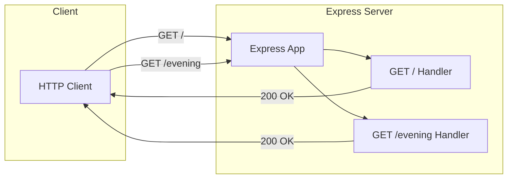
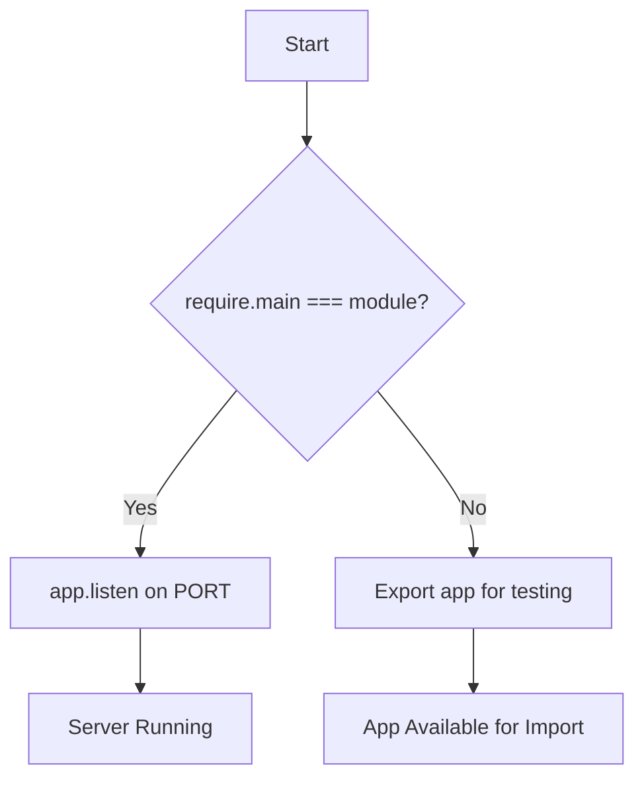
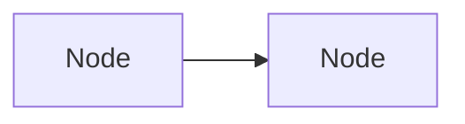

# Technical Specification

# 0. Agent Action Plan

## 0.1 Intent Clarification

This section translates the user's documentation requirements into precise technical language and identifies all implicit requirements for enhancing the documentation of the Node.js Express server project.

### 0.1.1 Core Documentation Objective

Based on the provided requirements, the Blitzy platform understands that the documentation objective is to:

- **Enhance JSDoc Comments**: Add comprehensive JSDoc comments to all functions, constants, and modules in `server.js` to provide inline code documentation with proper type annotations, parameter descriptions, and return value documentation
- **Create Comprehensive README**: Transform the existing basic README.md into a comprehensive project documentation with detailed setup instructions, API documentation, deployment guide, and inline code explanations
- **Documentation Type Classification**: [Create new documentation | Update existing documentation]
- **Documentation Categories**: [API docs | User guides | Technical specs | Deployment guide | README files]

| Requirement ID | Documentation Requirement | Enhanced Clarity |
|----------------|---------------------------|------------------|
| DOC-001 | Add JSDoc comments to server.js functions | Add JSDoc block comments with `@description`, `@param`, `@returns`, `@example` tags to all functions including route handlers, Express app initialization, and server startup logic |
| DOC-002 | Create comprehensive README | Enhance README.md with project overview, prerequisites, installation steps, configuration guide, and usage examples |
| DOC-003 | API Documentation | Document all REST API endpoints with methods, routes, request/response formats, status codes, and curl examples |
| DOC-004 | Deployment Guide | Create deployment documentation covering environment setup, production configuration, process managers (PM2), and cloud deployment options |
| DOC-005 | Inline Code Explanations | Add contextual comments explaining code logic, architectural decisions, and best practices throughout the codebase |

**Implicit Documentation Needs Detected:**

- JSDoc module-level documentation with `@module` and `@file` tags
- Environment variable documentation with `@env` or inline descriptions
- Test file documentation for understanding test coverage
- Configuration file documentation (package.json, .env.example)
- Cross-references between API documentation and source code
- Troubleshooting section for common issues
- Contributing guidelines for maintainers

**Documentation Dependencies and Prerequisites:**

- Node.js runtime ≥18.0.0 (as specified in `engines` field)
- Express.js ^4.21.2 for API documentation context
- Jest ^29.7.0 for test documentation context
- Understanding of JSDoc 3.x syntax and tags

### 0.1.2 Special Instructions and Constraints

**User-Specified Directives:**

- User Example: *"Add JSDoc comments to server.js functions, create a comprehensive README with setup instructions, API documentation, deployment guide, and inline code explanations."*

**Documentation Style Requirements:**

- Follow existing documentation patterns in `blitzy/documentation/` folder
- Use Markdown formatting with proper headings (# ## ###)
- Include code examples with syntax highlighting using javascript code blocks
- Maintain consistency with existing README structure while expanding content
- Use tables for structured information (environment variables, endpoints, etc.)

**Template Requirements:**

- Preserve existing README.md structure as base template
- Follow JSDoc 3.x standard format for code comments
- Use Mermaid diagrams for architectural visualization where appropriate

### 0.1.3 Technical Interpretation

These documentation requirements translate to the following technical documentation strategy:

| User Requirement | Technical Action | Specific Components |
|------------------|------------------|---------------------|
| Add JSDoc comments | Enhance existing JSDoc comments and add comprehensive documentation | `server.js` - file-level, function-level, and constant-level JSDoc blocks |
| Setup instructions | Document installation and configuration steps | README.md - Prerequisites, Installation, Configuration sections |
| API documentation | Document all endpoints with request/response specifications | README.md - API Reference section with endpoint tables and examples |
| Deployment guide | Create production deployment documentation | README.md - Deployment section covering PM2, Docker, cloud options |
| Inline code explanations | Add contextual comments explaining code decisions | `server.js` - strategic inline comments for code clarity |

**Documentation Strategy Summary:**

- To **enhance JSDoc comments**, we will **update** `server.js` with comprehensive JSDoc blocks including `@module`, `@description`, `@param`, `@returns`, and `@example` tags
- To **create setup instructions**, we will **expand** README.md with detailed prerequisites, installation steps, and configuration guidance
- To **document the API**, we will **add** an API Reference section with endpoint tables, request/response examples, and status codes
- To **create deployment guide**, we will **add** a Deployment section covering environment configuration, process managers, and cloud deployment
- To **add inline explanations**, we will **enhance** `server.js` with strategic comments explaining architectural decisions and code logic

### 0.1.4 Current Documentation Status

**Critical Observation:** Repository analysis reveals partial documentation exists with enhancement opportunities:

| Component | Current Status | Enhancement Needed |
|-----------|----------------|-------------------|
| JSDoc Comments in server.js | ✅ Present (basic) | Enhance with `@module`, `@example`, `@see` tags; add more detailed descriptions |
| README.md | ✅ Present (basic) | Expand with comprehensive setup, API docs, deployment guide |
| API Documentation | ⚠️ Minimal | Add detailed endpoint documentation with examples |
| Deployment Guide | ❌ Missing | Create comprehensive deployment section |
| Inline Code Explanations | ⚠️ Minimal | Add strategic explanatory comments |
| Test Documentation | ✅ Present (basic) | Already documented in test file |

**Existing JSDoc Evidence in server.js:**

- Lines 1-10: File-level JSDoc block present
- Lines 23-29: Route handler JSDoc present  
- Lines 34-40: Route handler JSDoc present

**Enhancement Opportunities:**

- Add `@module` tag for module identification
- Add `@example` tags with usage examples
- Add `@see` tags for cross-references
- Add `@constant` tags for PORT definition
- Enhance parameter types with more specific Express types

## 0.2 Documentation Discovery and Analysis

This section provides comprehensive analysis of the existing documentation infrastructure and repository structure to inform the documentation enhancement strategy.

### 0.2.1 Existing Documentation Infrastructure Assessment

**Repository Analysis Summary:**

Repository analysis reveals a Node.js/Express web service with basic documentation structure requiring enhancement. The project follows standard npm conventions with clear separation of concerns.

**Documentation Files Discovered:**

| File/Pattern | Location | Status | Description |
|--------------|----------|--------|-------------|
| README.md | Root directory | Present | Basic README with setup, endpoints table, testing, and environment variables |
| .env.example | Root directory | Present | Environment configuration template with PORT and DB variables |
| postman.json | Root directory | Present | Postman Collection v2.1.0 for API testing |
| Technical Specifications.md | blitzy/documentation/ | Present | Comprehensive technical specification document |
| Project Guide.md | blitzy/documentation/ | Present | Project status report and operations runbook |

**Documentation Infrastructure Findings:**

- **Current Documentation Framework**: Manual Markdown documentation (no generator configured)
- **Documentation Generator Configuration**: None detected (mkdocs.yml, docusaurus.config.js not present)
- **API Documentation Tools**: None configured (swagger-jsdoc, typedoc not installed)
- **Diagram Tools**: Mermaid syntax used in existing documentation
- **Documentation Hosting/Deployment**: Not configured

**Search Patterns Employed:**

- README*, docs/**, *.md, *.mdx - Found README.md, blitzy/documentation/*.md
- Config files (mkdocs.yml, docusaurus.config.js, sphinx.conf.py) - None found
- Existing JSDoc in source files - Found in server.js, tests/server.test.js

### 0.2.2 Repository Code Analysis for Documentation

**Code Files Requiring Documentation:**

| File | Lines | Purpose | Current JSDoc Status |
|------|-------|---------|---------------------|
| server.js | 54 | Express application entry point with route handlers | ✅ Present - enhancement needed |
| tests/server.test.js | 45 | Jest test suite for endpoint verification | ✅ Present - complete |

**Public APIs Identified (src/**/*.js pattern):**

| File | Function/Export | Type | Documentation Status |
|------|-----------------|------|---------------------|
| server.js | express app | Module Export | ⚠️ Missing `@module` tag |
| server.js | GET / handler | Route Handler | ✅ Basic JSDoc present |
| server.js | GET /evening handler | Route Handler | ✅ Basic JSDoc present |
| server.js | PORT constant | Constant | ⚠️ Missing `@constant` tag |

**Configuration Files Examined:**

| File | Purpose | Documentation Coverage |
|------|---------|----------------------|
| package.json | NPM configuration | Self-documented via JSON structure |
| .env.example | Environment template | ✅ Well-commented |
| postman.json | API collection | ✅ Request names document purpose |

### 0.2.3 Web Search Research Conducted

**JSDoc Best Practices Research:**

- Standard JSDoc tags for Node.js modules include `@module`, `@file`, `@description`, `@param`, `@returns`, `@example`, `@see`, `@constant`
- Express route handlers should document request and response objects with `@param {Object} req` and `@param {Object} res`
- Module exports should include `@exports` tag
- Constants should use `@constant` or `@const` tag with `@type` annotation

**Documentation Structure Conventions:**

- README.md should follow a standard structure: Title, Description, Prerequisites, Installation, Usage, API Reference, Configuration, Testing, Deployment, Contributing
- API documentation should include endpoint path, HTTP method, description, request parameters, response format, status codes, and examples
- Deployment guides should cover environment setup, configuration, process management, and cloud deployment options

**Recommended Diagram Types:**

- Architecture diagrams for system overview (Mermaid graph LR/TB)
- Sequence diagrams for request/response flows (Mermaid sequenceDiagram)
- Flowcharts for server startup logic (Mermaid flowchart)

### 0.2.4 Documentation Gap Analysis

**Critical Gaps Identified:**

| Gap Category | Current State | Target State | Priority |
|--------------|---------------|--------------|----------|
| README Completeness | Basic 33 lines | Comprehensive 150+ lines | High |
| API Documentation | Endpoint table only | Full request/response docs with examples | High |
| Deployment Guide | Not present | Complete deployment section | High |
| JSDoc Coverage | Present but basic | Enhanced with examples and cross-references | Medium |
| Architecture Documentation | Mermaid in tech specs | Integrated in README | Medium |

**Documentation Quality Issues:**

- README.md lacks prerequisite details (Node.js version requirement)
- No curl examples for API testing
- No error response documentation
- No troubleshooting section
- Missing license information
- No contribution guidelines

## 0.3 Documentation Scope Analysis

This section provides detailed analysis of all code modules and components requiring documentation, including mapping between source code and documentation deliverables.

### 0.3.1 Code-to-Documentation Mapping

**Module: server.js (Express Application)**

| Element | Type | Lines | Current Documentation | Documentation Needed |
|---------|------|-------|----------------------|---------------------|
| File header | Module Doc | 1-10 | ✅ Present | Add `@module`, `@file`, `@author`, `@version` tags |
| express require | Import | 15 | Inline comment present | Adequate |
| app creation | Initialization | 18 | Inline comment present | Add `@type` annotation |
| PORT constant | Constant | 21 | Inline comment present | Add `@constant` with `@type` and `@default` |
| GET / handler | Route | 30-32 | ✅ JSDoc present | Add `@example`, `@see` tags |
| GET /evening handler | Route | 41-43 | ✅ JSDoc present | Add `@example`, `@see` tags |
| require.main check | Conditional | 46-50 | Inline comment present | Enhance explanation |
| module.exports | Export | 53 | Inline comment present | Add `@exports` tag |

**Module: tests/server.test.js (Test Suite)**

| Element | Type | Lines | Current Documentation | Documentation Needed |
|---------|------|-------|----------------------|---------------------|
| File header | Module Doc | 1-10 | ✅ JSDoc present | Complete - no changes needed |
| Test imports | Imports | 15-18 | ✅ Comments present | Complete - no changes needed |
| Describe blocks | Test suites | 20-44 | ✅ JSDoc present | Complete - no changes needed |

### 0.3.2 API Endpoints Requiring Documentation

| Endpoint | Method | Handler Location | Current Doc | Documentation Required |
|----------|--------|------------------|-------------|------------------------|
| `/` | GET | server.js:30-32 | ✅ In code | README: full API reference entry |
| `/evening` | GET | server.js:41-43 | ✅ In code | README: full API reference entry |

**API Documentation Requirements:**

For each endpoint, the documentation should include:
- Endpoint path and HTTP method
- Description of functionality
- Request parameters (none for current endpoints)
- Response body format
- HTTP status codes (200 for success)
- Example curl commands
- Example responses

### 0.3.3 Configuration Options Requiring Documentation

| Config File | Option | Current Doc | Documentation Needed |
|-------------|--------|-------------|---------------------|
| .env.example | PORT | ✅ Commented | Enhance in README with default value and valid range |
| .env.example | DB | ✅ Commented | Enhance in README with connection string format examples |
| package.json | engines.node | In file | Add to README Prerequisites section |
| package.json | scripts.start | In file | Document in README Usage section |
| package.json | scripts.test | In file | Document in README Testing section |

### 0.3.4 Features Requiring User Guides

**Feature: Server Setup and Startup**

| Aspect | Current Coverage | Gaps | Target Coverage |
|--------|------------------|------|-----------------|
| Prerequisites | ❌ Not specified | Node.js version, npm | Complete prerequisites list |
| Installation | ⚠️ Basic (npm install) | Clone instructions, verification | Step-by-step guide |
| Configuration | ⚠️ Basic (env vars listed) | How to copy .env.example | Configuration guide with examples |
| Running | ⚠️ Basic (npm start) | What to expect, log messages | Detailed startup guide |

**Feature: API Usage**

| Aspect | Current Coverage | Gaps | Target Coverage |
|--------|------------------|------|-----------------|
| Endpoint list | ✅ Table present | Missing examples | Table + curl examples |
| Request format | ❌ Missing | N/A for GET | Document "no body required" |
| Response format | ⚠️ Response shown | Content-Type | Full response documentation |
| Error handling | ❌ Missing | 404, 500 scenarios | Error response documentation |

**Feature: Testing**

| Aspect | Current Coverage | Gaps | Target Coverage |
|--------|------------------|------|-----------------|
| Running tests | ✅ npm test | Test output expectations | Enhanced testing section |
| Test coverage | ❌ Missing | What tests cover | Test coverage description |
| Writing tests | ❌ Missing | Contributing tests | Contributing section |

**Feature: Deployment**

| Aspect | Current Coverage | Gaps | Target Coverage |
|--------|------------------|------|-----------------|
| Development | ⚠️ Minimal | Complete workflow | Development setup guide |
| Production | ❌ Missing | PM2, Docker, cloud | Complete deployment guide |
| Environment config | ⚠️ .env.example | Production values | Production configuration guide |

### 0.3.5 Documentation Gap Summary

**Undocumented or Under-documented Components:**

| Component | Documentation Type | Priority | Complexity |
|-----------|-------------------|----------|------------|
| Node.js version requirement | README Prerequisites | High | Low |
| API curl examples | README API Reference | High | Low |
| Deployment options | README Deployment section | High | Medium |
| Error responses | README API Reference | Medium | Low |
| Module-level JSDoc tags | server.js inline | Medium | Low |
| Architecture overview | README Overview | Medium | Medium |
| Troubleshooting | README Troubleshooting | Low | Medium |
| Contributing guide | README Contributing | Low | Low |

## 0.4 Documentation Implementation Design

This section details the documentation structure, content generation strategy, and implementation approach for enhancing the project documentation.

### 0.4.1 Documentation Structure Planning

**Enhanced README.md Structure:**

```
README.md (Target: ~200 lines)
├── Project Title and Badges
├── Overview
│   └── Project description and features
├── Architecture
│   └── Mermaid diagram of request flow
├── Prerequisites
│   ├── Node.js >=18.0.0
│   └── npm (included with Node.js)
├── Installation
│   ├── Clone repository
│   ├── Install dependencies
│   └── Verify installation
├── Configuration
│   ├── Environment variables
│   ├── Copy .env.example
│   └── Configuration options table
├── Usage
│   ├── Development server
│   ├── Production server
│   └── Expected output
├── API Reference
│   ├── Endpoints overview table
│   ├── GET / (detailed)
│   │   ├── Description
│   │   ├── Request/Response
│   │   └── curl example
│   └── GET /evening (detailed)
│       ├── Description
│       ├── Request/Response
│       └── curl example
├── Testing
│   ├── Running tests
│   ├── Test coverage
│   └── Test output
├── Deployment
│   ├── Environment setup
│   ├── PM2 deployment
│   ├── Docker deployment
│   └── Cloud deployment options
├── Troubleshooting
│   └── Common issues and solutions
├── Contributing
│   └── How to contribute
├── License
└── Acknowledgments
```

**Enhanced server.js JSDoc Structure:**

```
server.js (Enhanced Documentation)
├── Module-level JSDoc block
│   ├── @file - File description
│   ├── @module - Module name (server)
│   ├── @description - Detailed description
│   ├── @version - 1.0.0
│   ├── @author - Project maintainer
│   └── @see - Link to README
├── Import section comments
│   └── Contextual explanation
├── App initialization
│   ├── @type annotation
│   └── Architectural explanation
├── PORT constant
│   ├── @constant
│   ├── @type {number}
│   ├── @default 3000
│   └── @description
├── GET / route handler
│   ├── @description
│   ├── @param {express.Request} req
│   ├── @param {express.Response} res
│   ├── @returns {void}
│   ├── @example
│   └── @see README.md#api-reference
├── GET /evening route handler
│   ├── @description
│   ├── @param {express.Request} req
│   ├── @param {express.Response} res
│   ├── @returns {void}
│   ├── @example
│   └── @see README.md#api-reference
├── Conditional server startup
│   └── Inline explanation of pattern
└── Module export
    └── @exports app
```

### 0.4.2 Content Generation Strategy

**Information Extraction Approach:**

| Source | Information to Extract | Target Documentation |
|--------|----------------------|---------------------|
| server.js | Route paths, handlers, PORT logic | API Reference, Configuration |
| package.json | Node version, dependencies, scripts | Prerequisites, Installation |
| .env.example | Environment variables | Configuration section |
| tests/server.test.js | Test cases, expected responses | Testing section |
| postman.json | Request examples | API Reference curl examples |

**Documentation Standards:**

- **Markdown Formatting**: Use proper header hierarchy (# ## ### ####)
- **Mermaid Integration**: Use mermaid code blocks for diagrams
- **Code Examples**: Use javascript code blocks with syntax highlighting
- **Source Citations**: Reference source files as `Source: filename:line`
- **Tables**: Use for structured data (endpoints, environment variables)
- **Consistent Terminology**: Use terms from existing documentation

### 0.4.3 Diagram and Visual Strategy

**Mermaid Diagrams to Create:**

| Diagram Type | Purpose | Location |
|--------------|---------|----------|
| Architecture Flow | Show request flow from client to server | README.md Architecture section |
| Server Startup Flow | Illustrate conditional startup logic | README.md or server.js inline |

**Architecture Diagram Specification:**



**Server Startup Flow Diagram:**



### 0.4.4 JSDoc Enhancement Specifications

**Module-Level Documentation Block:**

```javascript
/**
 * @file Express.js Application Entry Point
 * @module server
 * @description Node.js Express server implementing greeting endpoints.
 * @version 1.0.0
 * @see {@link README.md} for setup and usage instructions
 */
```

**Enhanced Route Handler Documentation:**

```javascript
/**
 * @description Root endpoint handler - returns greeting
 * @param {import('express').Request} req - Express request
 * @param {import('express').Response} res - Express response
 * @returns {void} Sends "Hello world" as response
 * @example
 * // curl http://localhost:3000/
 * // Response: "Hello world"
 */
```

**Constant Documentation:**

```javascript
/**
 * @constant {number} PORT
 * @description Server listening port
 * @default 3000
 */
```

### 0.4.5 README Content Specifications

**API Reference Entry Template:**

For each endpoint, include:
- **Path**: The endpoint URL path
- **Method**: HTTP method (GET, POST, etc.)
- **Description**: What the endpoint does
- **Request Body**: Parameters required (if any)
- **Response**: Expected response format
- **Status Codes**: HTTP status codes returned
- **Example**: curl command and response

**Deployment Section Structure:**

| Subsection | Content |
|------------|---------|
| Environment Setup | .env configuration, production values |
| PM2 Deployment | Install PM2, ecosystem config, start command |
| Docker Deployment | Dockerfile creation, build and run commands |
| Cloud Options | Brief mention of Heroku, AWS, DigitalOcean |

## 0.5 Documentation File Transformation Mapping

This section provides an exhaustive mapping of all documentation files to be created, updated, or used as reference, with detailed specifications for each transformation.

### 0.5.1 File-by-File Documentation Plan

**Documentation Transformation Modes:**
- **CREATE** - Create a new documentation file
- **UPDATE** - Update an existing documentation file  
- **DELETE** - Remove an obsolete documentation file
- **REFERENCE** - Use as an example for documentation style and structure

| Target Documentation File | Transformation | Source Code/Docs | Content/Changes |
|---------------------------|----------------|------------------|-----------------|
| README.md | UPDATE | README.md, server.js, package.json, .env.example | Expand with comprehensive setup instructions, API documentation, deployment guide, architecture diagrams, troubleshooting, and contributing sections |
| server.js | UPDATE | server.js | Enhance JSDoc comments with @module, @file, @constant, @example, @see tags; add inline code explanations |
| tests/server.test.js | REFERENCE | tests/server.test.js | Use as example of existing JSDoc style; no changes needed |
| blitzy/documentation/Technical Specifications.md | REFERENCE | blitzy/documentation/Technical Specifications.md | Use for documentation style reference; no changes needed |
| blitzy/documentation/Project Guide.md | REFERENCE | blitzy/documentation/Project Guide.md | Use for formatting patterns; no changes needed |
| .env.example | REFERENCE | .env.example | Use for environment variable documentation; no changes needed |
| postman.json | REFERENCE | postman.json | Use for API endpoint examples; no changes needed |

### 0.5.2 README.md Update Detail

**Target File:** README.md

**Transformation Type:** UPDATE

**Current State:** 33 lines with basic structure

**Target State:** ~200 lines with comprehensive documentation

| Section | Current Status | Changes Required |
|---------|---------------|------------------|
| Title and Description | Present (2 lines) | Enhance with project purpose and features list |
| Architecture | Missing | ADD: Mermaid diagram showing request flow |
| Prerequisites | Missing | ADD: Node.js version, npm requirements |
| Setup | Present (5 lines) | Enhance with clone, verify steps |
| Configuration | Missing | ADD: Environment variables section with .env.example guidance |
| Endpoints | Present (5 lines) | Expand each endpoint with full documentation |
| Testing | Present (4 lines) | Enhance with test coverage info |
| Environment Variables | Present (3 lines) | Merge into Configuration section |
| Deployment | Missing | ADD: Complete deployment guide |
| Troubleshooting | Missing | ADD: Common issues section |
| Contributing | Missing | ADD: Contribution guidelines |
| License | Missing | ADD: License information |

**New Sections to Add:**

```
## Architecture (NEW)
- Mermaid diagram: Request flow from client to Express handlers
- Brief explanation of server architecture

#### Prerequisites (NEW)
- Node.js >= 18.0.0
- npm (comes with Node.js)

#### Configuration (NEW)
- Copy .env.example to .env
- Environment variables table with descriptions
- Example configuration values

#### API Reference (ENHANCED)
#### GET /
- Description, Request, Response, Status Codes, Example
#### GET /evening
- Description, Request, Response, Status Codes, Example

#### Deployment (NEW)
#### Development
- npm start workflow
#### Production with PM2
- Installation, configuration, commands
#### Docker Deployment
- Dockerfile, build, run commands
#### Cloud Deployment
- Brief cloud options overview

#### Troubleshooting (NEW)
- Port already in use
- Node version issues
- Module not found

#### Contributing (NEW)
- How to contribute
- Code style
- Pull request process

#### License (NEW)
- License information
```

### 0.5.3 server.js Update Detail

**Target File:** server.js

**Transformation Type:** UPDATE

**Current State:** 54 lines with basic JSDoc comments

**Target State:** ~80 lines with enhanced JSDoc and inline explanations

| Line Range | Current Content | Enhancement Required |
|------------|-----------------|---------------------|
| 1-10 | File-level JSDoc | Add @file, @module, @version, @see tags |
| 12 | 'use strict' | Add comment explaining strict mode purpose |
| 14-15 | Express import | Enhance comment with Express purpose |
| 17-18 | App creation | Add @type annotation comment |
| 20-21 | PORT constant | Add @constant JSDoc block with @type, @default |
| 23-32 | GET / handler | Add @example tag with curl command |
| 34-43 | GET /evening handler | Add @example tag with curl command |
| 45-50 | Conditional startup | Enhance explanation of require.main pattern |
| 52-53 | Module export | Add @exports tag |

**JSDoc Enhancements Specification:**

**Lines 1-10 Enhancement (Module Documentation):**
- Add `@file Express.js Application Entry Point`
- Add `@module server`
- Add `@version 1.0.0`
- Add `@see README.md for setup instructions`
- Keep existing description

**Line 21 Enhancement (PORT Constant):**
- Add JSDoc block before line 21:
  - `@constant {number}`
  - `@description Server listening port from environment or default`
  - `@default 3000`

**Lines 23-32 Enhancement (Root Endpoint):**
- Add `@example` tag showing curl command and expected output
- Add `@see` tag linking to README.md#api-reference

**Lines 34-43 Enhancement (Evening Endpoint):**
- Add `@example` tag showing curl command and expected output
- Add `@see` tag linking to README.md#api-reference

**Lines 45-50 Enhancement (Conditional Startup):**
- Expand inline comment to explain:
  - Why this pattern is used (testability)
  - How it prevents port binding during tests
  - Reference to Jest/Supertest testing approach

**Line 53 Enhancement (Module Export):**
- Add `@exports` tag documenting the exported app instance

### 0.5.4 Cross-Documentation Dependencies

**Internal Links Required:**

| From File | Link Target | Purpose |
|-----------|-------------|---------|
| server.js JSDoc | README.md#api-reference | Cross-reference to detailed API docs |
| server.js JSDoc | README.md#configuration | Reference for PORT configuration |
| README.md | .env.example | Configuration template reference |
| README.md | tests/server.test.js | Test suite reference |
| README.md | postman.json | API testing collection reference |

**Navigation Updates Required:**

| Update Location | Change Description |
|-----------------|-------------------|
| README.md | Add table of contents with anchor links |
| README.md | Add "Back to top" links in long sections |

### 0.5.5 Complete Documentation File List

**Files to Update (2 files):**

| File | Lines Changed | Priority |
|------|---------------|----------|
| README.md | ~167 new lines (33 → ~200) | High |
| server.js | ~26 new lines (54 → ~80) | High |

**Files Used as Reference (5 files):**

| File | Reference Purpose |
|------|-------------------|
| tests/server.test.js | JSDoc style example |
| blitzy/documentation/Technical Specifications.md | Documentation structure |
| blitzy/documentation/Project Guide.md | Formatting patterns |
| .env.example | Environment variable definitions |
| postman.json | API endpoint examples |

**Files Not Changed (7 files):**

| File | Reason |
|------|--------|
| package.json | Configuration complete |
| package-lock.json | Auto-generated |
| .env.example | Documentation complete |
| postman.json | Complete as-is |
| tests/server.test.js | Documentation complete |
| blitzy/documentation/*.md | Reference only |

## 0.6 Dependency Inventory

This section catalogs all documentation-related tools, packages, and dependencies relevant to this documentation enhancement task.

### 0.6.1 Documentation Tools and Packages

**Runtime Dependencies (from package.json):**

| Registry | Package Name | Version | Purpose |
|----------|--------------|---------|---------|
| npm | express | ^4.21.2 | Web framework - primary documentation subject |

**Development Dependencies (from package.json):**

| Registry | Package Name | Version | Purpose |
|----------|--------------|---------|---------|
| npm | jest | ^29.7.0 | Testing framework - test documentation reference |
| npm | supertest | ^7.0.0 | HTTP testing - API documentation validation |

**Runtime Environment:**

| Component | Version | Purpose |
|-----------|---------|---------|
| Node.js | >=18.0.0 | JavaScript runtime - prerequisite documentation |
| npm | (bundled) | Package manager - installation documentation |

### 0.6.2 Documentation Standards and Tools Used

**JSDoc Documentation:**

| Standard | Version | Purpose |
|----------|---------|---------|
| JSDoc | 3.x syntax | Inline code documentation format |

**Markdown Documentation:**

| Tool/Standard | Version | Purpose |
|---------------|---------|---------|
| CommonMark | Latest | Markdown specification followed |
| GitHub Flavored Markdown | Latest | Extended syntax for tables, code blocks |
| Mermaid | Latest | Diagram generation in markdown |

### 0.6.3 Optional Documentation Tools (Not Currently Installed)

The following tools are commonly used for enhanced documentation but are NOT currently part of the project. They are listed for reference in case future documentation enhancements require them:

| Registry | Package Name | Recommended Version | Purpose |
|----------|--------------|---------------------|---------|
| npm | jsdoc | ^4.0.2 | Generate HTML docs from JSDoc comments |
| npm | docdash | ^2.0.2 | JSDoc template for better output |
| npm | swagger-jsdoc | ^6.2.8 | OpenAPI spec from JSDoc comments |
| npm | swagger-ui-express | ^5.0.0 | Serve Swagger UI for API docs |
| npm | typedoc | ^0.25.4 | TypeScript documentation generator |

**Note:** These packages are NOT required for the current documentation task, which focuses on manual JSDoc comments and README enhancement.

### 0.6.4 Documentation Reference Updates

**Link Updates Required:**

Since this is primarily a documentation enhancement task without changing file locations, no link transformation rules are required. However, the following cross-references should be established:

| Documentation Element | Link/Reference Target |
|----------------------|----------------------|
| server.js JSDoc @see tags | README.md#api-reference |
| README.md Prerequisites | package.json engines field |
| README.md Configuration | .env.example file |
| README.md Testing | tests/server.test.js |
| README.md API collection | postman.json |

### 0.6.5 Version Verification

**Verified Package Versions from package-lock.json:**

| Package | Specified | Resolved | Status |
|---------|-----------|----------|--------|
| express | ^4.21.2 | 4.21.2 | ✅ Verified |
| jest | ^29.7.0 | 29.7.0 | ✅ Verified |
| supertest | ^7.0.0 | 7.0.0 | ✅ Verified |

**Runtime Version from package.json engines:**

| Runtime | Requirement | Installed | Status |
|---------|-------------|-----------|--------|
| Node.js | >=18.0.0 | v20.19.6 | ✅ Compatible |

### 0.6.6 Express.js Key Transitive Dependencies

For accurate API documentation, understanding Express.js internal components is helpful:

| Dependency | Purpose | Documentation Relevance |
|------------|---------|------------------------|
| body-parser | Request body parsing | Not used (no POST endpoints) |
| cookie-parser | Cookie handling | Not used |
| serve-static | Static file serving | Not used |
| router | Request routing | Documented via app.get() patterns |

**Note:** The current application uses minimal Express features (app.get, res.send), simplifying the API documentation requirements.

## 0.7 Coverage and Quality Targets

This section defines documentation coverage metrics, quality criteria, and validation requirements for the documentation enhancement task.

### 0.7.1 Documentation Coverage Metrics

**Current Coverage Analysis:**

| Documentation Type | Documented | Total | Coverage | Target |
|-------------------|------------|-------|----------|--------|
| Public Functions (server.js) | 2/2 | 2 | 100% | 100% |
| Constants | 0/1 | 1 | 0% | 100% |
| Module-level JSDoc | 1/1 | 1 | 100% (basic) | 100% (enhanced) |
| API Endpoints | 2/2 | 2 | 100% (basic) | 100% (comprehensive) |
| Environment Variables | 2/2 | 2 | 100% | 100% |
| README Sections | 4/12 | 12 | 33% | 100% |

**JSDoc Tag Coverage:**

| JSDoc Tag | Current Usage | Target Usage |
|-----------|---------------|--------------|
| @description | ✅ Used | ✅ Maintain |
| @param | ✅ Used | ✅ Maintain |
| @file | ❌ Missing | ✅ Add |
| @module | ❌ Missing | ✅ Add |
| @constant | ❌ Missing | ✅ Add |
| @example | ❌ Missing | ✅ Add |
| @see | ❌ Missing | ✅ Add |
| @exports | ❌ Missing | ✅ Add |
| @version | ❌ Missing | ✅ Add |

**README Section Coverage:**

| Section | Current Status | Target Status |
|---------|---------------|---------------|
| Title/Description | ✅ Present | ✅ Enhance |
| Architecture | ❌ Missing | ✅ Add |
| Prerequisites | ❌ Missing | ✅ Add |
| Installation | ✅ Present (basic) | ✅ Enhance |
| Configuration | ❌ Missing | ✅ Add |
| Usage | ❌ Missing | ✅ Add |
| API Reference | ✅ Present (basic) | ✅ Enhance |
| Testing | ✅ Present (basic) | ✅ Enhance |
| Deployment | ❌ Missing | ✅ Add |
| Troubleshooting | ❌ Missing | ✅ Add |
| Contributing | ❌ Missing | ✅ Add |
| License | ❌ Missing | ✅ Add |

### 0.7.2 Documentation Quality Criteria

**Completeness Requirements:**

| Component | Requirement | Validation Method |
|-----------|-------------|-------------------|
| JSDoc Comments | All public functions have @description, @param, @returns | Code review |
| API Endpoints | Each has description, request, response, status codes, example | README review |
| Configuration | All environment variables documented with type, default, description | README review |
| Setup Instructions | Verifiable step-by-step process | Manual testing |
| Code Examples | All examples use correct syntax and are testable | curl execution |

**Accuracy Validation:**

| Criterion | Validation Method | Acceptance Criteria |
|-----------|-------------------|---------------------|
| Code examples executable | Execute curl commands | Returns expected response |
| API signatures match code | Compare JSDoc to implementation | 100% match |
| Environment variables correct | Compare to .env.example | All variables documented |
| Dependencies versions | Compare to package.json | Exact version match |
| Port default | Compare to server.js | Correctly states 3000 |

**Clarity Standards:**

| Standard | Description | Example |
|----------|-------------|---------|
| Technical accuracy | Use correct terminology | "Express.js" not "Express JS" |
| Progressive disclosure | Simple concepts first | Prerequisites before Installation |
| Consistent terminology | Same term for same concept | "endpoint" throughout, not "route" sometimes |
| Actionable instructions | Clear steps with expected outcomes | "Run `npm install`. You should see 355 packages installed." |

**Maintainability Requirements:**

| Requirement | Implementation |
|-------------|----------------|
| Source citations | JSDoc @see tags reference README sections |
| Version tracking | @version tag in module JSDoc |
| Update indicators | Last updated date in README |
| Template consistency | All API endpoints use same documentation format |

### 0.7.3 Example and Diagram Requirements

**Minimum Examples Required:**

| Documentation Section | Examples Required | Type |
|----------------------|-------------------|------|
| API GET / | 1 | curl command with response |
| API GET /evening | 1 | curl command with response |
| Installation | 1 | npm install output snippet |
| Configuration | 1 | .env file content example |
| Testing | 1 | npm test output snippet |
| Deployment PM2 | 1 | PM2 start command |
| Deployment Docker | 1 | Docker run command |

**Diagram Requirements:**

| Diagram | Type | Purpose | Complexity |
|---------|------|---------|------------|
| Architecture Overview | Mermaid graph | Show request flow | Simple |
| Server Startup Flow | Mermaid flowchart | Explain conditional startup | Simple |

**Code Example Testing:**

| Example Type | Validation Method |
|--------------|-------------------|
| curl commands | Execute against running server |
| npm commands | Execute in project directory |
| Configuration | Visual review against .env.example |

### 0.7.4 Quality Checklist

**Pre-Completion Verification:**

- [ ] All JSDoc tags present (@file, @module, @constant, @example, @see)
- [ ] All README sections present (12 sections)
- [ ] All curl examples tested and working
- [ ] All code snippets have correct syntax
- [ ] Mermaid diagrams render correctly
- [ ] Cross-references between files are accurate
- [ ] No placeholder text remains
- [ ] Consistent formatting throughout
- [ ] No broken links or references
- [ ] Grammar and spelling checked

## 0.8 Scope Boundaries

This section defines clear boundaries for what is included and excluded from the documentation enhancement task.

### 0.8.1 Exhaustively In Scope

**Documentation Files to Update:**

| Pattern | Files | Changes |
|---------|-------|---------|
| README.md | 1 file | Comprehensive expansion with new sections |
| server.js | 1 file | Enhanced JSDoc comments and inline explanations |

**Specific Changes In Scope:**

**README.md Enhancements:**
- Architecture section with Mermaid diagram
- Prerequisites section with Node.js version requirement
- Enhanced installation section with verification steps
- Configuration section with environment variable documentation
- Usage section with development and production commands
- Enhanced API Reference with detailed endpoint documentation
- Enhanced Testing section with coverage information
- Deployment section with PM2, Docker, and cloud options
- Troubleshooting section with common issues
- Contributing section with guidelines
- License section

**server.js JSDoc Enhancements:**
- Module-level documentation with @file, @module, @version, @see tags
- @constant tag for PORT definition
- @example tags for route handlers with curl commands
- @see tags linking to README.md API reference
- Enhanced inline comments explaining code patterns
- @exports tag for module.exports

**Documentation Assets In Scope:**
- Mermaid diagrams embedded in README.md
- Code examples (curl commands, npm commands)
- Configuration examples (.env format)

### 0.8.2 Explicitly Out of Scope

**Source Code Modifications (except documentation):**

| Item | Reason |
|------|--------|
| Adding new endpoints | Not requested; documentation only |
| Modifying existing route handlers | Not requested; documentation only |
| Adding middleware | Not requested; documentation only |
| Changing Express configuration | Not requested; documentation only |
| Modifying package.json dependencies | Not requested; documentation only |
| Adding documentation generation tools (jsdoc, swagger) | Not explicitly requested |

**Test File Modifications:**

| Item | Reason |
|------|--------|
| tests/server.test.js changes | Already well-documented; no enhancement needed |
| Adding new test files | Not requested; documentation only |

**Documentation Files Not Modified:**

| File | Reason |
|------|--------|
| blitzy/documentation/Technical Specifications.md | Reference only |
| blitzy/documentation/Project Guide.md | Reference only |
| .env.example | Already complete |
| postman.json | Already complete |
| package.json | No documentation changes needed |

**Infrastructure Changes:**

| Item | Reason |
|------|--------|
| CI/CD pipeline updates | Not requested |
| Documentation hosting setup | Not requested |
| Automated documentation generation | Not requested |
| GitHub Actions for docs | Not requested |

**User-Excluded Items:**

No explicit exclusions provided by user. Default exclusions apply to non-documentation changes.

### 0.8.3 Scope Decision Matrix

| Item | In Scope | Out of Scope | Reason |
|------|----------|--------------|--------|
| JSDoc in server.js | ✅ | | Explicitly requested |
| README.md expansion | ✅ | | Explicitly requested |
| API documentation | ✅ | | Explicitly requested |
| Deployment guide | ✅ | | Explicitly requested |
| Inline code explanations | ✅ | | Explicitly requested |
| Test file JSDoc | | ✅ | Already complete |
| New documentation tools | | ✅ | Not requested |
| Source code changes | | ✅ | Documentation task only |
| New features | | ✅ | Not requested |
| CI/CD changes | | ✅ | Not requested |

### 0.8.4 Boundary Conditions

**Edge Cases Addressed:**

| Scenario | Decision | Rationale |
|----------|----------|-----------|
| server.js already has JSDoc | Enhance existing | User requested "add" JSDoc comments; enhance for completeness |
| README.md already exists | Expand existing | User requested "create comprehensive"; expand current file |
| Test file documentation | No change | Complete and well-documented |
| Inline comments vs JSDoc | Add both | User requested both "JSDoc" and "inline code explanations" |

**Clarifications:**

| Question | Answer |
|----------|--------|
| Should new .md files be created? | No - enhance existing README.md |
| Should documentation be generated? | No - manual enhancement only |
| Should external docs be created? | No - in-repo documentation only |
| Should postman.json be updated? | No - reference only |

### 0.8.5 File Change Summary

**Files Modified (2):**

| File | Change Type | Estimated Line Changes |
|------|-------------|----------------------|
| README.md | UPDATE | +167 lines (33 → ~200) |
| server.js | UPDATE | +26 lines (54 → ~80) |

**Files Unchanged (12):**

| File | Status |
|------|--------|
| package.json | No change |
| package-lock.json | No change |
| .env.example | No change |
| postman.json | No change |
| tests/server.test.js | No change |
| blitzy/documentation/Technical Specifications.md | No change |
| blitzy/documentation/Project Guide.md | No change |
| amazon_cloudformation.yaml | No change |
| apache.conf | No change |
| datadog.yaml | No change |
| Other demo/config files | No change |

## 0.9 Execution Parameters

This section defines the specific commands, validation methods, and execution parameters for the documentation enhancement task.

### 0.9.1 Documentation Build and Preview Commands

**Development Environment Setup:**

```bash
# Navigate to project directory
cd /tmp/blitzy/Repo-Test-Sud/B3/

#### Install dependencies (for testing documentation accuracy)
npm ci

#### Verify installation
node --version  # Should show v18+ (e.g., v20.19.6)
npm --version   # Should show npm version
```

**Documentation Validation Commands:**

```bash
# Verify server starts correctly (validates setup instructions)
npm start &
# Expected output: "Server running on port 3000"

#### Test API endpoints (validates API documentation examples)
curl http://localhost:3000/
#### Expected: Hello world

curl http://localhost:3000/evening
# Expected: Good evening

#### Stop server
kill %1

#### Run automated tests (validates testing documentation)
npm test
#### Expected: 2 tests passing
```

**Markdown Preview Options:**

- GitHub: Push to repository and view rendered README.md
- VS Code: Use Markdown Preview extension
- Local: Use `npx marked README.md > preview.html`

### 0.9.2 JSDoc Validation

**Syntax Validation:**

```bash
# Check JavaScript syntax (includes JSDoc comments)
node --check server.js
# Expected: No output (success)
```

**JSDoc Best Practices Checklist:**

| Tag | Required | Present | Validates |
|-----|----------|---------|-----------|
| @file | Yes | To add | Module description |
| @module | Yes | To add | Module name |
| @description | Yes | Present | Function purpose |
| @param | Yes | Present | Parameter documentation |
| @constant | Yes | To add | Constant definition |
| @example | Yes | To add | Usage examples |
| @see | Optional | To add | Cross-references |
| @version | Optional | To add | Version tracking |
| @exports | Optional | To add | Export documentation |

### 0.9.3 Documentation Format Standards

**Default Markdown Format:**

| Element | Format |
|---------|--------|
| Headers | # Level 1, ## Level 2, ### Level 3, #### Level 4 |
| Code blocks | Triple backticks with language identifier |
| Tables | GitHub Flavored Markdown pipe syntax |
| Lists | - for unordered, 1. for ordered |
| Links | [text](url) or anchor links [text](#section) |
| Emphasis | **bold** for emphasis, `code` for inline code |

**Mermaid Diagram Format:**



**JSDoc Comment Format:**

```javascript
/**
 * @description Brief description
 * @param {Type} name - Description
 * @returns {Type} Description
 * @example
 * // Example usage
 */
```

### 0.9.4 Citation Requirements

**Source File Citation Format:**

Every technical claim in documentation should be traceable to source:

| Citation Type | Format | Example |
|---------------|--------|---------|
| File reference | `Source: filename` | Source: server.js |
| Line reference | `Source: filename:line` | Source: server.js:21 |
| Function reference | `See: filename#function` | See: server.js#app.get |

**Cross-Reference Format:**

| Reference Type | Format |
|----------------|--------|
| README to code | Source file path in text |
| JSDoc to README | @see README.md#section-anchor |
| Inline to external | Full URL in markdown link |

### 0.9.5 Validation Checklist

**Pre-Completion Validation:**

| Check | Command/Method | Expected Result |
|-------|----------------|-----------------|
| Server starts | `npm start` | "Server running on port 3000" |
| API endpoint 1 | `curl localhost:3000/` | "Hello world" |
| API endpoint 2 | `curl localhost:3000/evening` | "Good evening" |
| Tests pass | `npm test` | 2 tests passing |
| Syntax valid | `node --check server.js` | No errors |
| README renders | View on GitHub/VS Code | Proper formatting |
| Diagrams render | View Mermaid in preview | Diagrams display |
| Links work | Click all internal links | Navigate correctly |

**Documentation Accuracy Verification:**

| Documented Value | Verification Source | Method |
|-----------------|---------------------|--------|
| Node.js >=18.0.0 | package.json engines | File inspection |
| Express ^4.21.2 | package.json dependencies | File inspection |
| PORT default 3000 | server.js line 21 | Code inspection |
| Endpoint responses | curl commands | Live testing |

### 0.9.6 Style Guide Reference

**Terminology Standards:**

| Use | Don't Use |
|-----|-----------|
| Express.js | Express JS, ExpressJS |
| Node.js | NodeJS, node.js |
| endpoint | route (when referring to URL paths) |
| API | api |
| JSDoc | jsdoc, JsDoc |
| npm | NPM |

**Writing Style:**

- Use active voice ("Run npm install" not "npm install should be run")
- Use second person ("You can start the server" not "One can start the server")
- Keep sentences concise
- Use code formatting for commands, variables, and file names
- Explain WHY, not just WHAT, in inline comments

## 0.10 Special Instructions for Documentation

This section captures user-specified documentation requirements and any special directives that must be followed during implementation.

### 0.10.1 User-Specified Requirements

**Original User Request:**

> "Add JSDoc comments to server.js functions, create a comprehensive README with setup instructions, API documentation, deployment guide, and inline code explanations."

**Parsed Requirements:**

| Requirement | Interpretation | Priority |
|-------------|----------------|----------|
| "Add JSDoc comments to server.js functions" | Enhance existing JSDoc with comprehensive tags (@module, @file, @constant, @example, @see) | High |
| "create a comprehensive README" | Expand existing README.md with complete documentation | High |
| "setup instructions" | Add Prerequisites, Installation, Configuration sections | High |
| "API documentation" | Add detailed API Reference section with examples | High |
| "deployment guide" | Add Deployment section with PM2, Docker, cloud options | High |
| "inline code explanations" | Add strategic comments explaining code decisions | High |

### 0.10.2 Implicit Documentation Directives

Based on analysis of existing repository documentation patterns:

| Directive | Source | Implementation |
|-----------|--------|----------------|
| Use Markdown tables for structured data | Existing README.md | Apply to endpoints, environment variables, dependencies |
| Use Mermaid for diagrams | Existing blitzy/documentation/ files | Apply for architecture and flow diagrams |
| Follow JSDoc 3.x standard | Existing JSDoc in server.js | Maintain consistency with existing patterns |
| Use consistent header hierarchy | Repository documentation standard | Follow # ## ### #### progression |

### 0.10.3 Documentation Standards to Follow

**JSDoc Standards:**

- Use `@file` and `@module` tags at file level
- Use `@description` for detailed explanations
- Use `@param` with type annotations in curly braces
- Use `@returns` with type and description
- Use `@example` with realistic code examples
- Use `@see` for cross-references to other documentation
- Use `@constant` for const declarations
- Use `@exports` for module.exports

**README Standards:**

- Clear hierarchy: Title → Overview → Prerequisites → Installation → Configuration → Usage → API → Testing → Deployment
- Actionable steps with expected outcomes
- Code examples in appropriate language blocks
- Tables for structured information
- Diagrams for visual understanding
- Troubleshooting for common issues

**Inline Comment Standards:**

- Explain WHY, not just WHAT
- Document non-obvious code patterns
- Reference external documentation or resources
- Keep comments concise but informative

### 0.10.4 Quality Requirements

**Completeness:**

- All public functions documented with JSDoc
- All environment variables documented
- All API endpoints have complete documentation
- Deployment covers multiple options (PM2, Docker, cloud)
- Troubleshooting addresses common issues

**Accuracy:**

- All code examples tested and verified working
- All version numbers match package.json
- All paths and commands are correct
- All curl examples produce documented responses

**Clarity:**

- Non-technical readers can follow setup instructions
- Technical readers can quickly find API details
- Code explanations add value beyond obvious comments
- Consistent terminology throughout

### 0.10.5 Documentation-Specific Constraints

**What to Document:**

- server.js: All functions, constants, exports, and key code patterns
- README.md: Complete project documentation for new users and contributors

**What NOT to Document:**

- Do not add documentation to test files (already complete)
- Do not create separate documentation files (enhance existing)
- Do not add documentation generation tools
- Do not modify source code functionality

**Format Constraints:**

- Keep JSDoc in server.js under 100 lines total
- Keep README.md under 250 lines total
- Use standard Markdown (no custom plugins)
- Use native Mermaid (no external diagram tools)

### 0.10.6 Implementation Notes

**JSDoc Implementation Sequence:**

1. Add module-level JSDoc block with @file, @module, @version, @see
2. Add @constant JSDoc for PORT variable
3. Enhance route handlers with @example tags
4. Add @see cross-references to README
5. Add @exports tag for module.exports
6. Add strategic inline comments for code patterns

**README Implementation Sequence:**

1. Add Architecture section with Mermaid diagram
2. Add Prerequisites section
3. Enhance Installation section
4. Add Configuration section
5. Add Usage section
6. Enhance API Reference section
7. Enhance Testing section
8. Add Deployment section
9. Add Troubleshooting section
10. Add Contributing section
11. Add License section

### 0.10.7 Final Deliverables Summary

| Deliverable | File | Changes |
|-------------|------|---------|
| Enhanced JSDoc | server.js | +26 lines of documentation |
| Comprehensive README | README.md | +167 lines of documentation |
| Architecture diagram | README.md (embedded) | Mermaid graph |
| API documentation | README.md (API Reference section) | Detailed endpoint docs |
| Deployment guide | README.md (Deployment section) | PM2, Docker, cloud |
| Code explanations | server.js (inline comments) | Strategic comments |

**Success Criteria:**

- [ ] All JSDoc tags present and correctly formatted
- [ ] README.md contains all 12 required sections
- [ ] All code examples verified working
- [ ] All cross-references accurate
- [ ] Documentation passes quality checklist

