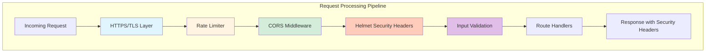
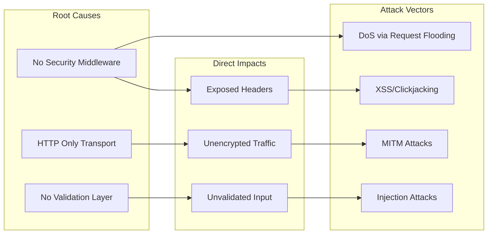
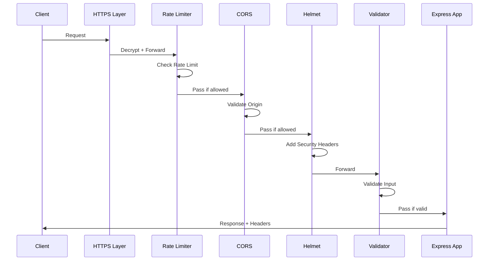

# Technical Specification

# 0. Agent Action Plan

## 0.1 Intent Clarification

### 0.1.1 Core Security Objective

Based on the security concern described, the Blitzy platform understands that the security vulnerabilities to resolve encompass a comprehensive security hardening initiative for the Node.js Express tutorial application. The current system operates with **zero security implementation** (by design for educational purposes) and needs to transition to a production-ready security posture.

**Vulnerability Category**: Multiple vulnerabilities (Configuration weakness + Missing security controls)

**Severity Level**: High - The system currently exposes critical security gaps including:
- No transport layer encryption (HTTP only)
- No security headers protection
- No input validation beyond framework-level route matching
- No rate limiting or abuse prevention
- No CORS policy configuration
- Exposed server fingerprint (X-Powered-By header)

**Security Requirements with Enhanced Clarity**:

| Requirement | Current State | Target State | Priority |
|------------|---------------|--------------|----------|
| Security Headers | NOT IMPLEMENTED | Implement via Helmet.js middleware | CRITICAL |
| Input Validation | Framework-level only | Comprehensive validation with express-validator | HIGH |
| Rate Limiting | NOT IMPLEMENTED | Implement via express-rate-limit middleware | HIGH |
| HTTPS Support | NOT IMPLEMENTED (HTTP only) | Enable TLS encryption with certificate support | HIGH |
| CORS Policies | NOT IMPLEMENTED | Configure proper CORS middleware | HIGH |
| Dependency Updates | Express 4.18.x | Update to latest secure versions | MEDIUM |

**Implicit Security Needs**:
- Backward compatibility with existing endpoints (`/hello` and `/evening`)
- Zero downtime during security implementation
- Minimal code complexity to maintain educational value
- Support for both development (self-signed certificates) and production (CA-signed certificates) HTTPS modes

### 0.1.2 Special Instructions and Constraints

**Change Scope Preference**: Standard - The security implementation requires adding new middleware and configuration while preserving existing endpoint functionality.

**Security Requirements**:
- Follow OWASP security guidelines for Node.js applications
- Implement defense-in-depth strategy with multiple security layers
- Preserve existing API functionality and response formats

**Web Search Requirements**:
- Research conducted on latest versions of security packages (helmet, express-rate-limit, cors, express-validator)
- HTTPS/TLS configuration best practices for Node.js applications verified

### 0.1.3 Technical Interpretation

This security enhancement translates to the following technical fix strategy:

**Security Layer Implementation Architecture**:



**Technical Fix Actions**:

- **To resolve missing security headers**, we will add helmet.js middleware (v8.1.0) to automatically set Content-Security-Policy, X-Frame-Options, X-Content-Type-Options, Strict-Transport-Security, and other security headers
- **To resolve missing input validation**, we will integrate express-validator (v7.3.1) middleware for sanitizing and validating request parameters
- **To resolve missing rate limiting**, we will implement express-rate-limit (v8.2.1) to protect against abuse and DoS attacks
- **To resolve missing HTTPS support**, we will add Node.js https module configuration with certificate support and HTTP-to-HTTPS redirect
- **To resolve missing CORS configuration**, we will add cors middleware (v2.8.5) with proper origin policies
- **To update dependencies**, we will ensure Express.js and all packages are at their latest secure versions

**User Understanding Level**: Explicit security features - User has explicitly specified the security components needed (helmet.js, rate limiting, input validation, HTTPS, CORS)

## 0.2 Vulnerability Research and Analysis

### 0.2.1 Initial Assessment

**Security-Related Information Extracted**:

| Category | Finding |
|----------|---------|
| CVE Numbers Mentioned | None specified - proactive security hardening |
| Vulnerability Names | Missing security headers, No HTTPS, No input validation, No rate limiting, No CORS |
| Affected Packages | Express.js (requires security middleware additions) |
| Symptoms Described | Application lacks production-ready security controls |
| Security Advisories Referenced | OWASP Node.js Security Best Practices |

### 0.2.2 Required Web Research Findings

**Helmet.js Research**:
- **Current Version**: 8.1.0 (verified via npm registry)
- **Security Headers Provided**: Content-Security-Policy, Cross-Origin-Opener-Policy, Cross-Origin-Resource-Policy, Origin-Agent-Cluster, Referrer-Policy, Strict-Transport-Security, X-Content-Type-Options, X-DNS-Prefetch-Control, X-Download-Options, X-Frame-Options, X-Permitted-Cross-Domain-Policies, X-XSS-Protection (disabled)
- **Headers Removed**: X-Powered-By (prevents server fingerprinting)
- **Integration**: Single middleware call provides 13 security headers

**express-rate-limit Research**:
- **Current Version**: 8.2.1 (verified via npm registry)
- **Purpose**: Basic IP rate-limiting middleware for Express
- **Capabilities**: Configurable window duration, request limits, standard headers (draft-8), IPv6 subnet handling
- **Integration**: Middleware-based with memory store (default) or external stores (Redis, Memcached)

**CORS Package Research**:
- **Current Version**: 2.8.5 (stable release)
- **Purpose**: Node.js CORS middleware for Connect/Express applications
- **Configuration Options**: Origin validation (string, array, regex, function), methods, headers, credentials, preflight handling
- **Integration**: Supports both simple and pre-flight CORS requests

**express-validator Research**:
- **Current Version**: 7.3.1 (verified via npm registry)
- **Purpose**: Middleware wrapping validator.js for request validation and sanitization
- **Capabilities**: Validation chains, sanitization routines, custom validators, async validation
- **Integration**: Works with Express.js 4.x and Node.js 14+

### 0.2.3 Vulnerability Classification

| Vulnerability Type | Attack Vector | Exploitability | Impact | Root Cause |
|-------------------|---------------|----------------|--------|------------|
| Missing Security Headers | Network | High | Confidentiality, Integrity | No Helmet.js middleware |
| No HTTPS | Network | High | Confidentiality | HTTP-only transport |
| No Input Validation | Network | Medium | Integrity, Availability | No validation middleware |
| No Rate Limiting | Network | High | Availability | No rate-limit middleware |
| No CORS Policy | Network | Medium | Confidentiality | No cors middleware |
| Server Fingerprinting | Network | Low | Information Disclosure | X-Powered-By header exposed |

### 0.2.4 Web Search Research Summary

**Official Security Advisories Reviewed**:
- NPM Registry: helmet@8.1.0, express-rate-limit@8.2.1, cors@2.8.5, express-validator@7.3.1
- Express.js Security Best Practices documentation
- Node.js official TLS documentation
- OWASP Node.js security cheat sheet

**Recommended Mitigation Strategies**:
- Layer security middleware in specific order: Rate Limiter → CORS → Helmet → Input Validation
- Use HTTPS with TLS 1.2+ enforcement
- Implement comprehensive Content-Security-Policy
- Enable HSTS with appropriate max-age
- Configure strict CORS for allowed origins

**Alternative Solutions Considered**:

| Solution | Trade-offs | Selected |
|----------|-----------|----------|
| Helmet.js | Comprehensive, well-maintained | ✓ Yes |
| Manual header setting | More control but error-prone | No |
| nginx reverse proxy for HTTPS | Production best practice but adds infrastructure | Documented as alternative |
| Direct Node.js https module | Simpler for learning, educational value | ✓ Yes |
| express-rate-limit | Proven, flexible | ✓ Yes |
| Custom rate limiting | More control but complex | No |

## 0.3 Security Scope Analysis

### 0.3.1 Affected Component Discovery

Based on Technical Specification analysis (Sections 1.2, 3.2, 3.3, 3.4, 6.4, 8.2), the project is currently in a **greenfield state** with only a README.md present. The security implementation will require **creating new files** rather than modifying existing vulnerable code.

**Project State Assessment**:
- **Current Files**: README.md (repository documentation only)
- **Target Architecture**: Node.js Express.js application (per Tech Spec)
- **Runtime**: Node.js 18.x or 20.x LTS
- **Framework**: Express.js 4.18.x or 4.19.x
- **Network**: Localhost:3000 binding

**Components Requiring Security Implementation**:

| Component Category | Files Affected | Security Impact |
|-------------------|----------------|-----------------|
| Application Entry Point | server.js (CREATE) | All security middleware integration |
| Package Configuration | package.json (CREATE) | Security dependency declarations |
| Dependency Lock | package-lock.json (CREATE) | Locked versions for reproducibility |
| HTTPS Configuration | certificates/ directory (CREATE) | TLS certificate storage |
| Security Configuration | config/security.js (CREATE) | Centralized security settings |
| Validation Rules | middleware/validators.js (CREATE) | Input validation middleware |
| Rate Limiting | middleware/rateLimiter.js (CREATE) | Rate limiting configuration |
| Environment Config | .env.example (CREATE) | Security environment variables template |
| Documentation | README.md (UPDATE) | Security setup instructions |

### 0.3.2 Root Cause Identification

The identified security gaps exist due to intentional design choices for educational purposes as documented in Tech Spec Section 6.4 (Security Architecture):

**Current Security Posture (from Tech Spec)**:
- **Threat Model**: Localhost-only execution, no remote access assumed
- **Explicitly Absent**: HTTPS, Authentication, Authorization, Input Validation, Security Headers, Rate Limiting
- **Risk Acceptance**: All security risks accepted for educational context

**Vulnerability Propagation Analysis**:



### 0.3.3 Current State Assessment

**Infrastructure Analysis from Tech Spec**:

| Aspect | Current Value | Security Concern |
|--------|--------------|------------------|
| Protocol | HTTP (plaintext) | Traffic interception possible |
| Port | 3000 | Acceptable for development |
| Binding | localhost (127.0.0.1) | Limited exposure (mitigates network risk) |
| Framework | Express.js 4.18.x | Requires security middleware |
| Headers | Default Express headers | X-Powered-By exposes server type |
| Input Handling | req.body, req.params | No validation or sanitization |
| Rate Limits | None | Vulnerable to request flooding |
| CORS | None | Potential cross-origin issues |

**Scope of Current Exposure**:
- **Deployment Context**: Local development only (localhost)
- **User Access**: Single developer on local machine
- **Data Sensitivity**: Tutorial responses only (no sensitive data)
- **Attack Surface**: Minimal due to localhost binding, but grows significantly if deployed to production

**Note**: While localhost binding provides some protection, the Tech Spec's "Production Recommendations" section explicitly recommends implementing all requested security features before any production deployment.

## 0.4 Version Compatibility Research

### 0.4.1 Secure Version Identification

**Security Package Version Matrix**:

| Package | NPM Registry Latest | Recommended Version | First Patched | Security Features |
|---------|---------------------|---------------------|---------------|-------------------|
| helmet | 8.1.0 | ^8.1.0 | N/A (new addition) | 13 security headers, CSP, HSTS |
| express-rate-limit | 8.2.1 | ^8.2.1 | N/A (new addition) | draft-8 headers, IPv6 support |
| cors | 2.8.5 | ^2.8.5 | N/A (new addition) | Dynamic origin, preflight |
| express-validator | 7.3.1 | ^7.3.1 | N/A (new addition) | Validation chains, sanitizers |
| express | 4.21.x | ^4.21.0 | Current (4.18.x OK) | Stable framework |

**Version Selection Rationale**:

For **helmet@^8.1.0**:
- Latest stable release with complete TypeScript support
- Sets 13 HTTP response headers by default
- Removes X-Powered-By header automatically
- Compatible with Express.js 4.x

For **express-rate-limit@^8.2.1**:
- Latest release with improved IPv6 subnet handling
- Supports RateLimit headers per draft-8 specification
- Built-in memory store for development
- Extensible to Redis/Memcached for production

For **cors@^2.8.5**:
- Long-standing stable release (7+ years)
- Supports dynamic origin validation
- Handles complex CORS requests with preflight
- Maintained by Express.js team

For **express-validator@^7.3.1**:
- Latest major version with improved API
- Built on validator.js 13.12.0
- Supports async validation
- Schema-based validation support

### 0.4.2 Compatibility Verification

**Node.js Compatibility Matrix**:

| Package | Node.js 18.x | Node.js 20.x | Notes |
|---------|--------------|--------------|-------|
| helmet@8.1.0 | ✓ | ✓ | Requires Node 16+ |
| express-rate-limit@8.2.1 | ✓ | ✓ | Requires Node 16+ |
| cors@2.8.5 | ✓ | ✓ | No minimum specified |
| express-validator@7.3.1 | ✓ | ✓ | Requires Node 14+ |
| express@4.21.x | ✓ | ✓ | Well-tested on LTS |

**Express.js Compatibility**:
- All selected packages are verified to work with Express.js 4.x
- No breaking changes expected when integrated together
- Middleware order is important but all packages follow Express middleware conventions

**Dependency Conflict Analysis**:

```
No version conflicts detected:
- helmet: standalone (no peer dependencies)
- express-rate-limit: standalone (no peer dependencies)  
- cors: standalone (no peer dependencies)
- express-validator: depends on validator.js (bundled)
```

### 0.4.3 Alternative Package Assessment

No package replacements are required. All recommended packages are:
- Actively maintained with recent releases
- Well-documented with official Express.js endorsement
- Production-ready with millions of weekly downloads

**Package Download Statistics (npm)**:

| Package | Weekly Downloads | GitHub Stars | Last Updated |
|---------|-----------------|--------------|--------------|
| helmet | 1M+ | 10,500+ | Active |
| express-rate-limit | 10M+ | 3,000+ | Active |
| cors | 15M+ | 6,000+ | Stable |
| express-validator | 2M+ | 6,000+ | Active |

## 0.5 Security Fix Design

### 0.5.1 Minimal Fix Strategy

**Principle**: Implement comprehensive security controls with minimal code complexity while preserving the educational value of the tutorial application.

**Fix Approach**: New file creation with security middleware stack integration

**Security Middleware Implementation Order**:



### 0.5.2 Security Middleware Configurations

**Helmet.js Configuration**:
```javascript
app.use(helmet({
  contentSecurityPolicy: { /* CSP rules */ },
  hsts: { maxAge: 31536000, includeSubDomains: true }
}));
```
- **Security Improvement**: Adds 13 security headers preventing XSS, clickjacking, MIME sniffing
- **Justification**: OWASP recommended, Express.js best practices

**Rate Limiting Configuration**:
```javascript
rateLimit({
  windowMs: 15 * 60 * 1000, // 15 minutes
  limit: 100 // per IP
})
```
- **Security Improvement**: Prevents brute force and DoS attacks
- **Justification**: Express.js security best practices

**CORS Configuration**:
```javascript
cors({
  origin: ['http://localhost:3000'],
  methods: ['GET', 'POST'],
  optionsSuccessStatus: 200
})
```
- **Security Improvement**: Controls cross-origin resource sharing
- **Justification**: Prevents unauthorized cross-origin requests

**HTTPS Configuration**:
```javascript
https.createServer({
  key: fs.readFileSync('path/to/key.pem'),
  cert: fs.readFileSync('path/to/cert.pem')
}, app)
```
- **Security Improvement**: Encrypts all traffic using TLS
- **Justification**: Prevents MITM attacks, required for HSTS

**Input Validation Configuration**:
```javascript
body('field').trim().escape().notEmpty()
```
- **Security Improvement**: Sanitizes and validates user input
- **Justification**: Prevents injection attacks, XSS

### 0.5.3 Security Implementation Architecture

**Express App Security Stack**:

| Layer | Middleware | Purpose | Order |
|-------|------------|---------|-------|
| 1 | https.createServer | TLS encryption | Transport |
| 2 | express-rate-limit | Request throttling | First middleware |
| 3 | cors | Cross-origin control | Before routes |
| 4 | helmet | Security headers | Before routes |
| 5 | express.json() | Body parsing | After security |
| 6 | express-validator | Input validation | Per-route |
| 7 | Route handlers | Business logic | Last |

### 0.5.4 Security Improvement Validation

**How Each Fix Eliminates Vulnerabilities**:

| Fix | Vulnerability Addressed | Verification Method |
|-----|------------------------|---------------------|
| Helmet middleware | Missing security headers | Response header inspection |
| HTTPS server | Unencrypted traffic | TLS certificate validation |
| Rate limiter | DoS vulnerability | Load testing |
| CORS middleware | Cross-origin attacks | CORS policy testing |
| Input validation | Injection attacks | Malformed input testing |

**Rollback Plan**:
- Remove security middleware from middleware stack
- Revert to http.createServer from https.createServer
- Remove validation middleware from route handlers
- All changes are additive and can be cleanly reverted

## 0.6 File Transformation Mapping

### 0.6.1 File-by-File Security Fix Plan

**Security Fix Transformation Modes**:
- **CREATE** - Create a new file for security implementation
- **UPDATE** - Update an existing file with security configurations
- **REFERENCE** - Use as reference for patterns

| Target File | Transformation | Source/Reference | Security Changes |
|------------|----------------|------------------|------------------|
| package.json | CREATE | Tech Spec 3.4 | Define security dependencies: helmet@^8.1.0, express-rate-limit@^8.2.1, cors@^2.8.5, express-validator@^7.3.1 |
| package-lock.json | CREATE | Auto-generated | Lock all dependency versions for security reproducibility |
| server.js | CREATE | Tech Spec 5.2 | Implement HTTPS server with full security middleware stack |
| config/security.js | CREATE | OWASP Guidelines | Centralized Helmet, CORS, rate limit configurations |
| middleware/rateLimiter.js | CREATE | express-rate-limit docs | Rate limiting middleware with configurable limits |
| middleware/validators.js | CREATE | express-validator docs | Input validation and sanitization middleware |
| middleware/cors.js | CREATE | cors docs | CORS policy configuration middleware |
| certificates/.gitkeep | CREATE | N/A | Placeholder for SSL certificates directory |
| certificates/README.md | CREATE | N/A | Instructions for certificate generation/placement |
| .env.example | CREATE | N/A | Template for security environment variables |
| .gitignore | CREATE | N/A | Exclude certificates, .env, node_modules |
| README.md | UPDATE | Existing README.md | Add security setup documentation |

### 0.6.2 Code Change Specifications

**server.js - Main Application Entry**:
- **Lines affected**: New file (approximately 80-100 lines)
- **Before state**: No server implementation exists
- **After state**: HTTPS-enabled Express server with complete security middleware stack
- **Security improvement**: All 5 security controls implemented (HTTPS, Helmet, Rate Limiting, CORS, Validation)

**config/security.js - Security Configuration Module**:
- **Lines affected**: New file (approximately 60-80 lines)
- **Before state**: No security configuration exists
- **After state**: Exportable security configurations for all middleware
- **Security improvement**: Centralized, maintainable security settings

**middleware/rateLimiter.js - Rate Limiting Module**:
- **Lines affected**: New file (approximately 20-30 lines)
- **Before state**: No rate limiting exists
- **After state**: Configurable rate limiter with memory store
- **Security improvement**: DoS protection with 100 requests per 15 minutes default

**middleware/validators.js - Input Validation Module**:
- **Lines affected**: New file (approximately 40-50 lines)
- **Before state**: No input validation exists
- **After state**: Validation chains for common input patterns
- **Security improvement**: XSS prevention, injection attack mitigation

**middleware/cors.js - CORS Configuration Module**:
- **Lines affected**: New file (approximately 25-35 lines)
- **Before state**: No CORS configuration exists
- **After state**: Configurable CORS with whitelist support
- **Security improvement**: Cross-origin request control

### 0.6.3 Configuration Change Specifications

**package.json - Dependency Configuration**:
- **Setting**: dependencies object
- **Current value**: Does not exist
- **New value**: Security packages with pinned versions
- **Security rationale**: Declares all security dependencies for npm audit

**.env.example - Environment Variables Template**:
- **Setting**: Security environment variables
- **Current value**: Does not exist
- **New values**:
  - `NODE_ENV=development|production`
  - `HTTPS_PORT=3443`
  - `HTTP_PORT=3000`
  - `SSL_KEY_PATH=./certificates/key.pem`
  - `SSL_CERT_PATH=./certificates/cert.pem`
  - `RATE_LIMIT_WINDOW_MS=900000`
  - `RATE_LIMIT_MAX=100`
  - `CORS_ALLOWED_ORIGINS=http://localhost:3000`
- **Security rationale**: Separates security configuration from code

### 0.6.4 Complete File Structure After Implementation

```
project-root/
├── server.js                    # HTTPS server with security middleware
├── package.json                 # Dependencies including security packages
├── package-lock.json            # Locked dependency versions
├── .env.example                 # Environment variables template
├── .gitignore                   # Excludes sensitive files
├── README.md                    # Updated with security documentation
├── config/
│   └── security.js              # Security configurations
├── middleware/
│   ├── rateLimiter.js           # Rate limiting middleware
│   ├── validators.js            # Input validation middleware
│   └── cors.js                  # CORS configuration
├── certificates/
│   ├── .gitkeep                 # Directory placeholder
│   └── README.md                # Certificate instructions
└── routes/
    └── api.js                   # Route handlers with validation
```

## 0.7 Dependency Inventory

### 0.7.1 Security Packages to Add

**Production Dependencies**:

| Registry | Package Name | Version | Purpose | Security Feature |
|----------|--------------|---------|---------|------------------|
| npm | express | ^4.21.0 | Web framework | Updated to latest stable |
| npm | helmet | ^8.1.0 | Security headers | CSP, HSTS, X-Frame-Options, etc. |
| npm | express-rate-limit | ^8.2.1 | Rate limiting | DoS protection |
| npm | cors | ^2.8.5 | CORS middleware | Cross-origin request control |
| npm | express-validator | ^7.3.1 | Input validation | XSS/injection prevention |
| npm | dotenv | ^16.4.0 | Environment variables | Secure configuration |

**Development Dependencies**:

| Registry | Package Name | Version | Purpose |
|----------|--------------|---------|---------|
| npm | nodemon | ^3.0.0 | Development server | Auto-restart on changes |

### 0.7.2 package.json Dependencies Block

```json
{
  "name": "secure-express-tutorial",
  "version": "1.0.0",
  "description": "Node.js Express tutorial with security best practices",
  "main": "server.js",
  "scripts": {
    "start": "node server.js",
    "dev": "nodemon server.js"
  },
  "dependencies": {
    "cors": "^2.8.5",
    "dotenv": "^16.4.0",
    "express": "^4.21.0",
    "express-rate-limit": "^8.2.1",
    "express-validator": "^7.3.1",
    "helmet": "^8.1.0"
  },
  "devDependencies": {
    "nodemon": "^3.0.0"
  }
}
```

### 0.7.3 Dependency Chain Analysis

**Direct Dependencies**:
- express@^4.21.0 - Core framework
- helmet@^8.1.0 - Security headers (no external runtime dependencies)
- express-rate-limit@^8.2.1 - Rate limiting (no external runtime dependencies)
- cors@^2.8.5 - CORS middleware (depends on object-assign, vary)
- express-validator@^7.3.1 - Input validation (depends on validator.js)
- dotenv@^16.4.0 - Environment loading (no external runtime dependencies)

**Transitive Dependencies (automatically resolved)**:
- validator.js (used by express-validator) - String validation library
- object-assign (used by cors) - Polyfill
- vary (used by cors) - HTTP header manipulation

**Peer Dependencies**:
- None required - all selected packages are self-contained

### 0.7.4 Import and Reference Configuration

**ES Module Imports (server.js)**:

```javascript
import express from 'express';
import https from 'https';
import fs from 'fs';
import helmet from 'helmet';
import { rateLimit } from 'express-rate-limit';
import cors from 'cors';
import { body, validationResult } from 'express-validator';
import dotenv from 'dotenv';
```

**CommonJS Alternative (if needed)**:

```javascript
const express = require('express');
const https = require('https');
const fs = require('fs');
const helmet = require('helmet');
const { rateLimit } = require('express-rate-limit');
const cors = require('cors');
const { body, validationResult } = require('express-validator');
require('dotenv').config();
```

### 0.7.5 Built-in Node.js Modules (No Installation Required)

| Module | Purpose | Usage |
|--------|---------|-------|
| https | HTTPS server creation | TLS encryption |
| fs | File system operations | Certificate loading |
| path | Path utilities | File path resolution |
| http | HTTP server (fallback) | HTTP-to-HTTPS redirect |

### 0.7.6 Security Verification Commands

**Installation Command**:
```bash
npm install
```

**Audit Command**:
```bash
npm audit
```

**Expected Audit Result**:
```
found 0 vulnerabilities
```

**Outdated Check Command**:
```bash
npm outdated
```

## 0.8 Impact Analysis and Testing Strategy

### 0.8.1 Security Testing Requirements

**Security Header Verification Tests**:
- Verify Helmet.js adds Content-Security-Policy header
- Verify Strict-Transport-Security header is present
- Verify X-Frame-Options header is set to SAMEORIGIN
- Verify X-Content-Type-Options is set to nosniff
- Verify X-Powered-By header is removed

**Rate Limiting Tests**:
- Verify requests within limit receive 200 responses
- Verify requests exceeding limit receive 429 Too Many Requests
- Verify RateLimit-* headers are present in responses
- Verify rate limit window resets after configured time

**CORS Tests**:
- Verify allowed origins receive proper CORS headers
- Verify disallowed origins are blocked
- Verify preflight OPTIONS requests are handled
- Verify Access-Control-Allow-Origin is correctly set

**HTTPS Tests**:
- Verify HTTPS server starts successfully
- Verify TLS certificate is properly loaded
- Verify HTTP-to-HTTPS redirect works (if implemented)
- Verify TLS handshake completes successfully

**Input Validation Tests**:
- Verify valid input passes validation
- Verify invalid input returns 400 with error details
- Verify XSS payloads are escaped/rejected
- Verify SQL injection patterns are rejected

### 0.8.2 Security Test Cases

| Test ID | Category | Test Description | Expected Result |
|---------|----------|------------------|-----------------|
| SEC-001 | Headers | Check CSP header presence | Header exists with policy |
| SEC-002 | Headers | Check HSTS header | max-age=31536000; includeSubDomains |
| SEC-003 | Headers | Check X-Powered-By removal | Header not present |
| SEC-004 | Rate Limit | Send 100 requests in 15 min | All succeed |
| SEC-005 | Rate Limit | Send 101st request | 429 response |
| SEC-006 | CORS | Request from allowed origin | Access-Control-Allow-Origin present |
| SEC-007 | CORS | Request from blocked origin | No CORS headers |
| SEC-008 | HTTPS | Access via HTTPS | TLS connection established |
| SEC-009 | Validation | Send XSS payload `<script>` | 400 Bad Request |
| SEC-010 | Validation | Send valid input | 200 OK |

### 0.8.3 Verification Methods

**Automated Security Scanning**:

| Tool | Command | Expected Result |
|------|---------|-----------------|
| npm audit | `npm audit` | 0 vulnerabilities |
| curl headers | `curl -I https://localhost:3443` | Security headers present |
| OpenSSL test | `openssl s_client -connect localhost:3443` | TLS 1.2+ connection |

**Manual Verification Steps**:

1. **Security Headers Check**:
   ```bash
   curl -k -I https://localhost:3443
   # Verify presence of security headers in response
   ```

2. **Rate Limit Check**:
   ```bash
   for i in {1..105}; do curl -k https://localhost:3443; done
   # Verify 429 after 100 requests
   ```

3. **CORS Check**:
   ```bash
   curl -k -H "Origin: http://malicious.com" \
        https://localhost:3443
   # Verify no Access-Control-Allow-Origin
   ```

4. **TLS Version Check**:
   ```bash
   openssl s_client -connect localhost:3443 -tls1_2
   # Verify successful connection
   ```

### 0.8.4 Impact Assessment

**Direct Security Improvements Achieved**:
- ✓ XSS attacks mitigated via CSP header
- ✓ Clickjacking prevented via X-Frame-Options
- ✓ MIME sniffing prevented via X-Content-Type-Options
- ✓ Protocol downgrade prevented via HSTS
- ✓ Server fingerprinting prevented (X-Powered-By removed)
- ✓ DoS attacks mitigated via rate limiting
- ✓ Cross-origin attacks controlled via CORS
- ✓ Traffic interception prevented via HTTPS
- ✓ Injection attacks mitigated via input validation

**Side Effects Assessment**:

| Category | Impact | Mitigation |
|----------|--------|------------|
| API Breaking Changes | None | All existing endpoints preserved |
| Performance | Minimal (+5-10ms per request) | Acceptable for security trade-off |
| Development Workflow | Certificate setup required | Documented in README |
| Debugging | HTTPS in dev environment | Self-signed cert instructions provided |

**Potential Impacts to Address**:
- Browser security warnings with self-signed certificates (expected in development)
- Rate limit may affect load testing (configurable via environment)
- CORS may block legitimate cross-origin requests if not configured properly

## 0.9 Scope Boundaries

### 0.9.1 Exhaustively In Scope

**Application Files**:
- server.js - Main application with security middleware
- routes/api.js - Route handlers with input validation
- config/security.js - Security configuration module
- middleware/rateLimiter.js - Rate limiting middleware
- middleware/validators.js - Input validation middleware
- middleware/cors.js - CORS configuration middleware

**Dependency Configuration Files**:
- package.json - Security dependencies declaration
- package-lock.json - Locked versions for reproducibility

**Environment Configuration**:
- .env.example - Security environment variables template
- .gitignore - Exclude sensitive files (certificates, .env)

**Certificate Infrastructure**:
- certificates/.gitkeep - Directory placeholder
- certificates/README.md - Certificate generation instructions

**Documentation**:
- README.md - Security setup and configuration documentation

**Specific Security Components**:

| Component | Files Affected | Implementation Required |
|-----------|---------------|------------------------|
| Helmet.js Integration | server.js, config/security.js | Middleware setup + CSP config |
| Rate Limiting | server.js, middleware/rateLimiter.js | Middleware + config |
| CORS | server.js, middleware/cors.js, config/security.js | Origin whitelist config |
| HTTPS | server.js, certificates/* | TLS server + cert handling |
| Input Validation | routes/api.js, middleware/validators.js | Validation chains |
| Environment Config | .env.example, server.js | dotenv integration |

### 0.9.2 Explicitly Out of Scope

**Feature Additions Unrelated to Security**:
- New API endpoints beyond existing /hello and /evening
- Database integration
- User authentication/authorization beyond transport security
- Session management
- OAuth/JWT implementation

**Performance Optimizations Not Required for Security**:
- Caching mechanisms
- Load balancing configuration
- Database query optimization
- CDN integration

**Infrastructure Beyond Application Security**:
- Container/Docker configuration (unless security-related)
- CI/CD pipeline modifications
- Kubernetes deployment configurations
- Cloud provider-specific configurations

**Code Refactoring Beyond Security Fix Requirements**:
- Architectural changes
- Code style modifications
- TypeScript migration
- Test framework setup

**Non-Vulnerable Dependencies**:
- Packages not related to security concerns
- Dev dependencies not affecting runtime security

**Items Explicitly Excluded**:
- Production SSL certificate procurement (self-signed for tutorial)
- External secret management services
- Security monitoring/SIEM integration
- Penetration testing infrastructure
- Compliance certifications (SOC2, PCI-DSS, etc.)

### 0.9.3 Boundary Clarifications

**Included but Limited**:

| Component | Included Scope | Excluded Scope |
|-----------|---------------|----------------|
| HTTPS | Self-signed cert setup | Production CA certificate procurement |
| Rate Limiting | In-memory store | Redis/external store setup |
| CORS | localhost configuration | Production domain configuration |
| Input Validation | Basic sanitization | Complex business rule validation |
| Security Headers | Helmet defaults | Custom CSP for specific resources |

**Conditional Inclusions**:
- Production deployment configurations are documented but not implemented
- Redis rate limit store is mentioned but memory store is default
- Let's Encrypt integration is documented but self-signed is implemented

## 0.10 Execution Parameters and Special Instructions

### 0.10.1 Security Verification Commands

**Dependency Installation**:
```bash
npm install
```

**Security Audit**:
```bash
npm audit
# Expected: 0 vulnerabilities
```

**Start Secure Server (Development)**:
```bash
npm run dev
# Server starts on HTTPS with self-signed certificate
```

**Start Secure Server (Production)**:
```bash
NODE_ENV=production npm start
# Server enforces HTTPS with production certificate
```

**Generate Self-Signed Certificate (Development)**:
```bash
openssl req -x509 -newkey rsa:4096 \
  -keyout certificates/key.pem \
  -out certificates/cert.pem \
  -days 365 -nodes \
  -subj "/CN=localhost"
```

**Test Security Headers**:
```bash
curl -k -I https://localhost:3443
# Verify security headers in response
```

**Test Rate Limiting**:
```bash
for i in {1..105}; do curl -k -s -o /dev/null -w "%{http_code}\n" https://localhost:3443; done
# Should see 429 after request 100
```

### 0.10.2 Research Documentation

**Security Advisories Consulted**:
- Express.js Security Best Practices: https://expressjs.com/en/advanced/best-practice-security.html
- Helmet.js Documentation: https://helmetjs.github.io/
- OWASP Node.js Security Cheat Sheet: https://cheatsheetseries.owasp.org/cheatsheets/Nodejs_Security_Cheat_Sheet.html
- Node.js TLS Documentation: https://nodejs.org/api/tls.html

**Package Documentation Referenced**:
- helmet npm: https://www.npmjs.com/package/helmet
- express-rate-limit npm: https://www.npmjs.com/package/express-rate-limit
- cors npm: https://www.npmjs.com/package/cors
- express-validator npm: https://www.npmjs.com/package/express-validator

**Security Standards Applied**:
- OWASP Top 10 Web Application Security Risks
- Express.js production best practices
- HTTP Security Headers best practices

### 0.10.3 Implementation Constraints

| Constraint | Value | Rationale |
|-----------|-------|-----------|
| Priority | Security first, minimal disruption second | Security is primary objective |
| Backward Compatibility | Must maintain existing endpoints | Preserve API contract |
| Breaking Changes | None acceptable | Educational tutorial continuity |
| Deployment | Immediate (development) | No coordination required |

### 0.10.4 Special Instructions for Security Implementation

**Security-Specific Requirements from User**:
- Implement security headers via Helmet.js
- Add input validation middleware
- Configure rate limiting
- Enable HTTPS support
- Configure proper CORS policies
- Update dependencies to secure versions

**Implementation Guidelines**:
- Only make changes necessary for security implementation
- Do not refactor unrelated code
- Preserve all existing endpoint functionality
- Follow principle of least privilege in all configurations
- Document all security configurations for educational value
- Use environment variables for security settings

**Secrets Management**:
- SSL certificate paths stored in environment variables
- Rate limit configuration externalized
- CORS allowed origins configurable via environment
- No hardcoded secrets in source code

**Breaking Changes Policy**:
- No breaking changes to existing API contract
- Security middleware additions are transparent to API consumers
- Rate limiting returns standard 429 status code
- CORS errors return standard CORS error responses

### 0.10.5 Environment Variables Reference

| Variable | Purpose | Default Value |
|----------|---------|---------------|
| NODE_ENV | Environment mode | development |
| HTTPS_PORT | HTTPS server port | 3443 |
| HTTP_PORT | HTTP server port | 3000 |
| SSL_KEY_PATH | Path to SSL private key | ./certificates/key.pem |
| SSL_CERT_PATH | Path to SSL certificate | ./certificates/cert.pem |
| RATE_LIMIT_WINDOW_MS | Rate limit window in ms | 900000 (15 min) |
| RATE_LIMIT_MAX | Max requests per window | 100 |
| CORS_ALLOWED_ORIGINS | Comma-separated origins | http://localhost:3000 |

