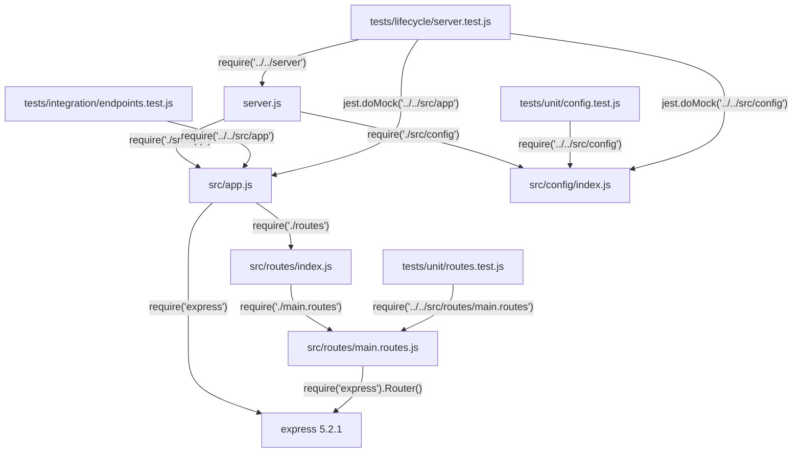

# Technical Specification

# 0. Agent Action Plan

## 0.1 Intent Clarification

### 0.1.1 Core Refactoring Objective

Based on the prompt, the Blitzy platform understands that the refactoring objective is to take the existing `hello_world` Node.js server — which already employs Express.js 5.2.1 as its HTTP framework — and perform a comprehensive Express.js-centric structural refactor. The user's instruction to "rewrite this Node.js server into an express.js refactor, keeping every feature and functionality exactly as in the original Node.js project" indicates that the codebase must be reorganized and improved while maintaining byte-for-byte behavioral equivalence across all HTTP response bodies, status codes, headers, server lifecycle events, and error handling flows.

- **Refactoring type:** Code structure — restructure the existing modular layered Express.js application for improved maintainability, Express.js idiomatic patterns, and extensibility while preserving all 63 passing tests and 100% code coverage
- **Target repository:** Same repository — all changes occur in-place within the current project directory
- **Key refactoring goals:**
  - Preserve the Factory Pattern in `src/app.js` that decouples Express app creation from HTTP server binding
  - Maintain the Barrel/Aggregator Pattern in `src/routes/index.js` for centralized route exports
  - Retain the Twelve-Factor App configuration model in `src/config/index.js`
  - Ensure `GET /` returns `Hello, World!\n` (with trailing newline) and `GET /evening` returns `Good evening` (without trailing newline) — exact string matches
  - Preserve all HTTP header contracts: `X-Powered-By: Express`, `Content-Type: text/html; charset=utf-8`, `ETag`, and accurate `Content-Length` values
  - Maintain server lifecycle behavior: `app.listen()` binding, `console.log()` startup message format, error suppression for `EADDRINUSE`/`EACCES`/generic errors, and graceful shutdown via `server.close()`
  - Keep all test infrastructure operational: unit tests (22), integration tests (26), and lifecycle tests (15) must continue to pass with no modifications to test logic
- **Implicit requirements surfaced:**
  - Maintain all public API contracts (HTTP endpoints, response formats, status codes)
  - Preserve CommonJS module system (`require()` / `module.exports`) throughout
  - Retain all JSDoc annotations and `'use strict'` directives as per existing coding standards
  - Keep the dual-consumption model where `src/app.js` exports are consumed by both `server.js` (production) and `tests/integration/endpoints.test.js` (Supertest testing) without modification

### 0.1.2 Technical Interpretation

This refactoring translates to the following technical transformation strategy:

- **Current architecture:** A modular layered Express.js 5.2.1 application comprising three tiers — Server Lifecycle Layer (`server.js`), Application Layer (`src/app.js`), and Supporting Layer (`src/config/index.js`, `src/routes/index.js`, `src/routes/main.routes.js`) — totaling five source files and approximately 180 lines of code
- **Target architecture:** The same modular layered Express.js 5.2.1 application with structural improvements applied to each layer while preserving the three-tier separation and all external behavioral contracts
- **Transformation rules:**
  - Every source file update must preserve its module's exported API surface exactly
  - All `require()` import paths must resolve correctly after refactoring
  - No new npm dependencies may be introduced (the zero-new-dependency constraint remains in effect)
  - All test file import paths must be updated to reflect any structural changes
  - The `jest.config.js` coverage collection patterns and test discovery globs must continue to capture all source and test files
- **Architectural constraints preserved:**
  - `src/app.js` must never call `app.listen()` — this responsibility belongs exclusively to `server.js`
  - `src/config/index.js` must continue to produce valid output for every possible input combination (no error states)
  - Route handler responses must use synchronous `res.send()` with hardcoded string literals — no async I/O
  - The single-process, single-event-loop model is maintained with no introduction of clustering or worker threads

## 0.2 Source Analysis

### 0.2.1 Comprehensive Source File Discovery

The repository has been exhaustively analyzed. All source, configuration, test, and documentation files have been cataloged through recursive directory traversal and direct file inspection. The following enumerates every file identified as requiring refactoring attention.

**Current Structure Mapping:**

```
hello_world/
├── .gitignore                          (11 lines — dependency/coverage/env/OS/IDE exclusions)
├── README.md                           (2 lines — minimal project marker)
├── jest.config.js                      (27 lines — Jest test runner configuration)
├── package.json                        (22 lines — npm manifest with express, jest, supertest)
├── package-lock.json                   (lockfileVersion 3 — resolved dependency graph)
├── server.js                           (52 lines — HTTP server bootstrap and lifecycle)
├── src/
│   ├── app.js                          (27 lines — Express Factory Pattern, route mounting)
│   ├── config/
│   │   └── index.js                    (41 lines — Twelve-Factor config: host, port, env)
│   └── routes/
│       ├── index.js                    (19 lines — Barrel/Aggregator for route exports)
│       └── main.routes.js             (41 lines — GET / and GET /evening handlers)
├── tests/
│   ├── unit/
│   │   ├── config.test.js              (140 lines — 15 config module unit tests)
│   │   └── routes.test.js             (94 lines — 7 route handler unit tests)
│   ├── integration/
│   │   └── endpoints.test.js          (199 lines — 26 HTTP integration tests)
│   └── lifecycle/
│       └── server.test.js             (375 lines — 15 server lifecycle tests)
└── blitzy/
    └── documentation/
        ├── Project Guide.md            (sprint report and development guide)
        └── Technical Specifications.md (agent action plan and implementation blueprint)
```

### 0.2.2 Source File Inventory

| File Path | Lines | Role | Refactoring Relevance |
|-----------|-------|------|-----------------------|
| `server.js` | 52 | HTTP server entry point — calls `app.listen()` with config | Core — server lifecycle layer to be refactored |
| `src/app.js` | 27 | Express app factory — mounts routes, exports app | Core — application layer to be refactored |
| `src/config/index.js` | 41 | Configuration with env var overrides and defaults | Core — supporting layer to be refactored |
| `src/routes/index.js` | 19 | Barrel re-export of `mainRoutes` | Core — route aggregation to be refactored |
| `src/routes/main.routes.js` | 41 | Route definitions: `GET /` and `GET /evening` | Core — route handlers to be refactored |
| `jest.config.js` | 27 | Test runner config with coverage thresholds | Config — must be updated if paths change |
| `package.json` | 22 | npm manifest with scripts, deps, entry point | Config — must reflect updated entry point/scripts |
| `package-lock.json` | ~228K | Resolved dependency graph | Config — auto-regenerated on install |
| `.gitignore` | ~20 | Git exclusion patterns | Config — may need updates for new directories |
| `README.md` | 2 | Minimal project marker | Documentation — to be updated |
| `tests/unit/config.test.js` | 140 | Config module unit tests (15 tests) | Test — import paths must track source changes |
| `tests/unit/routes.test.js` | 94 | Route handler unit tests (7 tests) | Test — import paths must track source changes |
| `tests/integration/endpoints.test.js` | 199 | HTTP integration tests (26 tests) | Test — import paths must track source changes |
| `tests/lifecycle/server.test.js` | 375 | Server lifecycle tests (15 tests) | Test — mock paths must track source changes |

### 0.2.3 Module Dependency Graph

The following dependency chain is linear and deterministic with no circular dependencies:



### 0.2.4 Behavioral Contracts to Preserve

| Contract | Verified By | Source File |
|----------|-------------|-------------|
| `GET /` returns `Hello, World!\n` with status 200 | `tests/integration/endpoints.test.js` | `src/routes/main.routes.js` |
| `GET /evening` returns `Good evening` with status 200 | `tests/integration/endpoints.test.js` | `src/routes/main.routes.js` |
| `Content-Type: text/html; charset=utf-8` on success | `tests/integration/endpoints.test.js` | Express automatic header |
| `X-Powered-By: Express` header present | `tests/integration/endpoints.test.js` | Express default behavior |
| `ETag` header present on cacheable GETs | `tests/integration/endpoints.test.js` | Express automatic header |
| Accurate `Content-Length` header | `tests/integration/endpoints.test.js` | Express automatic header |
| 404 for undefined routes and unsupported methods | `tests/integration/endpoints.test.js` | Express default handler |
| `OPTIONS /evening` returns 200 with `Allow` header | `tests/integration/endpoints.test.js` | Express automatic behavior |
| Server binds to `config.port` and `config.host` | `tests/lifecycle/server.test.js` | `server.js` |
| Logs `Server running at http://{host}:{port}/` | `tests/lifecycle/server.test.js` | `server.js` |
| Error suppression for EADDRINUSE, EACCES, generic | `tests/lifecycle/server.test.js` | `server.js` |
| Graceful shutdown via `server.close()` | `tests/lifecycle/server.test.js` | `server.js` |
| Config defaults: host=127.0.0.1, port=3000, env=development | `tests/unit/config.test.js` | `src/config/index.js` |
| Port sanitization: invalid strings → 3000, trimming, truncation | `tests/unit/config.test.js` | `src/config/index.js` |
| Router exports two GET layers: `/` then `/evening` | `tests/unit/routes.test.js` | `src/routes/main.routes.js` |

## 0.3 Scope Boundaries

### 0.3.1 Exhaustively In Scope

**Source Transformations:**
- `server.js` — Refactor HTTP server bootstrap, listen binding, error handling, and shutdown logic
- `src/app.js` — Refactor Express application factory with route mounting
- `src/config/index.js` — Refactor Twelve-Factor configuration module
- `src/routes/index.js` — Refactor route barrel/aggregator
- `src/routes/main.routes.js` — Refactor GET `/` and GET `/evening` route handler definitions

**Test Updates:**
- `tests/unit/config.test.js` — Update import paths to track any source file location changes
- `tests/unit/routes.test.js` — Update import paths to track any route file location changes
- `tests/integration/endpoints.test.js` — Update import path to track `src/app.js` location changes
- `tests/lifecycle/server.test.js` — Update `require()` paths and `jest.doMock()` paths for `server.js`, `src/app`, and `src/config`

**Configuration Updates:**
- `package.json` — Update `main` entry point, npm scripts, and metadata if structural changes require it
- `jest.config.js` — Update `testMatch`, `collectCoverageFrom`, and `coveragePathIgnorePatterns` if directory structure changes
- `.gitignore` — Update exclusion patterns if new directories are introduced

**Documentation Updates:**
- `README.md` — Update project documentation to reflect refactored structure and usage instructions

**Import Corrections:**
- Every file containing `require('./src/app')`, `require('./src/config')`, `require('./routes')`, `require('./main.routes')`, `require('../../src/config')`, `require('../../src/routes/main.routes')`, `require('../../src/app')`, `require('../../server')` — all import paths must be verified and corrected to match post-refactor structure

### 0.3.2 Explicitly Out of Scope

| Exclusion | Rationale |
|-----------|-----------|
| New feature additions (new endpoints, middleware) | User explicitly requires exact behavioral preservation |
| TypeScript migration | Project uses CommonJS JavaScript; no TypeScript conversion requested |
| Module system migration (ESM) | Project uses CommonJS; no ESM migration requested |
| New npm dependency additions | Zero-new-dependency constraint applies — only `express`, `jest`, `supertest` |
| CI/CD pipeline configuration | No GitHub Actions, Jenkins, or automation pipeline requested |
| Docker or container configuration | No containerization requested |
| Database or external service integration | Application is self-contained with no external dependencies |
| Performance optimization or load testing | Not requested by user |
| Security hardening (e.g., disabling `X-Powered-By`) | Not requested; existing behavior must be preserved |
| `npm audit fix` for `qs` vulnerability | Existing known issue — not part of refactoring scope |
| `blitzy/documentation/` folder modifications | Planning artifacts are reference-only, not part of application source |
| `package-lock.json` manual editing | Auto-regenerated by npm; no manual changes required |
| Node.js version upgrade | Node.js 20.x LTS remains the target runtime |
| Express version upgrade | Express 5.2.1 (resolved from `^5.1.0`) remains the production dependency |

## 0.4 Target Design

### 0.4.1 Refactored Structure Planning

The target architecture preserves the existing three-tier modular layered design — Server Lifecycle Layer, Application Layer, and Supporting Layer — while applying Express.js idiomatic improvements to each layer. The directory structure retains the same conceptual organization established in the original codebase, as the existing separation of concerns already follows Express.js best practices.

**Target Architecture:**

```
hello_world/
├── .gitignore                          (updated exclusion patterns)
├── README.md                           (updated project documentation)
├── jest.config.js                      (updated test/coverage configuration)
├── package.json                        (updated metadata and scripts)
├── package-lock.json                   (auto-regenerated)
├── server.js                           (refactored server lifecycle)
├── src/
│   ├── app.js                          (refactored Express factory)
│   ├── config/
│   │   └── index.js                    (refactored Twelve-Factor config)
│   └── routes/
│       ├── index.js                    (refactored route barrel)
│       └── main.routes.js             (refactored route handlers)
├── tests/
│   ├── unit/
│   │   ├── config.test.js              (updated import paths)
│   │   └── routes.test.js             (updated import paths)
│   ├── integration/
│   │   └── endpoints.test.js          (updated import paths)
│   └── lifecycle/
│       └── server.test.js             (updated mock/import paths)
└── blitzy/
    └── documentation/
        ├── Project Guide.md            (reference only — not modified)
        └── Technical Specifications.md (reference only — not modified)
```

### 0.4.2 Web Search Research Conducted

- Express.js 5 project structure best practices (2025) — confirmed that the existing modular pattern with separated `app.js` factory, `config/`, and `routes/` directories aligns with industry-standard Express.js project organization
- Express.js separation of concerns patterns — validated the Factory Pattern approach where `app.js` exports a configured Express instance without calling `listen()`
- Express.js route barrel pattern — confirmed the aggregator/barrel pattern in `src/routes/index.js` as the recommended approach for centralizing route exports
- Twelve-Factor App configuration in Express.js — verified that environment variable-driven configuration with fallback defaults is the established best practice

### 0.4.3 Design Pattern Applications

The following design patterns are preserved and reinforced during the refactoring:

| Pattern | Current Implementation | Refactored Application |
|---------|----------------------|------------------------|
| Factory Pattern | `src/app.js` creates Express app without port binding | Maintained — `src/app.js` continues to export configured app without `listen()` |
| Barrel/Aggregator Pattern | `src/routes/index.js` centralizes route exports | Maintained — single aggregation point for route module onboarding |
| Twelve-Factor Configuration | `src/config/index.js` externalizes settings via env vars | Maintained — `HOST`, `PORT`, `NODE_ENV` with sensible defaults |
| Separation of Concerns | Server lifecycle decoupled from app creation and routing | Maintained — three-tier layer independence preserved |
| Module Pattern | CommonJS `require()` / `module.exports` throughout | Maintained — consistent CommonJS semantics across all files |

### 0.4.4 Refactoring Transformation Strategy

The refactoring applies targeted improvements to each architectural layer while maintaining the existing module boundaries:

**Server Lifecycle Layer (`server.js`):**
- Refactor to maintain the HTTP bootstrap: requiring `src/app`, `src/config`, invoking `app.listen()`, and logging the startup URL
- Preserve error event handling for `EADDRINUSE`, `EACCES`, and generic errors
- Retain the `console.log()` format: `Server running at http://${host}:${port}/`

**Application Layer (`src/app.js`):**
- Refactor the Express factory to continue instantiating `express()`, mounting `mainRoutes` at root path, and exporting the configured app
- Ensure the factory never calls `app.listen()` — the critical contract for Supertest testability

**Supporting Layer:**
- `src/config/index.js` — Refactor configuration module to preserve `host`, `port`, `env` properties with identical resolution logic (`process.env` → fallback defaults)
- `src/routes/index.js` — Refactor barrel to continue re-exporting `{ mainRoutes }` for destructured import in `src/app.js`
- `src/routes/main.routes.js` — Refactor route handlers to preserve exact response strings: `Hello, World!\n` and `Good evening`

## 0.5 Transformation Mapping

### 0.5.1 File-by-File Transformation Plan

The following table maps every target file to its source file with the specific transformation mode and key changes required. All files are included in a single execution phase.

| Target File | Transformation | Source File | Key Changes |
|------------|----------------|-------------|-------------|
| `server.js` | UPDATE | `server.js` | Refactor HTTP server entry point; preserve `app.listen(config.port, config.host, callback)` invocation, `console.log` startup message format, and error handling behavior |
| `src/app.js` | UPDATE | `src/app.js` | Refactor Express factory pattern; preserve `express()` instantiation, `app.use('/', mainRoutes)` mounting, and `module.exports = app` export contract |
| `src/config/index.js` | UPDATE | `src/config/index.js` | Refactor configuration module; preserve `host`, `port`, `env` property exports with identical `process.env` resolution and fallback defaults |
| `src/routes/index.js` | UPDATE | `src/routes/index.js` | Refactor barrel aggregator; preserve `{ mainRoutes }` named export for destructured import |
| `src/routes/main.routes.js` | UPDATE | `src/routes/main.routes.js` | Refactor route handlers; preserve `router.get('/')` returning `'Hello, World!\n'` and `router.get('/evening')` returning `'Good evening'` |
| `package.json` | UPDATE | `package.json` | Update metadata, verify `main` points to `server.js`, confirm scripts and dependency declarations remain accurate |
| `jest.config.js` | UPDATE | `jest.config.js` | Verify `testMatch`, `collectCoverageFrom` patterns, coverage thresholds (75% branch, 90% function, 80% line/statement) |
| `.gitignore` | UPDATE | `.gitignore` | Verify exclusion patterns remain comprehensive for node_modules, coverage, env, logs, OS, IDE files |
| `README.md` | UPDATE | `README.md` | Update project documentation to reflect refactored structure, usage instructions, and architecture |
| `tests/unit/config.test.js` | UPDATE | `tests/unit/config.test.js` | Update `require('../../src/config')` import paths if source structure changes; preserve all 15 test cases |
| `tests/unit/routes.test.js` | UPDATE | `tests/unit/routes.test.js` | Update `require('../../src/routes/main.routes')` import path if source structure changes; preserve all 7 test cases |
| `tests/integration/endpoints.test.js` | UPDATE | `tests/integration/endpoints.test.js` | Update `require('../../src/app')` import path if source structure changes; preserve all 26 test cases |
| `tests/lifecycle/server.test.js` | UPDATE | `tests/lifecycle/server.test.js` | Update `jest.doMock('../../src/app')`, `jest.doMock('../../src/config')`, and `require('../../server')` paths if structure changes; preserve all 15 test cases |

### 0.5.2 Cross-File Dependencies

**Import statement updates required across the codebase:**

- `server.js`:
  - `require('./src/app')` — must resolve to the refactored Express factory module
  - `require('./src/config')` — must resolve to the refactored configuration module
- `src/app.js`:
  - `require('express')` — unchanged (npm package)
  - `require('./routes')` — must resolve to the refactored route barrel
- `src/routes/index.js`:
  - `require('./main.routes')` — must resolve to the refactored route handler module
- `src/routes/main.routes.js`:
  - `require('express')` — unchanged (npm package)
- `tests/unit/config.test.js`:
  - `require('../../src/config')` — must resolve to the refactored config module
- `tests/unit/routes.test.js`:
  - `require('../../src/routes/main.routes')` — must resolve to the refactored route handler module
- `tests/integration/endpoints.test.js`:
  - `require('supertest')` — unchanged (npm package)
  - `require('../../src/app')` — must resolve to the refactored Express factory module
- `tests/lifecycle/server.test.js`:
  - `jest.doMock('../../src/app', ...)` — mock path must match refactored app module location
  - `jest.doMock('../../src/config', ...)` — mock path must match refactored config module location
  - `require('../../server')` — must resolve to the refactored server entry point

### 0.5.3 Configuration and Documentation Updates

| File | Update Required |
|------|----------------|
| `package.json` | Verify `"main": "server.js"` entry point, confirm `"start": "node server.js"` script, validate dependency declarations |
| `jest.config.js` | Verify `testMatch: ['**/tests/**/*.test.js']` captures all tests, confirm `collectCoverageFrom: ['server.js', 'src/**/*.js']` captures all source |
| `.gitignore` | Verify `node_modules/`, `coverage/`, `.env`, `logs/`, OS and IDE patterns remain comprehensive |
| `README.md` | Update to document refactored project structure, installation, startup, and testing instructions |

### 0.5.4 Wildcard Patterns

- `src/**/*.js` — All source files requiring refactoring (5 files)
- `tests/**/*.test.js` — All test files requiring import path updates (4 files)
- `*.js` (root) — Root-level JavaScript files: `server.js`, `jest.config.js`

### 0.5.5 One-Phase Execution

The entire refactor is executed by Blitzy in a single phase. All 13 files listed in the transformation plan above are processed together to ensure atomic consistency of import paths, module exports, and behavioral contracts across the entire codebase.

## 0.6 Dependency Inventory

### 0.6.1 Key Packages

The following table enumerates all direct dependencies declared in `package.json`, verified against the installed versions resolved in `package-lock.json` and confirmed via runtime inspection.

| Registry | Package | Declared Version | Resolved Version | Type | Purpose |
|----------|---------|-----------------|-----------------|------|---------|
| npmjs.org | `express` | `^5.1.0` | 5.2.1 | `dependencies` | Express.js HTTP framework — routing engine, middleware pipeline, response handling |
| npmjs.org | `jest` | `^30.2.0` | 30.2.0 | `devDependencies` | Test runner, assertion library, mocking framework, coverage reporter |
| npmjs.org | `supertest` | `^7.1.4` | 7.2.2 | `devDependencies` | HTTP assertion library for integration testing against Express app without TCP binding |

**Runtime environment:**

| Component | Version | Source |
|-----------|---------|--------|
| Node.js | 20.20.0 | `node --version` output; compatible with Node.js 20.x LTS (Codename: Iron) |
| npm | 11.1.0 | `npm --version` output; lockfileVersion 3 |

**No new dependencies are introduced by this refactoring.** The zero-new-dependency constraint is preserved. The existing three direct npm packages remain the complete dependency surface.

### 0.6.2 Dependency Updates

**Import Refactoring:**

Files requiring import path verification and potential updates following the refactoring:

- `server.js` — Update internal imports to `src/app` and `src/config`
- `src/app.js` — Update internal imports to `./routes`
- `src/routes/index.js` — Update internal imports to `./main.routes`
- `tests/**/*.test.js` — Update all test file imports to track source file locations

Import transformation rules:

- Current: `const app = require('./src/app');` (in `server.js`)
- Refactored: Same path — `const app = require('./src/app');`
- Apply to: `server.js`

- Current: `const config = require('./src/config');` (in `server.js`)
- Refactored: Same path — `const config = require('./src/config');`
- Apply to: `server.js`

- Current: `const { mainRoutes } = require('./routes');` (in `src/app.js`)
- Refactored: Same path — `const { mainRoutes } = require('./routes');`
- Apply to: `src/app.js`

- Current: `const mainRoutes = require('./main.routes');` (in `src/routes/index.js`)
- Refactored: Same path — `const mainRoutes = require('./main.routes');`
- Apply to: `src/routes/index.js`

**External Reference Updates:**

| File Pattern | Update Required |
|-------------|----------------|
| `package.json` | Verify `"main": "server.js"` and all npm scripts |
| `jest.config.js` | Verify test discovery and coverage collection patterns |
| `README.md` | Update project structure documentation |

### 0.6.3 Transitive Dependencies of Note

The following key transitive dependencies of Express 5.2.1 are relevant to behavioral preservation during refactoring:

| Package | Version | Relevance to Refactoring |
|---------|---------|--------------------------|
| `router` | 2.2.0 | Express routing core — underlies `express.Router()` used in `main.routes.js` |
| `path-to-regexp` | 8.3.0 | Route path pattern matching — affects route registration in `main.routes.js` |
| `etag` | 1.8.1 | ETag generation — tests assert ETag presence on cacheable GET responses |
| `qs` | 6.14.1 | Query string parsing — tests verify query parameter handling behavior |
| `content-type` | 1.0.5 | Content-Type header parsing — tests assert `text/html; charset=utf-8` |
| `send` | 1.2.1 | Response streaming — underlies `res.send()` used in route handlers |

These transitive dependencies are not modified by the refactoring but their behavior is exercised by the test suite and must continue to function identically.

## 0.7 Refactoring Rules

### 0.7.1 Refactoring-Specific Rules

The following rules are derived from the user's explicit instruction to "keep every feature and functionality exactly as in the original Node.js project" and "ensure the rewritten version fully matches the behavior and logic of the current implementation":

- **Maintain all public API contracts** — The two HTTP endpoints (`GET /` and `GET /evening`) must return identical response bodies, status codes, and headers before and after refactoring
- **Preserve all existing functionality** — Every behavioral contract documented in the test suite (63 tests) must continue to pass without modification to test assertions
- **Ensure all tests continue passing** — All 63 tests across 4 test files must pass with 100% code coverage maintained across all four Jest coverage dimensions (statements, branches, functions, lines)
- **Follow Express.js patterns** — The Factory Pattern (`src/app.js`), Barrel Pattern (`src/routes/index.js`), and Twelve-Factor Configuration (`src/config/index.js`) must be preserved
- **Maintain backward compatibility** — All import paths, module exports, and configuration defaults must produce identical runtime behavior
- **Preserve the CommonJS module system** — All files must continue using `require()` / `module.exports` semantics with `'use strict'` directives
- **No new dependencies** — The refactoring must not introduce any new npm packages; only `express`, `jest`, and `supertest` are permitted

### 0.7.2 Special Instructions and Constraints

- **Response string literals are immutable contracts:**
  - `GET /` must return exactly `'Hello, World!\n'` (14 bytes including trailing newline)
  - `GET /evening` must return exactly `'Good evening'` (12 bytes, no trailing newline)
- **Server startup log format is a tested contract:**
  - Must output exactly: `` `Server running at http://${config.host}:${config.port}/` ``
  - Only one `console.log()` call during normal startup
- **Configuration defaults are tested contracts:**
  - `host` defaults to `'127.0.0.1'` when `HOST` env var is unset
  - `port` defaults to `3000` when `PORT` env var is unset or invalid
  - `env` defaults to `'development'` when `NODE_ENV` env var is unset
- **Port parsing behavior is a tested contract:**
  - Invalid PORT strings (e.g., `'abc'`, `''`) fall back to `3000`
  - Whitespace-padded PORT (e.g., `'  9000  '`) is trimmed to numeric value
  - Decimal PORT (e.g., `'3000.5'`) is truncated to integer `3000`
- **Error handling behavior is a tested contract:**
  - `EADDRINUSE`, `EACCES`, and generic errors must not crash the process
  - Server lifecycle must support boundary ports: `0` (OS-assigned) and `65535` (maximum)
- **JSDoc annotations and coding conventions:**
  - All files must include JSDoc module-level and function-level documentation
  - `'use strict'` directive required in all source and test files where currently present
  - Test descriptions must follow the `should <behavior>` naming convention
  - Test functions must use `test()` (not `it()`) per existing convention

### 0.7.3 Validation Criteria

The refactoring is considered successful when all of the following criteria are met:

| Criterion | Measurement | Threshold |
|-----------|-------------|-----------|
| All tests pass | `npx jest --ci --watchAll=false` | 63/63 tests, 4/4 suites |
| Statement coverage | Jest coverage report | ≥ 80% (currently 100%) |
| Branch coverage | Jest coverage report | ≥ 75% (currently 100%) |
| Function coverage | Jest coverage report | ≥ 90% (currently 100%) |
| Line coverage | Jest coverage report | ≥ 80% (currently 100%) |
| No new dependencies | `package.json` diff | Zero additions to `dependencies` or `devDependencies` |
| Behavioral equivalence | HTTP response comparison | Identical bodies, status codes, headers for all endpoints |
| Test execution time | Jest timing output | ≤ 5 seconds (currently ~1.1 seconds) |

## 0.8 References

### 0.8.1 Codebase Files and Folders Searched

The following files and folders were directly retrieved and analyzed to derive the conclusions in this Agent Action Plan:

**Source Files Inspected (read_file):**
| File Path | Purpose |
|-----------|---------|
| `server.js` | HTTP server entry point — reviewed listen binding, error handling, startup logging |
| `src/app.js` | Express application factory — reviewed Factory Pattern, route mounting, export contract |
| `src/config/index.js` | Configuration module — reviewed env var resolution, fallback defaults, type guarantees |
| `src/routes/index.js` | Route barrel — reviewed aggregator re-export pattern |
| `src/routes/main.routes.js` | Route handlers — reviewed GET `/` and GET `/evening` definitions and response strings |
| `package.json` | npm manifest — reviewed dependencies, scripts, entry point, metadata |
| `jest.config.js` | Jest configuration — reviewed test environment, patterns, coverage thresholds |
| `README.md` | Project marker — reviewed minimal content |
| `.gitignore` | Git exclusions — reviewed patterns for node_modules, coverage, env, IDE |
| `tests/unit/config.test.js` | Config unit tests — reviewed 15 test cases, helper functions, env manipulation |
| `tests/unit/routes.test.js` | Route unit tests — reviewed 7 test cases, Router introspection helpers |
| `tests/integration/endpoints.test.js` | Integration tests — reviewed 26 test cases, Supertest helpers, HTTP assertions |
| `tests/lifecycle/server.test.js` | Lifecycle tests — reviewed 15 test cases, mock factories, jest.doMock patterns |

**Folders Inspected (get_source_folder_contents):**
| Folder Path | Children Discovered |
|-------------|---------------------|
| (root) | `README.md`, `jest.config.js`, `package-lock.json`, `package.json`, `server.js`, `blitzy/`, `src/`, `tests/` |
| `src/` | `app.js`, `config/`, `routes/` |
| `src/config/` | `index.js` |
| `src/routes/` | `index.js`, `main.routes.js` |
| `tests/` | `integration/`, `lifecycle/`, `unit/` |
| `tests/unit/` | `config.test.js`, `routes.test.js` |
| `tests/integration/` | `endpoints.test.js` |
| `tests/lifecycle/` | `server.test.js` |
| `blitzy/` | `documentation/` |

**Tech Spec Sections Retrieved (get_tech_spec_section):**
| Section | Key Information Extracted |
|---------|--------------------------|
| 1.1 Executive Summary | Project overview, test suite scope (63 tests), 100% coverage, zero source modifications |
| 1.3 Scope | In-scope features, out-of-scope exclusions, implementation boundaries |
| 3.1 Technology Stack Overview | Node.js 20.x LTS, npm 11.x, Express 5.2.1, Jest 30.2.0, Supertest 7.2.2 |
| 3.4 Open Source Dependencies | Direct and transitive dependency inventory, license distribution, security status |
| 5.1 High-Level Architecture | Modular layered architecture, three tiers, Factory/Barrel/Twelve-Factor patterns |
| 5.2 Component Details | Per-component responsibilities, interfaces, behavioral characteristics |
| 6.1 Core Services Architecture | Single-process modular architecture confirmation, non-applicability of microservices |

### 0.8.2 Environment Verification

| Verification Step | Result |
|-------------------|--------|
| Node.js version | v20.20.0 (compatible with Node.js 20.x LTS) |
| npm version | 11.1.0 (lockfileVersion 3) |
| Express installed version | 5.2.1 (resolved from `^5.1.0`) |
| Jest installed version | 30.2.0 (resolved from `^30.2.0`) |
| Supertest installed version | 7.2.2 (resolved from `^7.1.4`) |
| `npm ci` | Completed successfully (379 packages installed) |
| `npx jest --ci --watchAll=false` | 63 passed, 0 failed, 4 suites — 100% coverage on all metrics |

### 0.8.3 Web Research Conducted

| Search Query | Key Insight |
|-------------|-------------|
| "Express.js 5 project structure best practices 2025" | Confirmed that separated `app.js` factory, `config/`, and `routes/` directories align with the industry-standard Express.js modular organization pattern |

### 0.8.4 Attachments

No external attachments, Figma URLs, or supplementary files were provided for this project.

