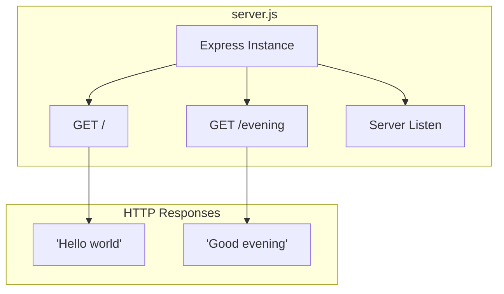
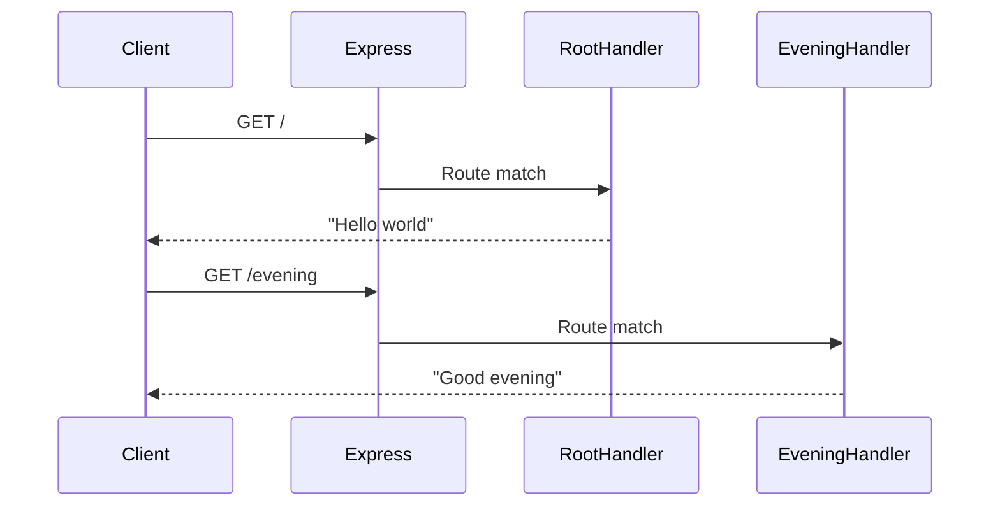
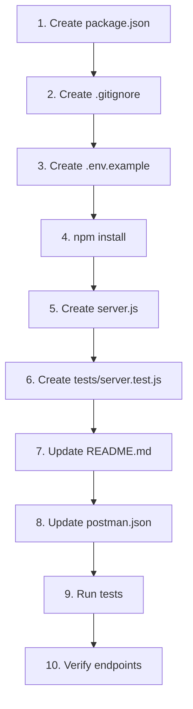

# Technical Specification

# 0. Agent Action Plan

## 0.1 Intent Clarification

### 0.1.1 Core Feature Objective

Based on the prompt, the Blitzy platform understands that the new feature requirement is to:

- **Add Express.js Framework**: Integrate the Express.js web framework into the existing repository to enable HTTP server functionality with robust routing capabilities
- **Create a "Good evening" Endpoint**: Implement a new HTTP endpoint that responds with the text "Good evening" when accessed
- **Establish Node.js Server Infrastructure**: Since the repository currently lacks Node.js server files, initialize a complete Node.js project with package management

**Implicit Requirements Detected:**

| Requirement | Inference Source | Technical Implication |
|-------------|------------------|----------------------|
| Node.js project initialization | No package.json exists in repository | Create package.json with project metadata and dependencies |
| HTTP module baseline | "Tutorial of node js server hosting one endpoint" | Basic HTTP server structure required before Express integration |
| Express.js routing setup | "Add expressjs into the project" | Configure Express application with route handlers |
| Multiple endpoints coexistence | "Hello world" + "Good evening" responses | Route differentiation via path or method |
| Development server capability | Tutorial nature of project | Server must be runnable for demonstration |

**Feature Dependencies and Prerequisites:**

- Node.js runtime (v18.x or higher for Express 5.x compatibility)
- npm package manager for dependency installation
- HTTP/HTTPS network port availability (typically port 3000)
- No existing dependencies to conflict with Express.js

### 0.1.2 Special Instructions and Constraints

**Architectural Requirements:**

- Follow standard Express.js application patterns with modular route definitions
- Maintain flat repository structure consistent with existing file organization
- Preserve existing tutorial files without modification
- Use ES Module or CommonJS syntax consistently throughout

**Integration Constraints:**

- New Node.js files must coexist with existing polyglot tutorial files (PHP, Java, C#, SQL, etc.)
- Server configuration should not conflict with existing Apache config (`apache.conf` uses port 80)
- Default to port 3000 for Express server to avoid port conflicts

**User Example (Preserved Exactly):**

> "this is a tutorial of node js server hosting one endpoint that returns the response 'Hello world'. Could you add expressjs into the project and add another endpoint that return the response of 'Good evening'?"

**Web Search Research Conducted:**

| Research Topic | Finding | Source |
|----------------|---------|--------|
| Express.js Latest Version | 5.1.0 (released October 2024) | npmjs.com |
| Express.js LTS Version | 4.21.x (stable, widely adopted) | expressjs.com |
| Node.js Requirement | Express 5.x requires Node.js 18+ | GitHub releases |
| Express.js API Pattern | `app.get(path, handler)` routing | Official documentation |

### 0.1.3 Technical Interpretation

These feature requirements translate to the following technical implementation strategy:

- **To initialize Node.js project**, we will **create** `package.json` with project metadata, scripts, and dependency declarations
- **To implement basic HTTP server**, we will **create** `server.js` with native http module serving "Hello world" response
- **To integrate Express.js**, we will **modify** `server.js` to use Express framework and **update** `package.json` with express dependency
- **To add "Good evening" endpoint**, we will **extend** `server.js` with additional route handler for the new endpoint
- **To ensure functionality**, we will **create** basic test structure and **update** documentation

**Technical Actions Mapping:**

| User Requirement | Technical Action | Target Component |
|------------------|------------------|------------------|
| "node js server hosting one endpoint" | Create HTTP server with GET endpoint | `server.js` |
| "returns the response 'Hello world'" | Implement route handler returning "Hello world" | `server.js` - root route (`/`) |
| "add expressjs into the project" | Install Express.js, refactor server | `package.json`, `server.js` |
| "another endpoint that return the response of 'Good evening'" | Add new GET route with response | `server.js` - evening route (`/evening`) |


## 0.2 Repository Scope Discovery

### 0.2.1 Comprehensive File Analysis

**Current Repository Structure:**

The repository contains 15 files organized in a flat structure at the root level. This is a polyglot test scaffold with no existing Node.js infrastructure.

| File | Type | Purpose | Impact on Feature |
|------|------|---------|-------------------|
| `README.md` | Documentation | Project overview | **MODIFY** - Add Node.js/Express documentation |
| `amazon_cloudformation.yaml` | Infrastructure | AWS resource definitions | No modification |
| `apache.conf` | Configuration | Apache web server config | No modification (uses port 80) |
| `cucumber.feature` | Test | BDD scenarios | No modification |
| `datadog.yaml` | Monitoring | Datadog agent config | No modification |
| `dotnet.cs` | Application | C# console sample | No modification |
| `dummy_qtest.csv` | Test | QTest test cases | No modification |
| `eclipse.xml` | IDE | Eclipse project config | No modification |
| `junit.java` | Test | JUnit test class | No modification |
| `maven.xml` | Build | Maven POM config | No modification |
| `mysql.sql` | Database | MySQL schema | No modification |
| `notion.md` | Documentation | Notion import sample | No modification |
| `oracle.sql` | Database | Oracle schema | No modification |
| `php.php` | Application | PHP script sample | No modification |
| `postman.json` | API Test | Postman collection | **MODIFY** - Add Express endpoint tests |
| `script.sh` | Utility | Bash diagnostic script | No modification |

**Integration Point Discovery:**

| Integration Type | Current State | Required Action |
|------------------|---------------|-----------------|
| API Endpoints | None (no server exists) | Create Express routes |
| Package Management | None (no package.json) | Initialize npm project |
| Server Entry Point | None | Create `server.js` |
| Test Framework | None for Node.js | Create test structure |
| Configuration | None for Node.js | Create `.env.example` |

### 0.2.2 New File Requirements

**New Source Files to Create:**

| File Path | Purpose | Description |
|-----------|---------|-------------|
| `package.json` | Dependency manifest | Node.js project configuration with Express.js dependency and npm scripts |
| `server.js` | Application entry point | Express.js server with "Hello world" and "Good evening" endpoints |
| `.env.example` | Environment template | Environment variable documentation (PORT, DB) |
| `.gitignore` | Git configuration | Ignore node_modules and environment files |

**New Test Files to Create:**

| File Path | Purpose | Coverage |
|-----------|---------|----------|
| `tests/server.test.js` | Unit/Integration tests | Test both endpoints for correct responses |

**New Configuration Files:**

| File Path | Purpose | Contents |
|-----------|---------|----------|
| `package.json` | npm configuration | Project metadata, dependencies (express), scripts |
| `.env.example` | Environment documentation | PORT=3000, DB (as provided by user) |
| `.gitignore` | Git ignore patterns | node_modules/, .env, *.log |

### 0.2.3 Web Search Research Conducted

| Research Area | Best Practice | Implementation Approach |
|---------------|---------------|------------------------|
| Express.js project structure | Minimal entry point with route handlers | Single `server.js` for tutorial simplicity |
| Node.js versioning | Use LTS versions for stability | Target Node.js 18+ compatibility |
| Express.js security | Use helmet, cors for production | Not required for tutorial project |
| API response patterns | JSON or plain text responses | Plain text for explicit user requirement |

### 0.2.4 Files Requiring Modification

**Existing Files to Update:**

| File | Modification Type | Specific Changes |
|------|-------------------|------------------|
| `README.md` | Content addition | Add Node.js server documentation, setup instructions, endpoint descriptions |
| `postman.json` | Collection extension | Add new request items for "Hello world" and "Good evening" endpoints |

**Pattern-Based File Discovery:**

```
Files to CREATE:
├── package.json          # New - npm project manifest
├── server.js             # New - Express application entry point
├── .env.example          # New - Environment variable template
├── .gitignore            # New - Git ignore rules
└── tests/
    └── server.test.js    # New - Endpoint tests

Files to MODIFY:
├── README.md             # Update - Add Express/Node.js documentation
└── postman.json          # Update - Add endpoint test requests
```


## 0.3 Dependency Inventory

### 0.3.1 Private and Public Packages

**Required Package Dependencies:**

| Registry | Package Name | Version | Purpose | Verification |
|----------|--------------|---------|---------|--------------|
| npmjs.com | express | ^4.21.2 | Web framework for HTTP routing and middleware | Verified - Latest stable 4.x release |
| npmjs.com (dev) | jest | ^29.7.0 | Testing framework for endpoint verification | Verified - Latest stable release |
| npmjs.com (dev) | supertest | ^7.0.0 | HTTP assertions for Express testing | Verified - Compatible with Jest |

**Runtime Requirements:**

| Component | Version | Source of Truth | Notes |
|-----------|---------|-----------------|-------|
| Node.js | ≥18.0.0 | Environment check (v20.19.6 installed) | Required for Express 4.x/5.x |
| npm | ≥8.0.0 | Environment check (v11.1.0 installed) | Package manager |

**User-Provided Environment Variables:**

| Variable | Purpose | Provided By |
|----------|---------|-------------|
| `DB` | Database connection (available in environment) | User configuration |

### 0.3.2 Dependency Configuration

**package.json Dependencies Block:**

```json
{
  "dependencies": {
    "express": "^4.21.2"
  },
  "devDependencies": {
    "jest": "^29.7.0",
    "supertest": "^7.0.0"
  }
}
```

**Dependency Justification:**

| Package | Justification | Alternative Considered |
|---------|---------------|----------------------|
| express | User explicitly requested ExpressJS integration | Native http module (less routing capability) |
| jest | Industry-standard testing framework | Mocha (more configuration required) |
| supertest | Seamless Express testing integration | node-fetch (manual server management) |

### 0.3.3 Import Updates

**Files Requiring Import Statements:**

| File | Import Type | Import Statement |
|------|-------------|------------------|
| `server.js` | CommonJS | `const express = require('express');` |
| `tests/server.test.js` | CommonJS | `const request = require('supertest');` |
| `tests/server.test.js` | CommonJS | `const app = require('../server');` |

**Import Transformation Rules:**

| Pattern | Old (N/A - New Project) | New |
|---------|-------------------------|-----|
| Express application | N/A | `const express = require('express');` |
| Express instance | N/A | `const app = express();` |
| Server export | N/A | `module.exports = app;` |

### 0.3.4 External Reference Updates

**Configuration Files to Update:**

| File Type | File Path | Update Required |
|-----------|-----------|-----------------|
| npm manifest | `package.json` | **CREATE** - Full project configuration |
| Git ignore | `.gitignore` | **CREATE** - node_modules exclusion |
| Environment | `.env.example` | **CREATE** - PORT, DB documentation |
| Postman | `postman.json` | **MODIFY** - Add endpoint tests |

**package.json Full Specification:**

```json
{
  "name": "repo-test-sud",
  "version": "1.0.0",
  "description": "Node.js Express server tutorial",
  "main": "server.js",
  "scripts": {
    "start": "node server.js",
    "test": "jest"
  },
  "engines": {
    "node": ">=18.0.0"
  }
}
```


## 0.4 Integration Analysis

### 0.4.1 Existing Code Touchpoints

**Direct Modifications Required:**

| File | Modification | Location | Purpose |
|------|--------------|----------|---------|
| `README.md` | Add content section | End of file | Document Node.js server setup and endpoints |
| `postman.json` | Add request items | `item` array | Include endpoint test definitions |

**README.md Integration Points:**

```
## Node.js Express Server

#### Setup
npm install
npm start

#### Endpoints
- GET / - Returns "Hello world"
- GET /evening - Returns "Good evening"
```

**postman.json Integration Points:**

The existing Postman collection contains one GET request. Two new requests will be added:

| Request Name | Method | URL | Expected Response |
|--------------|--------|-----|-------------------|
| Hello World Endpoint | GET | `http://localhost:3000/` | "Hello world" |
| Good Evening Endpoint | GET | `http://localhost:3000/evening` | "Good evening" |

### 0.4.2 New Component Integration

**Express Application Architecture:**



**Component Integration Flow:**

| Step | Component | Action | Dependency |
|------|-----------|--------|------------|
| 1 | `package.json` | Initialize project | None |
| 2 | `npm install` | Install Express | package.json |
| 3 | `server.js` | Import Express | express module |
| 4 | `server.js` | Create app instance | Express import |
| 5 | `server.js` | Define routes | App instance |
| 6 | `server.js` | Start server | Routes defined |

### 0.4.3 Endpoint Route Specification

**Route Definitions:**

| Route | Method | Handler Function | Response |
|-------|--------|------------------|----------|
| `/` | GET | Root handler | `res.send('Hello world')` |
| `/evening` | GET | Evening handler | `res.send('Good evening')` |

**Request-Response Flow:**



### 0.4.4 Environment Integration

**Environment Variable Mapping:**

| Variable | Source | Default | Usage |
|----------|--------|---------|-------|
| `PORT` | `.env` or environment | 3000 | Server listening port |
| `DB` | User-provided (in environment) | N/A | Database connection (available for future use) |

**Configuration Hierarchy:**

```
Environment Variables (highest priority)
    ↓
.env file
    ↓
Default values in code (PORT=3000)
```

### 0.4.5 Testing Integration

**Test Coverage Strategy:**

| Test Type | File | Coverage |
|-----------|------|----------|
| Unit/Integration | `tests/server.test.js` | Both endpoints |

**Test Assertions:**

| Endpoint | Assertion | Expected |
|----------|-----------|----------|
| `GET /` | Status code | 200 |
| `GET /` | Response body | "Hello world" |
| `GET /evening` | Status code | 200 |
| `GET /evening` | Response body | "Good evening" |


## 0.5 Technical Implementation

### 0.5.1 File-by-File Execution Plan

**CRITICAL: Every file listed below MUST be created or modified**

**Group 1 - Project Initialization Files:**

| Action | File Path | Purpose |
|--------|-----------|---------|
| CREATE | `package.json` | npm project manifest with Express dependency and scripts |
| CREATE | `.gitignore` | Exclude node_modules, .env, logs from version control |
| CREATE | `.env.example` | Document required environment variables (PORT, DB) |

**Group 2 - Core Application Files:**

| Action | File Path | Purpose |
|--------|-----------|---------|
| CREATE | `server.js` | Express application with "Hello world" (/) and "Good evening" (/evening) endpoints |

**Group 3 - Testing Files:**

| Action | File Path | Purpose |
|--------|-----------|---------|
| CREATE | `tests/server.test.js` | Jest test suite for endpoint verification |

**Group 4 - Documentation and API Testing:**

| Action | File Path | Purpose |
|--------|-----------|---------|
| MODIFY | `README.md` | Add Node.js/Express setup instructions and endpoint documentation |
| MODIFY | `postman.json` | Add new endpoint request definitions for testing |

### 0.5.2 Implementation Approach per File

**package.json - Project Manifest**

Purpose: Define Node.js project configuration and dependencies

```json
{
  "name": "repo-test-sud",
  "version": "1.0.0",
  "main": "server.js"
}
```

Key elements:
- Project name and version
- Entry point specification
- Express dependency declaration
- npm scripts for start and test

---

**server.js - Express Application**

Purpose: HTTP server with two GET endpoints

```javascript
const express = require('express');
const app = express();
```

Route implementations:
- Root route (`/`) returns "Hello world"
- Evening route (`/evening`) returns "Good evening"
- Server listens on PORT environment variable or default 3000

---

**.gitignore - Version Control Configuration**

Purpose: Exclude build artifacts and sensitive files

```
node_modules/
.env
```

Patterns:
- `node_modules/` - npm packages
- `.env` - environment secrets
- `*.log` - log files

---

**.env.example - Environment Template**

Purpose: Document required environment variables

```
PORT=3000
DB=
```

Variables documented:
- PORT - Server listening port
- DB - Database connection (user-provided)

---

**tests/server.test.js - Endpoint Tests**

Purpose: Verify endpoint responses

```javascript
const request = require('supertest');
const app = require('../server');
```

Test cases:
- GET / returns 200 with "Hello world"
- GET /evening returns 200 with "Good evening"

---

**README.md - Documentation Update**

Purpose: Add Express server documentation

Additions:
- Node.js Express Server section
- Installation instructions
- Endpoint documentation table
- Usage examples

---

**postman.json - API Collection Update**

Purpose: Add endpoint test requests

New requests:
- "Hello World Endpoint" - GET http://localhost:3000/
- "Good Evening Endpoint" - GET http://localhost:3000/evening

### 0.5.3 Implementation Sequence



**Implementation Order Justification:**

| Step | File | Reason for Order |
|------|------|------------------|
| 1 | `package.json` | Required before npm install |
| 2 | `.gitignore` | Prevent node_modules commit |
| 3 | `.env.example` | Document configuration before server |
| 4 | npm install | Install dependencies |
| 5 | `server.js` | Core application logic |
| 6 | `tests/server.test.js` | Validate implementation |
| 7 | `README.md` | Document completed feature |
| 8 | `postman.json` | Enable manual testing |
| 9-10 | Verification | Ensure correctness |


## 0.6 Scope Boundaries

### 0.6.1 Exhaustively In Scope

**All Feature Source Files:**

| File Pattern | Files Included | Action |
|--------------|----------------|--------|
| `server.js` | Express application entry point | CREATE |
| `package.json` | npm project manifest | CREATE |
| `.gitignore` | Git ignore configuration | CREATE |
| `.env.example` | Environment documentation | CREATE |

**All Feature Test Files:**

| File Pattern | Files Included | Action |
|--------------|----------------|--------|
| `tests/*.js` | `tests/server.test.js` | CREATE |

**Integration Points:**

| File | Specific Scope | Action |
|------|----------------|--------|
| `README.md` | Add "Node.js Express Server" section at end of file | MODIFY |
| `postman.json` | Add items to `item` array for endpoint testing | MODIFY |

**Configuration Files:**

| File | Purpose | Action |
|------|---------|--------|
| `package.json` | Define dependencies (express), scripts (start, test), engines (node >=18) | CREATE |
| `.env.example` | Document PORT=3000 and DB environment variables | CREATE |
| `.gitignore` | Exclude node_modules/, .env, *.log | CREATE |

**Documentation:**

| File | Section | Content |
|------|---------|---------|
| `README.md` | Node.js Express Server | Setup instructions, endpoint documentation |

**Endpoint Definitions:**

| Route | Method | Response | Status |
|-------|--------|----------|--------|
| `/` | GET | "Hello world" | In scope |
| `/evening` | GET | "Good evening" | In scope |

### 0.6.2 Explicitly Out of Scope

**Unrelated Features or Modules:**

| File | Reason for Exclusion |
|------|---------------------|
| `amazon_cloudformation.yaml` | AWS infrastructure - unrelated to Node.js server |
| `apache.conf` | Apache configuration - different web server |
| `datadog.yaml` | Monitoring configuration - not required for tutorial |
| `dotnet.cs` | C# code sample - different technology |
| `cucumber.feature` | BDD tests - not related to Express endpoints |
| `dummy_qtest.csv` | QTest fixtures - unrelated test format |
| `eclipse.xml` | Eclipse IDE config - not applicable to Node.js |
| `junit.java` | Java tests - different language |
| `maven.xml` | Maven build config - Java ecosystem |
| `mysql.sql` | MySQL schema - database not utilized |
| `notion.md` | Notion documentation - unrelated |
| `oracle.sql` | Oracle schema - database not utilized |
| `php.php` | PHP code sample - different technology |
| `script.sh` | Bash utility - not related to feature |

**Performance Optimizations Beyond Feature Requirements:**

| Optimization | Status | Reason |
|--------------|--------|--------|
| Load balancing | OUT OF SCOPE | Tutorial project only |
| Caching headers | OUT OF SCOPE | Not specified in requirements |
| Compression middleware | OUT OF SCOPE | Not specified in requirements |
| HTTPS/TLS | OUT OF SCOPE | Tutorial uses HTTP only |
| Rate limiting | OUT OF SCOPE | Not specified in requirements |

**Refactoring of Existing Code:**

| Category | Status | Reason |
|----------|--------|--------|
| Existing polyglot files | OUT OF SCOPE | User only requested Node.js addition |
| Repository reorganization | OUT OF SCOPE | Maintain flat structure |
| Legacy file updates | OUT OF SCOPE | No impact from feature |

**Additional Features Not Specified:**

| Feature | Status | Reason |
|---------|--------|--------|
| Database integration | OUT OF SCOPE | DB variable provided but usage not specified |
| Authentication | OUT OF SCOPE | Not mentioned in requirements |
| Additional endpoints | OUT OF SCOPE | Only "/" and "/evening" requested |
| Frontend/views | OUT OF SCOPE | Plain text responses only |
| WebSocket support | OUT OF SCOPE | HTTP endpoints only |
| API versioning | OUT OF SCOPE | Tutorial simplicity |

### 0.6.3 Scope Summary Matrix

| Category | In Scope | Out of Scope |
|----------|----------|--------------|
| **Files to Create** | server.js, package.json, .gitignore, .env.example, tests/server.test.js | Any other new files |
| **Files to Modify** | README.md, postman.json | All other existing files |
| **Endpoints** | GET /, GET /evening | Any additional routes |
| **Dependencies** | express, jest, supertest | Database drivers, authentication, etc. |
| **Testing** | Endpoint response tests | E2E, load, security testing |
| **Documentation** | README additions, Postman updates | External documentation, wiki |


## 0.7 Special Instructions

### 0.7.1 Feature-Specific Requirements

**User-Emphasized Directives:**

| Directive | Source | Implementation |
|-----------|--------|----------------|
| "add expressjs into the project" | User request | Use Express.js framework, not native http module |
| "return the response 'Hello world'" | User request | Exact string "Hello world" (text/plain) |
| "return the response of 'Good evening'" | User request | Exact string "Good evening" (text/plain) |
| Tutorial nature | User context | Keep implementation simple and educational |

**Response Format Requirements:**

| Endpoint | Response Type | Exact Content |
|----------|---------------|---------------|
| GET / | text/plain | `Hello world` |
| GET /evening | text/plain | `Good evening` |

### 0.7.2 Patterns and Conventions

**Express.js Application Pattern:**

The implementation must follow standard Express.js patterns:

```javascript
const app = express();
app.get('/', (req, res) => res.send('...'));
app.listen(PORT);
```

**File Naming Conventions:**

| Type | Convention | Example |
|------|------------|---------|
| Entry point | lowercase | `server.js` |
| Tests | .test.js suffix | `server.test.js` |
| Config | lowercase with extensions | `package.json`, `.env.example` |

**Code Style Requirements:**

| Aspect | Requirement |
|--------|-------------|
| Module system | CommonJS (`require`/`module.exports`) |
| Quotes | Single quotes preferred |
| Semicolons | Required |
| Indentation | 2 spaces |

### 0.7.3 Integration Requirements

**Coexistence with Existing Files:**

| Requirement | Implementation |
|-------------|----------------|
| Port conflict avoidance | Use port 3000 (Apache uses 80) |
| Flat structure | All files at repository root |
| No modifications to unrelated files | Only touch README.md and postman.json |

**Environment Variable Usage:**

| Variable | Usage Pattern |
|----------|---------------|
| PORT | `process.env.PORT \|\| 3000` |
| DB | Available in environment (user-provided) |

### 0.7.4 Quality Requirements

**Testing Mandates:**

| Requirement | Implementation |
|-------------|----------------|
| Test framework | Jest |
| HTTP testing | Supertest |
| Coverage | Both endpoints tested |
| Assertions | Status code + response body |

**Documentation Requirements:**

| Document | Required Additions |
|----------|--------------------|
| README.md | Setup steps, endpoint table, usage examples |
| postman.json | Request definitions for both endpoints |
| .env.example | All environment variables documented |

### 0.7.5 Verification Checklist

**Pre-Completion Verification:**

| Check | Criteria | Pass Condition |
|-------|----------|----------------|
| npm install | No errors | Exit code 0 |
| npm start | Server starts | Listening on port 3000 |
| GET / | Returns correct response | "Hello world" with 200 status |
| GET /evening | Returns correct response | "Good evening" with 200 status |
| npm test | All tests pass | Exit code 0 |

**Post-Implementation Validation Commands:**

```bash
# Install dependencies
npm install

#### Start server (background)
npm start &

#### Test endpoints
curl http://localhost:3000/
curl http://localhost:3000/evening

#### Run automated tests
npm test
```

### 0.7.6 Environment Setup Summary

**Runtime Environment:**

| Component | Version | Status |
|-----------|---------|--------|
| Node.js | v20.19.6 | ✓ Available |
| npm | v11.1.0 | ✓ Available |

**Dependencies to Install:**

| Package | Version | Registry |
|---------|---------|----------|
| express | ^4.21.2 | npmjs.com |
| jest | ^29.7.0 | npmjs.com (dev) |
| supertest | ^7.0.0 | npmjs.com (dev) |

**User-Provided Configuration:**

| Variable | Availability |
|----------|--------------|
| DB | In environment |


