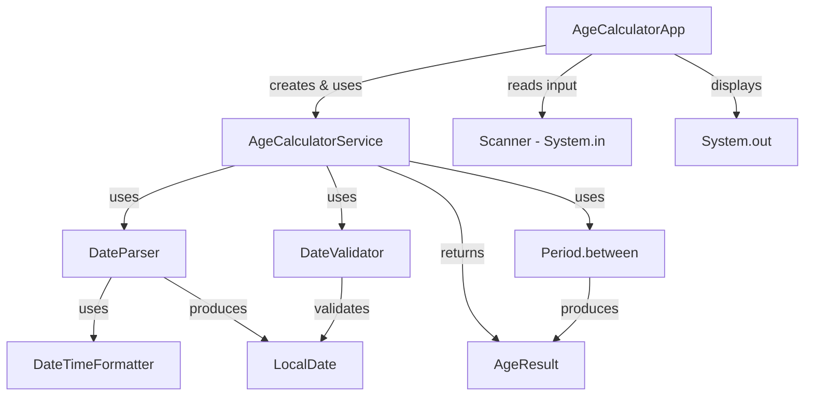

# Technical Specification

# 0. Agent Action Plan

## 0.1 Intent Clarification

### 0.1.1 Core Objective

Based on the provided requirements, the Blitzy platform understands that the objective is to **develop a greenfield Java console application** — an Age Calculator — that computes a user's exact age in years, months, and days from their entered Date of Birth (DOB). The application will be built from scratch within an existing, essentially empty repository (`21stgitOLDOne`) that currently contains only a `README.md` placeholder file.

The requirements translate to the following discrete deliverables:

- **Console-based user input**: Accept Date of Birth as a string in the exact format `DD/MM/YYYY` via standard input (`System.in`)
- **System date retrieval**: Automatically obtain the current date using `java.time.LocalDate.now()` with no user intervention
- **Precise age computation**: Calculate the elapsed time between DOB and the current date, decomposed into exact years, months, and days using `java.time.Period.between()`
- **Formatted output**: Display the result in the exact format: `Your age is X years, Y months, and Z days.`
- **Robust input validation**:
  - Reject future dates (DOB after the current system date)
  - Reject structurally invalid dates (e.g., `31/02/2020`, `00/13/1999`, non-numeric input)
  - Display meaningful, user-friendly error messages for each type of incorrect input
- **Object-Oriented Design**: Structure the application using OOP principles including encapsulation, separation of concerns, and clean class design
- **Exception handling**: Implement `try-catch` blocks to gracefully handle `DateTimeParseException`, `IllegalArgumentException`, and any other runtime errors

**Implicit requirements detected:**
- The repository requires a complete Java project structure to be created (source directories, package hierarchy)
- The `README.md` must be updated to document the new application
- The `DD/MM/YYYY` format requires a custom `DateTimeFormatter` using the pattern `"dd/MM/yyyy"` since Java's default `LocalDate.parse()` uses `ISO_LOCAL_DATE` (`yyyy-MM-dd`)
- Resource management for `Scanner` objects used for console input (proper closing)
- Edge case handling for leap year dates (e.g., `29/02/2000` is valid but `29/02/1900` is not)

### 0.1.2 Task Categorization

- **Primary task type**: New Product / Greenfield Development
- **Secondary aspects**: Console Application, Date/Time Computation, Input Validation
- **Scope classification**: Isolated change — a self-contained console application with no external integrations, no database, no network calls, and no dependency on external services

### 0.1.3 Special Instructions and Constraints

The user has specified the following explicit technical directives:

- **Mandatory Java APIs**:
  - `java.time.LocalDate` — for representing dates without time zones
  - `java.time.Period` — for calculating the difference between two dates in years, months, and days
  - `java.time.format.DateTimeFormatter` — for parsing the `DD/MM/YYYY` input format
- **Mandatory design principles**:
  - Object-Oriented Programming principles (encapsulation, separation of concerns, clean class hierarchy)
  - Proper exception handling using `try-catch` blocks
  - Clean and readable coding standards (meaningful variable names, consistent formatting, comments)
- **Input format constraint**: Dates must be entered in `DD/MM/YYYY` format exclusively
- **Output format constraint**: Results must be displayed as: `Your age is X years, Y months, and Z days.`

### 0.1.4 Technical Interpretation

These requirements translate to the following technical implementation strategy:

- To **accept and parse user input**, we will create a dedicated input handler class that reads from `System.in` using `java.util.Scanner` and parses the string using `DateTimeFormatter.ofPattern("dd/MM/yyyy")` with strict resolver style
- To **validate the date of birth**, we will implement validation logic that checks for `DateTimeParseException` (malformed input) and compares the parsed `LocalDate` against `LocalDate.now()` to reject future dates
- To **calculate exact age**, we will use `Period.between(dateOfBirth, LocalDate.now())` and extract years, months, and days via `getYears()`, `getMonths()`, and `getDays()`
- To **display the result**, we will format the output string using `String.format()` or `System.out.printf()` to produce the exact required output pattern
- To **follow OOP principles**, we will separate the application into distinct classes: a main entry point class, an age calculator service class, and a date input validator class, each with single responsibility
- To **handle exceptions gracefully**, we will wrap date parsing and validation in `try-catch` blocks catching `DateTimeParseException` and `IllegalArgumentException`, providing clear error messages to guide the user

## 0.2 Repository Scope Discovery

### 0.2.1 Comprehensive File Analysis

The repository `21stgitOLDOne` is a **greenfield project** containing no existing source code, build configuration, or project structure. The complete current repository state is:

| Path | Type | Content | Status |
|------|------|---------|--------|
| `README.md` | File | Contains only `# 21stgitOLDOne` (single heading, ~20 bytes) | Exists — requires update |

**No existing files match any standard search patterns:**
- Source code: No `src/**/*.*`, `lib/**/*.*`, `app/**/*.*`, `**/*.java` files exist
- Configuration: No `**/*.config.*`, `**/*.json`, `**/*.yaml`, `**/*.toml`, `**/*.xml`, `.env*` files exist
- Build/Deploy: No `Dockerfile*`, `docker-compose*`, `.github/workflows/*`, `Makefile*`, `pom.xml`, `build.gradle` exist
- Tests: No `tests/**/*.*`, `**/*test*.*`, `**/*spec*.*` exist
- Scripts: No `scripts/**/*.*`, `bin/**/*.*`, `tools/**/*.*` exist
- Documentation: Only `README.md` exists; no `docs/**/*.*`, `CONTRIBUTING*`, `**/*.rst` files

Since this is a greenfield project, **all files must be created from scratch**. The file transformation plan must account for establishing the full Java project structure, source code, and documentation.

### 0.2.2 Web Search Research Conducted

The following research was conducted to inform the implementation approach:

- **Java age calculation best practices**: Confirmed that `Period.between(birthDate, currentDate)` is the idiomatic Java 8+ approach, returning a `Period` object from which `getYears()`, `getMonths()`, and `getDays()` extract the decomposed age. The `Period` class correctly handles leap years and varying month lengths.
- **DateTimeFormatter with DD/MM/YYYY pattern**: The custom pattern `"dd/MM/yyyy"` must be used with `DateTimeFormatter.ofPattern()`. Using `ResolverStyle.STRICT` is recommended for robust validation that rejects dates like `31/02/2020`. By default, `ResolverStyle.SMART` is used which may silently adjust invalid dates.
- **Input validation for Java date parsing**: `DateTimeParseException` is thrown when input does not match the expected pattern or resolves to an invalid calendar date. Wrapping `LocalDate.parse(input, formatter)` in a `try-catch` block is the standard approach.
- **Java console application OOP structure**: Best practice for console Java applications includes separating the main entry point from business logic classes, using encapsulation with private fields and public methods, and maintaining single-responsibility principle across classes.
- **Future date validation**: Comparing `parsedDate.isAfter(LocalDate.now())` is the standard mechanism to detect and reject future dates.

### 0.2.3 Existing Infrastructure Assessment

- **Current project structure**: Flat — single `README.md` at repository root with no subdirectories
- **Existing patterns and conventions**: None established — the project has no code history to derive patterns from
- **Build and deployment configurations**: None present — a standard Java source directory structure (`src/main/java/...`) and direct `javac` compilation will be established
- **Testing infrastructure**: None present — unit tests will be created following standard Java conventions
- **Documentation system**: Only a bare `README.md` — will be expanded to document the Age Calculator application, build instructions, and usage examples
- **Java runtime**: OpenJDK 17.0.18 installed and verified (supports all required `java.time` APIs introduced in Java 8)

## 0.3 Scope Boundaries

### 0.3.1 Exhaustively In Scope

- **Source code (new creation)**:
  - `src/main/java/com/agecalculator/AgeCalculatorApp.java` — Main application entry point with `main()` method
  - `src/main/java/com/agecalculator/service/AgeCalculatorService.java` — Core age calculation business logic
  - `src/main/java/com/agecalculator/util/DateValidator.java` — Date input validation utility
  - `src/main/java/com/agecalculator/util/DateParser.java` — Date parsing from string input with DD/MM/YYYY formatter
  - `src/main/java/com/agecalculator/model/AgeResult.java` — Model class encapsulating years, months, days result

- **Test code (new creation)**:
  - `src/test/java/com/agecalculator/service/AgeCalculatorServiceTest.java` — Unit tests for age calculation logic
  - `src/test/java/com/agecalculator/util/DateValidatorTest.java` — Unit tests for date validation
  - `src/test/java/com/agecalculator/util/DateParserTest.java` — Unit tests for date parsing

- **Documentation (update and new creation)**:
  - `README.md` — Update with project description, build/run instructions, usage examples
  - `docs/USAGE.md` — Detailed usage documentation with examples

- **Configuration (new creation)**:
  - `.gitignore` — Java-specific gitignore patterns (`.class`, `*.jar`, `out/`, `build/`, `target/`)

### 0.3.2 Explicitly Out of Scope

- **GUI or web interface**: The application is strictly a console-based program; no Swing, JavaFX, or web UI is required
- **Database or persistent storage**: No data persistence; the application is a stateless single-execution tool
- **Build tool integration**: No Maven (`pom.xml`) or Gradle (`build.gradle`) is explicitly required — the project uses direct `javac` compilation; however, a simple compilation script may be provided for convenience
- **External library dependencies**: The application uses only Java Standard Library APIs (`java.time.*`, `java.util.Scanner`); no third-party JARs are needed
- **Localization or timezone handling**: The application uses the system default timezone via `LocalDate.now()`; multi-timezone support is not required
- **CI/CD pipeline configuration**: No `.github/workflows/`, Jenkins, or other CI/CD configuration is part of this scope
- **Containerization**: No `Dockerfile` or `docker-compose` configuration is required
- **Performance optimization**: The application is a simple single-user tool; no performance tuning or benchmarking is necessary
- **Security enhancements beyond input validation**: No authentication, authorization, or encryption is needed
- **Age calculation in hours, minutes, or seconds**: Only years, months, and days are required per the specification

## 0.4 Dependency Inventory

### 0.4.1 Key Private and Public Packages

This application is designed as a **zero-external-dependency project** using only the Java Standard Library. All required functionality is provided by built-in JDK packages.

| Registry | Package Name | Version | Purpose |
|----------|-------------|---------|---------|
| JDK (built-in) | `java.time.LocalDate` | JDK 17 (17.0.18) | Immutable date representation without time or timezone for DOB and current date |
| JDK (built-in) | `java.time.Period` | JDK 17 (17.0.18) | Calculate the difference between two `LocalDate` instances in years, months, and days |
| JDK (built-in) | `java.time.format.DateTimeFormatter` | JDK 17 (17.0.18) | Parse date strings in custom `DD/MM/YYYY` format into `LocalDate` objects |
| JDK (built-in) | `java.time.format.DateTimeParseException` | JDK 17 (17.0.18) | Exception thrown when a date string cannot be parsed by the formatter |
| JDK (built-in) | `java.time.format.ResolverStyle` | JDK 17 (17.0.18) | Strict date resolution to reject invalid calendar dates like `31/02/2020` |
| JDK (built-in) | `java.util.Scanner` | JDK 17 (17.0.18) | Read user input from the console (`System.in`) |

### 0.4.2 Runtime Environment

| Component | Version | Source | Notes |
|-----------|---------|--------|-------|
| OpenJDK | 17.0.18 | `apt` (openjdk-17-jdk-headless) | LTS release; installed and verified in environment |
| Java Compiler (`javac`) | 17.0.18 | Bundled with OpenJDK 17 | Used for direct source compilation |

### 0.4.3 Dependency Updates

- **New dependencies to add**: None — this is a greenfield project with no existing dependencies, and the application relies exclusively on the Java Standard Library
- **Dependencies to update**: Not applicable — no prior dependencies exist
- **Dependencies to remove**: Not applicable — no prior dependencies exist
- **Import/Reference Updates**: Not applicable — all imports will be established fresh in newly created source files

## 0.5 Implementation Design

### 0.5.1 Technical Approach

**Primary objectives with implementation approach:**

- Achieve **user input capture** by creating an `AgeCalculatorApp` entry-point class that instantiates a `Scanner` on `System.in`, prompts for DOB, and delegates processing to service classes
- Achieve **date parsing and validation** by creating a `DateParser` utility that wraps `DateTimeFormatter.ofPattern("dd/MM/yyyy")` with `ResolverStyle.STRICT` to reject malformed and calendar-invalid dates, and a `DateValidator` that enforces business rules such as no future dates
- Achieve **precise age computation** by creating an `AgeCalculatorService` class that accepts a `LocalDate` DOB, calls `Period.between(dob, LocalDate.now())`, and returns an `AgeResult` model containing years, months, and days
- Achieve **formatted output** by encapsulating the result in an `AgeResult` model with a `toString()` method that returns the exact format `Your age is X years, Y months, and Z days.`
- Achieve **robust error handling** by wrapping all date parsing in `try-catch` blocks catching `DateTimeParseException` and using conditional checks with `isAfter()` for future-date validation, displaying clear error messages to guide the user

**Logical implementation flow:**

- First, establish the **project directory structure** by creating the standard Java source layout (`src/main/java/com/agecalculator/...`) and package hierarchy
- Next, implement the **model layer** by creating the `AgeResult` class that encapsulates the years, months, and days output
- Then, implement the **utility layer** by creating `DateParser` (string-to-`LocalDate` conversion with format enforcement) and `DateValidator` (business rule validation including future-date rejection)
- Then, implement the **service layer** by creating `AgeCalculatorService` that orchestrates parsing, validation, and age computation
- Then, implement the **application entry point** by creating `AgeCalculatorApp` with the `main()` method that handles user interaction via `Scanner`, invokes the service, and displays results
- Finally, ensure **quality and correctness** by creating unit tests covering valid dates, invalid formats, future dates, leap years, and edge cases

### 0.5.2 Component Impact Analysis

**Direct modifications required:**
- `README.md`: Transform from a bare placeholder to comprehensive project documentation including build instructions, usage examples, and project description

**New components introduction:**

- `AgeCalculatorApp` (Entry Point): Main class with `main()` method; responsible for console I/O and orchestrating the user interaction loop. Rationale: separates presentation concerns from business logic
- `AgeCalculatorService` (Service): Core business logic for age calculation using `Period.between()`. Rationale: single-responsibility principle — encapsulates the calculation algorithm independently of I/O
- `AgeResult` (Model): Immutable data class holding years, months, days with `toString()` producing the required output format. Rationale: encapsulation of result data and formatted output in one cohesive object
- `DateParser` (Utility): Parses `DD/MM/YYYY` strings into `LocalDate` using strict `DateTimeFormatter`. Rationale: isolates date format handling for reuse and testability
- `DateValidator` (Utility): Validates parsed dates against business rules (no future dates, reasonable date ranges). Rationale: separates validation logic from parsing logic for clarity

**Component relationship diagram:**

```mermaid
graph TD
    A[AgeCalculatorApp] -->|creates & uses| B[AgeCalculatorService]
    A -->|reads input| C[Scanner - System.in]
    A -->|displays| D[System.out]
    B -->|uses| E[DateParser]
    B -->|uses| F[DateValidator]
    B -->|returns| G[AgeResult]
    E -->|uses| H[DateTimeFormatter]
    E -->|produces| I[LocalDate]
    F -->|validates| I
    B -->|uses| J[Period.between]
    J -->|produces| G
```

### 0.5.3 Critical Implementation Details

**Design patterns employed:**
- **Service Pattern**: `AgeCalculatorService` encapsulates business logic behind a clean public API
- **Value Object Pattern**: `AgeResult` is an immutable data carrier with no identity beyond its values
- **Utility Class Pattern**: `DateParser` and `DateValidator` provide stateless helper methods

**Key algorithms:**
- **Age calculation**: `Period.between(dob, LocalDate.now())` — the `Period` class internally handles month-length variations, leap years, and day carry-over to produce accurate year/month/day decomposition
- **Date parsing**: `DateTimeFormatter.ofPattern("dd/MM/yyyy").withResolverStyle(ResolverStyle.STRICT)` — strict resolution ensures that `31/02/2020` throws a `DateTimeParseException` instead of silently adjusting to a valid date

**Error handling and edge cases:**
- `DateTimeParseException` — caught when input does not match `DD/MM/YYYY` pattern or resolves to an invalid calendar date
- Future date check — `parsedDate.isAfter(LocalDate.now())` rejects dates beyond today
- Empty or null input — handled before parsing with a direct string check
- Leap year edge case — `29/02/2000` is valid (leap year), `29/02/1900` is invalid (not a leap year despite being divisible by 100); the strict `DateTimeFormatter` handles this correctly
- Same-day birth — `Period.between()` returns `0 years, 0 months, 0 days` for today's date, which is valid output

## 0.6 File Transformation Mapping

### 0.6.1 File-by-File Execution Plan

| Target File | Transformation | Source File/Reference | Purpose/Changes |
|-------------|----------------|----------------------|-----------------|
| `src/main/java/com/agecalculator/AgeCalculatorApp.java` | CREATE | N/A (new file) | Main entry point class with `main()` method; handles console input via `Scanner`, invokes `AgeCalculatorService`, displays results or error messages |
| `src/main/java/com/agecalculator/service/AgeCalculatorService.java` | CREATE | N/A (new file) | Core business logic class; orchestrates date parsing, validation, and age computation using `Period.between()` |
| `src/main/java/com/agecalculator/model/AgeResult.java` | CREATE | N/A (new file) | Immutable model class encapsulating years, months, days; includes `toString()` returning `Your age is X years, Y months, and Z days.` |
| `src/main/java/com/agecalculator/util/DateParser.java` | CREATE | N/A (new file) | Utility class for parsing `DD/MM/YYYY` strings to `LocalDate` using `DateTimeFormatter` with strict resolver |
| `src/main/java/com/agecalculator/util/DateValidator.java` | CREATE | N/A (new file) | Utility class for validating parsed dates (no future dates, reasonable range checks) |
| `src/test/java/com/agecalculator/service/AgeCalculatorServiceTest.java` | CREATE | N/A (new file) | Unit tests for `AgeCalculatorService` covering valid calculations, leap years, same-day birth, edge cases |
| `src/test/java/com/agecalculator/util/DateValidatorTest.java` | CREATE | N/A (new file) | Unit tests for `DateValidator` covering future dates, null/empty input, boundary dates |
| `src/test/java/com/agecalculator/util/DateParserTest.java` | CREATE | N/A (new file) | Unit tests for `DateParser` covering valid formats, invalid formats, invalid calendar dates |
| `README.md` | UPDATE | `README.md` | Update from bare placeholder to full project documentation with description, build/run instructions, usage examples |
| `.gitignore` | CREATE | N/A (new file) | Java-specific gitignore patterns for compiled classes, IDE files, and build artifacts |
| `docs/USAGE.md` | CREATE | N/A (new file) | Detailed usage documentation with input/output examples and error scenarios |

### 0.6.2 New Files Detail

- **`src/main/java/com/agecalculator/AgeCalculatorApp.java`** — Application entry point
  - Content type: Source code (Java)
  - Based on: Standard Java console application pattern
  - Key methods: `main(String[] args)` — prompts user, reads DOB input via `Scanner`, invokes service, prints result or error

- **`src/main/java/com/agecalculator/service/AgeCalculatorService.java`** — Age calculation service
  - Content type: Source code (Java)
  - Based on: Service pattern for business logic encapsulation
  - Key methods: `calculateAge(String dobString)` — parses, validates, computes, returns `AgeResult`; `calculateAge(LocalDate dob)` — computes age from a pre-parsed `LocalDate`

- **`src/main/java/com/agecalculator/model/AgeResult.java`** — Result model
  - Content type: Source code (Java)
  - Based on: Value Object / immutable data class pattern
  - Key elements: Private final fields (`years`, `months`, `days`), constructor, getters, `toString()` producing `Your age is X years, Y months, and Z days.`

- **`src/main/java/com/agecalculator/util/DateParser.java`** — Date parsing utility
  - Content type: Source code (Java)
  - Based on: Utility class pattern
  - Key elements: Static `DateTimeFormatter` constant with `dd/MM/yyyy` pattern and `ResolverStyle.STRICT`; method `parse(String dateString)` returning `LocalDate`

- **`src/main/java/com/agecalculator/util/DateValidator.java`** — Date validation utility
  - Content type: Source code (Java)
  - Based on: Utility class pattern
  - Key elements: Method `validate(LocalDate date)` checking against `LocalDate.now()`; method `isNotFutureDate(LocalDate date)` returning boolean

- **`src/test/java/com/agecalculator/service/AgeCalculatorServiceTest.java`** — Service tests
  - Content type: Test code (Java)
  - Key test cases: Valid DOB calculation, leap year DOB (29/02/2000), same-day birth, boundary month/day transitions

- **`src/test/java/com/agecalculator/util/DateValidatorTest.java`** — Validator tests
  - Content type: Test code (Java)
  - Key test cases: Future date rejection, today's date acceptance, past date acceptance

- **`src/test/java/com/agecalculator/util/DateParserTest.java`** — Parser tests
  - Content type: Test code (Java)
  - Key test cases: Valid `DD/MM/YYYY` parsing, invalid format rejection (e.g., `2020-01-01`), invalid calendar date rejection (e.g., `31/02/2020`), empty string handling

- **`.gitignore`** — Version control exclusions
  - Content type: Configuration
  - Key patterns: `*.class`, `*.jar`, `*.war`, `out/`, `build/`, `target/`, `.idea/`, `*.iml`, `.vscode/`, `.DS_Store`

- **`docs/USAGE.md`** — Usage documentation
  - Content type: Documentation (Markdown)
  - Key sections: Prerequisites, How to compile, How to run, Example input/output, Error scenarios

### 0.6.3 Files to Modify Detail

- **`README.md`** — Transform from placeholder to project documentation
  - Sections to update: Replace the single `# 21stgitOLDOne` heading entirely
  - New content to add: Project title and description, features list, prerequisites (Java 17+), build and run instructions (`javac` and `java` commands), usage examples with sample input/output, project structure overview
  - Content to remove: The bare `# 21stgitOLDOne` heading (to be replaced with the new project title)

### 0.6.4 Configuration and Documentation Updates

- **Configuration changes:**
  - `.gitignore`: New file establishing Java-specific exclusion patterns to keep the repository clean of compiled artifacts and IDE-specific files
  - Impact: Prevents accidental commits of `.class` files, build output directories, and IDE configuration

- **Documentation updates:**
  - `README.md`: Complete overhaul from placeholder to comprehensive project landing page
  - `docs/USAGE.md`: New detailed usage guide for end users
  - Cross-references: `README.md` will link to `docs/USAGE.md` for detailed usage information

### 0.6.5 Cross-File Dependencies

- `AgeCalculatorApp.java` imports and depends on `AgeCalculatorService`, `AgeResult`
- `AgeCalculatorService.java` imports and depends on `DateParser`, `DateValidator`, `AgeResult`
- `DateParser.java` imports `java.time.LocalDate`, `java.time.format.DateTimeFormatter`, `java.time.format.ResolverStyle`
- `DateValidator.java` imports `java.time.LocalDate`
- `AgeResult.java` is a standalone model with no project-internal dependencies
- All test files depend on their corresponding source classes and the Java testing framework
- `README.md` references the source directory structure and compilation commands
- `docs/USAGE.md` references the main class name and expected I/O formats

## 0.7 Rules

### 0.7.1 Task-Specific Rules

The following rules are derived directly from the user's explicit requirements and must be strictly observed during implementation:

- **Mandatory API usage**: The implementation must use `java.time.LocalDate`, `java.time.Period`, and `java.time.format.DateTimeFormatter` — no legacy `java.util.Date`, `java.util.Calendar`, or `java.text.SimpleDateFormat` classes are permitted
- **OOP principles required**: The code must follow Object-Oriented Programming principles including encapsulation (private fields with public accessors), separation of concerns (distinct classes for input, service, model, utility), and clean readable class design
- **Exception handling via try-catch**: All error-prone operations (date parsing, validation) must be enclosed in `try-catch` blocks — no uncaught exceptions should propagate to the user
- **Input format**: The application must accept Date of Birth exclusively in `DD/MM/YYYY` format (two-digit day, two-digit month, four-digit year, separated by forward slashes)
- **Output format**: The age must be displayed exactly as: `Your age is X years, Y months, and Z days.`
- **Future date rejection**: DOB must not be a future date; if a future date is entered, a meaningful error message must be displayed
- **Invalid date handling**: Invalid dates such as `31/02/2020` must be detected and rejected with a meaningful error message
- **Clean and readable coding standards**: Code must use meaningful variable and method names, consistent indentation, and appropriate inline documentation

## 0.8 Special Instructions

### 0.8.1 Special Execution Instructions

- **Compilation approach**: The project uses direct `javac` compilation without a build tool (no Maven or Gradle). Source files are compiled from the `src/main/java` directory with output to an `out/` or `build/` directory
- **Runtime**: Java 17 (OpenJDK 17.0.18) is the target runtime — all `java.time` APIs are fully supported
- **No external dependencies**: The application relies exclusively on the Java Standard Library; no third-party JARs, Maven Central downloads, or package manager installations are required
- **Console-only execution**: The application runs as a standalone console program via `java com.agecalculator.AgeCalculatorApp` — no application server, container, or framework runtime is needed
- **No deployment pipeline**: This is a local development project; no CI/CD, Docker, or cloud deployment configuration is required

### 0.8.2 Constraints and Boundaries

- **Technical constraints**:
  - Java 17 LTS as the compilation and runtime target
  - Only Java Standard Library APIs permitted (no third-party libraries)
  - Console-based I/O only (`System.in` / `System.out`)
- **Process constraints**:
  - Unit tests should be created for the core calculation and validation logic
  - Code must be compilable with standard `javac` without any build tool
- **Output constraints**:
  - The output format `Your age is X years, Y months, and Z days.` must be reproduced exactly
  - Error messages must be descriptive and user-friendly (e.g., "Error: Invalid date format. Please enter date in DD/MM/YYYY format." rather than raw exception stack traces)
- **Compatibility requirements**:
  - The application must be compatible with Java 17+ (uses `java.time` APIs available since Java 8, compiled for Java 17 target)

## 0.9 References

### 0.9.1 Repository Files and Folders Searched

The following repository files and folders were inspected during analysis:

| Path | Type | Findings |
|------|------|----------|
| `/` (repository root) | Folder | Contains only `README.md`; no source code, configuration, or build files |
| `README.md` | File | Single line content: `# 21stgitOLDOne`; bare placeholder with no project documentation |

**Additional repository searches yielded no results for:**
- `.blitzyignore` files (none found)
- Java source files (`**/*.java`)
- Build configuration files (`pom.xml`, `build.gradle`, `Makefile`)
- CI/CD configuration (`.github/workflows/`, `.gitlab-ci.yml`)
- Test files (`**/*Test.java`, `**/*Spec.java`)
- Documentation files beyond `README.md`

### 0.9.2 Technical Specification Sections Referenced

| Section | Key Takeaway |
|---------|-------------|
| 1.1 Executive Summary | Repository is a minimal placeholder with no implemented functionality |
| 1.3 Scope | Explicitly lists source code, application runtime, and testing frameworks as out of current scope (to be created) |
| 2.1 Feature Catalog | Only features are Repository Identification (F-001), Basic Documentation (F-002), and Version Control (F-003) |
| 2.2 Functional Requirements Table | Requirements are limited to README presence, Markdown rendering, and Git structure |
| 3.2 Programming Languages | No programming languages currently implemented in the repository |
| 3.3 Frameworks & Libraries | No frameworks or libraries currently utilized |
| 3.4 Open Source Dependencies | Zero-dependency architecture; no package managers configured |
| 5.1 High-Level Architecture | Static content architecture with platform-delegated services — will transition to application architecture |
| 6.1 Core Services Architecture | Core services are not currently applicable — greenfield development needed |

### 0.9.3 External Research Sources

| Source | Topic | Key Insight |
|--------|-------|-------------|
| Baeldung — Calculate Age in Java | `java.time` age calculation | `Period.between(birthDate, currentDate)` is the idiomatic Java 8+ approach for age calculation |
| Oracle Java Tutorials — Period and Duration | `Period` class usage | `Period` uses date-based values (years, months, days) for date differences |
| GeeksforGeeks — Calculate Age from Birthdate | Age calculator implementation | Demonstrated `LocalDate`, `Period`, and `DateTimeFormatter` working together for age computation |
| GeeksforGeeks — Validate Date Input in Java | Date format validation | `DateTimeFormatter.ofPattern("dd/MM/yyyy")` with try-catch on `DateTimeParseException` is the standard validation approach |
| Baeldung — Check If String Is Valid Date | Date validation best practices | `ResolverStyle.STRICT` is recommended for robust date validation over default `SMART` mode |
| Oracle JavaDoc — DateTimeFormatter | Formatter specification | Two-phase parsing (text parsing then field resolution) with configurable `ResolverStyle` |
| HowToDoInJava — Date Validation | `ResolverStyle.STRICT` usage | Strict mode prevents silent date adjustment and ensures calendar-accurate validation |

### 0.9.4 Attachments and External Resources

- **No Figma designs provided**: This is a console application with no graphical user interface
- **No external attachments**: No supplementary files, diagrams, or specifications were attached to this project
- **No environment-specific files**: The `/tmp/environments_files/` directory contained no user-provided files
- **Environments**: Four environments were attached, none with specific setup instructions (Environments 1–3 had no instructions; Environment 4 contained only the character "d" which appears to be accidental input)

