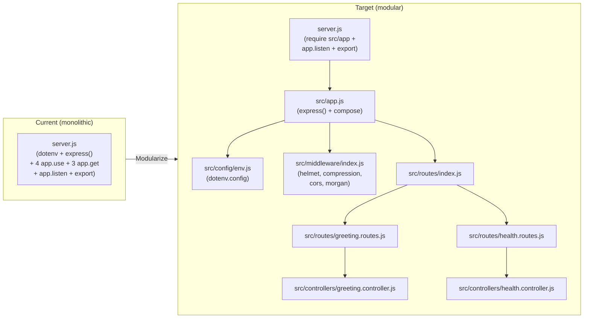
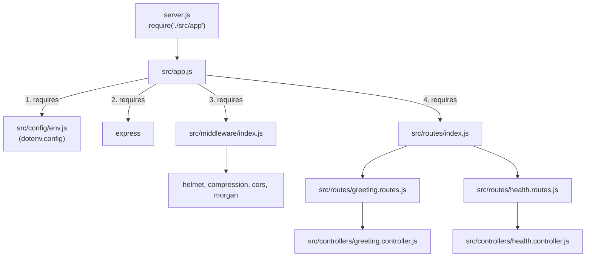

# Technical Specification

# 0. Agent Action Plan

## 0.1 Intent Clarification

### 0.1.1 Core Refactoring Objective

Based on the prompt, the Blitzy platform understands that the refactoring objective is to **decompose the existing monolithic single-file Express.js server (`server.js`) into a properly layered, modular Express.js architecture inside the same repository, while preserving every observable behavior of the current implementation bit-for-bit**.

The user's literal phrasing — "Rewrite this Node.js server into a express.js refactor" — cannot be satisfied as a framework migration because the project is already an Express application: `server.js` already calls `require('express')` and `const app = express()` [server.js:L31, L40], and `package.json` already declares `express: ^4.21.2` as a runtime dependency [package.json:dependencies.express]. The only coherent interpretation is therefore a **structural / modularity refactor of an existing Express server**. The user's qualifier — "keeping every feature and functionality exactly as in the original Node.js project. Ensure the rewritten version fully matches the behavior and logic of the current implementation." — confirms that this is a non-behavioral, non-functional refactor whose sole deliverable is improved internal organization.

| Attribute | Value |
|-----------|-------|
| Refactoring type | Code structure / Modularity refactor (separation of concerns) |
| Sub-category | Modular layout adoption inside an existing Express ^4.x application |
| Target repository | Same repository (`repo-test-sud`) |
| Net behavior change | None — strict zero-delta on all observable outputs |
| Net dependency change | None — no packages added, removed, or version-shifted |
| Execution phases | Single Blitzy phase |

#### Enumerated Refactoring Goals

- **G1 — App composition / bootstrap separation.** Split application construction (instantiating `express()`, registering middleware, mounting routes) from the network bootstrap (`app.listen`). The configured app instance must remain testable in isolation, exactly as today.
- **G2 — Per-domain route modules.** Replace the three inline `app.get(...)` declarations [server.js:L79-L107] with dedicated `express.Router()` modules grouped by domain (`greeting`, `health`).
- **G3 — Dedicated middleware registration module.** Extract the four `app.use(...)` calls [server.js:L56, L59, L62, L65] into a single registrar that preserves the exact ordering helmet → compression → cors → morgan.
- **G4 — Centralized environment configuration.** Move the `require('dotenv').config()` call [server.js:L28] into a dedicated configuration module that is loaded once, before any module reads `process.env`.
- **G5 — Controller layer for handler logic.** Extract the request-handler bodies from the route declarations into named controller functions, so route files declare URLs and methods only.
- **G6 — Stable public surface.** Preserve `server.js` as the project entry point so that `package.json`'s `"main": "server.js"` and `"start": "node server.js"` [package.json:L5, L7], `ecosystem.config.js`'s `script: './server.js'` [ecosystem.config.js:L26], and `tests/server.test.js`'s `require('../server')` [tests/server.test.js:L25] continue to resolve without edits.
- **G7 — Preserve the test contract.** All 7 Jest + Supertest assertions in `tests/server.test.js` must pass without any modification to assertions or import paths.

### 0.1.2 Technical Interpretation

This refactoring translates to the following technical transformation strategy: **convert a single 119-line `server.js` that mixes dotenv loading, middleware registration, route declarations, and `app.listen` into a thin entry-point (`server.js`) that delegates application construction to a new `src/app.js` factory, which composes configuration (`src/config/env.js`), middleware (`src/middleware/index.js`), and routes (`src/routes/index.js` plus per-domain route and controller modules) into the same configured `app` object that is exported today**.

#### Current → Target Architecture Mapping


```mermaid
flowchart LR
    subgraph Current["Current (monolithic)"]
        S0["server.js<br/>(dotenv + express()<br/>+ 4 app.use + 3 app.get<br/>+ app.listen + export)"]
    end

    subgraph Target["Target (modular)"]
        S1["server.js<br/>(require src/app +<br/>app.listen + export)"]
        A1["src/app.js<br/>(express() + compose)"]
        C1["src/config/env.js<br/>(dotenv.config)"]
        M1["src/middleware/index.js<br/>(helmet, compression,<br/>cors, morgan)"]
        R1["src/routes/index.js"]
        R2["src/routes/greeting.routes.js"]
        R3["src/routes/health.routes.js"]
        H1["src/controllers/greeting.controller.js"]
        H2["src/controllers/health.controller.js"]
        S1 --> A1
        A1 --> C1
        A1 --> M1
        A1 --> R1
        R1 --> R2
        R1 --> R3
        R2 --> H1
        R3 --> H2
    end

    Current -- "Modularize" --> Target
```

#### Transformation Rules

- The configured Express `app` instance produced by `src/app.js` must be **identical in observable behavior** to the one produced by the current `server.js` — same middleware, same ordering, same routes, same handlers, same exports.
- All `process.env` reads must occur **after** `dotenv.config()` has executed.
- `server.js` becomes a 2-responsibility entry point: re-export the configured app and conditionally call `app.listen` only when invoked directly via `node server.js`.
- No new public API surface, no new response fields, no new headers, no new error pathways are introduced — only internal reorganization.

## 0.2 Scope Boundaries

### 0.2.1 Exhaustively In Scope

The following files and patterns are explicitly in scope for this refactor. Every CREATE target sits under the new `src/` tree; every UPDATE target is named explicitly.

#### Source Transformations (Express application code)

- `server.js` — UPDATE: collapse to a thin entry point that requires `./src/app`, re-exports it, and conditionally calls `app.listen`.
- `src/app.js` — CREATE: Express application factory that composes config, middleware, and routes; exports the configured app.
- `src/config/env.js` — CREATE: invokes `require('dotenv').config()` exactly once at module load and exports resolved `PORT`, `NODE_ENV`, and `LOG_LEVEL` accessors.
- `src/middleware/index.js` — CREATE: registers helmet → compression → cors → morgan in this exact order onto a provided Express app.
- `src/routes/index.js` — CREATE: aggregates per-domain routers and mounts them onto a parent `express.Router()`.
- `src/routes/greeting.routes.js` — CREATE: declares `GET /` and `GET /evening` using `express.Router()`, delegates to the greeting controller.
- `src/routes/health.routes.js` — CREATE: declares `GET /health` using `express.Router()`, delegates to the health controller.
- `src/controllers/greeting.controller.js` — CREATE: exports `getRoot` (returns "Hello world") and `getEvening` (returns "Good evening").
- `src/controllers/health.controller.js` — CREATE: exports `getHealth` (returns `{status:'healthy', timestamp: ISO-8601, uptime: process.uptime()}` with status 200 and JSON content type).

#### Documentation Updates

- `README.md` — UPDATE: replace any structural references that implied a single-file server with a description of the new modular layout. The endpoint contract tables, environment-variable tables, and PM2 deployment instructions remain unchanged.

#### Configuration and Lockfile (REFERENCE — no edits required)

- `package.json` — REFERENCE: `"main": "server.js"` [package.json:L5] and `"start": "node server.js"` [package.json:L7] remain valid because `server.js` is preserved at the repository root. No dependency, devDependency, or script edits are required.
- `package-lock.json` — REFERENCE: lockfile is unchanged because no `npm install` is required (no dependency additions, removals, or version bumps).
- `.env.example` — REFERENCE: environment-variable contract is unchanged (NODE_ENV, LOG_LEVEL, PORT, DB_Host, DB, API_KEY).
- `ecosystem.config.js` — REFERENCE: `script: './server.js'` [ecosystem.config.js:L26] continues to resolve correctly; no PM2 changes required.
- `postman.json` — REFERENCE: endpoint URLs and methods are unchanged.

#### Tests (REFERENCE — no edits)

- `tests/server.test.js` — REFERENCE: the test file's `const app = require('../server')` import and every assertion in the suite continue to hold because the configured app exported from `server.js` is observably identical to the current export.

### 0.2.2 Explicitly Out of Scope

#### Behavioral Changes (forbidden by user constraint)

The user directive — "keeping every feature and functionality exactly as in the original Node.js project" — places the following categories explicitly out of scope:

- Adding, removing, or modifying any route or its response body, status code, or content type.
- Adding `app.use(express.json())` or any body parser (no existing handler consumes a request body).
- Adding a 404 handler, an error-handling middleware, a `trust proxy` setting, or any rate-limiting middleware.
- Adding `process.on('uncaughtException')` or `process.on('unhandledRejection')` handlers.
- Adding TLS termination, HTTPS configuration, or cookie/session middleware.
- Modifying any Helmet, compression, cors, or morgan option from its current default.
- Changing the morgan format-selection expression `process.env.NODE_ENV === 'production' ? 'combined' : 'dev'` [server.js:L65].
- Changing the `/health` response schema, the `new Date().toISOString()` timestamp, or `process.uptime()` numeric source.
- Migrating to Express 5, switching to TypeScript, adding a build step, or introducing async/await on handlers that today are synchronous.

#### Repository Artifacts (unrelated to the Express server)

The following files exist in the repository but are unrelated cross-language fixtures and operational samples; they are not modified by this refactor:

- `amazon_cloudformation.yaml` (AWS CloudFormation sample)
- `apache.conf` (Apache HTTPD sample)
- `datadog.yaml` (Datadog Agent sample)
- `dotnet.cs` (C# sample)
- `dummy_qtest.csv` (QA test cases)
- `eclipse.xml` (Eclipse project metadata)
- `junit.java` (Java JUnit sample)
- `maven.xml` (Maven POM sample)
- `mysql.sql` (MySQL seed)
- `notion.md` (Notion import demo)
- `oracle.sql` (Oracle seed)
- `php.php` (PHP sample)
- `script.sh` (diagnostic shell script)
- `blitzy/documentation/Project Guide.md` and `blitzy/documentation/Technical Specifications.md` (prior project documentation; not maintained as part of this refactor)

#### Rules-Mandated Files

User-specified rules list is empty (`[]`), so no rule-mandated files (migration scripts, fixtures, configuration files) need to be added to scope beyond what is enumerated above.

### 0.2.3 Design System Compliance

Not applicable. This refactor targets a server-side HTTP API; no UI components, no component library, no design tokens, and no Figma references are involved. The Design System Alignment Protocol is therefore intentionally omitted.

## 0.3 Target Design

### 0.3.1 Refactored Structure Planning

The refactored repository preserves every existing top-level file and folder and introduces a new `src/` tree that holds the decomposed Express application. No file is renamed or moved at the repository root; every external reference that today points at `server.js` continues to resolve.

```
repo-test-sud/
├── server.js                              [UPDATE — thin entry point]
├── src/                                   [CREATE — new directory tree]
│   ├── app.js                             [CREATE — Express application factory]
│   ├── config/
│   │   └── env.js                         [CREATE — dotenv loader + env accessors]
│   ├── middleware/
│   │   └── index.js                       [CREATE — middleware stack registrar]
│   ├── routes/
│   │   ├── index.js                       [CREATE — router aggregator]
│   │   ├── greeting.routes.js             [CREATE — GET / and GET /evening]
│   │   └── health.routes.js               [CREATE — GET /health]
│   └── controllers/
│       ├── greeting.controller.js         [CREATE — root/evening handlers]
│       └── health.controller.js           [CREATE — /health handler]
├── tests/
│   └── server.test.js                     [REFERENCE — unchanged]
├── package.json                           [REFERENCE — unchanged]
├── package-lock.json                      [REFERENCE — unchanged]
├── .env.example                           [REFERENCE — unchanged]
├── ecosystem.config.js                    [REFERENCE — unchanged]
├── postman.json                           [REFERENCE — unchanged]
├── README.md                              [UPDATE — describe modular layout]
└── (cross-language sample fixtures)       [OUT OF SCOPE — untouched]
```

#### Module Responsibilities

| Module | Responsibility | Required `require()` graph |
|--------|---------------|----------------------------|
| `server.js` | Re-export the configured app from `./src/app`; conditionally call `app.listen(PORT, ...)` when `require.main === module`; log startup messages preserving the existing console output [server.js:L111-L114] | `./src/app` |
| `src/app.js` | Instantiate `express()`, invoke the middleware registrar, mount the router aggregator, export the configured app instance | `express`, `./config/env`, `./middleware`, `./routes` |
| `src/config/env.js` | Call `require('dotenv').config()` at module load (once, before any other module reads `process.env`); export `PORT`, `NODE_ENV` resolved with the same defaults as the current implementation | `dotenv` |
| `src/middleware/index.js` | Export a function `registerMiddleware(app)` that calls `app.use(helmet())`, `app.use(compression())`, `app.use(cors())`, `app.use(morgan(...))` in that exact order, with the morgan-format selection logic preserved verbatim | `helmet`, `compression`, `cors`, `morgan` |
| `src/routes/index.js` | Create a parent `express.Router()`; mount the greeting and health routers; export the parent router | `express`, `./greeting.routes`, `./health.routes` |
| `src/routes/greeting.routes.js` | Declare `router.get('/', getRoot)` and `router.get('/evening', getEvening)`; export the router | `express`, `../controllers/greeting.controller` |
| `src/routes/health.routes.js` | Declare `router.get('/health', getHealth)`; export the router | `express`, `../controllers/health.controller` |
| `src/controllers/greeting.controller.js` | Export `getRoot(req, res)` that calls `res.send('Hello world')` and `getEvening(req, res)` that calls `res.send('Good evening')` | none |
| `src/controllers/health.controller.js` | Export `getHealth(req, res)` that calls `res.status(200).json({status:'healthy', timestamp: new Date().toISOString(), uptime: process.uptime()})` | none |

### 0.3.2 Web Search Research Conducted

A targeted web search confirmed the canonical Express.js modular layout: separation of concerns through dedicated folders for routes, controllers, middleware, and config; route grouping by domain using `express.Router()`; and centralizing configuration in one place. The query and confirmed best practices are:

- Query: "Express.js modular project structure best practices 2024"
- Confirmed practice: extract route handlers into per-domain modules using `express.Router()` and mount them on the app
- Confirmed practice: separate request handler logic into a controllers folder so route files declare URLs and methods only
- Confirmed practice: centralize environment configuration so consumers do not call `dotenv` directly
- Confirmed practice: keep an Express application factory ("`app.js`") separate from the network bootstrap so the app can be exercised by Supertest without binding a port

The target design applies these practices in the minimum form appropriate for a three-endpoint service; the structure is intentionally not over-engineered (no services layer, no models layer, no DAOs) because the existing application performs no persistence, no external I/O, and no business logic.

### 0.3.3 Design Pattern Applications

| Pattern | Application |
|---------|-------------|
| Application Factory | `src/app.js` constructs and returns a configured Express `app` without starting an HTTP listener. This enables Supertest to attach to the in-memory app, matching the existing test pattern at `tests/server.test.js:L25` |
| Entry-Point Pattern | `server.js` retains the `if (require.main === module) { app.listen(...) }` guard [server.js:L110-L115] so the test runner can import the app without binding to a port |
| Router Composition | A parent `express.Router()` in `src/routes/index.js` aggregates per-domain routers (`greeting.routes`, `health.routes`), each created with `express.Router()`. The parent router is mounted on the app via a single `app.use(router)` call |
| Controller Layer | Handler bodies move from inline arrow functions into named exports of `controllers/*.controller.js`, so route files become pure URL-to-handler declarations |
| Middleware Composition | A single registrar in `src/middleware/index.js` encapsulates the four `app.use(...)` calls. The morgan-format selection logic is colocated with the morgan registration to preserve the current behavior verbatim |
| Configuration Module | `src/config/env.js` owns the single call to `dotenv.config()` and exposes resolved env values, eliminating direct `process.env` reads from the rest of the source tree |

### 0.3.4 User Interface Design

Not applicable. The refactor target is an HTTP/JSON server; there is no user interface to design or update.

## 0.4 Transformation Mapping

### 0.4.1 File-by-File Transformation Plan

Every target file is mapped to a concrete source file (or marked as a pure addition derived from the existing `server.js`). All transformations execute in a single Blitzy phase.

| Target File | Transformation | Source File | Key Changes |
|-------------|----------------|-------------|-------------|
| `server.js` | UPDATE | `server.js` | Reduce to thin entry point: replace the body (currently lines 27-118) with: (1) `const app = require('./src/app');`, (2) `const PORT = require('./src/config/env').PORT;`, (3) preserve the `if (require.main === module) { app.listen(PORT, () => { console.log(...) }) }` guard verbatim from [server.js:L110-L115], (4) `module.exports = app;` preserving the export contract at [server.js:L118] |
| `src/app.js` | CREATE | `server.js` | New Express application factory. Require order: `./config/env` FIRST (so dotenv runs before any env read), then `express`, then `./middleware`, then `./routes`. Construct `const app = express()`, invoke `registerMiddleware(app)`, mount the aggregate router via `app.use(router)`. Export the configured `app`. Mirrors the assembly at [server.js:L31-L107] minus the listen call |
| `src/config/env.js` | CREATE | `server.js` | Encapsulates `require('dotenv').config()` from [server.js:L28]. Exports `PORT` resolved as `process.env.PORT || 3000` (matching [server.js:L43]) and `NODE_ENV` accessor for downstream consumers |
| `src/middleware/index.js` | CREATE | `server.js` | Exports `registerMiddleware(app)` that performs, in this exact order: `app.use(helmet())` [from server.js:L56], `app.use(compression())` [from server.js:L59], `app.use(cors())` [from server.js:L62], `app.use(morgan(process.env.NODE_ENV === 'production' ? 'combined' : 'dev'))` [from server.js:L65]. Requires `helmet`, `compression`, `cors`, `morgan` |
| `src/routes/index.js` | CREATE | `server.js` | Creates `const router = express.Router()`; mounts `router.use(require('./greeting.routes'))` and `router.use(require('./health.routes'))`; exports the parent router. Replaces the inline `app.get(...)` declarations at [server.js:L79, L94, L105] |
| `src/routes/greeting.routes.js` | CREATE | `server.js` | New `express.Router()` declaring `router.get('/', getRoot)` and `router.get('/evening', getEvening)`. Source rows: [server.js:L94-L96] and [server.js:L105-L107]. Imports handlers from `../controllers/greeting.controller` |
| `src/routes/health.routes.js` | CREATE | `server.js` | New `express.Router()` declaring `router.get('/health', getHealth)`. Source rows: [server.js:L79-L85]. Imports handler from `../controllers/health.controller` |
| `src/controllers/greeting.controller.js` | CREATE | `server.js` | Exports two named handlers extracted verbatim from [server.js:L94-L96] and [server.js:L105-L107]: `getRoot = (req, res) => res.send('Hello world')` and `getEvening = (req, res) => res.send('Good evening')` |
| `src/controllers/health.controller.js` | CREATE | `server.js` | Exports `getHealth = (req, res) => res.status(200).json({status:'healthy', timestamp: new Date().toISOString(), uptime: process.uptime()})` extracted verbatim from [server.js:L79-L85] |
| `README.md` | UPDATE | `README.md` | Add a "Project Structure" subsection documenting the `src/` tree. Endpoint contract tables [README.md:L29-L33], health-check schema [README.md:L44-L57], env-variable tables [README.md:L74-L82], and PM2 deployment instructions [README.md:L83-L122] remain untouched because their content is still accurate |
| `tests/server.test.js` | REFERENCE | n/a | No edits. The file imports `../server` [tests/server.test.js:L25] and asserts the public HTTP contract, which the refactor preserves exactly |
| `package.json` | REFERENCE | n/a | No edits. `"main": "server.js"` [package.json:L5], `"start": "node server.js"` [package.json:L7], dependency list [package.json:L16-L23], devDependencies [package.json:L24-L27], and `engines.node>=18.0.0` [package.json:L13-L15] remain valid |
| `package-lock.json` | REFERENCE | n/a | No edits. Dependency tree is unchanged because no packages are added, removed, or version-bumped |
| `.env.example` | REFERENCE | n/a | No edits. Env contract (NODE_ENV, LOG_LEVEL, PORT, DB_Host, DB, API_KEY) is unchanged |
| `ecosystem.config.js` | REFERENCE | n/a | No edits. `script: './server.js'` [ecosystem.config.js:L26] continues to resolve. PM2 env maps for development/production/test [ecosystem.config.js:L57-L75] are unchanged |
| `postman.json` | REFERENCE | n/a | No edits. Endpoint URLs (`http://localhost:3000/health`, `/`, `/evening`) and HTTP methods are unchanged |

### 0.4.2 Cross-File Dependencies

#### Import Statement Updates

The refactor introduces new internal `require()` paths. No third-party `require()` calls change.

- **`server.js`** — replace top-of-file requires:
  - FROM: `require('dotenv').config(); const express = require('express'); const helmet = require('helmet'); const morgan = require('morgan'); const cors = require('cors'); const compression = require('compression');` [server.js:L28, L31-L37]
  - TO: `const app = require('./src/app'); const { PORT } = require('./src/config/env');`

- **`src/app.js`** — new requires (order matters):
  - `require('./config/env');` (must be FIRST so dotenv runs before any env read)
  - `const express = require('express');`
  - `const registerMiddleware = require('./middleware');`
  - `const router = require('./routes');`

- **`src/config/env.js`** — new requires:
  - `require('dotenv').config();` (executed at module load)

- **`src/middleware/index.js`** — new requires:
  - `const helmet = require('helmet'); const compression = require('compression'); const cors = require('cors'); const morgan = require('morgan');`

- **`src/routes/index.js`** — new requires:
  - `const express = require('express');`
  - `const greetingRoutes = require('./greeting.routes');`
  - `const healthRoutes = require('./health.routes');`

- **`src/routes/greeting.routes.js`** — new requires:
  - `const express = require('express');`
  - `const { getRoot, getEvening } = require('../controllers/greeting.controller');`

- **`src/routes/health.routes.js`** — new requires:
  - `const express = require('express');`
  - `const { getHealth } = require('../controllers/health.controller');`

- **`src/controllers/*.controller.js`** — no third-party requires.

#### Configuration and Test Import Stability

No configuration or test imports change:

- `tests/server.test.js` continues to `require('../server')` and receive the configured Express app, because `server.js` will `module.exports = require('./src/app')` (preserving the export contract).
- `ecosystem.config.js` continues to reference `./server.js`.
- `package.json`'s `"main"` and `"start"` continue to reference `server.js`.

### 0.4.3 Wildcard Patterns

Wildcards are not required because the file count is small and every path is enumerated explicitly. If future extensions are made under `src/` (additional routes or controllers), the trailing-wildcard patterns `src/routes/*.routes.js` and `src/controllers/*.controller.js` may be applied; no leading wildcards are used.

### 0.4.4 One-Phase Execution

This refactor will be executed by Blitzy in **ONE** phase. All CREATE, UPDATE, and REFERENCE operations happen atomically within a single run: the eight new `src/**` files are created, `server.js` is updated to the thin entry point, and `README.md` is updated to describe the new layout. No multi-phase split is required because the refactor has no dependency on intermediate validation or human approval.

## 0.5 Dependency Inventory

### 0.5.1 Key Packages

The refactor is purely structural and adds, removes, or upgrades zero packages. The existing dependency manifest [package.json:L16-L27] and lockfile [package-lock.json: lockfileVersion 3] remain authoritative. The packages relevant to the refactor are listed below at their resolved versions:

| Registry | Package | Version (Manifest) | Version (Resolved) | Purpose |
|----------|---------|-------------------|--------------------|---------|
| npm | express | ^4.21.2 | 4.22.1 | Web application framework; consumed by `src/app.js`, `src/routes/*` |
| npm | helmet | ^8.1.0 | 8.1.0 | Security HTTP headers middleware; consumed by `src/middleware/index.js` |
| npm | morgan | ^1.10.1 | 1.10.1 | HTTP request logging middleware; consumed by `src/middleware/index.js` |
| npm | cors | ^2.8.5 | 2.8.5 | Cross-Origin Resource Sharing middleware; consumed by `src/middleware/index.js` |
| npm | compression | ^1.8.1 | 1.8.1 | gzip/deflate response compression middleware; consumed by `src/middleware/index.js` |
| npm | dotenv | ^17.2.3 | 17.2.3 | Environment-variable loader; consumed by `src/config/env.js` |
| npm | jest | ^29.7.0 (dev) | 29.7.0 | Test runner; consumed by `tests/server.test.js` |
| npm | supertest | ^7.0.0 (dev) | 7.1.4 | HTTP assertions; consumed by `tests/server.test.js` |

Runtime alignment: `package.json` declares `engines.node: ">=18.0.0"` [package.json:L13-L15]; the validation environment documented in `blitzy/documentation/Project Guide.md` is Node v20.19.5 with npm 10.8.2. The refactor introduces no syntax requiring a newer runtime.

### 0.5.2 Dependency Updates

This section documents the only changes the refactor introduces — purely internal `require()` paths. No external dependency change occurs.

#### Import Refactoring

- **Files requiring import updates** (enumerated; no wildcards required because the file count is small):
  - `server.js` — top-of-file requires replaced with `require('./src/app')` and a destructured `PORT` from `./src/config/env`
  - `src/app.js` — new file; requires `./config/env` FIRST, then `express`, `./middleware`, `./routes`
  - `src/middleware/index.js` — new file; requires `helmet`, `compression`, `cors`, `morgan`
  - `src/routes/index.js` — new file; requires `express`, `./greeting.routes`, `./health.routes`
  - `src/routes/greeting.routes.js` — new file; requires `express`, `../controllers/greeting.controller`
  - `src/routes/health.routes.js` — new file; requires `express`, `../controllers/health.controller`
  - `src/controllers/greeting.controller.js` — new file; no third-party requires
  - `src/controllers/health.controller.js` — new file; no third-party requires

- **Import transformation rules** (applied to `server.js` only; all other affected files are CREATEs):
  - Old: `require('dotenv').config();` [server.js:L28]
  - New: relocated into `src/config/env.js`, which is required transitively via `src/app.js`
  - Old: `const express = require('express'); const helmet = require('helmet'); const morgan = require('morgan'); const cors = require('cors'); const compression = require('compression');` [server.js:L31-L37]
  - New: removed from `server.js`; each module is required only inside its owning sub-module (`express` in `src/app.js` and `src/routes/*`, the four middleware packages in `src/middleware/index.js`)

#### External Reference Updates

The following categories of external files are evaluated for required updates; the conclusion for each is "no change required":

- **Configuration files** (`*.config.*`, `*.json`): `ecosystem.config.js` continues to reference `./server.js` [ecosystem.config.js:L26]; `postman.json` continues to reference the same endpoint URLs; `package.json` `"main"` and `"start"` continue to reference `server.js` [package.json:L5, L7]. No edits.
- **Documentation files** (`**/*.md`): `README.md` requires a UPDATE to add a "Project Structure" section describing the new modular layout; the existing endpoint contract, env-variable, and PM2 sections remain accurate. `blitzy/documentation/*.md` are not in scope for this refactor.
- **Build files** (`package.json`, `package-lock.json`): No edits. The refactor introduces no new packages, no new scripts, and no engine changes.
- **CI/CD files** (`.github/workflows/*.yml`, `.gitlab-ci.yml`): None present in the repository; no CI/CD edits possible or required.

## 0.6 Special Analysis

### 0.6.1 Behavior-Preservation Risk Inventory

This section enumerates the non-trivial risks that arise when decomposing a single-file Express server into modules. Each risk is paired with a specific mitigation rule that downstream code generation MUST honor.

#### Risk B1 — dotenv Load Order

**Risk.** The current implementation calls `require('dotenv').config()` on line 28 of `server.js`, before any other module is required. The expression `process.env.NODE_ENV === 'production' ? 'combined' : 'dev'` on line 65 is evaluated at module-load time when `app.use(morgan(...))` runs. If dotenv has not yet executed, NODE_ENV would be `undefined` and morgan would silently fall through to `'dev'` even when the operator intended `'combined'`.

**Mitigation rule.** `src/config/env.js` MUST invoke `require('dotenv').config()` at the very top of its module body, and `src/app.js` MUST require `./config/env` BEFORE it requires `./middleware`. Equivalently, `server.js` MUST require `./src/app` (which transitively loads `./src/config/env` first) before any code path reads `process.env`. This sequencing must be expressed via `require()` order, not via lazy/conditional evaluation.

#### Risk B2 — Middleware Registration Order

**Risk.** The current `app.use(...)` calls execute in the strict sequence helmet → compression → cors → morgan [server.js:L56, L59, L62, L65]. This ordering is observed by tests/server.test.js (helmet's `x-content-type-options: nosniff` and `x-frame-options: SAMEORIGIN` headers must be present on the `/` response [tests/server.test.js:L83, L88]) and is described in [README.md:L19-L25]. Any reordering risks: (a) compression interfering with helmet header insertion; (b) cors response headers being stripped by a later middleware; (c) morgan logging requests before security headers are applied.

**Mitigation rule.** `src/middleware/index.js` MUST register middleware in the exact sequence helmet, compression, cors, morgan, with no insertion of any additional middleware between or around them.

#### Risk B3 — Test-Export Contract

**Risk.** `tests/server.test.js` requires `../server` and passes the result to `supertest(app)` [tests/server.test.js:L25, L34]. If `server.js` no longer exports the configured Express app, every test fails.

**Mitigation rule.** `server.js` MUST end with `module.exports = app;` where `app` is the configured instance obtained from `require('./src/app')`. Equivalent forms (e.g., `module.exports = require('./src/app');`) are acceptable provided the exported value is the same Express app instance.

#### Risk B4 — Listen Guard

**Risk.** The current implementation guards `app.listen(...)` with `if (require.main === module)` [server.js:L110-L115]. This prevents the test process from binding to a TCP port. If the refactor moves `app.listen` into `src/app.js`, every `require('../server')` from the test process would call `listen`, triggering EADDRINUSE on parallel test runs or hanging the test process.

**Mitigation rule.** `app.listen(...)` MUST remain in `server.js` and MUST remain inside the `if (require.main === module) { ... }` block. `src/app.js` MUST NOT call `listen`.

#### Risk B5 — Morgan Format-Selection Expression

**Risk.** The expression `process.env.NODE_ENV === 'production' ? 'combined' : 'dev'` [server.js:L65] is a behavior-defining ternary. If the refactor "simplifies" it (e.g., reads NODE_ENV via a helper that returns a normalized default), the morgan format selection could change.

**Mitigation rule.** `src/middleware/index.js` MUST preserve the ternary expression verbatim at the point where morgan is registered. Use of `require('../config/env').NODE_ENV` is acceptable provided the resolved value matches `process.env.NODE_ENV` for every input (no defaulting, no normalization).

#### Risk B6 — Handler Response Semantics

**Risk.** The three response patterns must be preserved exactly:

| Route | Source Call | Required Effect |
|-------|-------------|-----------------|
| `GET /` | `res.send('Hello world')` [server.js:L95] | status 200, body text "Hello world", Content-Type set by Express default (text/html;charset=utf-8) |
| `GET /evening` | `res.send('Good evening')` [server.js:L106] | status 200, body text "Good evening", Content-Type set by Express default (text/html;charset=utf-8) |
| `GET /health` | `res.status(200).json({status:'healthy', timestamp: new Date().toISOString(), uptime: process.uptime()})` [server.js:L80-L84] | status 200, JSON body with `status` string, ISO-8601 `timestamp` string, numeric `uptime`, Content-Type `application/json; charset=utf-8` |

**Mitigation rule.** Controllers MUST use identical Express response methods (`res.send` / `res.status().json`) and identical body shapes. Tests [tests/server.test.js:L32-L74] verify these contracts.

#### Risk B7 — No-Introduction Constraint

**Risk.** A "clean refactor" sometimes tempts the addition of common Express hygiene: a 404 handler, an error-handling middleware, `app.disable('x-powered-by')`, `trust proxy`, body parsers, async wrappers. Each of these would change observable behavior.

**Mitigation rule.** The refactor MUST NOT add any middleware, handler, app setting, or framework option that is not present in the current `server.js`. The full inventory of allowed `app.use(...)` calls is exactly four (helmet, compression, cors, morgan). The full inventory of allowed route handlers is exactly three (`GET /`, `GET /evening`, `GET /health`).

### 0.6.2 Cross-Cutting Concerns

#### Module Load Sequencing (Single-Process)

Because Node.js's `require()` is synchronous and cached, the module-load graph below is deterministic. The graph illustrates the required load order so that env-dependent code runs only after dotenv has executed:


```mermaid
flowchart TD
    A["server.js<br/>require('./src/app')"] --> B["src/app.js"]
    B -- "1. requires" --> C["src/config/env.js<br/>(dotenv.config)"]
    B -- "2. requires" --> D["express"]
    B -- "3. requires" --> E["src/middleware/index.js"]
    B -- "4. requires" --> F["src/routes/index.js"]
    E --> G["helmet, compression, cors, morgan"]
    F --> H["src/routes/greeting.routes.js"]
    F --> I["src/routes/health.routes.js"]
    H --> J["src/controllers/greeting.controller.js"]
    I --> K["src/controllers/health.controller.js"]
```

The ordering in `src/app.js` is the single point of enforcement; downstream modules need only avoid eager `process.env` reads at module load.

#### PM2 Cluster Mode Compatibility

`ecosystem.config.js` runs `./server.js` in `exec_mode: 'cluster'` with `instances: 'max'` [ecosystem.config.js:L26, L30, L33]. Because each cluster worker is its own Node.js process, each worker independently traverses the new require graph above and obtains its own configured `app` instance from `src/app.js`. Worker isolation is unchanged.

#### Stateless Design Preservation

The refactor adds no module-level mutable state. `src/config/env.js` reads `process.env` once at module load and exposes immutable values; `src/middleware/index.js` and the controllers hold no instance state. Stateless horizontal scaling under PM2 cluster mode [tech spec section 5.1.1] continues to hold.

#### Logging Output

Console output on startup currently consists of two lines [server.js:L112-L113]: `Server running on port ${PORT}` and `Environment: ${process.env.NODE_ENV || 'development'}`. These must be preserved verbatim in the listen callback retained in `server.js`. Morgan request-log lines are produced by middleware and remain unchanged.

## 0.7 Refactoring Rules

### 0.7.1 User-Specified Rules

The user provided an explicit rules list: `[]` (empty). No coding-standards, file-mandate, or workflow rules were declared. The only constraints originate from the user's prompt itself.

### 0.7.2 Constraints Derived from the User Prompt

The user's verbatim instruction is recorded below for traceability:

> **User Instruction:** "Rewrite this Node.js server into a express.js refactor, keeping every feature and functionality exactly as in the original Node.js project. Ensure the rewritten version fully matches the behavior and logic of the current implementation."

This instruction yields the following non-negotiable rules:

- **R1 — Functional parity.** Every route, response body, response status code, response Content-Type, and response header that the current `server.js` produces MUST be reproduced exactly by the refactored implementation. There is no allowance for "equivalent but improved" semantics.
- **R2 — Test parity.** All 7 assertions in `tests/server.test.js` MUST pass without modification: the file is REFERENCE-only. This includes the Helmet `x-content-type-options: nosniff` and `x-frame-options: SAMEORIGIN` headers, the CORS `access-control-allow-origin` header, the `/health` JSON shape, and the ISO-8601 timestamp round-trip [tests/server.test.js:L32-L103].
- **R3 — Public surface parity.** `server.js` MUST remain at the repository root, MUST export the configured Express app, and MUST remain the entry point referenced by `package.json` `"main"` / `"start"` [package.json:L5, L7] and by `ecosystem.config.js` `script` [ecosystem.config.js:L26].
- **R4 — Dependency parity.** No package additions, removals, or version bumps. The dependency manifest [package.json:L16-L27] and lockfile remain authoritative as they exist today.
- **R5 — Environment-variable contract parity.** `.env.example` [\.env.example:L1-L66] MUST NOT change. Every env name and default the current implementation consumes (`PORT`, `NODE_ENV`) MUST be consumed identically by the refactored implementation.
- **R6 — No introduction of new behaviors.** The refactor MUST NOT add: a 404 handler, an error-handling middleware, `trust proxy`, `app.disable('x-powered-by')`, a body parser (`express.json`, `express.urlencoded`), process-level error handlers, rate limiting, or any additional logging beyond what morgan already emits. See Risk B7 in section 0.6.1.
- **R7 — Middleware ordering invariant.** The four `app.use(...)` calls MUST execute in the order helmet → compression → cors → morgan. See Risk B2 in section 0.6.1.
- **R8 — dotenv load-order invariant.** `dotenv.config()` MUST execute before any module reads `process.env`. See Risk B1 in section 0.6.1.
- **R9 — Listen guard invariant.** `app.listen(...)` MUST remain inside `if (require.main === module) { ... }` within `server.js`. The application factory in `src/app.js` MUST NOT bind to a port. See Risk B4 in section 0.6.1.
- **R10 — Single-phase delivery.** All changes ship in one Blitzy phase; no incremental milestones.

### 0.7.3 Validation Criteria

The refactor is considered complete when ALL of the following are true. These criteria are testable using only the artifacts already present in the repository:

| Criterion | Verification Method |
|-----------|--------------------|
| `npm test` exits 0 with 7/7 passing assertions | Run `npm test`; observe Jest output |
| `curl http://localhost:3000/` returns 200 + body "Hello world" | Start server with `node server.js`; curl root |
| `curl http://localhost:3000/evening` returns 200 + body "Good evening" | Start server with `node server.js`; curl /evening |
| `curl http://localhost:3000/health` returns 200 + JSON with keys `status`, `timestamp`, `uptime`; timestamp round-trips via `new Date(...).toISOString()` | Start server; curl /health; inspect JSON |
| Response includes `x-content-type-options: nosniff` and `x-frame-options: SAMEORIGIN` | curl with `-i` flag |
| Response to a cross-origin request includes `access-control-allow-origin` | curl with `-H "Origin: http://example.com" -i` |
| `pm2 start ecosystem.config.js` launches the configured cluster | Run PM2 launch; observe `pm2 status` |
| `node -e "require('./server')"` succeeds and the export is an Express app function | One-line smoke test |
| No new package appears in `package-lock.json`'s top-level `packages` map | Diff lockfile against the current revision |
| No file outside the scope enumerated in section 0.2.1 is modified | Diff against the current revision |

### 0.7.4 Special Instructions

There are no special instructions beyond the constraints above. Specifically:

- No migration to a new repository (the user's prompt says "this Node.js server" — same repo).
- No performance or scalability deliverables (the user explicitly demands behavior preservation; no perf targets are set).
- No examples were provided by the user.
- No web search outputs are mandatory beyond the corroborating "Express.js modular project structure best practices" reference cited in section 0.3.2.

## 0.8 References

### 0.8.1 Files and Locators Cited in this Section

Every factual claim made in sub-sections 0.1 through 0.7 about the existing system traces to a specific file path and locator. The complete list of cited locators is:

| Source File | Locator(s) | Used to Substantiate |
|-------------|-----------|----------------------|
| `server.js` | L28 | `require('dotenv').config()` location at top of file |
| `server.js` | L31 | `const express = require('express')` proving the project is already an Express app |
| `server.js` | L31-L37 | The full list of top-of-file third-party requires that will be relocated |
| `server.js` | L40 | `const app = express()` instantiation point |
| `server.js` | L43 | `const PORT = process.env.PORT || 3000` default port resolution |
| `server.js` | L56 | `app.use(helmet())` — first middleware |
| `server.js` | L59 | `app.use(compression())` — second middleware |
| `server.js` | L62 | `app.use(cors())` — third middleware |
| `server.js` | L65 | `app.use(morgan(process.env.NODE_ENV === 'production' ? 'combined' : 'dev'))` — fourth middleware, format-selection ternary |
| `server.js` | L79-L85 | `GET /health` handler returning `{status:'healthy', timestamp, uptime}` |
| `server.js` | L94-L96 | `GET /` handler returning "Hello world" |
| `server.js` | L105-L107 | `GET /evening` handler returning "Good evening" |
| `server.js` | L110-L115 | `if (require.main === module) { app.listen(PORT, () => { console.log(...) }) }` block |
| `server.js` | L112-L113 | The two startup `console.log` statements that must be preserved verbatim |
| `server.js` | L118 | `module.exports = app` — the test-export contract |
| `package.json` | L5 | `"main": "server.js"` |
| `package.json` | L7 | `"start": "node server.js"` |
| `package.json` | L13-L15 | `"engines": { "node": ">=18.0.0" }` |
| `package.json` | L16-L23 | runtime dependencies map |
| `package.json` | L24-L27 | devDependencies map |
| `package-lock.json` | `lockfileVersion: 3`, `packages["node_modules/<pkg>"].version` for each direct dep | Resolved versions cited in section 0.5.1 |
| `tests/server.test.js` | L25 | `const app = require('../server')` — test import path |
| `tests/server.test.js` | L32-L103 | Full assertion set covering routes, /health schema, ISO-8601 timestamp, Helmet headers, CORS header |
| `tests/server.test.js` | L83, L88 | `x-content-type-options` and `x-frame-options` assertions |
| `.env.example` | L1-L66 | Environment-variable contract |
| `ecosystem.config.js` | L26 | `script: './server.js'` |
| `ecosystem.config.js` | L30, L33 | `instances: 'max'`, `exec_mode: 'cluster'` |
| `ecosystem.config.js` | L57-L75 | env, env_production, env_test maps |
| `README.md` | L19-L25 | Middleware stack table |
| `README.md` | L29-L33 | Endpoint contract table |
| `README.md` | L44-L57 | Health-check response schema |
| `README.md` | L74-L82 | Environment-variables table |
| `README.md` | L83-L122 | PM2 deployment section |
| Existing tech spec | §1.2 System Overview | Confirms existing Express ^4.21.2 stack and middleware order |
| Existing tech spec | §5.1 High-Level Architecture | Confirms monolithic architecture style and middleware-chain pattern |
| Existing tech spec | §5.2 Component Details | Confirms `server.js` responsibilities and `require.main === module` pattern |
| `blitzy/documentation/Project Guide.md` | (whole document) | Confirms validation environment Node v20.19.5 / npm 10.8.2 and 7/7 passing test count |

Where a claim about external best practices is made (section 0.3.2), the supporting source is the web-search result cited in section 0.8.4.

### 0.8.2 Attachments

No attachments were provided by the user. The "Setup Instructions" field is "None provided", the environment-variables list is empty (`[]`), the secrets list is empty (`[]`), and zero environments were attached. No files exist in `/tmp/environments_files`.

### 0.8.3 Figma Screens

No Figma URLs or frame names were referenced by the user. This refactor has no UI component and no design-system applicability.

### 0.8.4 Search Log (Appendix)

The investigation underlying this Agent Action Plan consisted of the following inspections:

- **Folder listings (`get_source_folder_contents`):** repository root (`""`), `tests/`, `blitzy/`, `blitzy/documentation/`
- **File reads (`read_file`):** `server.js` [1, -1], `package.json` [1, -1], `tests/server.test.js` [1, -1], `.env.example` [1, -1], `ecosystem.config.js` [1, -1], `README.md` [1, -1]
- **File summaries (`get_file_summary`):** `postman.json`, `blitzy/documentation/Project Guide.md`
- **Tech-spec section retrievals (`get_tech_spec_section`):** `1.2 System Overview`, `5.1 HIGH-LEVEL ARCHITECTURE`, `5.2 COMPONENT DETAILS`
- **Shell inspections (`bash`):**
  - `find / -name ".blitzyignore"` — confirmed no .blitzyignore exists in the repository
  - `node --version` / `npm --version` / `which node` — verified Node v22.22.2, npm 11.1.0 are installed in the working environment
  - Python parse of `package-lock.json` — extracted lockfileVersion and resolved versions for express (4.22.1), helmet (8.1.0), morgan (1.10.1), cors (2.8.5), compression (1.8.1), dotenv (17.2.3), jest (29.7.0), supertest (7.1.4)
  - `find . -maxdepth 2 -type d` — enumerated top-level directory structure
- **Web search (`web_search`):**
  - Query: "Express.js modular project structure best practices 2024" — corroborated standard patterns for routers, controllers, middleware separation, and config centralization referenced in section 0.3.2

