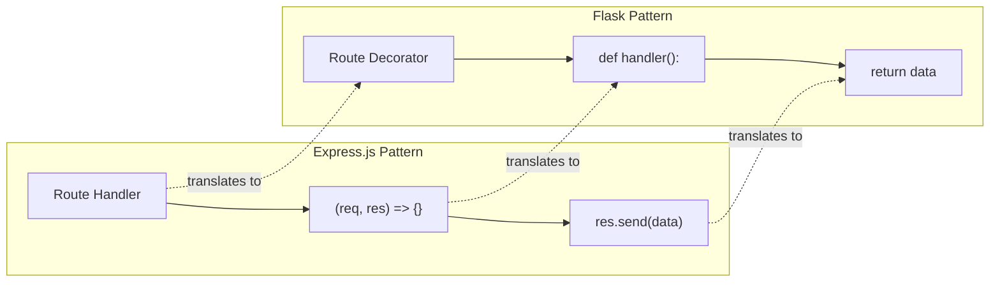
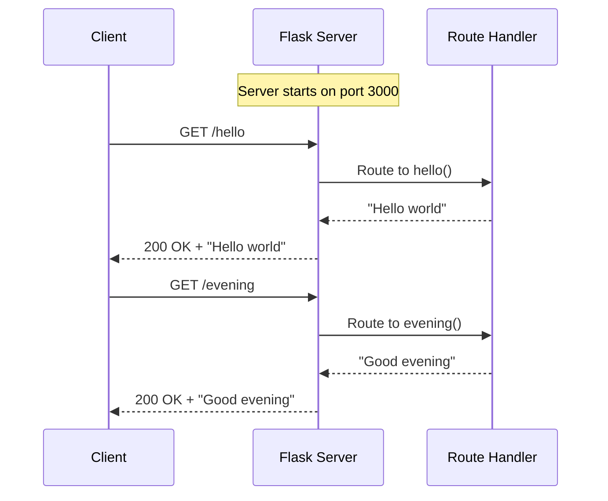
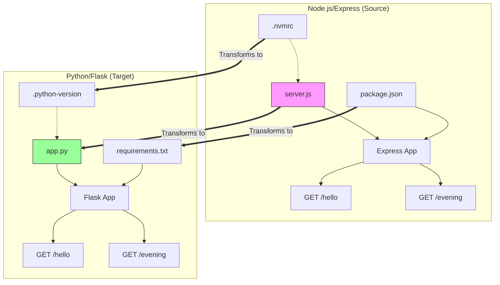
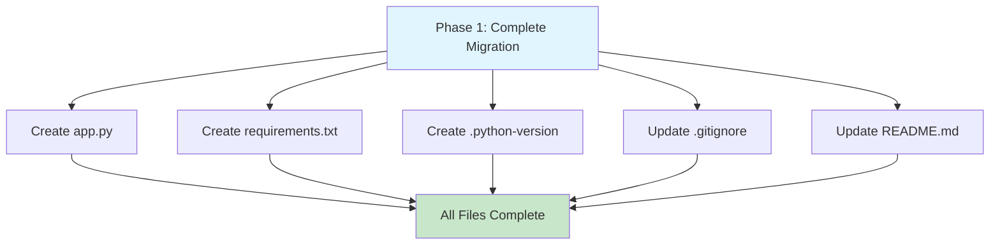
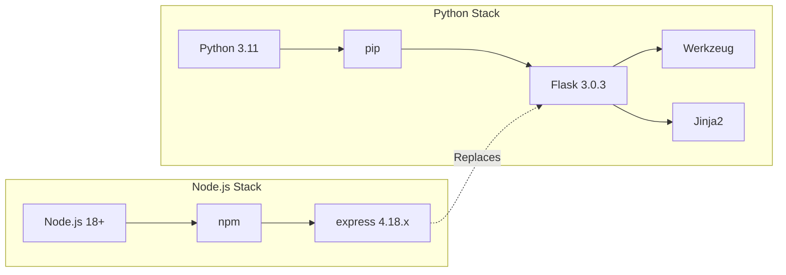
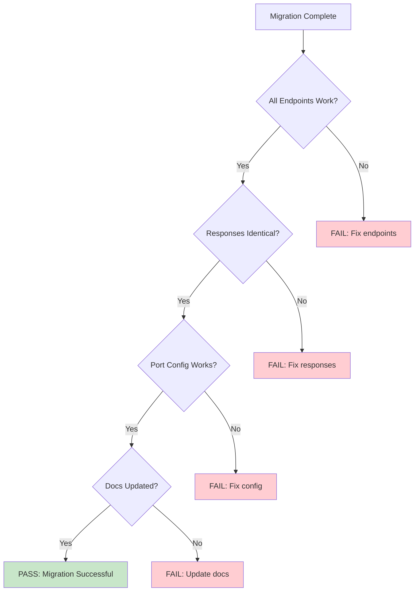

# Technical Specification

# 0. Agent Action Plan

## 0.1 Intent Clarification

### 0.1.1 Core Refactoring Objective

Based on the prompt, the Blitzy platform understands that the refactoring objective is to **completely rewrite a Node.js/Express.js server application into a Python 3 Flask application** while maintaining exact feature parity with the original implementation.

**Refactoring Type**: Tech Stack Migration (Node.js → Python)

**Target Repository**: Same repository transformation (in-place migration)

**Refactoring Goals with Enhanced Clarity**:

| Goal | Description | Success Criteria |
|------|-------------|------------------|
| Language Migration | Convert JavaScript/Node.js codebase to Python 3 | All source files converted to Python equivalents |
| Framework Replacement | Replace Express.js with Flask framework | All Express routes mapped to Flask route decorators |
| API Preservation | Maintain identical HTTP API behavior | All endpoints return same responses with same status codes |
| Port Compatibility | Keep default port configuration | Server runs on port 3000 as in original |
| Response Fidelity | Match exact response content and format | GET /hello returns "Hello world", GET /evening returns "Good evening" |

**Implicit Requirements Identified**:

- Maintain all public API contracts (HTTP methods, paths, response formats)
- Preserve identical behavior for all route handlers
- Keep the same default port (3000) for backward compatibility
- Maintain similar project structure patterns (entry point file, configuration)
- Ensure equivalent error handling behavior
- Preserve content-type headers and response formats

### 0.1.2 Special Instructions and Constraints

**Critical Directives Captured**:

| Directive | Source | Implementation Impact |
|-----------|--------|----------------------|
| "keeping every feature and functionality exactly as in the original" | User requirement | 100% feature parity required |
| "fully matches the behavior and logic" | User requirement | Response content, status codes, and API contracts must be identical |
| "Rewrite this Node.js server into a Python 3 Flask application" | User requirement | Complete language/framework migration |

**Migration Requirements**:

- Convert all Express.js route handlers to Flask route decorators
- Translate JavaScript async patterns to Python synchronous Flask patterns
- Replace npm/package.json dependency management with pip/requirements.txt
- Convert Node.js environment variable handling to Python os.environ

**Performance/Scalability Considerations**:

- Flask's WSGI-based synchronous model differs from Node.js event-driven model
- For production deployment, consider using Gunicorn or uWSGI as WSGI server
- Flask default development server suitable for tutorial/development purposes

**User Example Preserved**: No specific code examples provided by user - migration based on Technical Specifications document describing the Node.js server structure.

### 0.1.3 Technical Interpretation

This refactoring translates to the following technical transformation strategy:

**Architecture Mapping**:

```
Node.js/Express Architecture     →     Python/Flask Architecture
═══════════════════════════════════════════════════════════════════
server.js                        →     app.py (or server.py)
package.json                     →     requirements.txt
.nvmrc                           →     .python-version (optional)
node_modules/                    →     venv/ (virtual environment)
express()                        →     Flask(__name__)
app.get('/path', handler)        →     @app.route('/path')
app.listen(port, callback)       →     app.run(port=port)
res.send('text')                 →     return 'text'
process.env.PORT                 →     os.environ.get('PORT')
```

**Transformation Rules**:

| Express.js Pattern | Flask Equivalent | Notes |
|-------------------|------------------|-------|
| `const express = require('express')` | `from flask import Flask` | Import statement |
| `const app = express()` | `app = Flask(__name__)` | App initialization |
| `app.get('/hello', (req, res) => {...})` | `@app.route('/hello')` + `def hello():` | Route decorator pattern |
| `res.send('Hello world')` | `return 'Hello world'` | Response return |
| `app.listen(3000, () => {...})` | `app.run(host='0.0.0.0', port=3000)` | Server startup |

**Request-Response Transformation**:


```mermaid
graph LR
    subgraph "Express.js Pattern"
        A1[Route Handler] --> B1["(req, res) => {}"]
        B1 --> C1["res.send(data)"]
    end
    
    subgraph "Flask Pattern"
        A2[Route Decorator] --> B2["def handler():"]
        B2 --> C2["return data"]
    end
    
    A1 -.->|translates to| A2
    B1 -.->|translates to| B2
    C1 -.->|translates to| C2
```

## 0.2 Source Analysis

### 0.2.1 Comprehensive Source File Discovery

**Repository State Assessment**:

The repository analysis reveals this is a **greenfield specification project** where the Node.js server exists only as documented requirements in the Technical Specifications, not as actual source code files. The migration task requires implementing the Python Flask equivalent based on the specified behavior.

**Search Patterns Executed**:

| Search Pattern | Files Found | Assessment |
|---------------|-------------|------------|
| `*.js`, `*.ts` | None (excluding system) | No JavaScript source files present |
| `package.json` | None | No npm manifest found |
| `server.*`, `app.*`, `index.*` | `/app/main.py` (Blitzy infrastructure) | Out of scope for migration |
| `node_modules/` | None | No npm dependencies installed |

**Source Structure from Technical Specifications**:

Based on the Technical Specifications document, the **intended Node.js source structure** to be migrated is:

```
Node.js Project (Specified):
├── server.js              # Main server entry point
│   ├── Express app initialization
│   ├── GET /hello route handler
│   │   └── Returns: "Hello world"
│   ├── GET /evening route handler  
│   │   └── Returns: "Good evening"
│   └── Server listen on port 3000
│
├── package.json           # Dependencies and scripts
│   ├── name: "Repo-Test-Sud"
│   ├── main: "server.js"
│   ├── dependencies:
│   │   └── express: "^4.18.x"
│   └── scripts:
│       └── start: "node server.js"
│
├── .nvmrc                 # Node version specification
│   └── Node.js >=18.x
│
├── .gitignore             # Git ignore patterns
│   └── node_modules/
│
└── README.md              # Project documentation
```

### 0.2.2 Source Files Inventory

**Complete Source File Enumeration**:

| File | Purpose | Lines (Est.) | Transformation Required |
|------|---------|--------------|------------------------|
| `server.js` | Main application entry point with Express routes | ~25-30 | Full rewrite to Flask |
| `package.json` | NPM package manifest and scripts | ~15-20 | Convert to requirements.txt |
| `.nvmrc` | Node version specification | 1 | Convert to .python-version |
| `.gitignore` | Version control ignore patterns | ~5 | Update for Python patterns |
| `README.md` | Project documentation | ~20-30 | Update for Python/Flask |

### 0.2.3 Source Code Behavior Analysis

**Route Handler Specifications**:

| Endpoint | HTTP Method | Request Processing | Response | Status Code |
|----------|-------------|-------------------|----------|-------------|
| `/hello` | GET | None required | `"Hello world"` | 200 |
| `/evening` | GET | None required | `"Good evening"` | 200 |

**Server Configuration Specifications**:

| Configuration | Value | Notes |
|--------------|-------|-------|
| Default Port | 3000 | Standard Express development port |
| Host Binding | localhost | Development server default |
| Environment Variable | PORT | Optional port override |

**Logical Flow Analysis**:


```mermaid
sequenceDiagram
    participant Client
    participant Server as Flask Server
    participant Route as Route Handler
    
    Note over Server: Server starts on port 3000
    
    Client->>Server: GET /hello
    Server->>Route: Route to hello()
    Route-->>Server: "Hello world"
    Server-->>Client: 200 OK + "Hello world"
    
    Client->>Server: GET /evening
    Server->>Route: Route to evening()
    Route-->>Server: "Good evening"
    Server-->>Client: 200 OK + "Good evening"
```

### 0.2.4 Dependency Analysis

**Node.js Dependencies from Specification**:

| Package | Version | Purpose | Python Equivalent |
|---------|---------|---------|-------------------|
| express | ^4.18.x | Web framework | Flask |
| (Node.js runtime) | >=18.x | Runtime environment | Python 3.9+ |

**No Additional Dependencies Required**:

The source specification describes a minimal tutorial server with no external dependencies beyond Express.js itself. The Flask equivalent will be equally minimal.

## 0.3 Target Design

### 0.3.1 Refactored Structure Planning

**Target Python/Flask Architecture**:

The target structure maintains a minimal, beginner-friendly layout that mirrors the simplicity of the original Node.js tutorial server while following Python best practices.

```
Target Flask Project:
├── app.py                    # Main Flask application (equivalent to server.js)
│   ├── Flask app initialization
│   ├── GET /hello route handler
│   │   └── Returns: "Hello world"
│   ├── GET /evening route handler
│   │   └── Returns: "Good evening"
│   └── Server entry point (port 3000)
│
├── requirements.txt          # Python dependencies (equivalent to package.json)
│   └── Flask==3.0.3
│
├── .python-version          # Python version specification (equivalent to .nvmrc)
│   └── 3.11
│
├── .gitignore               # Updated for Python patterns
│   ├── __pycache__/
│   ├── *.pyc
│   ├── venv/
│   └── .env
│
├── README.md                # Updated documentation for Python/Flask
│   ├── Installation instructions
│   ├── Running the server
│   ├── API endpoints documentation
│   └── Development guidelines
│
└── venv/                    # Virtual environment (equivalent to node_modules/)
    └── (not tracked in git)
```

### 0.3.2 Web Search Research Conducted

**Best Practices Identified for Node.js to Flask Migration**:

| Research Topic | Key Finding | Application |
|---------------|-------------|-------------|
| Express to Flask route mapping | Flask uses decorator pattern `@app.route()` vs Express callback pattern | Direct translation of route handlers |
| Response handling | Flask returns data directly from functions vs Express `res.send()` | Simplified response pattern |
| Server configuration | Flask uses `app.run()` with host/port parameters | Match port 3000 configuration |
| Project structure | Flask minimal apps use single file approach | Keep `app.py` as single entry point |
| Dependency management | `requirements.txt` is Flask standard | Replace `package.json` |

**Flask Version Selection Rationale**:

| Version | Release Date | Python Support | Recommendation |
|---------|--------------|----------------|----------------|
| 3.0.3 | April 7, 2024 | Python 3.8+ | Stable LTS choice |
| 3.1.0 | November 13, 2024 | Python 3.9+ | Latest stable |

**Selected**: Flask 3.0.3 for maximum compatibility while maintaining modern features.

### 0.3.3 Design Pattern Applications

**Pattern Mapping from Express to Flask**:

| Pattern | Express.js Implementation | Flask Implementation |
|---------|---------------------------|----------------------|
| Application Factory | `const app = express()` | `app = Flask(__name__)` |
| Route Registration | `app.get('/path', handler)` | `@app.route('/path')` decorator |
| Response Handling | `res.send('text')` | `return 'text'` |
| Server Startup | `app.listen(port, callback)` | `app.run(port=port)` |
| Environment Config | `process.env.VAR` | `os.environ.get('VAR')` |

### 0.3.4 Target File Specifications

**app.py Structure**:

```python
from flask import Flask
import os

app = Flask(__name__)

@app.route('/hello')
def hello():
    return 'Hello world'

@app.route('/evening')  
def evening():
    return 'Good evening'

if __name__ == '__main__':
    port = int(os.environ.get('PORT', 3000))
    app.run(host='0.0.0.0', port=port)
```

**requirements.txt Structure**:

```
Flask==3.0.3
```

**.python-version Structure**:

```
3.11
```

**.gitignore Structure**:

```
# Python

__pycache__/
*.py[cod]
*$py.class
*.so
.Python
venv/
ENV/

#### Environment

.env
.env.local

#### IDE

.idea/
.vscode/
*.swp
```

### 0.3.5 Architecture Comparison Diagram


```mermaid
graph TB
    subgraph "Node.js/Express (Source)"
        N1[server.js] --> N2[Express App]
        N2 --> N3[GET /hello]
        N2 --> N4[GET /evening]
        N5[package.json] --> N2
        N6[.nvmrc] -.-> N1
    end
    
    subgraph "Python/Flask (Target)"
        P1[app.py] --> P2[Flask App]
        P2 --> P3[GET /hello]
        P2 --> P4[GET /evening]
        P5[requirements.txt] --> P2
        P6[.python-version] -.-> P1
    end
    
    N1 ==>|"Transforms to"| P1
    N5 ==>|"Transforms to"| P5
    N6 ==>|"Transforms to"| P6
    
    style N1 fill:#f9f,stroke:#333
    style P1 fill:#9f9,stroke:#333
```

## 0.4 Transformation Mapping

### 0.4.1 File-by-File Transformation Plan

**Complete File Transformation Matrix**:

| Target File | Transformation | Source File | Key Changes |
|-------------|----------------|-------------|-------------|
| `app.py` | CREATE | `server.js` | Create Flask application with identical route handlers; translate Express patterns to Flask decorators |
| `requirements.txt` | CREATE | `package.json` | Create Python dependency manifest with Flask replacing Express |
| `.python-version` | CREATE | `.nvmrc` | Create Python version specification (3.11) replacing Node version |
| `.gitignore` | UPDATE | `.gitignore` | Update patterns from node_modules to __pycache__, venv |
| `README.md` | UPDATE | `README.md` | Update all documentation for Python/Flask stack |

### 0.4.2 Detailed Code Transformations

**server.js → app.py Transformation**:

| Express.js Code Segment | Flask Code Equivalent | Line Reference |
|------------------------|----------------------|----------------|
| `const express = require('express');` | `from flask import Flask` | Import statement |
| `const app = express();` | `app = Flask(__name__)` | App initialization |
| `app.get('/hello', (req, res) => { res.send('Hello world'); });` | `@app.route('/hello')` + `def hello(): return 'Hello world'` | Hello route |
| `app.get('/evening', (req, res) => { res.send('Good evening'); });` | `@app.route('/evening')` + `def evening(): return 'Good evening'` | Evening route |
| `const PORT = process.env.PORT \|\| 3000;` | `port = int(os.environ.get('PORT', 3000))` | Port configuration |
| `app.listen(PORT, () => {...});` | `app.run(host='0.0.0.0', port=port)` | Server startup |

**package.json → requirements.txt Transformation**:

| package.json Field | requirements.txt Equivalent | Notes |
|-------------------|---------------------------|-------|
| `"express": "^4.18.x"` | `Flask==3.0.3` | Framework dependency |
| `"name": "Repo-Test-Sud"` | (N/A - not needed) | Package metadata not required |
| `"scripts": { "start": "node server.js" }` | (N/A - use `flask run`) | Flask CLI handles startup |

### 0.4.3 Cross-File Dependencies

**Import Statement Transformations**:

| Source Import | Target Import | Files Affected |
|--------------|---------------|----------------|
| `require('express')` | `from flask import Flask` | app.py |
| `process.env.PORT` | `os.environ.get('PORT')` | app.py |
| (N/A) | `import os` | app.py (new import) |

**Configuration File Updates**:

| Configuration Aspect | Node.js Pattern | Python Pattern | File |
|---------------------|-----------------|----------------|------|
| Dependency list | package.json dependencies | requirements.txt | requirements.txt |
| Runtime version | .nvmrc | .python-version | .python-version |
| Ignore patterns | node_modules/ | venv/, __pycache__/ | .gitignore |

### 0.4.4 Wildcard Patterns for File Groups

**Trailing Wildcard Patterns Identified**:

| Pattern | Purpose | Transformation Action |
|---------|---------|----------------------|
| `*.js` | JavaScript source files | Convert to Python equivalents |
| `*.json` | JSON configuration files | Convert to Python equivalents where applicable |
| `*.md` | Documentation files | Update content for Python/Flask |

### 0.4.5 Single-Phase Execution Plan

**CRITICAL**: The entire refactor will be executed by Blitzy in **ONE phase**. All file transformations occur simultaneously.

**Execution Order Within Single Phase**:


```mermaid
graph TD
    A[Phase 1: Complete Migration] --> B[Create app.py]
    A --> C[Create requirements.txt]
    A --> D[Create .python-version]
    A --> E[Update .gitignore]
    A --> F[Update README.md]
    
    B --> G[All Files Complete]
    C --> G
    D --> G
    E --> G
    F --> G
    
    style A fill:#e1f5fe
    style G fill:#c8e6c9
```

**File Creation Summary**:

| Priority | File | Action | Dependencies |
|----------|------|--------|--------------|
| 1 | app.py | CREATE | None |
| 2 | requirements.txt | CREATE | None |
| 3 | .python-version | CREATE | None |
| 4 | .gitignore | UPDATE | None |
| 5 | README.md | UPDATE | None |

All five transformations are independent and can be executed in parallel within the single phase.

## 0.5 Dependency Inventory

### 0.5.1 Key Private and Public Packages

**Source Dependencies (Node.js)**:

| Registry | Package | Version | Purpose | Status |
|----------|---------|---------|---------|--------|
| npm | express | ^4.18.x | Web framework | To be replaced |
| npm | (Node.js built-in) | N/A | HTTP server | Replaced by Flask built-in |

**Target Dependencies (Python)**:

| Registry | Package | Version | Purpose | Notes |
|----------|---------|---------|---------|-------|
| PyPI | Flask | 3.0.3 | Web framework | Replaces Express.js |
| PyPI | Werkzeug | >=3.0.0 | WSGI toolkit | Auto-installed with Flask |
| PyPI | Jinja2 | >=3.1.2 | Template engine | Auto-installed with Flask |
| PyPI | itsdangerous | >=2.1.2 | Data signing | Auto-installed with Flask |
| PyPI | click | >=8.1.3 | CLI framework | Auto-installed with Flask |
| PyPI | blinker | >=1.6.2 | Signal support | Auto-installed with Flask |
| PyPI | MarkupSafe | >=2.0 | HTML escaping | Auto-installed with Jinja2 |

**Version Verification**:

All package versions have been verified against PyPI as of December 2024:
- Flask 3.0.3: Released April 7, 2024 - Stable production release
- Python 3.11: LTS release with full Flask 3.x support

### 0.5.2 Dependency Updates

**Import Refactoring Requirements**:

| File | Old Import Pattern | New Import Pattern |
|------|-------------------|-------------------|
| app.py | N/A (new file) | `from flask import Flask` |
| app.py | N/A (new file) | `import os` |

**Import Transformation Rules**:

```
Source Pattern (JavaScript):
────────────────────────────
const express = require('express');
const app = express();

Target Pattern (Python):
────────────────────────────
from flask import Flask
import os

app = Flask(__name__)
```

### 0.5.3 External Reference Updates

**Configuration Files Requiring Updates**:

| File Type | Pattern | Update Required |
|-----------|---------|-----------------|
| Dependency manifest | package.json → requirements.txt | Full replacement |
| Version spec | .nvmrc → .python-version | Full replacement |
| Ignore rules | .gitignore | Content update |
| Documentation | README.md | Content update |

**Build and CI/CD Considerations**:

| Aspect | Node.js Approach | Python Approach |
|--------|-----------------|-----------------|
| Install dependencies | `npm install` | `pip install -r requirements.txt` |
| Run server | `npm start` or `node server.js` | `flask run` or `python app.py` |
| Run tests | `npm test` | `pytest` (if tests added) |
| Environment setup | `nvm use` | `pyenv local 3.11` or `python -m venv venv` |

### 0.5.4 Runtime Environment Mapping

**Node.js to Python Runtime Mapping**:

| Node.js Component | Python Equivalent | Notes |
|------------------|-------------------|-------|
| Node.js v18+ | Python 3.11 | Runtime interpreter |
| npm | pip | Package manager |
| package.json | requirements.txt + pyproject.toml | Dependency manifest |
| node_modules/ | venv/lib/pythonX.X/site-packages/ | Installed packages |
| .nvmrc | .python-version | Version specification |
| npx | pipx (optional) | Tool execution |

### 0.5.5 Dependency Verification Matrix

**Pre-Migration vs Post-Migration Dependencies**:


```mermaid
graph LR
    subgraph "Node.js Stack"
        N1[Node.js 18+]
        N2[npm]
        N3[express 4.18.x]
        N1 --> N2
        N2 --> N3
    end
    
    subgraph "Python Stack"
        P1[Python 3.11]
        P2[pip]
        P3[Flask 3.0.3]
        P4[Werkzeug]
        P5[Jinja2]
        P1 --> P2
        P2 --> P3
        P3 --> P4
        P3 --> P5
    end
    
    N3 -.->|"Replaces"| P3
```

## 0.6 Scope Boundaries

### 0.6.1 Exhaustively In Scope

**Source Transformations**:

| Pattern | Description | Action |
|---------|-------------|--------|
| `server.js` | Main application entry point | Full rewrite to app.py |
| `package.json` | NPM dependency manifest | Convert to requirements.txt |
| `.nvmrc` | Node version specification | Convert to .python-version |

**Configuration Updates**:

| Pattern | Description | Action |
|---------|-------------|--------|
| `.gitignore` | Version control ignore patterns | Update for Python patterns |
| Environment variables | PORT configuration | Maintain identical behavior |

**Documentation Updates**:

| Pattern | Description | Action |
|---------|-------------|--------|
| `README.md` | Project documentation | Update for Python/Flask instructions |

**API Endpoints**:

| Endpoint | Method | Current Response | Required Response |
|----------|--------|------------------|-------------------|
| `/hello` | GET | "Hello world" | "Hello world" (identical) |
| `/evening` | GET | "Good evening" | "Good evening" (identical) |

### 0.6.2 Explicitly Out of Scope

**Excluded from Migration**:

| Item | Reason |
|------|--------|
| `/app/main.py` | Blitzy platform infrastructure code - unrelated to tutorial server |
| `blitzy/` directory | Documentation scaffolding - not application code |
| Database functionality | Not present in source specification |
| Authentication/Authorization | Not present in source specification |
| Middleware layers | Not present in source specification |
| Static file serving | Not present in source specification |
| Template rendering | Not present in source specification |
| Session management | Not present in source specification |
| Logging configuration | Not present in source specification |
| Testing framework | Not explicitly required (can be added later) |

**Architectural Constraints**:

| Constraint | Description |
|------------|-------------|
| No framework additions | Do not add Flask extensions beyond core Flask |
| No database | Application is stateless, no persistence required |
| No additional routes | Only /hello and /evening endpoints |
| No complex error handling | Simple default error responses acceptable |

### 0.6.3 Scope Validation Matrix

**Feature Parity Checklist**:

| Feature | Node.js Original | Flask Target | In Scope |
|---------|-----------------|--------------|----------|
| GET /hello endpoint | ✓ | ✓ | ✅ Yes |
| GET /evening endpoint | ✓ | ✓ | ✅ Yes |
| Port 3000 default | ✓ | ✓ | ✅ Yes |
| PORT env variable | ✓ | ✓ | ✅ Yes |
| Dependency manifest | package.json | requirements.txt | ✅ Yes |
| Version specification | .nvmrc | .python-version | ✅ Yes |
| Git ignore patterns | .gitignore | .gitignore | ✅ Yes |
| Documentation | README.md | README.md | ✅ Yes |
| POST endpoints | ✗ | ✗ | ❌ N/A |
| Database | ✗ | ✗ | ❌ N/A |
| Authentication | ✗ | ✗ | ❌ N/A |

### 0.6.4 Boundary Enforcement Rules

**IN SCOPE Rules**:

```
INCLUDE:
├── All files defined in Technical Specifications
├── All HTTP endpoints (/hello, /evening)
├── All response behaviors (content, status codes)
├── Configuration equivalents (port, env vars)
├── Documentation updates
└── Dependency management files
```

**OUT OF SCOPE Rules**:

```
EXCLUDE:
├── Blitzy platform infrastructure (/app/main.py)
├── Documentation scaffolding (/blitzy/*)
├── Features not in original specification
├── Database integration
├── Additional Flask extensions
├── Testing infrastructure (unless explicitly requested)
└── CI/CD pipeline configuration
```

### 0.6.5 Risk Assessment for Scope

**Scope Creep Risks**:

| Risk | Mitigation |
|------|------------|
| Adding unnecessary Flask extensions | Stick to core Flask only |
| Over-engineering simple routes | Match original simplicity |
| Adding features not in original | Reference Technical Specs as single source of truth |
| Complex project structure | Maintain single-file approach like original |

```mermaid
graph TD
    A[Scope Boundary] --> B{In Scope?}
    B -->|Yes| C[Include in Migration]
    B -->|No| D[Exclude from Migration]
    
    C --> E[/hello endpoint]
    C --> F[/evening endpoint]
    C --> G[Port configuration]
    C --> H[Dependency files]
    C --> I[Documentation]
    
    D --> J[Database]
    D --> K[Authentication]
    D --> L[Platform infrastructure]
    D --> M[Additional routes]
```

## 0.7 Special Instructions for Refactoring

### 0.7.1 User-Specified Requirements

**Primary Directive from User**:

> "Rewrite this Node.js server into a Python 3 Flask application, keeping every feature and functionality exactly as in the original Node.js project. Ensure the rewritten version fully matches the behavior and logic of the current implementation."

**Extracted Requirements**:

| Requirement | Interpretation | Implementation Approach |
|-------------|---------------|------------------------|
| "keeping every feature and functionality exactly" | 100% feature parity | Implement identical endpoints with identical responses |
| "fully matches the behavior" | Behavioral equivalence | Same HTTP methods, paths, status codes, response content |
| "logic of the current implementation" | Logic preservation | Route handler logic must produce identical outputs |

### 0.7.2 Refactoring-Specific Constraints

**Mandatory Compliance Items**:

| Constraint | Description | Verification Method |
|------------|-------------|---------------------|
| API Contract Preservation | All public endpoints must remain identical | Test GET /hello returns "Hello world" |
| Response Content Matching | Response bodies must be character-for-character identical | Compare response strings |
| HTTP Method Preservation | GET requests only, no new methods | Verify only GET handlers exist |
| Port Configuration | Default port 3000, configurable via PORT env | Test startup on port 3000 |
| Stateless Operation | No session state, no persistence | Verify no database/file dependencies |

### 0.7.3 Quality Assurance Requirements

**Behavioral Verification Checklist**:

| Test Case | Expected Result | Priority |
|-----------|-----------------|----------|
| `GET /hello` | Response: "Hello world", Status: 200 | Critical |
| `GET /evening` | Response: "Good evening", Status: 200 | Critical |
| Server starts on port 3000 | Server accessible at localhost:3000 | Critical |
| PORT env variable override | Server uses custom port when PORT is set | High |
| Unknown route handling | Default 404 response | Medium |

### 0.7.4 Documentation Requirements

**README.md Must Include**:

| Section | Content |
|---------|---------|
| Project title | Updated name reflecting Python/Flask |
| Description | Purpose as tutorial Flask server |
| Prerequisites | Python 3.9+, pip |
| Installation | Virtual environment setup, pip install |
| Running | flask run or python app.py |
| API Reference | GET /hello, GET /evening endpoints |
| Environment Variables | PORT configuration |

### 0.7.5 Code Style Requirements

**Python Code Standards**:

| Standard | Requirement |
|----------|-------------|
| PEP 8 | Follow Python style guidelines |
| Naming | Snake_case for functions and variables |
| Imports | Standard library first, then third-party |
| Docstrings | Optional for simple functions |
| Type hints | Optional for this simple application |

**Flask-Specific Patterns**:

| Pattern | Implementation |
|---------|----------------|
| App initialization | `app = Flask(__name__)` |
| Route decorators | `@app.route('/path')` |
| Response return | Direct string return |
| Entry point guard | `if __name__ == '__main__':` |

### 0.7.6 Migration Validation Requirements

**Pre-Deployment Checklist**:

```
□ app.py created with Flask routes
□ requirements.txt contains Flask==3.0.3
□ .python-version specifies Python 3.11
□ .gitignore updated for Python patterns
□ README.md updated for Python/Flask
□ GET /hello returns "Hello world"
□ GET /evening returns "Good evening"
□ Server runs on port 3000 by default
□ PORT environment variable is respected
□ No Node.js artifacts remain
```

**Acceptance Criteria Summary**:


```mermaid
graph TD
    A[Migration Complete] --> B{All Endpoints Work?}
    B -->|Yes| C{Responses Identical?}
    B -->|No| X[FAIL: Fix endpoints]
    C -->|Yes| D{Port Config Works?}
    C -->|No| Y[FAIL: Fix responses]
    D -->|Yes| E{Docs Updated?}
    D -->|No| Z[FAIL: Fix config]
    E -->|Yes| F[PASS: Migration Successful]
    E -->|No| W[FAIL: Update docs]
    
    style F fill:#c8e6c9
    style X fill:#ffcdd2
    style Y fill:#ffcdd2
    style Z fill:#ffcdd2
    style W fill:#ffcdd2
```

